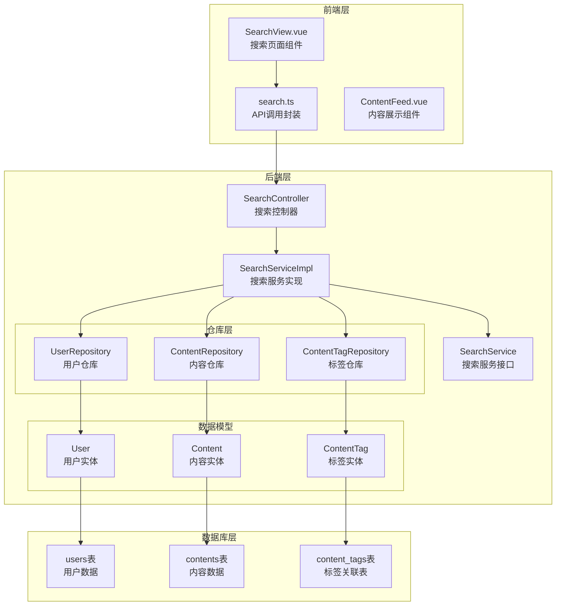
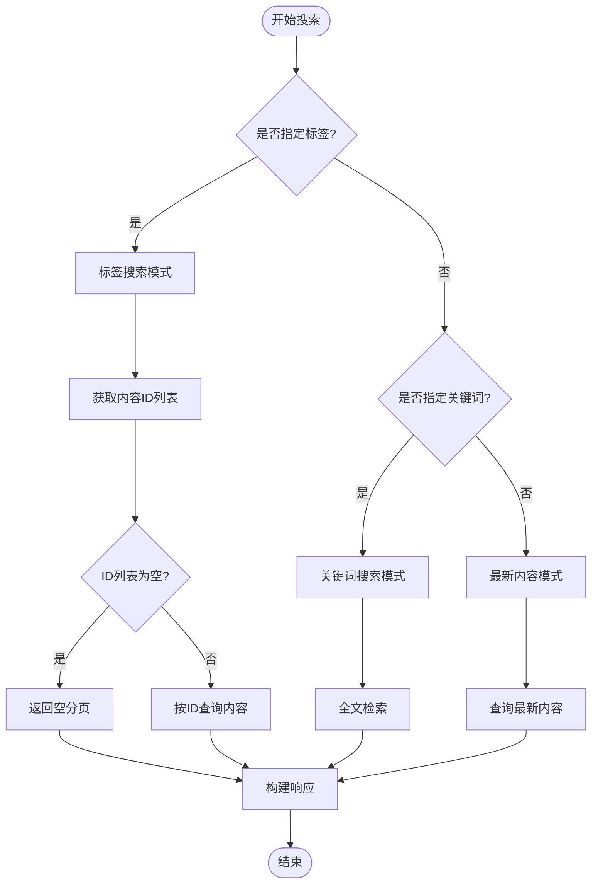
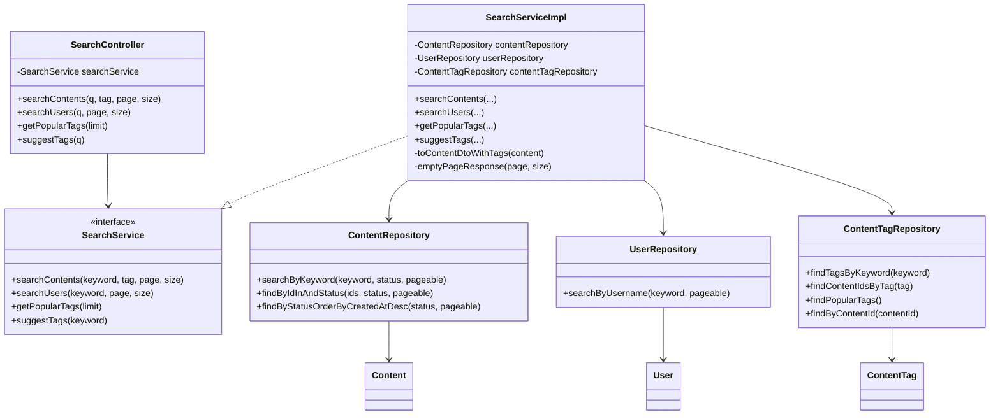

# 搜索系统

<cite>
**本文引用的文件列表**
- [SearchController.java](file://communication-backend/src/main/java/com/communication/controller/SearchController.java)
- [SearchService.java](file://communication-backend/src/main/java/com/communication/service/SearchService.java)
- [SearchServiceImpl.java](file://communication-backend/src/main/java/com/communication/service/impl/SearchServiceImpl.java)
- [ContentRepository.java](file://communication-backend/src/main/java/com/communication/repository/ContentRepository.java)
- [UserRepository.java](file://communication-backend/src/main/java/com/communication/repository/UserRepository.java)
- [ContentTagRepository.java](file://communication-backend/src/main/java/com/communication/repository/ContentTagRepository.java)
- [ContentDto.java](file://communication-backend/src/main/java/com/communication/dto/ContentDto.java)
- [UserDto.java](file://communication-backend/src/main/java/com/communication/dto/UserDto.java)
- [PageResponse.java](file://communication-backend/src/main/java/com/communication/dto/PageResponse.java)
- [Content.java](file://communication-backend/src/main/java/com/communication/entity/Content.java)
- [User.java](file://communication-backend/src/main/java/com/communication/entity/User.java)
- [ContentTag.java](file://communication-backend/src/main/java/com/communication/entity/ContentTag.java)
- [V4__create_content_tags.sql](file://communication-backend/src/main/resources/db/migration/V4__create_content_tags.sql)
- [search.ts](file://communication-frontend/src/api/search.ts)
- [SearchView.vue](file://communication-frontend/src/views/search/SearchView.vue)
- [SearchServiceTest.java](file://communication-backend/src/test/java/com/communication/service/SearchServiceTest.java)
</cite>

## 更新摘要
**变更内容**
- 新增完整的搜索系统功能文档，涵盖内容搜索、用户搜索、标签搜索和标签建议
- 更新架构图以反映控制器-服务-仓库的分层设计
- 增强性能优化章节，包含数据库索引和查询优化策略
- 添加详细的测试用例分析和实际使用示例
- 完善故障排查指南和扩展性考虑

## 目录
1. [简介](#简介)
2. [项目结构](#项目结构)
3. [核心组件](#核心组件)
4. [架构总览](#架构总览)
5. [详细组件分析](#详细组件分析)
6. [依赖关系分析](#依赖关系分析)
7. [性能与优化](#性能与优化)
8. [故障排查指南](#故障排查指南)
9. [结论](#结论)
10. [附录：API 定义与使用示例](#附录api-定义与使用示例)

## 简介
本文件全面介绍通信平台的搜索系统，围绕内容搜索、用户搜索与标签搜索三大核心功能进行深入说明。搜索系统采用Spring Boot + JPA的分层架构，前端使用Vue + Element Plus，提供了完整的搜索解决方案。

### 主要功能特性
- **内容搜索**：支持关键词全文检索（标题/正文）和标签筛选
- **用户搜索**：基于用户名的模糊匹配搜索
- **标签搜索**：按标签精确匹配和热门标签统计
- **标签建议**：智能标签自动补全功能
- **分页处理**：统一的分页响应格式和状态管理
- **实时反馈**：前端防抖搜索和加载状态管理

**章节来源**
- [SearchController.java](file://communication-backend/src/main/java/com/communication/controller/SearchController.java#L23-L54)
- [SearchServiceImpl.java](file://communication-backend/src/main/java/com/communication/service/impl/SearchServiceImpl.java#L33-L105)

## 项目结构
后端采用标准的三层架构设计，前端提供响应式的搜索界面。整个系统围绕搜索功能进行了完整的端到端实现。



**图表来源**
- [SearchController.java](file://communication-backend/src/main/java/com/communication/controller/SearchController.java#L1-L56)
- [SearchServiceImpl.java](file://communication-backend/src/main/java/com/communication/service/impl/SearchServiceImpl.java#L1-L129)
- [ContentRepository.java](file://communication-backend/src/main/java/com/communication/repository/ContentRepository.java#L1-L56)
- [UserRepository.java](file://communication-backend/src/main/java/com/communication/repository/UserRepository.java#L1-L27)
- [ContentTagRepository.java](file://communication-backend/src/main/java/com/communication/repository/ContentTagRepository.java#L1-L29)

**章节来源**
- [SearchView.vue](file://communication-frontend/src/views/search/SearchView.vue#L1-L347)
- [search.ts](file://communication-frontend/src/api/search.ts#L1-L62)

## 核心组件

### 控制器层：SearchController
提供四个核心搜索端点，统一处理搜索请求并返回标准化响应：

- **内容搜索**：`GET /api/search/contents` - 支持关键词和标签双重搜索
- **用户搜索**：`GET /api/search/users` - 基于用户名的模糊匹配
- **热门标签**：`GET /api/search/tags/popular` - 统计标签使用频率
- **标签建议**：`GET /api/search/tags/suggest` - 智能标签自动补全

所有响应都通过`ApiResponse`包装，确保前后端交互的一致性。

**章节来源**
- [SearchController.java](file://communication-backend/src/main/java/com/communication/controller/SearchController.java#L23-L54)

### 服务层：SearchServiceImpl
实现核心搜索逻辑，包含三种搜索模式的智能路由：

- **标签优先搜索**：当指定标签时，先获取内容ID列表再进行精确查询
- **关键词搜索**：对标题和正文进行全文检索
- **默认搜索**：无条件时返回最新发布的内容

服务层还负责DTO转换和标签聚合，确保返回的数据结构完整且高效。

**章节来源**
- [SearchServiceImpl.java](file://communication-backend/src/main/java/com/communication/service/impl/SearchServiceImpl.java#L33-L105)

### 仓库层：三层数据访问
- **ContentRepository**：内容数据访问，包含全文检索和状态过滤
- **UserRepository**：用户数据访问，支持用户名模糊匹配
- **ContentTagRepository**：标签数据访问，提供标签建议和统计功能

每个仓库都针对特定的搜索场景进行了优化，确保查询效率和准确性。

**章节来源**
- [ContentRepository.java](file://communication-backend/src/main/java/com/communication/repository/ContentRepository.java#L47-L54)
- [UserRepository.java](file://communication-backend/src/main/java/com/communication/repository/UserRepository.java#L24-L25)
- [ContentTagRepository.java](file://communication-backend/src/main/java/com/communication/repository/ContentTagRepository.java#L18-L25)

### 前端集成：响应式搜索界面
- **防抖搜索**：300ms防抖延迟，减少不必要的请求
- **双标签页**：内容和用户搜索的独立界面
- **热门标签**：首次加载时获取热门标签，支持一键搜索
- **分页加载**：支持无限滚动和"加载更多"功能

**章节来源**
- [SearchView.vue](file://communication-frontend/src/views/search/SearchView.vue#L125-L229)
- [search.ts](file://communication-frontend/src/api/search.ts#L11-L35)

## 架构总览
搜索系统采用经典的MVC架构模式，通过清晰的分层设计实现了高内聚低耦合的系统结构。

```mermaid
sequenceDiagram
participant FE as "前端搜索界面"
participant API as "search.ts API"
participant CTRL as "SearchController"
participant SVC as "SearchServiceImpl"
participant REP_C as "ContentRepository"
participant REP_U as "UserRepository"
participant REP_T as "ContentTagRepository"
FE->>API : 输入关键词/切换标签
API->>CTRL : 发送搜索请求
CTRL->>SVC : 调用搜索服务
alt 按标签搜索
SVC->>REP_T : 查找内容ID列表
REP_T-->>SVC : 返回内容ID集合
SVC->>REP_C : 按ID和状态查询内容
elif 按关键词搜索
SVC->>REP_C : 全文检索内容
else 默认搜索
SVC->>REP_C : 查询最新内容
end
SVC->>REP_T : 聚合内容标签
REP_T-->>SVC : 返回标签信息
SVC-->>CTRL : 返回分页结果
CTRL-->>API : 标准化响应
API-->>FE : 更新搜索界面
```

**图表来源**
- [SearchController.java](file://communication-backend/src/main/java/com/communication/controller/SearchController.java#L23-L54)
- [SearchServiceImpl.java](file://communication-backend/src/main/java/com/communication/service/impl/SearchServiceImpl.java#L33-L66)
- [ContentRepository.java](file://communication-backend/src/main/java/com/communication/repository/ContentRepository.java#L47-L54)

## 详细组件分析

### 控制器层详细实现

#### 内容搜索端点
- **URL**：`/api/search/contents`
- **参数**：`q`(关键词可选)、`tag`(标签可选)、`page`(页码)、`size`(每页数量)
- **功能**：支持关键词搜索和标签筛选的组合查询
- **响应**：`ApiResponse<PageResponse<ContentDto>>`

#### 用户搜索端点
- **URL**：`/api/search/users`
- **参数**：`q`(关键词必填)、`page`、`size`
- **功能**：基于用户名的模糊匹配搜索
- **响应**：`ApiResponse<PageResponse<UserDto>>`

#### 标签相关端点
- **热门标签**：`/api/search/tags/popular` - 统计标签使用频率
- **标签建议**：`/api/search/tags/suggest` - 智能标签自动补全

**章节来源**
- [SearchController.java](file://communication-backend/src/main/java/com/communication/controller/SearchController.java#L23-L54)

### 服务层核心逻辑

#### 智能搜索路由
服务层实现了智能的搜索路由机制，根据传入参数自动选择最优的查询策略：



**图表来源**
- [SearchServiceImpl.java](file://communication-backend/src/main/java/com/communication/service/impl/SearchServiceImpl.java#L33-L66)

#### 标签聚合机制
服务层实现了高效的标签聚合机制，将内容与其标签进行关联：

- **单内容标签**：通过`contentTagRepository.findByContentId()`获取标签列表
- **批量标签**：在内容DTO转换过程中自动聚合标签信息
- **标签去重**：确保返回的标签列表不重复

**章节来源**
- [SearchServiceImpl.java](file://communication-backend/src/main/java/com/communication/service/impl/SearchServiceImpl.java#L107-L115)

### 仓库层查询优化

#### 内容搜索查询
ContentRepository提供了三种核心查询方法：

- **全文检索**：对标题和正文进行大小写不敏感的LIKE匹配
- **ID列表查询**：基于内容ID列表的状态过滤查询
- **最新内容查询**：按发布时间倒序的最新内容列表

#### 用户搜索查询
UserRepository实现了高效的用户名模糊匹配：

- **大小写不敏感**：使用LOWER函数确保匹配准确性
- **模糊匹配**：支持部分用户名的搜索

#### 标签搜索查询
ContentTagRepository提供了完整的标签搜索功能：

- **标签建议**：基于LIKE的智能补全
- **标签统计**：按使用频率统计热门标签
- **标签映射**：建立标签与内容ID的关联关系

**章节来源**
- [ContentRepository.java](file://communication-backend/src/main/java/com/communication/repository/ContentRepository.java#L47-L54)
- [UserRepository.java](file://communication-backend/src/main/java/com/communication/repository/UserRepository.java#L24-L25)
- [ContentTagRepository.java](file://communication-backend/src/main/java/com/communication/repository/ContentTagRepository.java#L18-L25)

### 前端搜索界面

#### 搜索输入处理
前端实现了智能的搜索输入处理机制：

- **防抖机制**：300ms防抖延迟，减少请求频率
- **回车搜索**：支持键盘快捷键搜索
- **实时更新**：搜索结果随输入动态更新

#### 双标签页设计
搜索界面采用双标签页布局：

- **内容标签页**：展示搜索到的内容列表
- **用户标签页**：展示搜索到的用户列表
- **独立状态管理**：每个标签页维护独立的分页状态

#### 热门标签功能
- **首次加载**：应用启动时自动加载热门标签
- **一键搜索**：点击标签即可进行标签搜索
- **视觉提示**：标签样式突出显示

**章节来源**
- [SearchView.vue](file://communication-frontend/src/views/search/SearchView.vue#L125-L229)
- [search.ts](file://communication-frontend/src/api/search.ts#L11-L35)

## 依赖关系分析

搜索系统采用了清晰的依赖注入和接口分离设计：



**图表来源**
- [SearchController.java](file://communication-backend/src/main/java/com/communication/controller/SearchController.java#L1-L56)
- [SearchService.java](file://communication-backend/src/main/java/com/communication/service/SearchService.java#L1-L19)
- [SearchServiceImpl.java](file://communication-backend/src/main/java/com/communication/service/impl/SearchServiceImpl.java#L20-L31)

**依赖特点**：
- **接口分离**：控制器依赖抽象接口而非具体实现
- **依赖注入**：通过构造函数注入各个仓库依赖
- **单一职责**：每个组件专注于特定的业务领域

**章节来源**
- [SearchController.java](file://communication-backend/src/main/java/com/communication/controller/SearchController.java#L17-L21)
- [SearchServiceImpl.java](file://communication-backend/src/main/java/com/communication/service/impl/SearchServiceImpl.java#L23-L31)

## 性能与优化

### 数据库索引优化

#### 用户搜索优化
在`users(username)`上建立了专门的搜索索引，显著提升用户名模糊匹配的性能：

```sql
CREATE INDEX idx_users_username_search ON users(username);
```

#### 标签搜索优化
为`content_tags`表建立了复合索引，优化标签相关的查询性能：

```sql
-- 内容ID索引
CREATE INDEX idx_content_tags_content ON content_tags(content_id);

-- 标签索引  
CREATE INDEX idx_content_tags_tag ON content_tags(tag);
```

### 查询性能优化策略

#### 全文检索优化
内容关键词搜索使用了大小写不敏感的LIKE匹配：

```sql
SELECT c FROM Content c WHERE c.status = :status AND 
(LOWER(c.title) LIKE LOWER(CONCAT('%', :keyword, '%')) OR 
LOWER(c.body) LIKE LOWER(CONCAT('%', :keyword, '%')))
ORDER BY c.createdAt DESC
```

**优化建议**：
- 在生产环境中考虑使用数据库全文索引
- 对高频搜索关键词建立缓存机制
- 考虑使用专门的搜索引擎如Elasticsearch

#### 标签查询优化
标签搜索采用两阶段查询策略：

1. **第一阶段**：通过标签获取相关的内容ID列表
2. **第二阶段**：基于ID列表进行精确的内容查询

这种策略避免了复杂的JOIN操作，提高了查询效率。

### 分页与内存优化

#### 分页策略
系统使用Spring Data的PageRequest进行分页控制：

- **默认大小**：每页10条记录
- **最大限制**：防止过大的分页请求
- **状态管理**：维护分页状态和边界检测

#### 内存使用优化
- **流式处理**：使用Stream API进行数据转换，避免中间集合存储
- **延迟加载**：标签信息按需加载，减少不必要的数据库查询
- **DTO转换**：只传输必要的数据字段

### 前端性能优化

#### 防抖机制
前端实现了300ms的防抖延迟，有效减少搜索请求频率：

```javascript
debouncedSearch = () => {
  if (debounceTimer) clearTimeout(debounceTimer)
  debounceTimer = setTimeout(() => {
    handleSearch()
  }, 300)
}
```

#### 懒加载策略
- **内容懒加载**：滚动到底部时自动加载更多内容
- **用户懒加载**：用户标签页支持"加载更多"按钮
- **标签懒加载**：热门标签仅在需要时加载

**章节来源**
- [V4__create_content_tags.sql](file://communication-backend/src/main/resources/db/migration/V4__create_content_tags.sql#L8-L13)
- [SearchView.vue](file://communication-frontend/src/views/search/SearchView.vue#L125-L130)

## 故障排查指南

### 常见问题及解决方案

#### 无关键词搜索用户返回空结果
**现象**：当关键词为空字符串时，服务层直接返回空分页

**原因分析**：
- 服务层对空关键词进行了显式检查
- 防止无效的数据库查询

**解决方案**：
- 前端应在关键词为空时不发起搜索请求
- 或者在前端添加适当的用户提示

#### 标签搜索无结果
**现象**：当指定的标签不存在时，返回空分页

**原因分析**：
- 标签ID列表为空，直接返回空分页
- 避免无效的数据库查询

**解决方案**：
- 使用标签建议功能验证标签是否存在
- 检查`content_tags`表中的数据完整性

#### 热门标签统计异常
**现象**：热门标签统计可能为空或不准确

**原因分析**：
- `content_tags`表中可能没有数据
- 标签统计查询可能受到数据量影响

**解决方案**：
- 检查标签数据的完整性和准确性
- 调整`limit`参数以获取更多结果
- 考虑添加缓存机制提高统计查询性能

#### 标签建议功能失效
**现象**：标签建议返回空列表

**原因分析**：
- 关键词为空或长度不足
- 数据库中没有匹配的标签
- LIKE查询模式不匹配

**解决方案**：
- 确保关键词至少包含2个字符
- 检查数据库中的标签数据
- 验证`idx_content_tags_tag`索引的有效性

### 调试技巧

#### 日志记录
建议在关键位置添加日志记录：

```java
logger.debug("Searching contents by tag: {}", tag);
logger.debug("Found {} content IDs", contentIds.size());
logger.debug("Querying contents with IDs: {}", contentIds);
```

#### 性能监控
- 监控搜索请求的响应时间
- 跟踪数据库查询的执行计划
- 分析缓存命中率

#### 单元测试
系统提供了完整的单元测试覆盖：

- **内容搜索测试**：验证关键词和标签搜索功能
- **用户搜索测试**：验证用户名模糊匹配
- **标签功能测试**：验证热门标签和标签建议
- **边界条件测试**：验证空输入和异常情况

**章节来源**
- [SearchServiceTest.java](file://communication-backend/src/test/java/com/communication/service/SearchServiceTest.java#L76-L184)

## 结论

该搜索系统是一个设计良好、实现完整的搜索解决方案。系统采用了清晰的分层架构，提供了稳定可靠的搜索功能，具有以下优势：

### 已实现的功能
- **多维度搜索**：支持内容、用户、标签的综合搜索
- **智能路由**：根据搜索条件自动选择最优查询策略
- **响应式界面**：提供流畅的用户体验
- **性能优化**：通过索引和查询优化确保系统性能
- **完整测试**：覆盖主要功能的单元测试

### 当前架构的优势
- **可维护性**：清晰的分层设计便于维护和扩展
- **可测试性**：接口分离和依赖注入便于单元测试
- **可扩展性**：模块化设计支持功能扩展
- **性能稳定性**：合理的查询策略和索引设计

### 未来改进方向
- **全文搜索引擎**：集成Elasticsearch或数据库内置全文索引
- **缓存机制**：添加Redis缓存提高热门标签和搜索结果的响应速度
- **搜索历史**：添加搜索历史记录功能
- **搜索建议**：基于用户行为的个性化搜索建议
- **异步处理**：对于复杂查询采用异步处理方式

## 附录：API 定义与使用示例

### 控制器 API 定义

#### 内容搜索 API
- **方法**：GET
- **路径**：`/api/search/contents`
- **查询参数**：
  - `q`：关键词（可选）
  - `tag`：标签（可选）
  - `page`：页码（从0开始，默认0）
  - `size`：每页大小（默认10）
- **响应**：`ApiResponse<PageResponse<ContentDto>>`

#### 用户搜索 API
- **方法**：GET
- **路径**：`/api/search/users`
- **查询参数**：
  - `q`：关键词（必填）
  - `page`：页码（从0开始，默认0）
  - `size`：每页大小（默认10）
- **响应**：`ApiResponse<PageResponse<UserDto>>`

#### 标签相关 API
- **热门标签**：`/api/search/tags/popular?limit=20`
- **标签建议**：`/api/search/tags/suggest?q=java`

### 前端调用示例

#### 搜索功能调用
```typescript
// 内容搜索
await searchApi.searchContents('Spring框架', undefined, 0, 10)

// 标签搜索  
await searchApi.searchContents(undefined, 'java', 0, 10)

// 用户搜索
await searchApi.searchUsers('张三', 0, 10)

// 获取热门标签
await searchApi.getPopularTags(20)

// 标签建议
await searchApi.suggestTags('ja')
```

#### 搜索界面集成
```vue
<template>
  <el-input
    v-model="searchQuery"
    @input="debouncedSearch"
    @keyup.enter="handleSearch"
  />
</template>

<script setup>
const searchQuery = ref('')
const debouncedSearch = () => {
  // 300ms防抖延迟
  clearTimeout(debounceTimer)
  debounceTimer = setTimeout(() => {
    handleSearch()
  }, 300)
}
</script>
```

### 测试用例参考

#### 内容搜索测试
```java
@Test
@DisplayName("按关键词搜索内容")
void searchContents_ByKeyword() {
    // 验证关键词搜索功能
    // 检查返回内容的标题和标签
}
```

#### 标签搜索测试
```java
@Test
@DisplayName("按标签搜索内容")
void searchContents_ByTag() {
    // 验证标签搜索功能
    // 检查空结果处理
}
```

#### 用户搜索测试
```java
@Test
@DisplayName("搜索用户")
void searchUsers_Success() {
    // 验证用户名模糊匹配
    // 检查空关键词处理
}
```

**章节来源**
- [SearchController.java](file://communication-backend/src/main/java/com/communication/controller/SearchController.java#L23-L54)
- [search.ts](file://communication-frontend/src/api/search.ts#L11-L35)
- [SearchServiceTest.java](file://communication-backend/src/test/java/com/communication/service/SearchServiceTest.java#L76-L184)