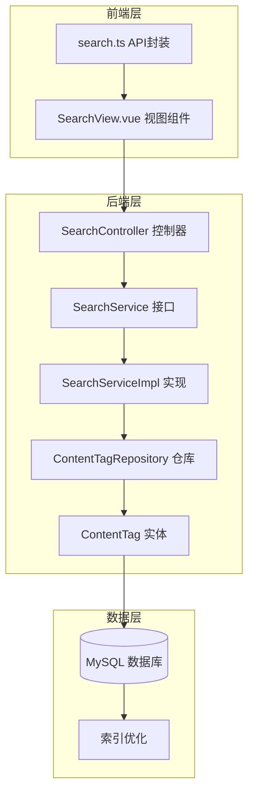
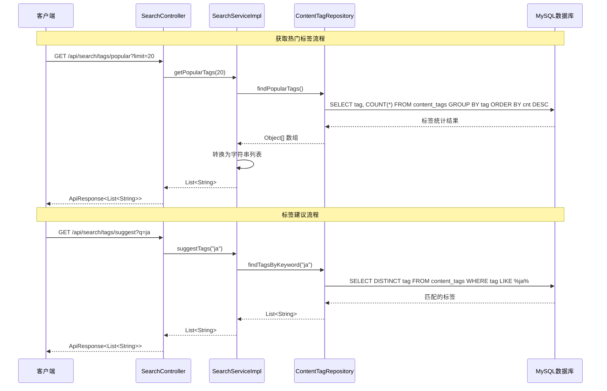
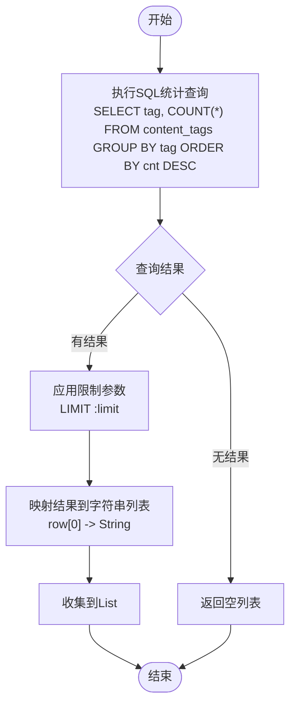
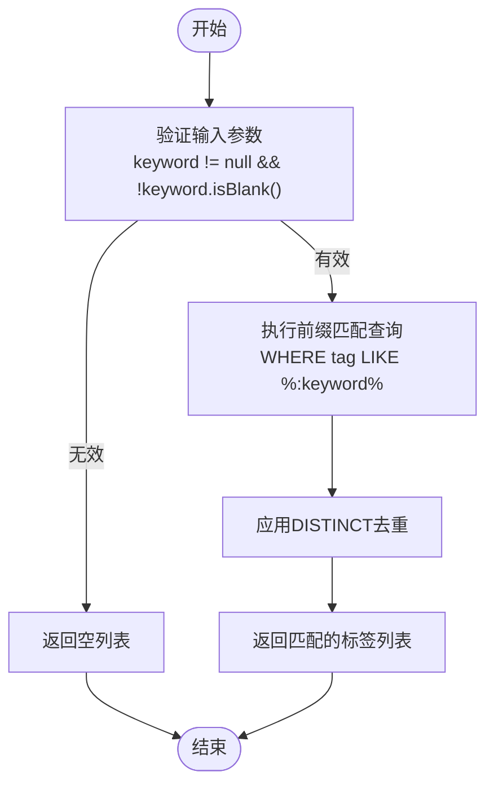
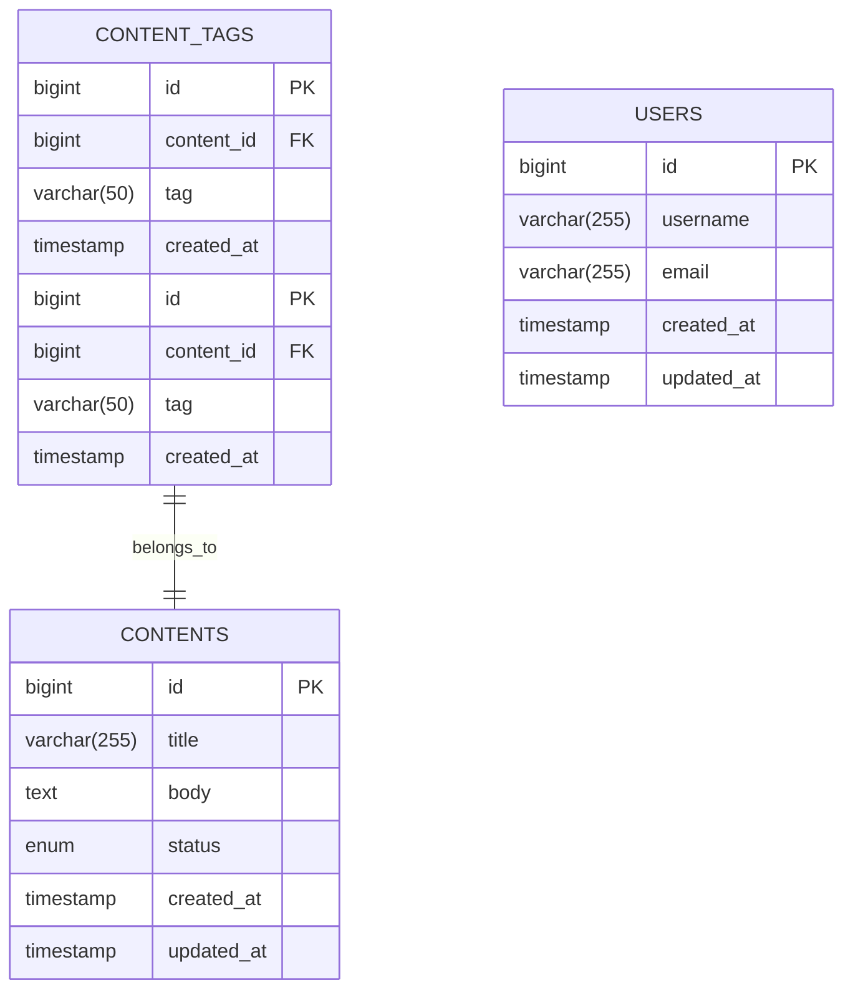
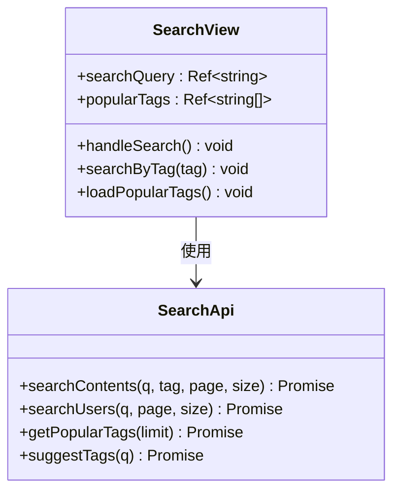
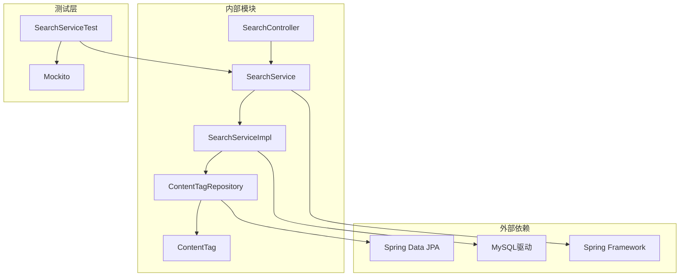
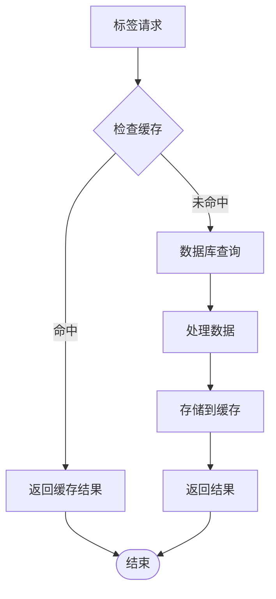

# 标签搜索

<cite>
**本文档引用的文件**
- [SearchController.java](file://communication-backend/src/main/java/com/communication/controller/SearchController.java)
- [SearchService.java](file://communication-backend/src/main/java/com/communication/service/SearchService.java)
- [SearchServiceImpl.java](file://communication-backend/src/main/java/com/communication/service/impl/SearchServiceImpl.java)
- [ContentTagRepository.java](file://communication-backend/src/main/java/com/communication/repository/ContentTagRepository.java)
- [ContentTag.java](file://communication-backend/src/main/java/com/communication/entity/ContentTag.java)
- [V4__create_content_tags.sql](file://communication-backend/src/main/resources/db/migration/V4__create_content_tags.sql)
- [SearchServiceTest.java](file://communication-backend/src/test/java/com/communication/service/SearchServiceTest.java)
- [search.ts](file://communication-frontend/src/api/search.ts)
- [SearchView.vue](file://communication-frontend/src/views/search/SearchView.vue)
- [ContentDto.java](file://communication-backend/src/main/java/com/communication/dto/ContentDto.java)
</cite>

## 目录
1. [简介](#简介)
2. [项目结构](#项目结构)
3. [核心组件](#核心组件)
4. [架构概览](#架构概览)
5. [详细组件分析](#详细组件分析)
6. [依赖关系分析](#依赖关系分析)
7. [性能考虑](#性能考虑)
8. [故障排除指南](#故障排除指南)
9. [结论](#结论)

## 简介

标签搜索功能是通信平台的核心特性之一，提供了两个主要的标签相关功能：
- **热门标签获取** (`/search/tags/popular`)：基于内容标签使用频率统计，返回最热门的标签列表
- **标签建议** (`/search/tags/suggest`)：基于前缀匹配算法，提供智能的标签建议和自动补全

该功能通过Spring Data JPA实现高效的数据查询，结合数据库索引优化和分页机制，确保在大规模数据集上也能提供流畅的用户体验。

## 项目结构

标签搜索功能分布在后端和前端两个层面，采用清晰的分层架构：



**图表来源**
- [SearchController.java](file://communication-backend/src/main/java/com/communication/controller/SearchController.java#L1-L56)
- [SearchServiceImpl.java](file://communication-backend/src/main/java/com/communication/service/impl/SearchServiceImpl.java#L1-L129)
- [ContentTagRepository.java](file://communication-backend/src/main/java/com/communication/repository/ContentTagRepository.java#L1-L29)

**章节来源**
- [SearchController.java](file://communication-backend/src/main/java/com/communication/controller/SearchController.java#L1-L56)
- [SearchService.java](file://communication-backend/src/main/java/com/communication/service/SearchService.java#L1-L19)
- [SearchServiceImpl.java](file://communication-backend/src/main/java/com/communication/service/impl/SearchServiceImpl.java#L1-L129)

## 核心组件

### 控制器层

SearchController提供RESTful API接口，负责处理HTTP请求和响应：

- `/api/search/tags/popular`：获取热门标签列表
- `/api/search/tags/suggest`：获取标签建议列表

### 服务层

SearchService定义了标签搜索的核心业务逻辑接口，包括：
- `getPopularTags(int limit)`：获取热门标签
- `suggestTags(String keyword)`：获取标签建议

### 数据访问层

ContentTagRepository实现了标签相关的数据库操作，包括：
- `findPopularTags()`：统计热门标签
- `findTagsByKeyword(String keyword)`：标签前缀匹配
- `findContentIdsByTag(String tag)`：根据标签查找内容ID

**章节来源**
- [SearchController.java](file://communication-backend/src/main/java/com/communication/controller/SearchController.java#L42-L54)
- [SearchService.java](file://communication-backend/src/main/java/com/communication/service/SearchService.java#L9-L18)
- [ContentTagRepository.java](file://communication-backend/src/main/java/com/communication/repository/ContentTagRepository.java#L12-L28)

## 架构概览

标签搜索功能采用经典的三层架构模式，确保关注点分离和代码可维护性：



**图表来源**
- [SearchController.java](file://communication-backend/src/main/java/com/communication/controller/SearchController.java#L42-L54)
- [SearchServiceImpl.java](file://communication-backend/src/main/java/com/communication/service/impl/SearchServiceImpl.java#L91-L105)
- [ContentTagRepository.java](file://communication-backend/src/main/java/com/communication/repository/ContentTagRepository.java#L18-L25)

## 详细组件分析

### 热门标签获取功能

热门标签功能通过统计每个标签的使用频率来实现，采用以下算法：

#### 统计算法实现



**图表来源**
- [SearchServiceImpl.java](file://communication-backend/src/main/java/com/communication/service/impl/SearchServiceImpl.java#L92-L97)
- [ContentTagRepository.java](file://communication-backend/src/main/java/com/communication/repository/ContentTagRepository.java#L24-L25)

#### 数据库查询优化

热门标签统计查询使用了高效的GROUP BY和ORDER BY操作：

```sql
SELECT ct.tag, COUNT(ct) as cnt 
FROM ContentTag ct 
GROUP BY ct.tag 
ORDER BY cnt DESC
```

该查询利用了数据库的索引优化，通过`idx_content_tags_tag`索引实现快速分组统计。

**章节来源**
- [SearchServiceImpl.java](file://communication-backend/src/main/java/com/communication/service/impl/SearchServiceImpl.java#L91-L97)
- [ContentTagRepository.java](file://communication-backend/src/main/java/com/communication/repository/ContentTagRepository.java#L24-L25)
- [V4__create_content_tags.sql](file://communication-backend/src/main/resources/db/migration/V4__create_content_tags.sql#L8-L9)

### 标签建议功能

标签建议功能实现了智能的前缀匹配算法，提供实时的标签补全体验：

#### 建议算法实现



**图表来源**
- [SearchServiceImpl.java](file://communication-backend/src/main/java/com/communication/service/impl/SearchServiceImpl.java#L99-L105)
- [ContentTagRepository.java](file://communication-backend/src/main/java/com/communication/repository/ContentTagRepository.java#L18-L19)

#### 前缀匹配优化

标签建议使用了高效的LIKE操作符配合通配符：
- 查询模式：`%keyword%` 实现模糊匹配
- 使用DISTINCT关键字避免重复标签
- 利用`idx_content_tags_tag`索引提高查询性能

**章节来源**
- [SearchServiceImpl.java](file://communication-backend/src/main/java/com/communication/service/impl/SearchServiceImpl.java#L99-L105)
- [ContentTagRepository.java](file://communication-backend/src/main/java/com/communication/repository/ContentTagRepository.java#L18-L19)

### 数据模型设计

标签搜索功能基于以下核心实体和关系：



**图表来源**
- [ContentTag.java](file://communication-backend/src/main/java/com/communication/entity/ContentTag.java#L7-L28)
- [V4__create_content_tags.sql](file://communication-backend/src/main/resources/db/migration/V4__create_content_tags.sql#L2-L10)

**章节来源**
- [ContentTag.java](file://communication-backend/src/main/java/com/communication/entity/ContentTag.java#L1-L66)
- [V4__create_content_tags.sql](file://communication-backend/src/main/resources/db/migration/V4__create_content_tags.sql#L1-L14)

### 前端集成实现

前端通过API封装和视图组件实现完整的标签搜索体验：

#### API封装设计



**图表来源**
- [search.ts](file://communication-frontend/src/api/search.ts#L11-L35)
- [SearchView.vue](file://communication-frontend/src/views/search/SearchView.vue#L95-L229)

**章节来源**
- [search.ts](file://communication-frontend/src/api/search.ts#L1-L36)
- [SearchView.vue](file://communication-frontend/src/views/search/SearchView.vue#L1-L342)

## 依赖关系分析

标签搜索功能的依赖关系体现了清晰的关注点分离：



**图表来源**
- [SearchController.java](file://communication-backend/src/main/java/com/communication/controller/SearchController.java#L1-L56)
- [SearchServiceImpl.java](file://communication-backend/src/main/java/com/communication/service/impl/SearchServiceImpl.java#L20-L31)
- [SearchServiceTest.java](file://communication-backend/src/test/java/com/communication/service/SearchServiceTest.java#L32-L45)

**章节来源**
- [SearchServiceTest.java](file://communication-backend/src/test/java/com/communication/service/SearchServiceTest.java#L1-L186)

## 性能考虑

### 数据库索引优化

标签搜索功能通过精心设计的数据库索引实现高性能查询：

| 索引名称 | 表名 | 列 | 类型 | 描述 |
|---------|------|----|------|------|
| idx_content_tags_content | content_tags | content_id | 普通索引 | 支持内容ID查询 |
| idx_content_tags_tag | content_tags | tag | 普通索引 | 支持标签查询和统计 |
| idx_users_username_search | users | username | 普通索引 | 支持用户名搜索 |

### 查询性能优化策略

1. **分页查询**：使用Spring Data JPA的PageRequest实现分页，避免一次性加载大量数据
2. **索引利用**：所有标签查询都利用了相应的数据库索引
3. **批量操作**：热门标签统计使用GROUP BY和COUNT函数进行服务器端聚合
4. **去重处理**：使用DISTINCT关键字避免重复标签返回

### 缓存策略建议

虽然当前实现没有内置缓存，但可以考虑以下优化方案：



**章节来源**
- [V4__create_content_tags.sql](file://communication-backend/src/main/resources/db/migration/V4__create_content_tags.sql#L8-L9)
- [SearchServiceImpl.java](file://communication-backend/src/main/java/com/communication/service/impl/SearchServiceImpl.java#L91-L105)

## 故障排除指南

### 常见问题及解决方案

#### 热门标签为空

**问题描述**：`/api/search/tags/popular` 返回空数组

**可能原因**：
- 数据库中没有标签数据
- 数据库连接配置错误
- 权限不足

**解决方案**：
1. 验证数据库连接配置
2. 检查是否有内容标签数据
3. 查看数据库日志确认查询执行

#### 标签建议不准确

**问题描述**：`/api/search/tags/suggest` 返回的结果不符合预期

**可能原因**：
- 关键词输入为空或空白
- 数据库中没有匹配的标签
- 查询语法问题

**解决方案**：
1. 确保关键词参数非空
2. 检查标签数据的完整性
3. 验证数据库索引是否正确

#### 性能问题

**问题描述**：标签查询响应时间过长

**可能原因**：
- 数据量过大
- 缺少必要的数据库索引
- 查询语句效率低

**解决方案**：
1. 添加适当的数据库索引
2. 优化查询语句
3. 实施分页和缓存策略

**章节来源**
- [SearchServiceTest.java](file://communication-backend/src/test/java/com/communication/service/SearchServiceTest.java#L153-L184)

## 结论

标签搜索功能通过精心设计的架构和优化的数据库查询，为用户提供了高效、智能的标签发现体验。该功能的主要优势包括：

1. **高效的统计算法**：通过数据库层面的GROUP BY和COUNT操作实现快速热门标签统计
2. **智能的建议系统**：基于前缀匹配的实时标签建议，提升用户体验
3. **良好的扩展性**：清晰的分层架构便于功能扩展和维护
4. **性能优化**：合理的数据库索引设计和查询优化策略

未来可以考虑的改进方向：
- 实施结果缓存机制以进一步提升性能
- 添加标签权重计算以实现更精确的相关性排序
- 扩展标签建议的智能程度，支持同义词和相关标签推荐

该功能为内容分类和发现提供了坚实的基础，有助于提升平台的整体用户体验和内容可发现性。