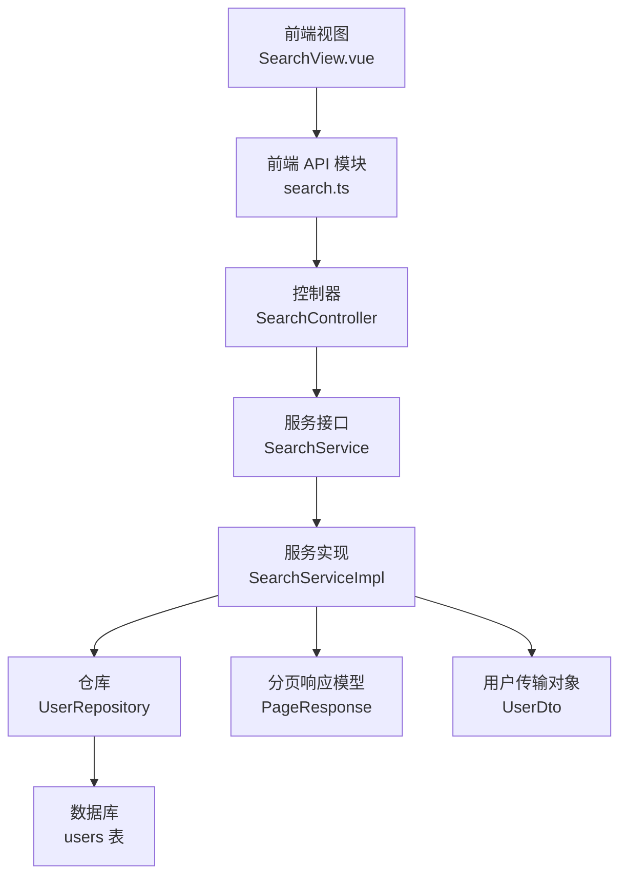
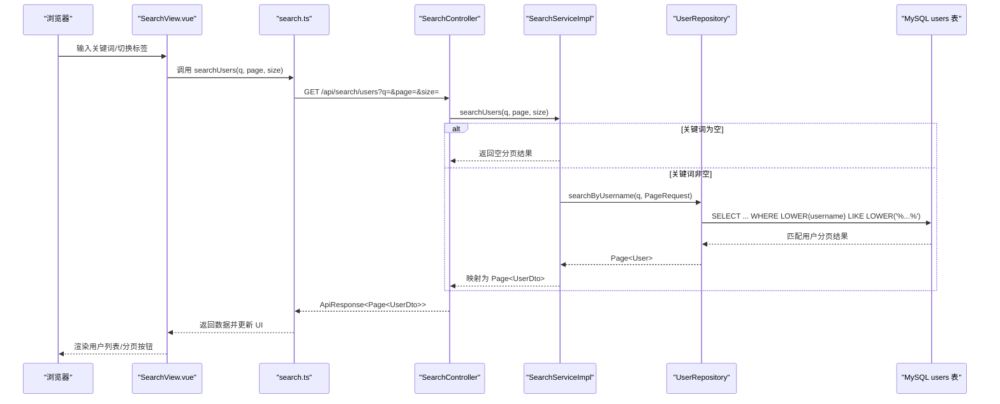
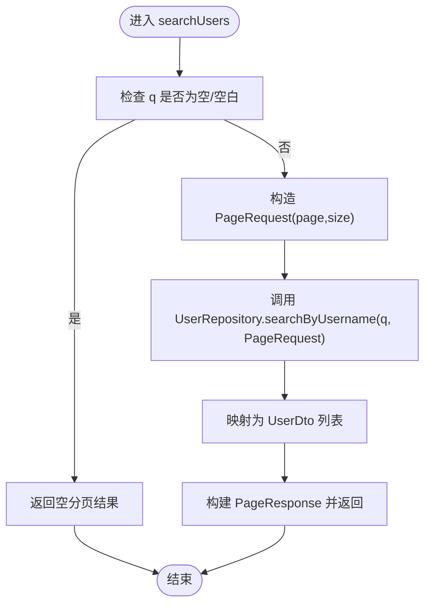
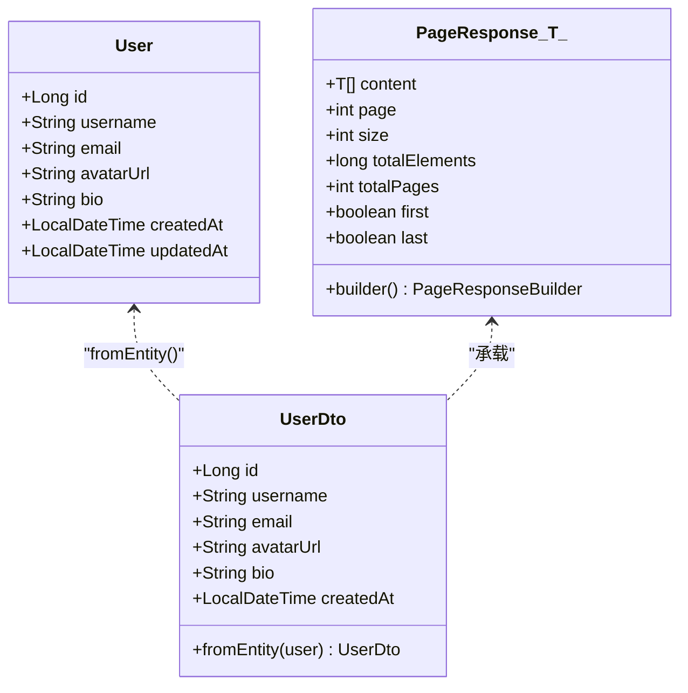
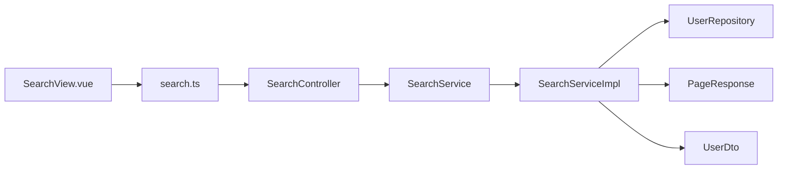

# 用户搜索

<cite>
**本文引用的文件**
- [SearchController.java](file://communication-backend/src/main/java/com/communication/controller/SearchController.java)
- [SearchService.java](file://communication-backend/src/main/java/com/communication/service/SearchService.java)
- [SearchServiceImpl.java](file://communication-backend/src/main/java/com/communication/service/impl/SearchServiceImpl.java)
- [UserRepository.java](file://communication-backend/src/main/java/com/communication/repository/UserRepository.java)
- [User.java](file://communication-backend/src/main/java/com/communication/entity/User.java)
- [UserDto.java](file://communication-backend/src/main/java/com/communication/dto/UserDto.java)
- [PageResponse.java](file://communication-backend/src/main/java/com/communication/dto/PageResponse.java)
- [application.yml](file://communication-backend/src/main/resources/application.yml)
- [V1__init_users.sql](file://communication-backend/src/main/resources/db/migration/V1__init_users.sql)
- [V4__create_content_tags.sql](file://communication-backend/src/main/resources/db/migration/V4__create_content_tags.sql)
- [search.ts](file://communication-frontend/src/api/search.ts)
- [SearchView.vue](file://communication-frontend/src/views/search/SearchView.vue)
- [SearchServiceTest.java](file://communication-backend/src/test/java/com/communication/service/SearchServiceTest.java)
</cite>

## 目录
1. [简介](#简介)
2. [项目结构](#项目结构)
3. [核心组件](#核心组件)
4. [架构总览](#架构总览)
5. [详细组件分析](#详细组件分析)
6. [依赖关系分析](#依赖关系分析)
7. [性能考虑](#性能考虑)
8. [故障排查指南](#故障排查指南)
9. [结论](#结论)
10. [附录](#附录)

## 简介
本文件聚焦于“用户搜索”功能的完整实现与使用说明，覆盖后端 API 设计、查询参数处理、搜索算法与服务层实现、前端调用与交互、以及性能优化策略。读者可据此快速理解 /api/search/users 端点的工作机制，并在现有基础上扩展更丰富的搜索体验（如模糊匹配、分页与结果格式化）。

## 项目结构
后端采用 Spring Boot + JPA 的分层架构：控制器负责接收请求与封装响应；服务层编排业务逻辑；仓库层执行数据库查询；实体与 DTO 负责数据模型与传输对象转换。前端通过 API 模块发起请求，视图组件负责搜索输入、防抖与分页加载。

图表来源
- [SearchView.vue](file://communication-frontend/src/views/search/SearchView.vue#L1-L342)
- [search.ts](file://communication-frontend/src/api/search.ts#L1-L36)
- [SearchController.java](file://communication-backend/src/main/java/com/communication/controller/SearchController.java#L1-L56)
- [SearchService.java](file://communication-backend/src/main/java/com/communication/service/SearchService.java#L1-L19)
- [SearchServiceImpl.java](file://communication-backend/src/main/java/com/communication/service/impl/SearchServiceImpl.java#L1-L129)
- [UserRepository.java](file://communication-backend/src/main/java/com/communication/repository/UserRepository.java#L1-L27)
- [PageResponse.java](file://communication-backend/src/main/java/com/communication/dto/PageResponse.java#L1-L65)
- [UserDto.java](file://communication-backend/src/main/java/com/communication/dto/UserDto.java#L1-L72)
- [V1__init_users.sql](file://communication-backend/src/main/resources/db/migration/V1__init_users.sql#L1-L14)

章节来源
- [SearchController.java](file://communication-backend/src/main/java/com/communication/controller/SearchController.java#L1-L56)
- [SearchService.java](file://communication-backend/src/main/java/com/communication/service/SearchService.java#L1-L19)
- [SearchServiceImpl.java](file://communication-backend/src/main/java/com/communication/service/impl/SearchServiceImpl.java#L1-L129)
- [UserRepository.java](file://communication-backend/src/main/java/com/communication/repository/UserRepository.java#L1-L27)
- [PageResponse.java](file://communication-backend/src/main/java/com/communication/dto/PageResponse.java#L1-L65)
- [UserDto.java](file://communication-backend/src/main/java/com/communication/dto/UserDto.java#L1-L72)
- [V1__init_users.sql](file://communication-backend/src/main/resources/db/migration/V1__init_users.sql#L1-L14)
- [V4__create_content_tags.sql](file://communication-backend/src/main/resources/db/migration/V4__create_content_tags.sql#L1-L14)
- [search.ts](file://communication-frontend/src/api/search.ts#L1-L36)
- [SearchView.vue](file://communication-frontend/src/views/search/SearchView.vue#L1-L342)

## 核心组件
- 控制器层：提供 /api/search/users 接口，解析查询参数 q、page、size，调用服务层并封装统一响应。
- 服务层：实现用户搜索的核心逻辑，包含空关键词处理、分页查询与结果映射。
- 仓库层：基于 JPA 的自定义查询，实现用户名模糊匹配。
- 数据传输层：UserDto 将实体转换为对外暴露的用户信息；PageResponse 统一封装分页元数据。
- 前端层：SearchView.vue 提供输入防抖、标签切换与分页加载；search.ts 定义 API 调用方法。

章节来源
- [SearchController.java](file://communication-backend/src/main/java/com/communication/controller/SearchController.java#L33-L40)
- [SearchServiceImpl.java](file://communication-backend/src/main/java/com/communication/service/impl/SearchServiceImpl.java#L68-L89)
- [UserRepository.java](file://communication-backend/src/main/java/com/communication/repository/UserRepository.java#L24-L25)
- [UserDto.java](file://communication-backend/src/main/java/com/communication/dto/UserDto.java#L39-L48)
- [PageResponse.java](file://communication-backend/src/main/java/com/communication/dto/PageResponse.java#L41-L63)
- [SearchView.vue](file://communication-frontend/src/views/search/SearchView.vue#L125-L201)
- [search.ts](file://communication-frontend/src/api/search.ts#L18-L22)

## 架构总览
下图展示了从浏览器到数据库的完整调用链路，包括参数传递、服务编排与数据返回。

图表来源
- [SearchView.vue](file://communication-frontend/src/views/search/SearchView.vue#L125-L201)
- [search.ts](file://communication-frontend/src/api/search.ts#L18-L22)
- [SearchController.java](file://communication-backend/src/main/java/com/communication/controller/SearchController.java#L33-L40)
- [SearchServiceImpl.java](file://communication-backend/src/main/java/com/communication/service/impl/SearchServiceImpl.java#L68-L89)
- [UserRepository.java](file://communication-backend/src/main/java/com/communication/repository/UserRepository.java#L24-L25)
- [V1__init_users.sql](file://communication-backend/src/main/resources/db/migration/V1__init_users.sql#L11-L11)

## 详细组件分析

### API 设计与查询参数处理
- 端点路径：/api/search/users
- 请求方法：GET
- 查询参数
  - q：字符串，用户名关键词（可选）
  - page：整数，页码（默认 0）
  - size：整数，每页大小（默认 10）
- 响应包装：统一由 ApiResponse 包裹 PageResponse<UserDto>

章节来源
- [SearchController.java](file://communication-backend/src/main/java/com/communication/controller/SearchController.java#L33-L40)
- [search.ts](file://communication-frontend/src/api/search.ts#L18-L22)

### 用户搜索算法与实现逻辑
- 空关键词处理：当 q 为空或空白时，直接返回空分页结果，避免无效查询。
- 模糊匹配：通过仓库层的自定义 JPQL 实现不区分大小写的模糊匹配。
- 分页与排序：使用 Spring Data 的 PageRequest 进行分页；当前实现按数据库默认顺序返回。
- 结果映射：将 Page<User> 映射为 Page<UserDto>，仅暴露必要字段。

图表来源
- [SearchServiceImpl.java](file://communication-backend/src/main/java/com/communication/service/impl/SearchServiceImpl.java#L68-L89)
- [UserRepository.java](file://communication-backend/src/main/java/com/communication/repository/UserRepository.java#L24-L25)
- [UserDto.java](file://communication-backend/src/main/java/com/communication/dto/UserDto.java#L39-L48)
- [PageResponse.java](file://communication-backend/src/main/java/com/communication/dto/PageResponse.java#L41-L63)

章节来源
- [SearchServiceImpl.java](file://communication-backend/src/main/java/com/communication/service/impl/SearchServiceImpl.java#L68-L89)
- [UserRepository.java](file://communication-backend/src/main/java/com/communication/repository/UserRepository.java#L24-L25)

### 服务层实现细节
- 依赖注入：ContentRepository、ContentTagRepository、UserRepository
- 关键方法
  - searchUsers：处理空关键词、调用仓库、映射 DTO、构建分页响应
  - emptyPageResponse：统一空分页构造
- 数据流
  - 输入参数 → 验证 → 仓库查询 → 实体映射 → DTO 列表 → 分页封装 → 返回

章节来源
- [SearchServiceImpl.java](file://communication-backend/src/main/java/com/communication/service/impl/SearchServiceImpl.java#L20-L31)
- [SearchServiceImpl.java](file://communication-backend/src/main/java/com/communication/service/impl/SearchServiceImpl.java#L68-L89)
- [SearchServiceImpl.java](file://communication-backend/src/main/java/com/communication/service/impl/SearchServiceImpl.java#L117-L127)

### 数据模型与映射
- 实体 User：包含 id、username、email、avatarUrl、bio、时间戳等字段
- DTO UserDto：从 User 映射出对外可见字段
- PageResponse：统一分页载体，包含 content、page、size、totalElements、totalPages、first、last

图表来源
- [User.java](file://communication-backend/src/main/java/com/communication/entity/User.java#L11-L96)
- [UserDto.java](file://communication-backend/src/main/java/com/communication/dto/UserDto.java#L7-L72)
- [PageResponse.java](file://communication-backend/src/main/java/com/communication/dto/PageResponse.java#L5-L65)

章节来源
- [User.java](file://communication-backend/src/main/java/com/communication/entity/User.java#L11-L96)
- [UserDto.java](file://communication-backend/src/main/java/com/communication/dto/UserDto.java#L39-L48)
- [PageResponse.java](file://communication-backend/src/main/java/com/communication/dto/PageResponse.java#L41-L63)

### 前端集成与交互
- 防抖：输入框变更后延迟触发搜索，降低请求频率
- 分页：支持“加载更多”，自动维护页码与最后一页标记
- 视图联动：切换标签时按需触发用户搜索；路由参数同步搜索状态
- 错误处理：捕获异常并输出日志，保证 UI 不崩溃

章节来源
- [SearchView.vue](file://communication-frontend/src/views/search/SearchView.vue#L125-L201)
- [search.ts](file://communication-frontend/src/api/search.ts#L18-L22)

### 测试验证
- 空关键词返回空分页
- 正常关键词返回匹配用户
- 分页行为符合预期

章节来源
- [SearchServiceTest.java](file://communication-backend/src/test/java/com/communication/service/SearchServiceTest.java#L145-L151)
- [SearchServiceTest.java](file://communication-backend/src/test/java/com/communication/service/SearchServiceTest.java#L132-L143)

## 依赖关系分析
- 控制器依赖服务接口，便于替换实现与测试
- 服务实现依赖仓库接口，遵循依赖倒置原则
- 仓库基于 JPA，使用自定义查询实现模糊匹配
- 前端通过 API 模块与后端解耦

图表来源
- [SearchController.java](file://communication-backend/src/main/java/com/communication/controller/SearchController.java#L17-L21)
- [SearchService.java](file://communication-backend/src/main/java/com/communication/service/SearchService.java#L9-L18)
- [SearchServiceImpl.java](file://communication-backend/src/main/java/com/communication/service/impl/SearchServiceImpl.java#L20-L31)
- [UserRepository.java](file://communication-backend/src/main/java/com/communication/repository/UserRepository.java#L13-L26)
- [PageResponse.java](file://communication-backend/src/main/java/com/communication/dto/PageResponse.java#L41-L63)
- [UserDto.java](file://communication-backend/src/main/java/com/communication/dto/UserDto.java#L39-L48)
- [SearchView.vue](file://communication-frontend/src/views/search/SearchView.vue#L99-L102)
- [search.ts](file://communication-frontend/src/api/search.ts#L11-L22)

章节来源
- [SearchController.java](file://communication-backend/src/main/java/com/communication/controller/SearchController.java#L1-L56)
- [SearchService.java](file://communication-backend/src/main/java/com/communication/service/SearchService.java#L1-L19)
- [SearchServiceImpl.java](file://communication-backend/src/main/java/com/communication/service/impl/SearchServiceImpl.java#L1-L129)
- [UserRepository.java](file://communication-backend/src/main/java/com/communication/repository/UserRepository.java#L1-L27)
- [PageResponse.java](file://communication-backend/src/main/java/com/communication/dto/PageResponse.java#L1-L65)
- [UserDto.java](file://communication-backend/src/main/java/com/communication/dto/UserDto.java#L1-L72)
- [SearchView.vue](file://communication-frontend/src/views/search/SearchView.vue#L1-L342)
- [search.ts](file://communication-frontend/src/api/search.ts#L1-L36)

## 性能考虑
- 索引利用
  - 用户名索引：users 表已建立 username 索引，有利于 LIKE 模糊匹配
  - 内容标签索引：content_tags 表对 tag 建有索引，提升标签检索效率
- 查询优化
  - 使用 LOWER 函数可能影响索引命中，建议评估是否可改为二进制比较或预处理大小写
  - 对于高频关键词，可引入前缀索引或全文索引（取决于 MySQL 版本与存储引擎）
- 结果缓存
  - 对热门标签与常用搜索模式可引入 Redis 缓存，减少重复查询
  - 分页结果可按 q+page+size 维度进行缓存，注意失效策略
- 分页与排序
  - 当前按默认顺序返回，若需按相关性排序，可在仓库层增加排序字段或使用全文检索
- 数据库配置
  - application.yml 中的方言与 SQL 格式化设置有助于开发调试，生产环境可按需调整

章节来源
- [V1__init_users.sql](file://communication-backend/src/main/resources/db/migration/V1__init_users.sql#L11-L11)
- [V4__create_content_tags.sql](file://communication-backend/src/main/resources/db/migration/V4__create_content_tags.sql#L8-L13)
- [application.yml](file://communication-backend/src/main/resources/application.yml#L11-L18)
- [UserRepository.java](file://communication-backend/src/main/java/com/communication/repository/UserRepository.java#L24-L25)

## 故障排查指南
- 现象：搜索无结果
  - 检查 q 是否为空或仅空白字符
  - 确认数据库中是否存在匹配的用户名（大小写不敏感）
- 现象：分页异常
  - 核对 page 与 size 参数是否合理
  - 检查 PageResponse 字段是否正确填充
- 现象：前端无响应
  - 查看控制台错误日志
  - 确认路由参数与 API 调用一致

章节来源
- [SearchServiceImpl.java](file://communication-backend/src/main/java/com/communication/service/impl/SearchServiceImpl.java#L68-L89)
- [PageResponse.java](file://communication-backend/src/main/java/com/communication/dto/PageResponse.java#L41-L63)
- [SearchView.vue](file://communication-frontend/src/views/search/SearchView.vue#L162-L166)

## 结论
用户搜索功能以清晰的分层架构实现：前端负责交互与分页，后端通过控制器与服务层完成参数校验、仓库查询与结果映射。当前实现满足基本的用户名模糊搜索与分页需求；结合索引优化与缓存策略，可进一步提升性能与用户体验。

## 附录
- API 参考
  - GET /api/search/users?q=&page=&size=
    - q：用户名关键词（可选）
    - page：页码（默认 0）
    - size：每页大小（默认 10）
    - 返回：ApiResponse<Page<UserDto>>

章节来源
- [SearchController.java](file://communication-backend/src/main/java/com/communication/controller/SearchController.java#L33-L40)
- [search.ts](file://communication-frontend/src/api/search.ts#L18-L22)