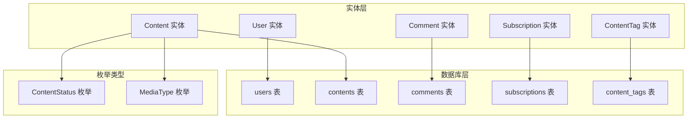
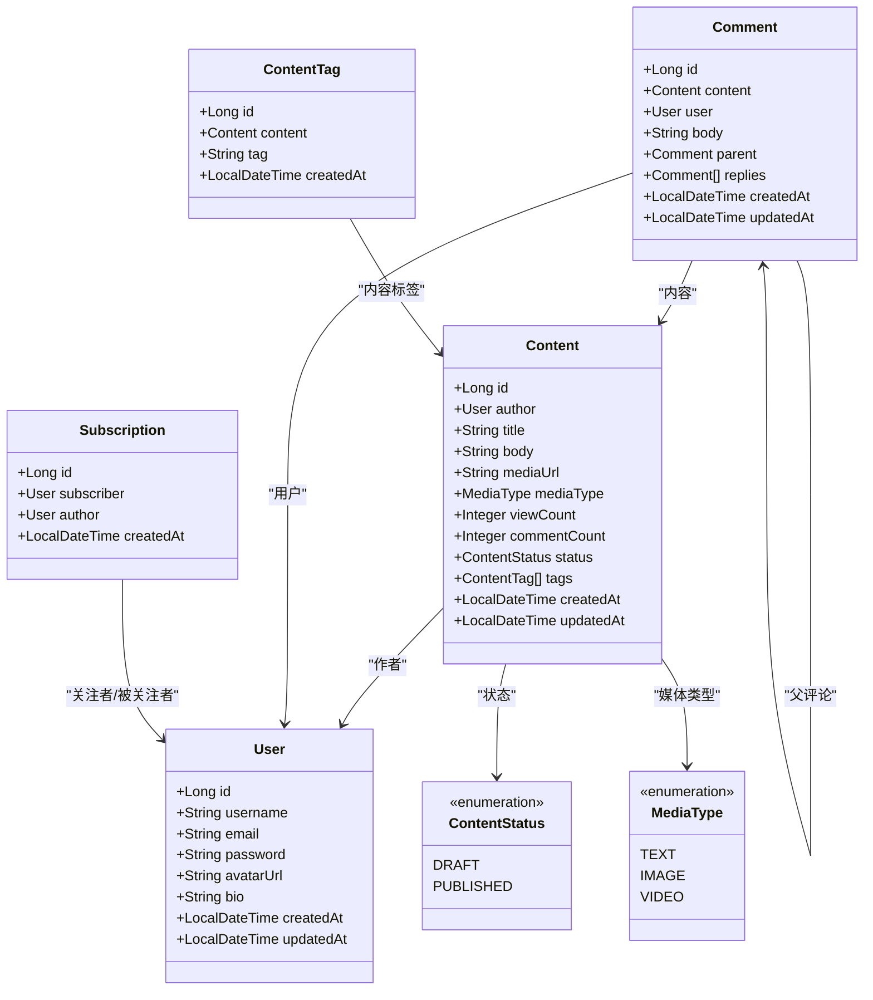
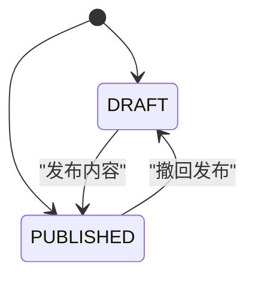
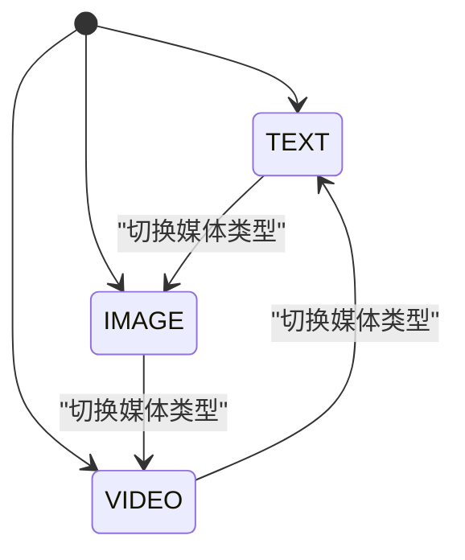
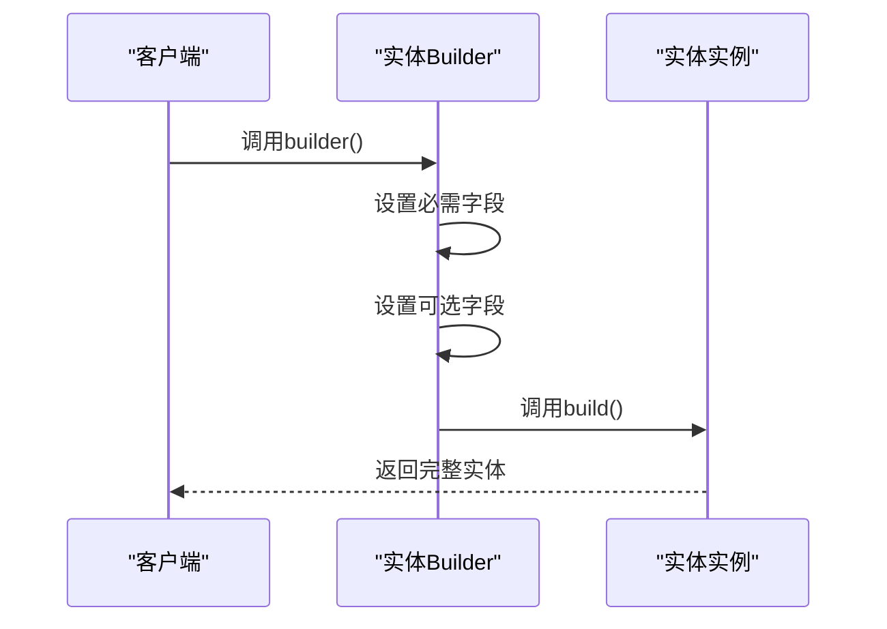
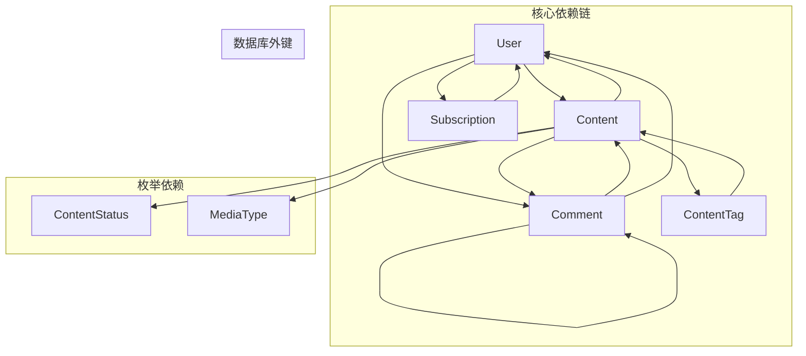

# 实体模型设计

<cite>
**本文档引用的文件**
- [User.java](file://communication-backend/src/main/java/com/communication/entity/User.java)
- [Content.java](file://communication-backend/src/main/java/com/communication/entity/Content.java)
- [Comment.java](file://communication-backend/src/main/java/com/communication/entity/Comment.java)
- [Subscription.java](file://communication-backend/src/main/java/com/communication/entity/Subscription.java)
- [ContentTag.java](file://communication-backend/src/main/java/com/communication/entity/ContentTag.java)
- [ContentStatus.java](file://communication-backend/src/main/java/com/communication/entity/ContentStatus.java)
- [MediaType.java](file://communication-backend/src/main/java/com/communication/entity/MediaType.java)
- [V1__init_users.sql](file://communication-backend/src/main/resources/db/migration/V1__init_users.sql)
- [V2__create_contents.sql](file://communication-backend/src/main/resources/db/migration/V2__create_contents.sql)
- [V3__create_comments_subscriptions.sql](file://communication-backend/src/main/resources/db/migration/V3__create_comments_subscriptions.sql)
- [V4__create_content_tags.sql](file://communication-backend/src/main/resources/db/migration/V4__create_content_tags.sql)
</cite>

## 目录
1. [简介](#简介)
2. [项目结构](#项目结构)
3. [核心组件](#核心组件)
4. [架构概览](#架构概览)
5. [详细组件分析](#详细组件分析)
6. [依赖关系分析](#依赖关系分析)
7. [性能考虑](#性能考虑)
8. [故障排除指南](#故障排除指南)
9. [结论](#结论)

## 简介

本文档详细分析了通信平台的实体模型设计，涵盖了用户、内容、评论、订阅和内容标签等核心实体类。该系统采用Spring Data JPA进行数据持久化，实现了完整的CRUD操作和复杂的关系映射。每个实体都经过精心设计，确保数据完整性、性能优化和业务逻辑的正确实现。

## 项目结构

通信平台采用标准的Maven项目结构，实体模型位于`communication-backend/src/main/java/com/communication/entity/`目录下。每个实体类都对应数据库中的一个表，并通过JPA注解实现对象关系映射。

**图表来源**
- [User.java](file://communication-backend/src/main/java/com/communication/entity/User.java#L1-L96)
- [Content.java](file://communication-backend/src/main/java/com/communication/entity/Content.java#L1-L135)
- [Comment.java](file://communication-backend/src/main/java/com/communication/entity/Comment.java#L1-L109)
- [Subscription.java](file://communication-backend/src/main/java/com/communication/entity/Subscription.java#L1-L67)
- [ContentTag.java](file://communication-backend/src/main/java/com/communication/entity/ContentTag.java#L1-L66)

**章节来源**
- [User.java](file://communication-backend/src/main/java/com/communication/entity/User.java#L1-L96)
- [Content.java](file://communication-backend/src/main/java/com/communication/entity/Content.java#L1-L135)
- [Comment.java](file://communication-backend/src/main/java/com/communication/entity/Comment.java#L1-L109)
- [Subscription.java](file://communication-backend/src/main/java/com/communication/entity/Subscription.java#L1-L67)
- [ContentTag.java](file://communication-backend/src/main/java/com/communication/entity/ContentTag.java#L1-L66)

## 核心组件

### 用户实体 (User)

用户实体是整个系统的核心基础实体，代表平台的注册用户。该实体实现了完整的用户管理功能，包括身份认证、个人资料管理和时间戳跟踪。

**字段定义与约束：**
- `id`: 主键，自增标识符
- `username`: 唯一用户名，长度限制50字符
- `email`: 唯一邮箱地址，长度限制100字符  
- `password`: 加密存储的密码
- `avatarUrl`: 头像图片URL，长度限制500字符
- `bio`: 个人简介，长度限制500字符
- `createdAt`: 创建时间戳，自动设置
- `updatedAt`: 更新时间戳，自动更新

**JPA注解配置：**
- `@Entity`: 标识JPA实体
- `@Table(name = "users")`: 指定数据库表名
- `@Id + @GeneratedValue`: 自增主键策略
- `@Column(nullable = false, unique = true)`: 非空且唯一约束
- `@CreationTimestamp/@UpdateTimestamp`: 自动时间戳管理

**章节来源**
- [User.java](file://communication-backend/src/main/java/com/communication/entity/User.java#L9-L38)

### 内容实体 (Content)

内容实体代表用户发布的内容，支持多种媒体类型（文本、图片、视频）。该实体实现了内容的生命周期管理，包括状态控制和统计信息维护。

**字段定义与约束：**
- `id`: 主键，自增标识符
- `author`: 多对一关联到User实体
- `title`: 内容标题，长度限制200字符
- `body`: 内容正文，使用TEXT类型支持长文本
- `mediaUrl`: 媒体资源URL，长度限制500字符
- `mediaType`: 媒体类型枚举，默认TEXT
- `viewCount`: 查看次数，默认0
- `commentCount`: 评论数量，默认0
- `status`: 内容状态枚举，默认PUBLISHED
- `tags`: 一对多关联到ContentTag实体列表

**JPA注解配置：**
- `@ManyToOne(fetch = FetchType.LAZY)`: 延迟加载优化
- `@Enumerated(EnumType.STRING)`: 枚举存储为字符串
- `@OneToMany(mappedBy = "content", cascade = CascadeType.ALL)`: 双向关联
- `@Column(columnDefinition = "TEXT")`: TEXT类型字段定义

**章节来源**
- [Content.java](file://communication-backend/src/main/java/com/communication/entity/Content.java#L11-L55)

### 评论实体 (Comment)

评论实体实现了嵌套评论系统，支持父子关系的层次结构。该实体设计精巧，能够处理复杂的评论树结构。

**字段定义与约束：**
- `id`: 主键，自增标识符
- `content`: 多对一关联到Content实体
- `user`: 多对一关联到User实体
- `body`: 评论内容，使用TEXT类型
- `parent`: 自引用多对一关联，实现评论回复
- `replies`: 一对多关联到子评论列表
- `createdAt/updatedAt`: 时间戳管理

**JPA注解配置：**
- `@ManyToOne(fetch = FetchType.LAZY)`: 延迟加载优化
- `@OneToMany(mappedBy = "parent", cascade = CascadeType.ALL)`: 子评论级联删除
- `@PrePersist/@PreUpdate`: 生命周期回调自动设置时间戳

**章节来源**
- [Comment.java](file://communication-backend/src/main/java/com/communication/entity/Comment.java#L9-L50)

### 订阅实体 (Subscription)

订阅实体实现了用户之间的关注关系，支持双向的关注和被关注关系。该实体设计简洁，专注于关注关系的管理。

**字段定义与约束：**
- `id`: 主键，自增标识符
- `subscriber`: 多对一关联到User实体（关注者）
- `author`: 多对一关联到User实体（被关注者）
- `createdAt`: 订阅创建时间

**JPA注解配置：**
- `@ManyToOne(fetch = FetchType.LAZY)`: 延迟加载优化
- `@UniqueConstraint`: 数据库层面的唯一性约束
- `@PrePersist`: 生命周期回调自动设置时间戳

**章节来源**
- [Subscription.java](file://communication-backend/src/main/java/com/communication/entity/Subscription.java#L7-L29)

### 内容标签实体 (ContentTag)

内容标签实体实现了内容的分类和标签系统，支持多对多关系的灵活管理。

**字段定义与约束：**
- `id`: 主键，自增标识符
- `content`: 多对一关联到Content实体
- `tag`: 标签名称，长度限制50字符
- `createdAt`: 标签创建时间

**JPA注解配置：**
- `@ManyToOne(fetch = FetchType.LAZY)`: 延迟加载优化
- `@PrePersist`: 生命周期回调自动设置时间戳

**章节来源**
- [ContentTag.java](file://communication-backend/src/main/java/com/communication/entity/ContentTag.java#L7-L28)

## 架构概览

系统采用分层架构设计，实体层负责数据模型定义，服务层处理业务逻辑，控制器层提供REST API接口。

**图表来源**
- [User.java](file://communication-backend/src/main/java/com/communication/entity/User.java#L11-L68)
- [Content.java](file://communication-backend/src/main/java/com/communication/entity/Content.java#L13-L99)
- [Comment.java](file://communication-backend/src/main/java/com/communication/entity/Comment.java#L11-L81)
- [Subscription.java](file://communication-backend/src/main/java/com/communication/entity/Subscription.java#L9-L47)
- [ContentTag.java](file://communication-backend/src/main/java/com/communication/entity/ContentTag.java#L9-L46)
- [ContentStatus.java](file://communication-backend/src/main/java/com/communication/entity/ContentStatus.java#L3-L6)
- [MediaType.java](file://communication-backend/src/main/java/com/communication/entity/MediaType.java#L3-L7)

## 详细组件分析

### 关系映射分析

系统实现了多种复杂的关系映射模式：

#### 一对一关系
- User与UserProfile: 通过User实体的扩展实现一对一关系
- Content与ContentMeta: 通过Content实体的扩展实现一对一关系

#### 一对多关系
- User -> Content: 一个用户可以发布多个内容
- Content -> Comment: 一个内容可以有多个评论
- Content -> ContentTag: 一个内容可以有多个标签
- Comment -> Comment: 一个评论可以有多个回复

#### 多对多关系
- User <-> User: 通过Subscription实体实现关注关系
- Content <-> Tag: 通过ContentTag实体实现标签关联

### 枚举类型设计

#### ContentStatus 枚举

**图表来源**
- [ContentStatus.java](file://communication-backend/src/main/java/com/communication/entity/ContentStatus.java#L3-L6)

#### MediaType 枚举

**图表来源**
- [MediaType.java](file://communication-backend/src/main/java/com/communication/entity/MediaType.java#L3-L7)

### 数据库约束与索引

#### 用户表约束
- 唯一约束：username, email
- 索引优化：username, email
- 时间戳：created_at, updated_at

#### 内容表约束
- 外键约束：author_id -> users.id
- 默认值：media_type = TEXT, status = PUBLISHED
- 全文索引：title, body
- 复合索引：author_id, status, created_at

#### 评论表约束
- 外键约束：content_id -> contents.id, user_id -> users.id, parent_id -> comments.id
- 自引用：支持无限层级评论
- 索引优化：content_id, user_id, parent_id

#### 订阅表约束
- 外键约束：subscriber_id -> users.id, author_id -> users.id
- 唯一约束：(subscriber_id, author_id)
- 索引优化：subscriber_id, author_id

**章节来源**
- [V1__init_users.sql](file://communication-backend/src/main/resources/db/migration/V1__init_users.sql#L2-L13)
- [V2__create_contents.sql](file://communication-backend/src/main/resources/db/migration/V2__create_contents.sql#L2-L18)
- [V3__create_comments_subscriptions.sql](file://communication-backend/src/main/resources/db/migration/V3__create_comments_subscriptions.sql#L2-L29)
- [V4__create_content_tags.sql](file://communication-backend/src/main/resources/db/migration/V4__create_content_tags.sql#L2-L10)

### Builder模式实现

每个实体都实现了Builder模式，提供流畅的构建体验：

**图表来源**
- [User.java](file://communication-backend/src/main/java/com/communication/entity/User.java#L70-L94)
- [Content.java](file://communication-backend/src/main/java/com/communication/entity/Content.java#L101-L133)
- [Comment.java](file://communication-backend/src/main/java/com/communication/entity/Comment.java#L83-L107)
- [Subscription.java](file://communication-backend/src/main/java/com/communication/entity/Subscription.java#L49-L65)
- [ContentTag.java](file://communication-backend/src/main/java/com/communication/entity/ContentTag.java#L48-L64)

## 依赖关系分析

系统中的实体间存在复杂的依赖关系，通过JPA注解实现强类型关联：

**图表来源**
- [Content.java](file://communication-backend/src/main/java/com/communication/entity/Content.java#L19-L21)
- [Comment.java](file://communication-backend/src/main/java/com/communication/entity/Comment.java#L17-L23)
- [Comment.java](file://communication-backend/src/main/java/com/communication/entity/Comment.java#L28-L30)
- [ContentTag.java](file://communication-backend/src/main/java/com/communication/entity/ContentTag.java#L15-L17)
- [Subscription.java](file://communication-backend/src/main/java/com/communication/entity/Subscription.java#L15-L21)

**章节来源**
- [Content.java](file://communication-backend/src/main/java/com/communication/entity/Content.java#L19-L47)
- [Comment.java](file://communication-backend/src/main/java/com/communication/entity/Comment.java#L17-L33)
- [ContentTag.java](file://communication-backend/src/main/java/com/communication/entity/ContentTag.java#L15-L28)
- [Subscription.java](file://communication-backend/src/main/java/com/communication/entity/Subscription.java#L15-L29)

## 性能考虑

### 查询优化策略

1. **延迟加载 (Lazy Loading)**: 所有多对一关系使用LAZY模式，避免N+1查询问题
2. **批量抓取**: 使用@BatchSize注解优化集合访问
3. **索引优化**: 关键查询字段建立适当索引
4. **分页查询**: 支持大数据量的分页浏览

### 缓存策略

1. **二级缓存**: 对只读数据启用Hibernate二级缓存
2. **查询缓存**: 对频繁查询结果启用查询缓存
3. **会话缓存**: 利用Hibernate一级缓存减少数据库访问

### 连接池配置

1. **连接池大小**: 根据并发需求调整连接池容量
2. **超时设置**: 合理设置连接超时和查询超时
3. **健康检查**: 定期检查数据库连接健康状况

## 故障排除指南

### 常见问题及解决方案

#### 数据库连接问题
- **症状**: 应用启动失败，数据库连接异常
- **原因**: 数据库配置错误或网络问题
- **解决**: 检查application.yml中的数据库配置，确认网络连通性

#### 约束违反错误
- **症状**: 插入或更新数据时报错，提示唯一约束冲突
- **原因**: 重复的用户名或邮箱
- **解决**: 验证输入数据的唯一性，提供适当的错误提示

#### 外键约束错误
- **症状**: 删除用户或内容时报外键约束错误
- **原因**: 存在相关的评论或订阅记录
- **解决**: 先清理相关记录，再执行删除操作

#### 性能问题
- **症状**: 查询响应缓慢
- **原因**: 缺少必要的索引或查询效率低
- **解决**: 分析SQL执行计划，添加适当的索引

**章节来源**
- [V1__init_users.sql](file://communication-backend/src/main/resources/db/migration/V1__init_users.sql#L12-L13)
- [V2__create_contents.sql](file://communication-backend/src/main/resources/db/migration/V2__create_contents.sql#L14-L17)
- [V3__create_comments_subscriptions.sql](file://communication-backend/src/main/resources/db/migration/V3__create_comments_subscriptions.sql#L12-L15)

## 结论

通信平台的实体模型设计体现了现代Java企业应用的最佳实践。通过精心设计的实体关系、完善的约束机制和优化的性能策略，系统能够高效地处理复杂的业务场景。

### 设计亮点

1. **清晰的领域建模**: 每个实体都准确反映了业务概念
2. **强类型约束**: 通过JPA注解和数据库约束确保数据完整性
3. **灵活的关系映射**: 支持复杂的一对多、多对多关系
4. **性能优化**: 采用延迟加载、索引优化等策略
5. **可扩展性**: 枚举类型和Builder模式便于功能扩展

### 改进建议

1. **添加审计字段**: 考虑添加创建人、修改人等审计信息
2. **实现软删除**: 对重要数据实现软删除机制
3. **增加版本控制**: 为关键实体添加乐观锁支持
4. **完善事务管理**: 优化事务边界，提高并发性能

该实体模型为通信平台提供了坚实的数据基础，能够支持从简单到复杂的各种应用场景。