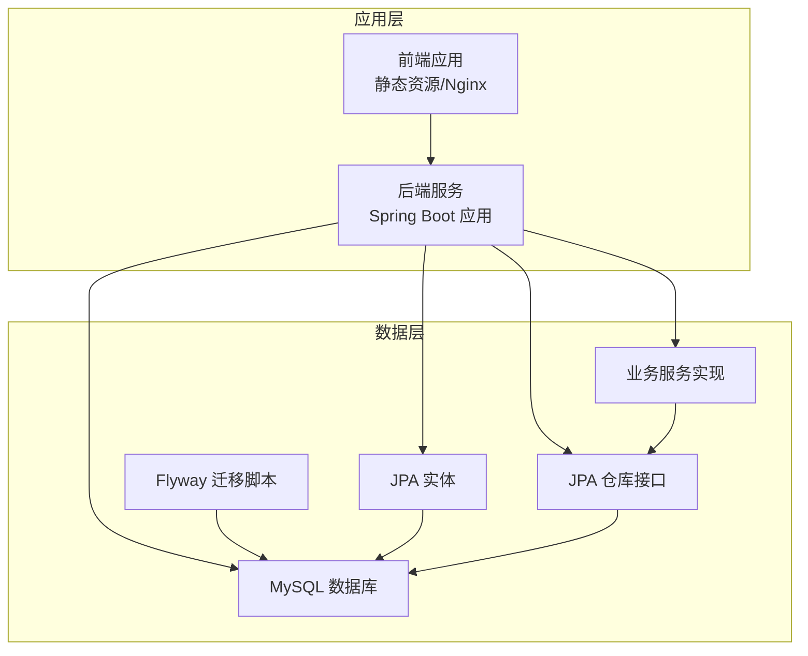
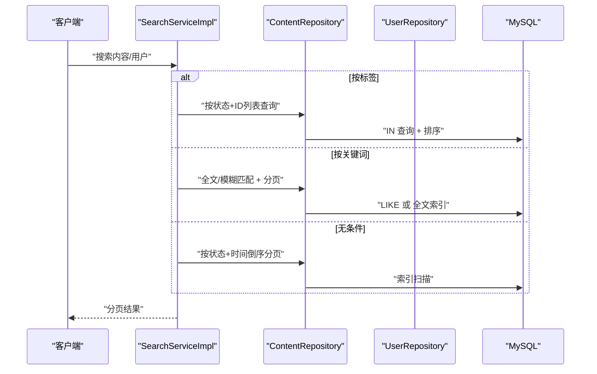
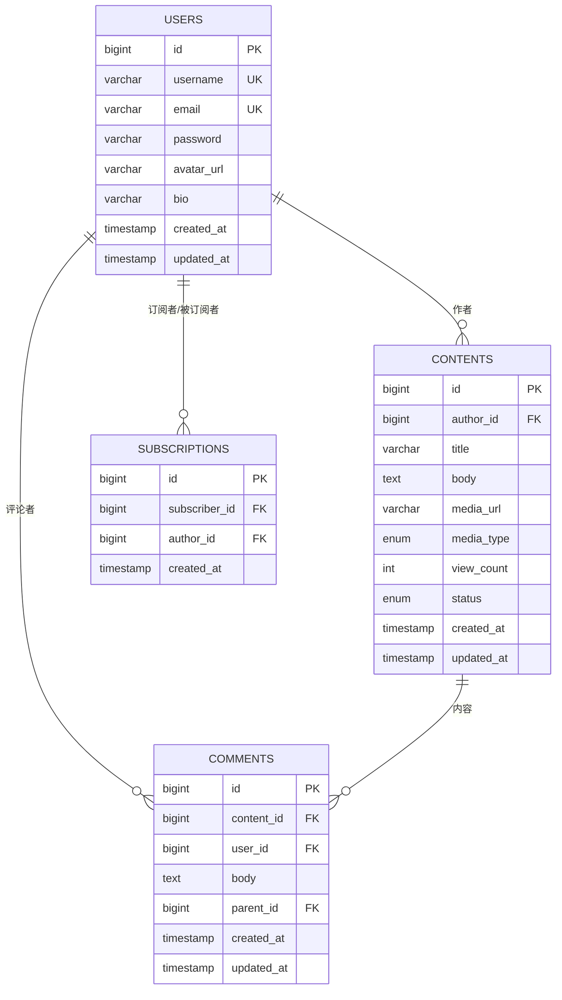
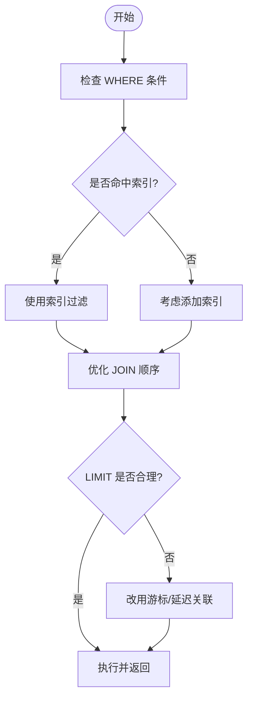
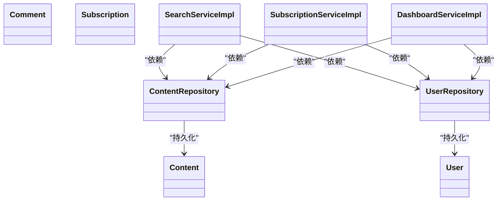

# 性能优化设计

<cite>
**本文引用的文件**
- [application.yml](file://communication-backend/src/main/resources/application.yml)
- [application-docker.yml](file://communication-backend/src/main/resources/application-docker.yml)
- [docker-compose.yml](file://docker-compose.yml)
- [pom.xml](file://communication-backend/pom.xml)
- [V1__init_users.sql](file://communication-backend/src/main/resources/db/migration/V1__init_users.sql)
- [V2__create_contents.sql](file://communication-backend/src/main/resources/db/migration/V2__create_contents.sql)
- [V3__create_comments_subscriptions.sql](file://communication-backend/src/main/resources/db/migration/V3__create_comments_subscriptions.sql)
- [User.java](file://communication-backend/src/main/java/com/communication/entity/User.java)
- [Content.java](file://communication-backend/src/main/java/com/communication/entity/Content.java)
- [Comment.java](file://communication-backend/src/main/java/com/communication/entity/Comment.java)
- [UserRepository.java](file://communication-backend/src/main/java/com/communication/repository/UserRepository.java)
- [ContentRepository.java](file://communication-backend/src/main/java/com/communication/repository/ContentRepository.java)
- [SearchServiceImpl.java](file://communication-backend/src/main/java/com/communication/service/impl/SearchServiceImpl.java)
- [SubscriptionServiceImpl.java](file://communication-backend/src/main/java/com/communication/service/impl/SubscriptionServiceImpl.java)
- [DashboardServiceImpl.java](file://communication-backend/src/main/java/com/communication/service/impl/DashboardServiceImpl.java)
</cite>

## 目录
1. [简介](#简介)
2. [项目结构](#项目结构)
3. [核心组件](#核心组件)
4. [架构总览](#架构总览)
5. [详细组件分析](#详细组件分析)
6. [依赖分析](#依赖分析)
7. [性能考虑](#性能考虑)
8. [故障排查指南](#故障排查指南)
9. [结论](#结论)
10. [附录](#附录)

## 简介
本文件面向通信平台数据库性能优化设计，聚焦于索引设计策略（主键、唯一、普通）、查询优化（WHERE、JOIN、LIMIT）、数据库配置（InnoDB参数与缓冲池）、慢查询与监控、执行计划分析、分区与分表策略、连接池与连接优化、缓存策略以及性能测试与基准测试方法。文档以代码库中的实体、仓库与服务实现为依据，结合数据库迁移脚本与Spring Boot配置，给出可落地的优化建议。

## 项目结构
后端采用Spring Boot + JPA/Hibernate + MySQL，Flyway进行数据库版本管理；前端通过Nginx反向代理，后端容器化部署。数据库层由实体定义、JPA仓库接口、服务实现与Flyway迁移脚本共同构成。

**图表来源**
- [docker-compose.yml](file://docker-compose.yml#L1-L60)
- [application.yml](file://communication-backend/src/main/resources/application.yml#L1-L42)
- [application-docker.yml](file://communication-backend/src/main/resources/application-docker.yml#L1-L43)

**章节来源**
- [docker-compose.yml](file://docker-compose.yml#L1-L60)
- [application.yml](file://communication-backend/src/main/resources/application.yml#L1-L42)
- [application-docker.yml](file://communication-backend/src/main/resources/application-docker.yml#L1-L43)

## 核心组件
- 实体模型：用户、内容、评论、订阅关系等，定义了表结构与字段约束。
- 仓库接口：基于JPA的CRUD与自定义查询，支撑分页、排序与聚合统计。
- 服务实现：封装业务逻辑，组合多个仓库进行复杂查询与事务控制。
- 数据库迁移：Flyway脚本定义表结构、索引与外键约束。

**章节来源**
- [User.java](file://communication-backend/src/main/java/com/communication/entity/User.java#L1-L96)
- [Content.java](file://communication-backend/src/main/java/com/communication/entity/Content.java#L1-L135)
- [Comment.java](file://communication-backend/src/main/java/com/communication/entity/Comment.java#L1-L109)
- [UserRepository.java](file://communication-backend/src/main/java/com/communication/repository/UserRepository.java#L1-L27)
- [ContentRepository.java](file://communication-backend/src/main/java/com/communication/repository/ContentRepository.java#L1-L56)
- [SearchServiceImpl.java](file://communication-backend/src/main/java/com/communication/service/impl/SearchServiceImpl.java#L1-L129)
- [SubscriptionServiceImpl.java](file://communication-backend/src/main/java/com/communication/service/impl/SubscriptionServiceImpl.java#L1-L179)
- [DashboardServiceImpl.java](file://communication-backend/src/main/java/com/communication/service/impl/DashboardServiceImpl.java#L1-L87)
- [V1__init_users.sql](file://communication-backend/src/main/resources/db/migration/V1__init_users.sql#L1-L14)
- [V2__create_contents.sql](file://communication-backend/src/main/resources/db/migration/V2__create_contents.sql#L1-L19)
- [V3__create_comments_subscriptions.sql](file://communication-backend/src/main/resources/db/migration/V3__create_comments_subscriptions.sql#L1-L33)

## 架构总览
下图展示从请求到数据库的关键交互路径，包括搜索、订阅流、仪表盘统计等典型场景。

**图表来源**
- [SearchServiceImpl.java](file://communication-backend/src/main/java/com/communication/service/impl/SearchServiceImpl.java#L33-L66)
- [ContentRepository.java](file://communication-backend/src/main/java/com/communication/repository/ContentRepository.java#L46-L54)
- [UserRepository.java](file://communication-backend/src/main/java/com/communication/repository/UserRepository.java#L24-L25)

## 详细组件分析

### 索引设计策略
- 主键索引：所有表均使用自增主键，确保聚簇索引有序写入，降低页分裂与插入开销。
- 唯一索引：用户名与邮箱在用户表上建立唯一索引，保障业务唯一性并加速查找。
- 普通索引：
  - 内容表：作者ID、状态、创建时间（降序）、全文索引用于搜索。
  - 评论表：内容ID、用户ID、父评论ID，支撑回复树与按作者/内容检索。
  - 订阅表：订阅者ID、作者ID（联合唯一），并分别对两列建单列索引，支持查询关注/粉丝列表。
- 复合索引建议：
  - 内容表：按作者+状态+时间倒序的复合索引可覆盖常见“我的已发布”或“订阅流”查询。
  - 评论表：内容ID+时间或内容ID+用户ID可优化回复树与按内容/作者查询。
  - 用户表：username/email已有唯一索引，避免重复索引。

**图表来源**
- [V1__init_users.sql](file://communication-backend/src/main/resources/db/migration/V1__init_users.sql#L1-L14)
- [V2__create_contents.sql](file://communication-backend/src/main/resources/db/migration/V2__create_contents.sql#L1-L19)
- [V3__create_comments_subscriptions.sql](file://communication-backend/src/main/resources/db/migration/V3__create_comments_subscriptions.sql#L1-L33)

**章节来源**
- [V1__init_users.sql](file://communication-backend/src/main/resources/db/migration/V1__init_users.sql#L11-L12)
- [V2__create_contents.sql](file://communication-backend/src/main/resources/db/migration/V2__create_contents.sql#L14-L17)
- [V3__create_comments_subscriptions.sql](file://communication-backend/src/main/resources/db/migration/V3__create_comments_subscriptions.sql#L13-L15)
- [V3__create_comments_subscriptions.sql](file://communication-backend/src/main/resources/db/migration/V3__create_comments_subscriptions.sql#L26-L28)

### 查询优化技术
- WHERE条件优化
  - 使用精确相等条件优先走唯一/主键索引；避免在索引列使用函数或隐式转换。
  - 对大小写不敏感的字符串比较，尽量统一格式或使用二进制/校对规则优化。
- JOIN操作优化
  - 关联查询时确保连接键有索引；先小表驱动大表，减少中间结果集。
  - 在订阅流中，先查出作者ID集合，再以IN子句查询内容，避免笛卡尔积。
- LIMIT使用最佳实践
  - 配合合适的排序索引与分页游标，避免深度分页导致的offset过大。
  - 对高频分页查询，可引入“基于游标的分页”或“延迟关联”减少回表成本。

[本图为概念流程图，无需图表来源]

**章节来源**
- [SearchServiceImpl.java](file://communication-backend/src/main/java/com/communication/service/impl/SearchServiceImpl.java#L133-L167)
- [ContentRepository.java](file://communication-backend/src/main/java/com/communication/repository/ContentRepository.java#L44-L54)

### 数据库配置优化（InnoDB）
- 缓冲池（innodb_buffer_pool_size）：根据可用内存设定，建议占物理内存的50%-70%，确保热点数据常驻。
- 日志组（innodb_log_file_size/innodb_log_files_in_group）：增大单个日志文件可提升写入吞吐，但会增加崩溃恢复时间。
- 文件系统与I/O：使用SSD存储，开启O_DIRECT减少两次拷贝；调整innodb_flush_log_at_trx_commit平衡安全与性能。
- 并发与锁：合理设置innodb_thread_concurrency与innodb_concurrency_tickets，避免过度竞争。
- 字符集与排序规则：utf8mb4_unicode_ci满足多语言需求，注意排序成本与索引前缀长度限制。

[本节为通用配置建议，无需章节来源]

### 慢查询日志与性能监控
- 启用慢查询日志：设置long_query_time阈值（如1秒），记录超过阈值的SQL与执行时间。
- 监控指标：QPS、TPS、连接数、缓冲池命中率、锁等待、磁盘I/O、上下文切换。
- 工具链：EXPLAIN/ANALYZE查看执行计划；pt-query-digest解析慢查询日志；Perf/Zabbix/Prometheus+Grafana采集指标。

[本节为通用监控建议，无需章节来源]

### 执行计划分析方法
- 使用EXPLAIN/EXPLAIN ANALYZE观察：
  - 是否使用期望的索引（type、key、rows、filtered）。
  - 是否发生全表扫描或临时表/文件排序。
  - JOIN顺序与连接类型（NLJ、BNL、Hash Join）。
- 针对性优化：
  - 添加缺失的单列/复合索引。
  - 改写SQL谓词，避免在索引列使用函数或隐式转换。
  - 将可复用的子查询物化或拆分为多次查询。

[本节为通用分析方法，无需章节来源]

### 分区表与分表策略
- 分区表（Partitioning）：适用于超大表的时间维度（如按月/季度分区），便于归档与维护。
- 分表（Sharding）：按业务维度水平拆分（如用户ID取模、地域分片），需配合全局ID生成器与路由规则。
- 适用场景：
  - 内容表：按作者ID或创建时间分片，支撑高并发读写。
  - 评论表：按内容ID分片，减少跨节点JOIN。
  - 订阅表：按用户ID分片，支持关注/粉丝列表快速查询。

[本节为通用策略建议，无需章节来源]

### 连接池配置与连接优化
- HikariCP参数调优（示例）：
  - maximumPoolSize：根据峰值并发与CPU核数设定。
  - minimumIdle：保持一定空闲连接，降低连接建立开销。
  - connectionTimeout：适配业务RT目标，避免过长排队。
  - idleTimeout、maxLifetime：平衡连接复用与资源回收。
- 连接优化：
  - 启用自动提交批处理、批量插入。
  - 使用只读事务与适当的隔离级别。
  - 避免长时间持有连接，及时关闭Statement/ResultSet。

**章节来源**
- [application-docker.yml](file://communication-backend/src/main/resources/application-docker.yml#L8-L11)

### 缓存策略设计
- 查询结果缓存：
  - 页面级缓存：搜索结果、订阅流、热门标签等，设置合理TTL与失效策略。
  - 列表分页缓存：对稳定列表（如热门内容）做LRU缓存。
- 热点数据缓存：
  - 用户资料、作者统计、热门标签等高频读取对象放入Redis/Memcached。
  - 缓存更新策略：写放大时采用“写后失效”，读多写少场景采用“写时更新”。
- 缓存一致性：
  - 引入分布式锁或版本号，保证缓存与数据库最终一致。

[本节为通用缓存建议，无需章节来源]

### 性能测试与基准测试
- 单元/集成测试：使用JUnit+Mock，验证关键查询路径与分页性能。
- 压力测试：JMeter/Locust模拟高并发请求，测量响应时间与错误率。
- 基准测试：sysbench/tpcc评估数据库吞吐与延迟；针对热点SQL做回归对比。
- 观测与回归：持续监控关键指标，建立性能基线，定期回归测试。

[本节为通用测试建议，无需章节来源]

## 依赖分析
- 实体与表结构：用户、内容、评论、订阅四张核心表，分别对应User、Content、Comment、Subscription实体。
- 仓库与查询：UserRepository与ContentRepository提供分页、排序、聚合与全文/模糊查询能力。
- 服务与业务：SearchServiceImpl组合多个仓库实现搜索与标签建议；SubscriptionServiceImpl实现订阅流与关注/粉丝查询；DashboardServiceImpl聚合统计作者内容与互动数据。

**图表来源**
- [User.java](file://communication-backend/src/main/java/com/communication/entity/User.java#L1-L96)
- [Content.java](file://communication-backend/src/main/java/com/communication/entity/Content.java#L1-L135)
- [Comment.java](file://communication-backend/src/main/java/com/communication/entity/Comment.java#L1-L109)
- [UserRepository.java](file://communication-backend/src/main/java/com/communication/repository/UserRepository.java#L1-L27)
- [ContentRepository.java](file://communication-backend/src/main/java/com/communication/repository/ContentRepository.java#L1-L56)
- [SearchServiceImpl.java](file://communication-backend/src/main/java/com/communication/service/impl/SearchServiceImpl.java#L20-L31)
- [SubscriptionServiceImpl.java](file://communication-backend/src/main/java/com/communication/service/impl/SubscriptionServiceImpl.java#L25-L36)
- [DashboardServiceImpl.java](file://communication-backend/src/main/java/com/communication/service/impl/DashboardServiceImpl.java#L17-L31)

**章节来源**
- [UserRepository.java](file://communication-backend/src/main/java/com/communication/repository/UserRepository.java#L1-L27)
- [ContentRepository.java](file://communication-backend/src/main/java/com/communication/repository/ContentRepository.java#L1-L56)
- [SearchServiceImpl.java](file://communication-backend/src/main/java/com/communication/service/impl/SearchServiceImpl.java#L1-L129)
- [SubscriptionServiceImpl.java](file://communication-backend/src/main/java/com/communication/service/impl/SubscriptionServiceImpl.java#L1-L179)
- [DashboardServiceImpl.java](file://communication-backend/src/main/java/com/communication/service/impl/DashboardServiceImpl.java#L1-L87)

## 性能考虑
- 索引覆盖：确保常用查询的WHERE/JOIN/ORDER BY列被索引覆盖，减少回表与排序。
- 分页与游标：对深度分页使用基于游标的分页，避免OFFSET过大。
- 统计与缓存：对聚合统计（如阅读量、评论数）采用缓存与异步更新，降低实时计算压力。
- 连接池与事务：合理设置连接池参数，避免长事务与死锁；对只读查询使用只读事务。
- 监控与告警：建立慢查询、连接数、缓冲池命中率等关键指标的监控与告警。

[本节为通用性能建议，无需章节来源]

## 故障排查指南
- 慢查询定位：启用慢查询日志，结合EXPLAIN分析执行计划，识别缺少索引或回表过多的SQL。
- 连接池问题：检查maximumPoolSize是否不足、connectionTimeout是否过短、idleTimeout是否导致频繁重建。
- 锁与死锁：排查长时间事务、不必要的共享锁、热点行更新引发的锁竞争。
- 缓存一致性：确认缓存失效策略与写后失效/写时更新机制是否正确实施。

[本节为通用排查建议，无需章节来源]

## 结论
通过对实体与仓库的结构化分析，结合数据库迁移脚本与Spring Boot配置，本文件提出了面向通信平台的数据库性能优化方案：以索引设计为核心，配合查询优化、连接池与缓存策略，并辅以慢查询日志与监控体系，形成从设计到运维的闭环优化路径。实际落地时应结合业务负载与硬件环境，持续压测与回归，逐步完善性能基线。

## 附录
- 关键配置参考
  - 数据源与连接池：见application-docker.yml中的HikariCP参数。
  - JPA与方言：见application.yml中的JPA与Hibernate配置。
  - Flyway迁移：见db/migration目录下的SQL脚本。
- 依赖与构建
  - Maven依赖：Spring Data JPA、MySQL Connector、Flyway等。

**章节来源**
- [application.yml](file://communication-backend/src/main/resources/application.yml#L5-L18)
- [application-docker.yml](file://communication-backend/src/main/resources/application-docker.yml#L3-L11)
- [pom.xml](file://communication-backend/pom.xml#L25-L77)