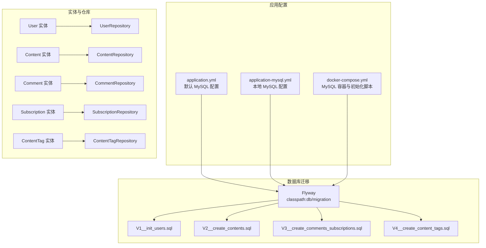
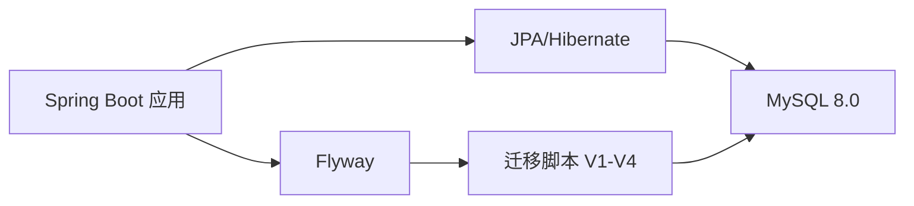

# 数据库设计

<cite>
**本文档引用的文件**
- [application-mysql.yml](file://communication-backend/src/main/resources/application-mysql.yml)
- [application.yml](file://communication-backend/src/main/resources/application.yml)
- [docker-compose.yml](file://docker-compose.yml)
- [User.java](file://communication-backend/src/main/java/com/communication/entity/User.java)
- [Content.java](file://communication-backend/src/main/java/com/communication/entity/Content.java)
- [Comment.java](file://communication-backend/src/main/java/com/communication/entity/Comment.java)
- [Subscription.java](file://communication-backend/src/main/java/com/communication/entity/Subscription.java)
- [ContentTag.java](file://communication-backend/src/main/java/com/communication/entity/ContentTag.java)
- [ContentStatus.java](file://communication-backend/src/main/java/com/communication/entity/ContentStatus.java)
- [MediaType.java](file://communication-backend/src/main/java/com/communication/entity/MediaType.java)
- [V1__init_users.sql](file://communication-backend/src/main/resources/db/migration/V1__init_users.sql)
- [V2__create_contents.sql](file://communication-backend/src/main/resources/db/migration/V2__create_contents.sql)
- [V3__create_comments_subscriptions.sql](file://communication-backend/src/main/resources/db/migration/V3__create_comments_subscriptions.sql)
- [V4__create_content_tags.sql](file://communication-backend/src/main/resources/db/migration/V4__create_content_tags.sql)
- [UserRepository.java](file://communication-backend/src/main/java/com/communication/repository/UserRepository.java)
- [ContentRepository.java](file://communication-backend/src/main/java/com/communication/repository/ContentRepository.java)
- [CommentRepository.java](file://communication-backend/src/main/java/com/communication/repository/CommentRepository.java)
- [SubscriptionRepository.java](file://communication-backend/src/main/java/com/communication/repository/SubscriptionRepository.java)
- [ContentTagRepository.java](file://communication-backend/src/main/java/com/communication/repository/ContentTagRepository.java)
- [init.sql](file://init.sql)
</cite>

## 更新摘要
**所做更改**
- 新增 MySQL 环境配置文件 application-mysql.yml，提供本地 Docker 化 MySQL 开发支持
- 更新数据库配置章节，包含多环境配置策略和 Docker Compose 集成
- 增强本地开发环境配置说明，涵盖 MySQL 用户名密码配置和连接参数
- 完善数据库初始化和迁移流程，支持多种部署场景

## 目录
1. 引言
2. 项目结构
3. 核心组件
4. 架构总览
5. 详细组件分析
6. 依赖分析
7. 性能考虑
8. 故障排查指南
9. 结论
10. 附录

## 引言
本文件面向通信平台的数据库设计，系统化梳理数据模型、实体关系、迁移与版本管理、索引与性能优化、数据完整性与业务规则，并提供 ER 图与表关系图，帮助开发者与运维人员快速理解与维护数据库层。

## 项目结构
后端采用 Spring Boot + JPA/Hibernate + Flyway 的架构，数据库迁移脚本位于 resources/db/migration，应用通过 Flyway 自动执行迁移；实体定义在 entity 包中，仓库接口在 repository 包中，配合 Spring Data JPA 提供查询方法。



**图表来源**
- [application.yml:1-42](file://communication-backend/src/main/resources/application.yml#L1-L42)
- [application-mysql.yml:1-10](file://communication-backend/src/main/resources/application-mysql.yml#L1-L10)
- [docker-compose.yml:1-60](file://docker-compose.yml#L1-L60)
- [V1__init_users.sql:1-14](file://communication-backend/src/main/resources/db/migration/V1__init_users.sql#L1-L14)
- [V2__create_contents.sql:1-19](file://communication-backend/src/main/resources/db/migration/V2__create_contents.sql#L1-L19)
- [V3__create_comments_subscriptions.sql:1-33](file://communication-backend/src/main/resources/db/migration/V3__create_comments_subscriptions.sql#L1-L33)
- [V4__create_content_tags.sql:1-14](file://communication-backend/src/main/resources/db/migration/V4__create_content_tags.sql#L1-L14)
- [User.java:1-96](file://communication-backend/src/main/java/com/communication/entity/User.java#L1-L96)
- [Content.java:1-135](file://communication-backend/src/main/java/com/communication/entity/Content.java#L1-L135)
- [Comment.java:1-109](file://communication-backend/src/main/java/com/communication/entity/Comment.java#L1-L109)
- [Subscription.java:1-67](file://communication-backend/src/main/java/com/communication/entity/Subscription.java#L1-L67)
- [ContentTag.java:1-66](file://communication-backend/src/main/java/com/communication/entity/ContentTag.java#L1-L66)
- [UserRepository.java:1-27](file://communication-backend/src/main/java/com/communication/repository/UserRepository.java#L1-L27)
- [ContentRepository.java:1-56](file://communication-backend/src/main/java/com/communication/repository/ContentRepository.java#L1-L56)
- [CommentRepository.java:1-33](file://communication-backend/src/main/java/com/communication/repository/CommentRepository.java#L1-L33)
- [SubscriptionRepository.java:1-34](file://communication-backend/src/main/java/com/communication/repository/SubscriptionRepository.java#L1-L34)
- [ContentTagRepository.java:1-29](file://communication-backend/src/main/java/com/communication/repository/ContentTagRepository.java#L1-L29)

**章节来源**
- [application.yml:1-42](file://communication-backend/src/main/resources/application.yml#L1-L42)
- [application-mysql.yml:1-10](file://communication-backend/src/main/resources/application-mysql.yml#L1-L10)
- [docker-compose.yml:1-60](file://docker-compose.yml#L1-L60)

## 核心组件
- 用户表 users：存储用户基本信息与时间戳，具备用户名与邮箱唯一性约束，以及 username/email 索引。
- 内容表 contents：存储文章/内容，关联作者（users），支持媒体类型与状态枚举，全文检索索引覆盖标题与正文，带作者与状态、创建时间索引。
- 评论表 comments：支持树形评论（父子关系），关联内容与用户，带内容、用户、父评论索引。
- 订阅表 subscriptions：多对多关系的中间表，保证订阅关系唯一性，带订阅者与作者索引。
- 内容标签表 content_tags：多对多中间表，记录内容与其标签，带内容与标签索引。

**章节来源**
- [User.java:1-96](file://communication-backend/src/main/java/com/communication/entity/User.java#L1-L96)
- [Content.java:1-135](file://communication-backend/src/main/java/com/communication/entity/Content.java#L1-L135)
- [Comment.java:1-109](file://communication-backend/src/main/java/com/communication/entity/Comment.java#L1-L109)
- [Subscription.java:1-67](file://communication-backend/src/main/java/com/communication/entity/Subscription.java#L1-L67)
- [ContentTag.java:1-66](file://communication-backend/src/main/java/com/communication/entity/ContentTag.java#L1-L66)
- [V1__init_users.sql:1-14](file://communication-backend/src/main/resources/db/migration/V1__init_users.sql#L1-L14)
- [V2__create_contents.sql:1-19](file://communication-backend/src/main/resources/db/migration/V2__create_contents.sql#L1-L19)
- [V3__create_comments_subscriptions.sql:1-33](file://communication-backend/src/main/resources/db/migration/V3__create_comments_subscriptions.sql#L1-L33)
- [V4__create_content_tags.sql:1-14](file://communication-backend/src/main/resources/db/migration/V4__create_content_tags.sql#L1-L14)

## 架构总览
下图展示数据库层的实体关系与外键约束，体现一对一、一对多、多对多映射及索引策略。

```mermaid
erDiagram
USERS {
bigint id PK
varchar username UK
varchar email UK
varchar password
varchar avatar_url
varchar bio
timestamp created_at
timestamp updated_at
}
CONTENTS {
bigint id PK
bigint author_id FK
varchar title
text body
varchar media_url
enum media_type
int view_count
int comment_count
enum status
timestamp created_at
timestamp updated_at
}
COMMENTS {
bigint id PK
bigint content_id FK
bigint user_id FK
text body
bigint parent_id FK
timestamp created_at
timestamp updated_at
}
SUBSCRIPTIONS {
bigint id PK
bigint subscriber_id FK
bigint author_id FK
timestamp created_at
}
CONTENT_TAGS {
bigint id PK
bigint content_id FK
varchar tag
timestamp created_at
}
USERS ||--o{ CONTENTS : "作者"
USERS ||--o{ COMMENTS : "评论者"
CONTENTS ||--o{ COMMENTS : "被评论"
USERS ||--o{ SUBSCRIPTIONS : "订阅者/作者"
CONTENTS ||--o{ CONTENT_TAGS : "拥有标签"
-- 外键约束
CONTENTS }o--|| USERS : "author_id"
COMMENTS }o--|| CONTENTS : "content_id"
COMMENTS }o--|| USERS : "user_id"
COMMENTS }o--o| COMMENTS : "parent_id"
SUBSCRIPTIONS }o--|| USERS : "subscriber_id"
SUBSCRIPTIONS }o--|| USERS : "author_id"
CONTENT_TAGS }o--|| CONTENTS : "content_id"
```

**图表来源**
- [V1__init_users.sql:1-14](file://communication-backend/src/main/resources/db/migration/V1__init_users.sql#L1-L14)
- [V2__create_contents.sql:1-19](file://communication-backend/src/main/resources/db/migration/V2__create_contents.sql#L1-L19)
- [V3__create_comments_subscriptions.sql:1-33](file://communication-backend/src/main/resources/db/migration/V3__create_comments_subscriptions.sql#L1-L33)
- [V4__create_content_tags.sql:1-14](file://communication-backend/src/main/resources/db/migration/V4__create_content_tags.sql#L1-L14)
- [User.java:1-96](file://communication-backend/src/main/java/com/communication/entity/User.java#L1-L96)
- [Content.java:1-135](file://communication-backend/src/main/java/com/communication/entity/Content.java#L1-L135)
- [Comment.java:1-109](file://communication-backend/src/main/java/com/communication/entity/Comment.java#L1-L109)
- [Subscription.java:1-67](file://communication-backend/src/main/java/com/communication/entity/Subscription.java#L1-L67)
- [ContentTag.java:1-66](file://communication-backend/src/main/java/com/communication/entity/ContentTag.java#L1-L66)

## 详细组件分析

### 用户表 users
- 字段要点：自增主键、用户名与邮箱唯一、密码、头像 URL、简介、创建/更新时间戳。
- 约束与索引：UNIQUE（username、email），普通索引（username、email）。
- 业务规则：用户名与邮箱全局唯一；用于内容作者、评论用户、订阅关系主体。

**章节来源**
- [User.java:1-96](file://communication-backend/src/main/java/com/communication/entity/User.java#L1-L96)
- [V1__init_users.sql:1-14](file://communication-backend/src/main/resources/db/migration/V1__init_users.sql#L1-L14)

### 内容表 contents
- 字段要点：作者（外键）、标题、正文、媒体 URL、媒体类型（枚举）、浏览量、评论数、状态（枚举）、创建/更新时间戳。
- 约束与索引：外键 author_id → users(id)，索引 author_id、status、created_at（降序）、全文索引(title, body)。
- 业务规则：默认发布状态；浏览量通过仓库方法递增；按状态与创建时间分页查询；支持全文检索关键词搜索。

**章节来源**
- [Content.java:1-135](file://communication-backend/src/main/java/com/communication/entity/Content.java#L1-L135)
- [ContentStatus.java:1-7](file://communication-backend/src/main/java/com/communication/entity/ContentStatus.java#L1-L7)
- [MediaType.java:1-8](file://communication-backend/src/main/java/com/communication/entity/MediaType.java#L1-L8)
- [V2__create_contents.sql:1-19](file://communication-backend/src/main/resources/db/migration/V2__create_contents.sql#L1-L19)
- [ContentRepository.java:1-56](file://communication-backend/src/main/java/com/communication/repository/ContentRepository.java#L1-L56)

### 评论表 comments
- 字段要点：内容（外键）、用户（外键）、正文、父评论（自关联，实现树形回复）、创建/更新时间戳。
- 约束与索引：外键 content_id → contents(id)、user_id → users(id)、parent_id → comments(id)，索引 content_id、user_id、parent_id。
- 业务规则：支持按内容顶层评论分页、按父评论排序子回复、按用户统计评论数、删除内容时级联删除评论。

**章节来源**
- [Comment.java:1-109](file://communication-backend/src/main/java/com/communication/entity/Comment.java#L1-L109)
- [V3__create_comments_subscriptions.sql:1-33](file://communication-backend/src/main/resources/db/migration/V3__create_comments_subscriptions.sql#L1-L33)
- [CommentRepository.java:1-33](file://communication-backend/src/main/java/com/communication/repository/CommentRepository.java#L1-L33)

### 订阅表 subscriptions
- 字段要点：订阅者（外键）、被订阅作者（外键）、创建时间。
- 约束与索引：UNIQUE(subscriber_id, author_id)，索引 subscriber_id、author_id。
- 业务规则：订阅关系唯一；支持按订阅者或作者分页查询；统计订阅数与被订阅数。

**章节来源**
- [Subscription.java:1-67](file://communication-backend/src/main/java/com/communication/entity/Subscription.java#L1-L67)
- [V3__create_comments_subscriptions.sql:1-33](file://communication-backend/src/main/resources/db/migration/V3__create_comments_subscriptions.sql#L1-L33)
- [SubscriptionRepository.java:1-34](file://communication-backend/src/main/java/com/communication/repository/SubscriptionRepository.java#L1-L34)

### 内容标签表 content_tags
- 字段要点：内容（外键）、标签名、创建时间。
- 约束与索引：外键 content_id → contents(id)，索引 content_id、tag。
- 业务规则：支持按标签检索内容 ID 列表、按标签模糊匹配、统计热门标签。

**章节来源**
- [ContentTag.java:1-66](file://communication-backend/src/main/java/com/communication/entity/ContentTag.java#L1-L66)
- [V4__create_content_tags.sql:1-14](file://communication-backend/src/main/resources/db/migration/V4__create_content_tags.sql#L1-L14)
- [ContentTagRepository.java:1-29](file://communication-backend/src/main/java/com/communication/repository/ContentTagRepository.java#L1-L29)

### 关系与映射
- 用户 ↔ 内容：一对多（一个作者可有多篇内容）
- 用户 ↔ 评论：一对多（一个用户可有多条评论）
- 内容 ↔ 评论：一对多（一篇文章可有多个评论）
- 评论 ↔ 评论：自关联（父子评论）
- 用户 ↔ 用户（订阅）：多对多（通过 subscriptions 表）
- 内容 ↔ 标签：多对多（通过 content_tags 表）

**章节来源**
- [Content.java:1-135](file://communication-backend/src/main/java/com/communication/entity/Content.java#L1-L135)
- [Comment.java:1-109](file://communication-backend/src/main/java/com/communication/entity/Comment.java#L1-L109)
- [Subscription.java:1-67](file://communication-backend/src/main/java/com/communication/entity/Subscription.java#L1-L67)
- [ContentTag.java:1-66](file://communication-backend/src/main/java/com/communication/entity/ContentTag.java#L1-L66)

## 依赖分析
- 运行时依赖
  - 数据库：MySQL 8.0（utf8mb4 字符集）
  - 连接池与驱动：Spring Boot 默认（MySQL Connector/J）
  - ORM：Hibernate（JPA）
  - 迁移：Flyway（classpath:db/migration）
- 配置要点
  - 数据源：本地或容器内 MySQL
  - JPA：验证模式（validate），方言为 MySQL
  - Flyway：启用，迁移目录 classpath:db/migration，首次迁移自动基线



**图表来源**
- [application.yml:1-42](file://communication-backend/src/main/resources/application.yml#L1-L42)
- [V1__init_users.sql:1-14](file://communication-backend/src/main/resources/db/migration/V1__init_users.sql#L1-L14)
- [V2__create_contents.sql:1-19](file://communication-backend/src/main/resources/db/migration/V2__create_contents.sql#L1-L19)
- [V3__create_comments_subscriptions.sql:1-33](file://communication-backend/src/main/resources/db/migration/V3__create_comments_subscriptions.sql#L1-L33)
- [V4__create_content_tags.sql:1-14](file://communication-backend/src/main/resources/db/migration/V4__create_content_tags.sql#L1-L14)

**章节来源**
- [application.yml:1-42](file://communication-backend/src/main/resources/application.yml#L1-L42)

## 性能考虑
- 索引策略
  - users：username、email 唯一与普通索引，支持登录与搜索。
  - contents：author_id、status、created_at（降序）、全文索引(title, body)，支撑作者筛选、状态过滤、时间排序与全文检索。
  - comments：content_id、user_id、parent_id，支撑内容评论列表、用户评论历史、树形回复。
  - subscriptions：subscriber_id、author_id 唯一索引，支撑订阅去重与分页。
  - content_tags：content_id、tag，支撑标签检索与热门标签统计。
- 查询优化建议
  - 分页查询优先使用覆盖索引列（如 created_at、author_id、status）。
  - 全文检索优先使用全文索引，避免 LIKE 百分号前缀导致的索引失效。
  - 聚合统计使用原生 SQL 或投影查询，减少对象加载开销。
- 锁与并发
  - 外键级联删除（CASCADE）确保数据一致性，但需注意批量删除的锁竞争。
  - 唯一索引 uk_subscription 防止重复订阅，写入冲突时由数据库抛出唯一约束异常。

**章节来源**
- [V1__init_users.sql:1-14](file://communication-backend/src/main/resources/db/migration/V1__init_users.sql#L1-L14)
- [V2__create_contents.sql:1-19](file://communication-backend/src/main/resources/db/migration/V2__create_contents.sql#L1-L19)
- [V3__create_comments_subscriptions.sql:1-33](file://communication-backend/src/main/resources/db/migration/V3__create_comments_subscriptions.sql#L1-L33)
- [V4__create_content_tags.sql:1-14](file://communication-backend/src/main/resources/db/migration/V4__create_content_tags.sql#L1-L14)
- [ContentRepository.java:1-56](file://communication-backend/src/main/java/com/communication/repository/ContentRepository.java#L1-L56)
- [CommentRepository.java:1-33](file://communication-backend/src/main/java/com/communication/repository/CommentRepository.java#L1-L33)
- [SubscriptionRepository.java:1-34](file://communication-backend/src/main/java/com/communication/repository/SubscriptionRepository.java#L1-L34)
- [ContentTagRepository.java:1-29](file://communication-backend/src/main/java/com/communication/repository/ContentTagRepository.java#L1-L29)

## 故障排查指南
- Flyway 迁移失败
  - 现象：启动时报错提示迁移失败或版本不一致。
  - 排查：检查 classpath:db/migration 下脚本是否完整、命名是否符合 V{N}__*.sql 规范、baseline-on-migrate 是否启用。
  - 参考配置：Flyway 启用、locations、baseline-on-migrate。
- 数据库连接问题
  - 现象：应用无法连接数据库。
  - 排查：确认 JDBC URL、用户名、密码正确；容器环境检查环境变量；初始化脚本是否成功执行。
  - 参考配置：application.yml 中 datasource.url、username、password；docker-compose 中环境变量与 init.sql。
- 唯一约束冲突
  - 现象：插入订阅或标签时报唯一约束错误。
  - 排查：先查询是否存在相同组合，再进行插入或忽略。
  - 参考仓库：SubscriptionRepository.existsBySubscriberIdAndAuthorId；ContentTagRepository.existsByContentIdAndTag。
- 全文检索无效
  - 现象：按关键词搜索无结果或性能差。
  - 排查：确认表引擎为 InnoDB，全文索引已建立，查询使用正确的 LIKE 或 JPQL 条件。
  - 参考脚本：V2__create_contents.sql 的全文索引定义。

**章节来源**
- [application.yml:1-42](file://communication-backend/src/main/resources/application.yml#L1-L42)
- [application-mysql.yml:1-10](file://communication-backend/src/main/resources/application-mysql.yml#L1-L10)
- [docker-compose.yml:1-60](file://docker-compose.yml#L1-L60)
- [init.sql:1-3](file://init.sql#L1-L3)
- [SubscriptionRepository.java:1-34](file://communication-backend/src/main/java/com/communication/repository/SubscriptionRepository.java#L1-L34)
- [ContentTagRepository.java:1-29](file://communication-backend/src/main/java/com/communication/repository/ContentTagRepository.java#L1-L29)
- [V2__create_contents.sql:1-19](file://communication-backend/src/main/resources/db/migration/V2__create_contents.sql#L1-L19)

## 结论
该数据库设计以清晰的实体边界与外键约束为基础，结合 Flyway 的版本化迁移与完善的索引策略，满足用户、内容、评论、订阅与标签的核心业务需求。通过合理的查询接口与约束设计，既保障了数据一致性，也为后续扩展（如更复杂的标签体系、内容统计报表）提供了良好基础。

## 附录

### 数据库配置与环境支持

#### 多环境配置策略
项目支持多种数据库配置环境：

**默认配置（application.yml）**
- 使用本地 MySQL 实例，root 用户，可从环境变量获取密码
- 适用于开发和生产环境的基础配置

**本地 MySQL 配置（application-mysql.yml）**
- 专门针对本地 Docker 化 MySQL 开发环境
- 支持通过环境变量配置 MySQL 用户名和密码
- 提供详细的使用说明和连接参数配置

**Docker Compose 集成**
- 完整的容器化部署方案
- MySQL 8.0 容器配置，包含健康检查
- 自动初始化数据库和字符集设置
- 后端服务依赖 MySQL 容器启动

**章节来源**
- [application.yml:1-42](file://communication-backend/src/main/resources/application.yml#L1-L42)
- [application-mysql.yml:1-10](file://communication-backend/src/main/resources/application-mysql.yml#L1-L10)
- [docker-compose.yml:1-60](file://docker-compose.yml#L1-L60)

### 数据库初始化与迁移流程
- 初始化数据库
  - 使用 init.sql 创建数据库与字符集设置。
  - 在 docker-compose 中通过 init.sql 挂载到容器入口初始化。
- 启动应用触发 Flyway
  - Spring Boot 启动时自动扫描 classpath:db/migration 并执行未应用的迁移脚本。
  - 若首次运行，baseline-on-migrate 将自动创建 Flyway 版本元数据表。

**章节来源**
- [init.sql:1-3](file://init.sql#L1-L3)
- [docker-compose.yml:1-60](file://docker-compose.yml#L1-L60)
- [application.yml:1-42](file://communication-backend/src/main/resources/application.yml#L1-L42)

### 迁移脚本清单与变更摘要
- V1__init_users.sql：创建 users 表，添加 username、email 唯一约束与索引。
- V2__create_contents.sql：创建 contents 表，添加 author_id 外键、状态与全文索引。
- V3__create_comments_subscriptions.sql：创建 comments 与 subscriptions 表，添加外键与索引，为 contents 添加 comment_count。
- V4__create_content_tags.sql：创建 content_tags 表，添加外键与索引，优化用户搜索索引。

**章节来源**
- [V1__init_users.sql:1-14](file://communication-backend/src/main/resources/db/migration/V1__init_users.sql#L1-L14)
- [V2__create_contents.sql:1-19](file://communication-backend/src/main/resources/db/migration/V2__create_contents.sql#L1-L19)
- [V3__create_comments_subscriptions.sql:1-33](file://communication-backend/src/main/resources/db/migration/V3__create_comments_subscriptions.sql#L1-L33)
- [V4__create_content_tags.sql:1-14](file://communication-backend/src/main/resources/db/migration/V4__create_content_tags.sql#L1-L14)