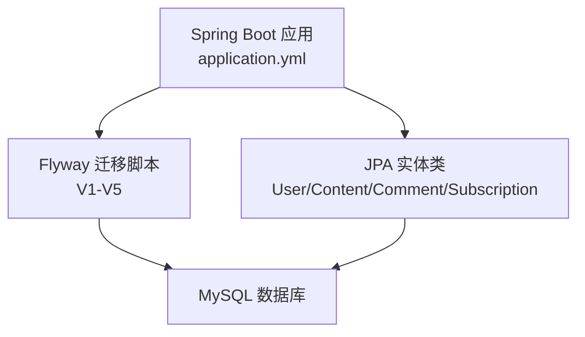
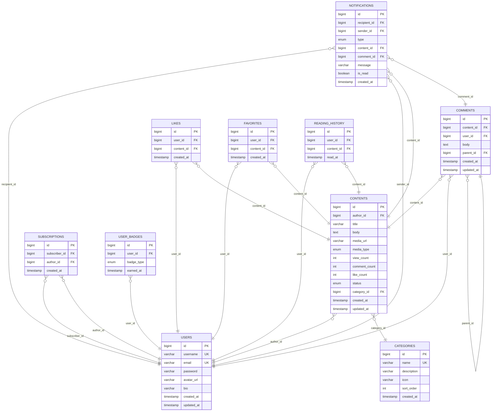
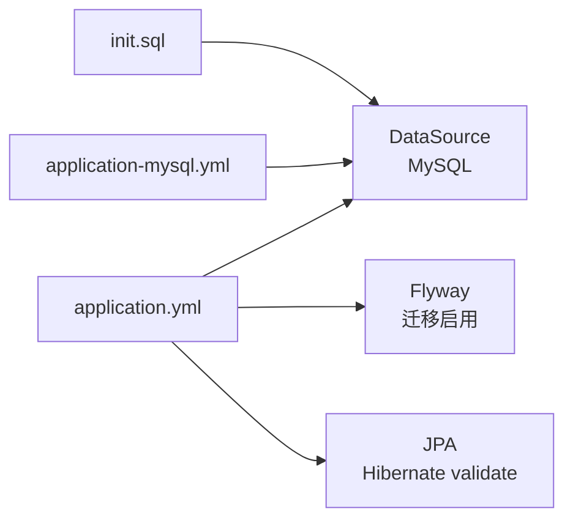

# 数据库设计

<cite>
**本文引用的文件**
- [application.yml](file://communication-backend/src/main/resources/application.yml)
- [application-mysql.yml](file://communication-backend/src/main/resources/application-mysql.yml)
- [V1__init_users.sql](file://communication-backend/src/main/resources/db/migration/V1__init_users.sql)
- [V2__create_contents.sql](file://communication-backend/src/main/resources/db/migration/V2__create_contents.sql)
- [V3__create_comments_subscriptions.sql](file://communication-backend/src/main/resources/db/migration/V3__create_comments_subscriptions.sql)
- [V4__create_content_tags.sql](file://communication-backend/src/main/resources/db/migration/V4__create_content_tags.sql)
- [V5__add_likes_favorites_notifications_categories_history_badges.sql](file://communication-backend/src/main/resources/db/migration/V5__add_likes_favorites_notifications_categories_history_badges.sql)
- [init.sql](file://init.sql)
- [User.java](file://communication-backend/src/main/java/com/communication/entity/User.java)
- [Content.java](file://communication-backend/src/main/java/com/communication/entity/Content.java)
- [Comment.java](file://communication-backend/src/main/java/com/communication/entity/Comment.java)
- [Subscription.java](file://communication-backend/src/main/java/com/communication/entity/Subscription.java)
</cite>

## 目录
1. [简介](#简介)
2. [项目结构](#项目结构)
3. [核心组件](#核心组件)
4. [架构总览](#架构总览)
5. [详细组件分析](#详细组件分析)
6. [依赖分析](#依赖分析)
7. [性能考量](#性能考量)
8. [故障排查指南](#故障排查指南)
9. [结论](#结论)
10. [附录](#附录)

## 简介
本文件面向数据库设计与演进，围绕用户、内容、评论、订阅等核心实体，系统化阐述ER关系图与表结构设计、外键与索引策略、数据完整性保障、Flyway迁移与回滚机制、性能优化、配置优化、安全与监控维护建议。文档同时给出数据模型演进历史与各版本迁移目的，并提供可操作的运维与排障指引。

## 项目结构
数据库相关的核心位置集中在后端资源与实体定义中：
- Flyway 迁移脚本位于 resources/db/migration，按版本号顺序演进
- Spring Boot 配置文件定义了数据源、JPA、Flyway 等关键参数
- JPA 实体类映射到对应表，体现对象-关系映射与级联行为

图表来源
- [application.yml:1-42](file://communication-backend/src/main/resources/application.yml#L1-L42)
- [V1__init_users.sql:1-14](file://communication-backend/src/main/resources/db/migration/V1__init_users.sql#L1-L14)
- [V2__create_contents.sql:1-19](file://communication-backend/src/main/resources/db/migration/V2__create_contents.sql#L1-L19)
- [V3__create_comments_subscriptions.sql:1-33](file://communication-backend/src/main/resources/db/migration/V3__create_comments_subscriptions.sql#L1-L33)
- [V4__create_content_tags.sql:1-14](file://communication-backend/src/main/resources/db/migration/V4__create_content_tags.sql#L1-L14)
- [V5__add_likes_favorites_notifications_categories_history_badges.sql:1-100](file://communication-backend/src/main/resources/db/migration/V5__add_likes_favorites_notifications_categories_history_badges.sql#L1-L100)

章节来源
- [application.yml:1-42](file://communication-backend/src/main/resources/application.yml#L1-L42)
- [application-mysql.yml:1-10](file://communication-backend/src/main/resources/application-mysql.yml#L1-L10)

## 核心组件
本项目数据库由以下核心实体构成：
- 用户表 users：存储用户身份信息与基础资料
- 内容表 contents：存储文章/内容及其状态、媒体类型、统计字段
- 评论表 comments：支持树形评论与回复
- 订阅表 subscriptions：记录用户对作者的关注关系
- 其他扩展表：categories、likes、favorites、notifications、reading_history、user_badges

章节来源
- [V1__init_users.sql:1-14](file://communication-backend/src/main/resources/db/migration/V1__init_users.sql#L1-L14)
- [V2__create_contents.sql:1-19](file://communication-backend/src/main/resources/db/migration/V2__create_contents.sql#L1-L19)
- [V3__create_comments_subscriptions.sql:1-33](file://communication-backend/src/main/resources/db/migration/V3__create_comments_subscriptions.sql#L1-L33)
- [V4__create_content_tags.sql:1-14](file://communication-backend/src/main/resources/db/migration/V4__create_content_tags.sql#L1-L14)
- [V5__add_likes_favorites_notifications_categories_history_badges.sql:1-100](file://communication-backend/src/main/resources/db/migration/V5__add_likes_favorites_notifications_categories_history_badges.sql#L1-L100)

## 架构总览
下图展示数据库层的整体架构与实体间关系：

图表来源
- [V1__init_users.sql:1-14](file://communication-backend/src/main/resources/db/migration/V1__init_users.sql#L1-L14)
- [V2__create_contents.sql:1-19](file://communication-backend/src/main/resources/db/migration/V2__create_contents.sql#L1-L19)
- [V3__create_comments_subscriptions.sql:1-33](file://communication-backend/src/main/resources/db/migration/V3__create_comments_subscriptions.sql#L1-L33)
- [V4__create_content_tags.sql:1-14](file://communication-backend/src/main/resources/db/migration/V4__create_content_tags.sql#L1-L14)
- [V5__add_likes_favorites_notifications_categories_history_badges.sql:1-100](file://communication-backend/src/main/resources/db/migration/V5__add_likes_favorites_notifications_categories_history_badges.sql#L1-L100)

## 详细组件分析

### 用户表 users
- 设计要点
  - 主键自增 id
  - 唯一约束：username、email
  - 时间戳：created_at、updated_at
  - 索引：username、email
- 完整性与安全
  - 密码字段用于认证，需配合后端加密策略使用
  - 建议在应用层进行密码哈希与盐值处理
- 性能
  - 唯一索引支持登录与注册场景的快速查找

章节来源
- [V1__init_users.sql:1-14](file://communication-backend/src/main/resources/db/migration/V1__init_users.sql#L1-L14)
- [User.java:1-96](file://communication-backend/src/main/java/com/communication/entity/User.java#L1-L96)

### 内容表 contents
- 设计要点
  - 外键：author_id 引用 users(id)，级联删除
  - 统计字段：view_count、comment_count、like_count
  - 状态与媒体类型：status、media_type
  - 索引：author_id、status、created_at（降序）、全文索引(title, body)
- 关系与级联
  - 删除作者时，其内容随之外键级联删除
- 性能
  - 全文索引支持标题与正文检索
  - 按时间倒序查询与状态过滤常见于内容列表

章节来源
- [V2__create_contents.sql:1-19](file://communication-backend/src/main/resources/db/migration/V2__create_contents.sql#L1-L19)
- [Content.java:1-153](file://communication-backend/src/main/java/com/communication/entity/Content.java#L1-L153)

### 评论表 comments
- 设计要点
  - 外键：content_id、user_id 引用 contents(id)、users(id)，parent_id 引用自身实现树形结构
  - 级联：删除用户或内容时，评论级联删除
  - 索引：content_id、user_id、parent_id
- 关系与级联
  - 自引用 parent_id 支持多级回复
- 性能
  - 通过 content_id 快速定位内容下的评论树

章节来源
- [V3__create_comments_subscriptions.sql:1-33](file://communication-backend/src/main/resources/db/migration/V3__create_comments_subscriptions.sql#L1-L33)
- [Comment.java:1-109](file://communication-backend/src/main/java/com/communication/entity/Comment.java#L1-L109)

### 订阅表 subscriptions
- 设计要点
  - 双外键：subscriber_id、author_id 引用 users(id)
  - 唯一索引：(subscriber_id, author_id) 防止重复关注
  - 索引：subscriber_id、author_id
- 关系与级联
  - 删除用户时，其关注与被关注关系均级联删除
- 性能
  - 唯一索引确保关注关系幂等，避免重复关注

章节来源
- [V3__create_comments_subscriptions.sql:18-29](file://communication-backend/src/main/resources/db/migration/V3__create_comments_subscriptions.sql#L18-L29)
- [Subscription.java:1-67](file://communication-backend/src/main/java/com/communication/entity/Subscription.java#L1-L67)

### 内容标签表 content_tags
- 设计要点
  - 外键：content_id 引用 contents(id)，级联删除
  - 索引：content_id、tag
- 性能
  - 便于按标签筛选内容

章节来源
- [V4__create_content_tags.sql:1-14](file://communication-backend/src/main/resources/db/migration/V4__create_content_tags.sql#L1-L14)

### 分类表 categories 与扩展表
- 分类表 categories
  - 唯一约束：name
  - 索引：sort_order
- 内容表扩展字段
  - 新增 category_id 外键（删除时设为空），新增 like_count 字段
  - 新增索引：contents(category_id)
- 扩展表
  - likes、favorites：唯一索引(user_id, content_id)
  - notifications：多外键（recipient_id、sender_id、content_id、comment_id），复合索引优化读取
  - reading_history：唯一索引(user_id, content_id)
  - user_badges：唯一索引(user_id, badge_type)

章节来源
- [V5__add_likes_favorites_notifications_categories_history_badges.sql:1-100](file://communication-backend/src/main/resources/db/migration/V5__add_likes_favorites_notifications_categories_history_badges.sql#L1-L100)

## 依赖分析
- Spring Boot 配置
  - 数据源：MySQL，支持环境变量覆盖用户名与密码
  - JPA：hibernate.dialect 指定 MySQL 方言；ddl-auto 设置为 validate
  - Flyway：启用并指定迁移脚本路径，首次运行自动基线化
- 初始化
  - init.sql 负责创建数据库与字符集设置
  - application-mysql.yml 提供本机 MySQL 的连接参数

图表来源
- [application.yml:1-42](file://communication-backend/src/main/resources/application.yml#L1-L42)
- [application-mysql.yml:1-10](file://communication-backend/src/main/resources/application-mysql.yml#L1-L10)
- [init.sql:1-3](file://init.sql#L1-L3)

章节来源
- [application.yml:1-42](file://communication-backend/src/main/resources/application.yml#L1-L42)
- [application-mysql.yml:1-10](file://communication-backend/src/main/resources/application-mysql.yml#L1-L10)
- [init.sql:1-3](file://init.sql#L1-L3)

## 性能考量
- 索引策略
  - 用户：username、email 唯一索引
  - 内容：author_id、status、created_at DESC、全文索引(title, body)
  - 评论：content_id、user_id、parent_id
  - 订阅：subscriber_id、author_id（唯一索引）
  - 内容标签：content_id、tag
  - likes/favorites：(user_id, content_id) 唯一索引
  - notifications：recipient_id、(recipient_id, is_read)、created_at DESC
  - reading_history：(user_id, content_id)、(user_id, read_at DESC)
  - user_badges：(user_id, badge_type)
- 查询优化建议
  - 使用覆盖索引减少回表
  - 对高频过滤条件（status、is_read）建立复合索引
  - 全文检索优先使用数据库内置全文索引
- 存储引擎与字符集
  - InnoDB 引擎提供事务与行级锁
  - utf8mb4 字符集满足多语言与表情符号
- 缓存与分页
  - 列表类查询采用分页与延迟加载（如 JPA FetchType.LAZY）

[本节为通用性能指导，不直接分析具体文件，故无“章节来源”]

## 故障排查指南
- 迁移失败
  - 确认 Flyway 已启用且迁移路径正确
  - 检查 baseline-on-migrate 是否符合预期
  - 查看数据库是否存在已标记的迁移记录
- 连接问题
  - 校验 application.yml 与 application-mysql.yml 中的 JDBC URL、用户名、密码
  - 确保 init.sql 已创建数据库与字符集
- 约束冲突
  - 唯一索引冲突（如订阅、收藏、徽章）需先去重再插入
  - 外键约束导致删除失败时，确认是否需要先清理子表数据
- SQL 语法与方言
  - JPA 方言为 MySQL，确保生成 SQL 符合 MySQL 语法

章节来源
- [application.yml:1-42](file://communication-backend/src/main/resources/application.yml#L1-L42)
- [application-mysql.yml:1-10](file://communication-backend/src/main/resources/application-mysql.yml#L1-L10)
- [init.sql:1-3](file://init.sql#L1-L3)

## 结论
该数据库设计以用户、内容、评论、订阅为核心，辅以分类、点赞、收藏、通知、阅读历史与徽章等扩展能力，形成完整的内容社交数据模型。通过 Flyway 版本化迁移与严格的外键与索引策略，兼顾了数据一致性与查询性能。结合合理的配置与安全实践，可支撑从开发到生产的全生命周期运维。

[本节为总结性内容，不直接分析具体文件，故无“章节来源”]

## 附录

### 数据模型演进历史
- V1：初始化用户表，建立基础字段与索引
- V2：创建内容表，引入作者外键与全文索引
- V3：创建评论与订阅表，补充评论计数字段
- V4：引入内容标签表，增强搜索与分类能力
- V5：新增分类、点赞、收藏、通知、阅读历史、徽章表，完善生态功能

章节来源
- [V1__init_users.sql:1-14](file://communication-backend/src/main/resources/db/migration/V1__init_users.sql#L1-L14)
- [V2__create_contents.sql:1-19](file://communication-backend/src/main/resources/db/migration/V2__create_contents.sql#L1-L19)
- [V3__create_comments_subscriptions.sql:1-33](file://communication-backend/src/main/resources/db/migration/V3__create_comments_subscriptions.sql#L1-L33)
- [V4__create_content_tags.sql:1-14](file://communication-backend/src/main/resources/db/migration/V4__create_content_tags.sql#L1-L14)
- [V5__add_likes_favorites_notifications_categories_history_badges.sql:1-100](file://communication-backend/src/main/resources/db/migration/V5__add_likes_favorites_notifications_categories_history_badges.sql#L1-L100)

### 数据完整性与约束
- 唯一性约束
  - users.username、users.email
  - subscriptions(subscriber_id, author_id)
  - likes(user_id, content_id)
  - favorites(user_id, content_id)
  - reading_history(user_id, content_id)
  - user_badges(user_id, badge_type)
- 外键与级联
  - contents.author_id -> users(id)：ON DELETE CASCADE
  - comments.content_id -> contents(id)、user_id -> users(id)、parent_id -> comments(id)：均 ON DELETE CASCADE
  - subscriptions.subscriber_id -> users(id)、author_id -> users(id)：ON DELETE CASCADE
  - categories(id) 作为 contents.category_id 外键，删除时 SET NULL
  - likes/favorites/content_tags/notifications/reading_history/user_badges：均引用 users/contents/comments 并设置 ON DELETE CASCADE

章节来源
- [V1__init_users.sql:1-14](file://communication-backend/src/main/resources/db/migration/V1__init_users.sql#L1-L14)
- [V2__create_contents.sql:1-19](file://communication-backend/src/main/resources/db/migration/V2__create_contents.sql#L1-L19)
- [V3__create_comments_subscriptions.sql:1-33](file://communication-backend/src/main/resources/db/migration/V3__create_comments_subscriptions.sql#L1-L33)
- [V4__create_content_tags.sql:1-14](file://communication-backend/src/main/resources/db/migration/V4__create_content_tags.sql#L1-L14)
- [V5__add_likes_favorites_notifications_categories_history_badges.sql:1-100](file://communication-backend/src/main/resources/db/migration/V5__add_likes_favorites_notifications_categories_history_badges.sql#L1-L100)

### Flyway 迁移与回滚机制
- 启用与路径
  - 在 application.yml 中启用 Flyway，指定迁移脚本路径为 classpath:db/migration
  - baseline-on-migrate：首次运行自动创建基线
- 回滚策略
  - 建议在开发环境使用可逆迁移脚本，生产环境谨慎回滚
  - 可通过手动执行 down 脚本或调整基线版本实现回滚
- 最佳实践
  - 迁移脚本必须幂等，避免重复执行造成副作用
  - 重要变更前先在测试环境验证

章节来源
- [application.yml:20-24](file://communication-backend/src/main/resources/application.yml#L20-L24)

### 数据库配置优化
- 连接池
  - 建议在 application.yml 或外部配置中设置连接池参数（如最大连接数、空闲超时、连接寿命），并结合应用负载调优
- 查询优化
  - 为高频查询字段建立合适索引，避免全表扫描
  - 使用 EXPLAIN 分析慢查询，针对性优化
- 备份策略
  - 建议采用定时快照与增量备份相结合的方式，确保可恢复点明确
  - 生产库备份应与业务低峰期错开

[本节为通用配置建议，不直接分析具体文件，故无“章节来源”]

### 数据安全与访问控制
- 敏感数据保护
  - 用户密码必须经哈希与加盐处理，不在数据库明文保存
  - 敏感字段（如邮箱）在传输与存储中使用加密
- 访问控制
  - 严格区分数据库账号权限，限制应用只读或必要写权限
  - 使用环境变量注入数据库凭据，避免硬编码

[本节为通用安全指导，不直接分析具体文件，故无“章节来源”]

### 监控与维护
- 监控指标
  - 连接数、慢查询、锁等待、缓冲池命中率、表扫描次数
- 维护任务
  - 定期重建碎片索引、更新统计信息
  - 清理过期通知、历史记录与临时数据

[本节为通用运维指导，不直接分析具体文件，故无“章节来源”]