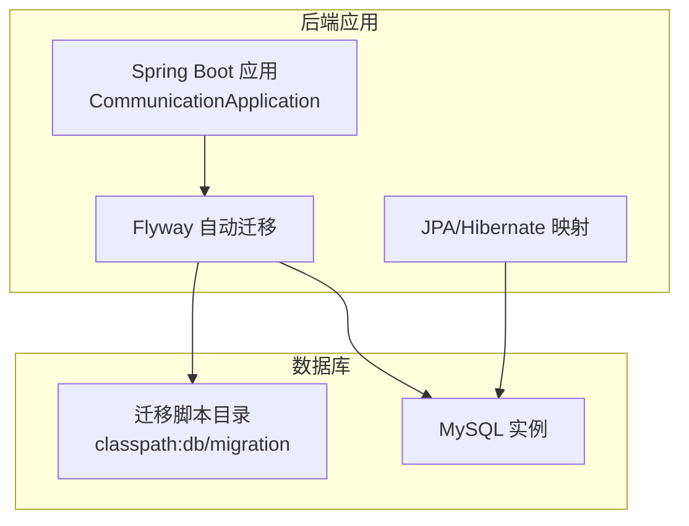
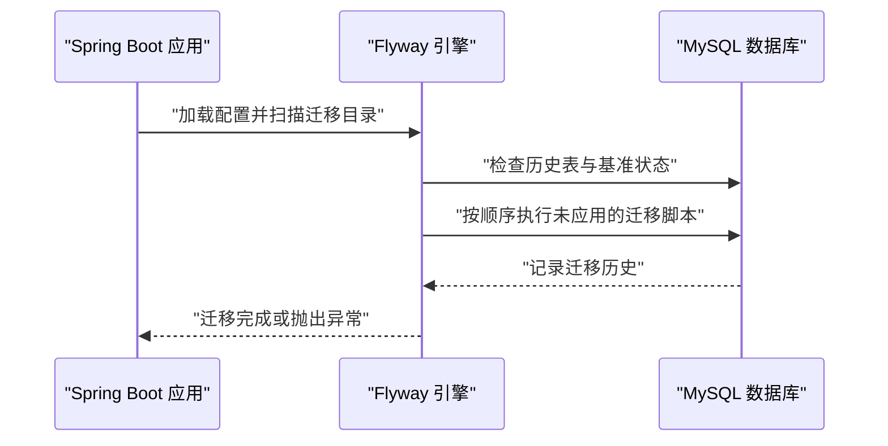
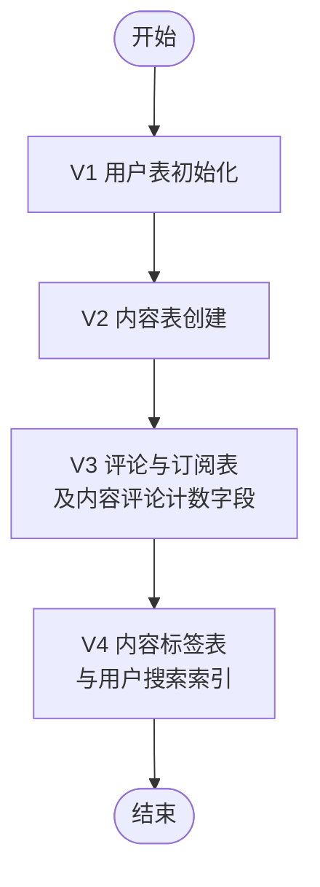
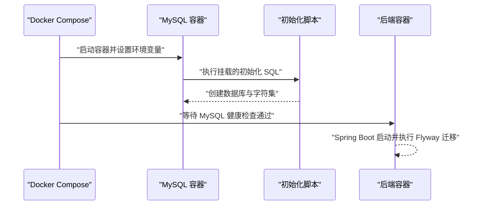
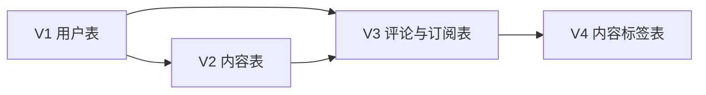
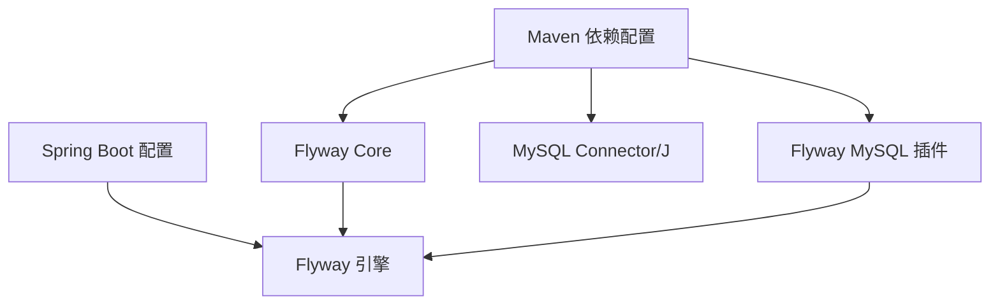

# 数据库迁移策略

<cite>
**本文引用的文件**
- [application.yml](file://communication-backend/src/main/resources/application.yml)
- [application-docker.yml](file://communication-backend/src/main/resources/application-docker.yml)
- [pom.xml](file://communication-backend/pom.xml)
- [V1__init_users.sql](file://communication-backend/src/main/resources/db/migration/V1__init_users.sql)
- [V2__create_contents.sql](file://communication-backend/src/main/resources/db/migration/V2__create_contents.sql)
- [V3__create_comments_subscriptions.sql](file://communication-backend/src/main/resources/db/migration/V3__create_comments_subscriptions.sql)
- [V4__create_content_tags.sql](file://communication-backend/src/main/resources/db/migration/V4__create_content_tags.sql)
- [docker-compose.yml](file://docker-compose.yml)
- [init.sql](file://init.sql)
- [User.java](file://communication-backend/src/main/java/com/communication/entity/User.java)
- [Content.java](file://communication-backend/src/main/java/com/communication/entity/Content.java)
</cite>

## 目录
1. [简介](#简介)
2. [项目结构](#项目结构)
3. [核心组件](#核心组件)
4. [架构总览](#架构总览)
5. [详细组件分析](#详细组件分析)
6. [依赖分析](#依赖分析)
7. [性能考量](#性能考量)
8. [故障排查指南](#故障排查指南)
9. [结论](#结论)
10. [附录](#附录)

## 简介
本文件面向通信平台的数据库迁移与版本化管理，系统性阐述基于 Flyway 的迁移策略与实施细节。内容涵盖：
- Flyway 配置与启用方式
- 迁移脚本命名规范与版本管理策略
- 从 V1 到 V4 的演进路径与设计意图
- DDL 编写规范、兼容性与最佳实践
- 初始化流程与生产环境部署要点
- 执行顺序与依赖关系管理
- 失败回滚与错误处理机制
- 新增迁移版本与维护既有脚本的操作流程
- 版本升级的完整流程与注意事项

## 项目结构
后端采用 Spring Boot + Flyway + MySQL 架构，数据库迁移脚本位于资源目录的迁移位置，通过 Spring 配置启用 Flyway 并自动执行。

图表来源
- [application.yml](file://communication-backend/src/main/resources/application.yml#L20-L24)
- [pom.xml](file://communication-backend/pom.xml#L50-L57)

章节来源
- [application.yml](file://communication-backend/src/main/resources/application.yml#L1-L42)
- [application-docker.yml](file://communication-backend/src/main/resources/application-docker.yml#L1-L43)
- [pom.xml](file://communication-backend/pom.xml#L1-L114)

## 核心组件
- Flyway 配置：在应用配置中启用 Flyway，并指定迁移脚本位置与基线策略。
- 迁移脚本：按版本号顺序命名，按需包含 DDL 与数据初始化。
- 数据库初始化：通过 Docker Compose 启动时执行初始化 SQL，确保数据库存在与字符集设置。
- 生产配置：Docker 环境下禁用 JPA 的 DDL 自动建模，由 Flyway 统一治理。

章节来源
- [application.yml](file://communication-backend/src/main/resources/application.yml#L20-L24)
- [application-docker.yml](file://communication-backend/src/main/resources/application-docker.yml#L22-L26)
- [docker-compose.yml](file://docker-compose.yml#L1-L60)
- [init.sql](file://init.sql#L1-L3)

## 架构总览
Flyway 在应用启动时扫描 classpath 下的迁移目录，自动执行未应用的迁移脚本，保证数据库结构与代码一致。

图表来源
- [application.yml](file://communication-backend/src/main/resources/application.yml#L20-L24)
- [pom.xml](file://communication-backend/pom.xml#L50-L57)

## 详细组件分析

### 迁移脚本命名规范与版本管理
- 命名格式：V<版本号>__<简短描述>.sql
  - 示例：V1__init_users.sql、V2__create_contents.sql、V3__create_comments_subscriptions.sql、V4__create_content_tags.sql
- 版本顺序：按数字递增，Flyway 按文件名排序执行
- 基线策略：启用基线迁移（baseline-on-migrate），允许在已有数据库上首次启用 Flyway
- 脚本位置：classpath:db/migration

章节来源
- [application.yml](file://communication-backend/src/main/resources/application.yml#L20-L24)
- [V1__init_users.sql](file://communication-backend/src/main/resources/db/migration/V1__init_users.sql#L1-L14)
- [V2__create_contents.sql](file://communication-backend/src/main/resources/db/migration/V2__create_contents.sql#L1-L19)
- [V3__create_comments_subscriptions.sql](file://communication-backend/src/main/resources/db/migration/V3__create_comments_subscriptions.sql#L1-L33)
- [V4__create_content_tags.sql](file://communication-backend/src/main/resources/db/migration/V4__create_content_tags.sql#L1-L14)

### V1 到 V4 的演进与设计思路
- V1：初始化用户表，定义唯一约束与常用索引，统一字符集与排序规则
- V2：创建内容表，引入作者外键、全文检索索引、状态枚举与媒体类型枚举
- V3：新增评论表与订阅表，建立多表关联与去重约束；同时为内容表增加评论计数字段
- V4：新增内容标签表，完善内容分类与检索能力；为用户表补充搜索索引

图表来源
- [V1__init_users.sql](file://communication-backend/src/main/resources/db/migration/V1__init_users.sql#L1-L14)
- [V2__create_contents.sql](file://communication-backend/src/main/resources/db/migration/V2__create_contents.sql#L1-L19)
- [V3__create_comments_subscriptions.sql](file://communication-backend/src/main/resources/db/migration/V3__create_comments_subscriptions.sql#L1-L33)
- [V4__create_content_tags.sql](file://communication-backend/src/main/resources/db/migration/V4__create_content_tags.sql#L1-L14)

### DDL 编写规范与兼容性
- 字符集与排序规则：统一使用 utf8mb4 与对应排序规则，确保多语言支持
- 引擎选择：InnoDB 提供事务与外键支持
- 索引设计：为主键、唯一键与查询热点列建立索引；对全文检索场景使用合适索引类型
- 外键约束：明确引用关系与级联删除策略，避免脏数据
- 可重复执行：脚本应幂等，Flyway 会跳过已执行的历史记录
- 兼容性：针对 MySQL 8.0 的语法特性进行适配，避免使用不兼容方言

章节来源
- [V1__init_users.sql](file://communication-backend/src/main/resources/db/migration/V1__init_users.sql#L1-L14)
- [V2__create_contents.sql](file://communication-backend/src/main/resources/db/migration/V2__create_contents.sql#L1-L19)
- [V3__create_comments_subscriptions.sql](file://communication-backend/src/main/resources/db/migration/V3__create_comments_subscriptions.sql#L1-L33)
- [V4__create_content_tags.sql](file://communication-backend/src/main/resources/db/migration/V4__create_content_tags.sql#L1-L14)

### 数据库初始化流程
- 开发环境：本地直接连接 MySQL，Flyway 自动执行迁移
- Docker 环境：Compose 启动时挂载初始化 SQL，创建数据库并设置字符集；后端容器健康检查通过后再启动应用
- 初始化 SQL：确保目标数据库存在且字符集正确

图表来源
- [docker-compose.yml](file://docker-compose.yml#L1-L60)
- [init.sql](file://init.sql#L1-L3)
- [application-docker.yml](file://communication-backend/src/main/resources/application-docker.yml#L1-L43)

章节来源
- [docker-compose.yml](file://docker-compose.yml#L1-L60)
- [init.sql](file://init.sql#L1-L3)
- [application.yml](file://communication-backend/src/main/resources/application.yml#L1-L42)
- [application-docker.yml](file://communication-backend/src/main/resources/application-docker.yml#L1-L43)

### 生产环境部署策略
- 禁用 JPA DDL 自动建模：生产配置中将 JPA 的 ddl-auto 设置为 none，确保仅由 Flyway 管理结构变更
- 基线策略：启用 baseline-on-migrate，允许在已有数据库上首次启用 Flyway
- 连接池参数：合理设置最大连接数、空闲连接数与超时时间，提升稳定性
- 日志级别：生产环境适当降低日志级别，便于问题定位

章节来源
- [application-docker.yml](file://communication-backend/src/main/resources/application-docker.yml#L13-L26)
- [application.yml](file://communication-backend/src/main/resources/application.yml#L20-L24)

### 迁移执行顺序与依赖关系
- 顺序：Flyway 按文件名排序执行，V1 → V2 → V3 → V4
- 依赖：V2 依赖 V1（用户表存在）；V3 依赖 V1/V2（用户与内容表存在）；V4 依赖 V3（评论、订阅、内容表存在）
- 外键：V2 的作者外键依赖用户表；V3 的评论与订阅外键依赖用户与内容表；V4 的标签外键依赖内容表

图表来源
- [V1__init_users.sql](file://communication-backend/src/main/resources/db/migration/V1__init_users.sql#L1-L14)
- [V2__create_contents.sql](file://communication-backend/src/main/resources/db/migration/V2__create_contents.sql#L1-L19)
- [V3__create_comments_subscriptions.sql](file://communication-backend/src/main/resources/db/migration/V3__create_comments_subscriptions.sql#L1-L33)
- [V4__create_content_tags.sql](file://communication-backend/src/main/resources/db/migration/V4__create_content_tags.sql#L1-L14)

### 回滚策略与错误处理
- 回滚策略：Flyway 默认不提供自动回滚，建议通过“向前修复”方式新增补丁脚本修正错误；如需回滚，应在受控环境下手动执行降级脚本并谨慎操作
- 错误处理：Flyway 在执行失败时会抛出异常并停止后续迁移；生产环境建议结合监控与告警，及时发现并处理迁移异常
- 历史记录：Flyway 会记录已执行的迁移版本，避免重复执行

章节来源
- [application.yml](file://communication-backend/src/main/resources/application.yml#L20-L24)
- [application-docker.yml](file://communication-backend/src/main/resources/application-docker.yml#L22-L26)

### 新增迁移版本与维护既有脚本
- 新增步骤
  - 在迁移目录创建新文件，命名遵循 V<版本号>__<描述>.sql，版本号必须大于当前最高版本
  - 编写幂等的 DDL 与可选的数据初始化逻辑
  - 在开发环境验证迁移成功后再合并到主分支
- 维护既有脚本
  - 不得修改已存在脚本内容；如需修正，应新增补丁脚本
  - 对外键、索引与约束的调整需评估对现有数据的影响

章节来源
- [application.yml](file://communication-backend/src/main/resources/application.yml#L20-L24)
- [V1__init_users.sql](file://communication-backend/src/main/resources/db/migration/V1__init_users.sql#L1-L14)
- [V2__create_contents.sql](file://communication-backend/src/main/resources/db/migration/V2__create_contents.sql#L1-L19)
- [V3__create_comments_subscriptions.sql](file://communication-backend/src/main/resources/db/migration/V3__create_comments_subscriptions.sql#L1-L33)
- [V4__create_content_tags.sql](file://communication-backend/src/main/resources/db/migration/V4__create_content_tags.sql#L1-L14)

### 版本升级完整流程与注意事项
- 升级流程
  - 准备：备份数据库、确认脚本无语法错误、在预发布环境验证
  - 执行：启动应用，Flyway 自动执行未应用的迁移脚本
  - 校验：检查历史表记录、关键表结构与索引、业务功能
  - 回退：若失败，保留现场并按补丁脚本修复，必要时手动回滚
- 注意事项
  - 严禁修改已执行脚本
  - 大表 DDL 与重建索引需在低峰期执行
  - 外键与索引变更需评估性能影响
  - 生产环境严格区分基线与迁移策略

章节来源
- [application.yml](file://communication-backend/src/main/resources/application.yml#L20-L24)
- [application-docker.yml](file://communication-backend/src/main/resources/application-docker.yml#L22-L26)

## 依赖分析
- 外部依赖：Flyway Core 与 Flyway MySQL 插件
- 运行时依赖：MySQL Connector/J、MySQL 数据库
- 配置依赖：Spring Boot 自动装配 Flyway，读取 application.yml 中的 Flyway 配置

图表来源
- [pom.xml](file://communication-backend/pom.xml#L50-L57)
- [application.yml](file://communication-backend/src/main/resources/application.yml#L20-L24)

章节来源
- [pom.xml](file://communication-backend/pom.xml#L1-L114)
- [application.yml](file://communication-backend/src/main/resources/application.yml#L20-L24)

## 性能考量
- 索引设计：为高频查询列建立索引，避免全表扫描；对全文检索场景使用合适索引类型
- 外键与约束：外键约束提升一致性但可能影响写入性能，需结合业务权衡
- 迁移窗口：大变更尽量安排在低峰时段，减少对线上服务的影响
- 连接池：合理配置连接池参数，避免连接争用导致迁移卡顿

## 故障排查指南
- 迁移失败
  - 现象：应用启动失败，控制台输出 Flyway 异常信息
  - 排查：检查迁移脚本语法、依赖对象是否存在、字符集与排序规则是否匹配
  - 处理：根据错误提示修复脚本，必要时新增补丁脚本修正
- 历史记录异常
  - 现象：Flyway 报告版本冲突或重复执行
  - 排查：检查历史表记录与当前脚本版本
  - 处理：在受控环境下清理历史记录或新增补丁脚本
- 生产环境差异
  - 现象：开发与生产环境结构不一致
  - 排查：核对 JPA 配置（生产环境 ddl-auto=none）、Flyway 基线策略与脚本版本
  - 处理：统一配置与脚本，确保迁移顺序与依赖正确

章节来源
- [application.yml](file://communication-backend/src/main/resources/application.yml#L20-L24)
- [application-docker.yml](file://communication-backend/src/main/resources/application-docker.yml#L13-L26)

## 结论
本方案通过 Flyway 将数据库结构版本化管理与自动化迁移集成到 Spring Boot 应用中，配合 Docker 初始化与生产环境的严格配置，形成可追溯、可回滚、可验证的数据库演进体系。建议在团队内固化脚本命名与评审流程，持续优化索引与约束设计，确保迁移过程安全可控。

## 附录
- 实体映射参考
  - 用户实体与内容实体均与迁移脚本中的表结构保持一致，确保 ORM 层与数据库层协同工作

章节来源
- [User.java](file://communication-backend/src/main/java/com/communication/entity/User.java#L1-L96)
- [Content.java](file://communication-backend/src/main/java/com/communication/entity/Content.java#L1-L135)