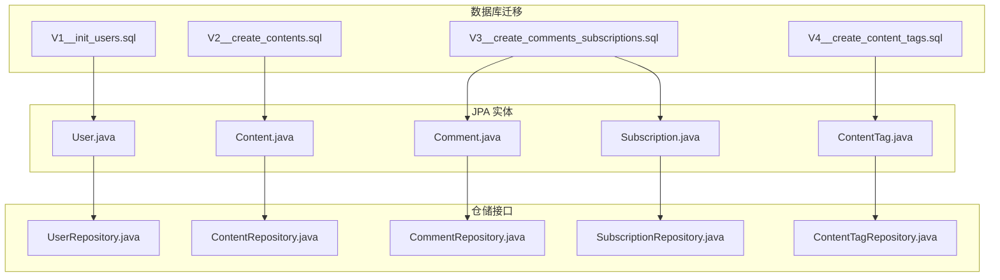
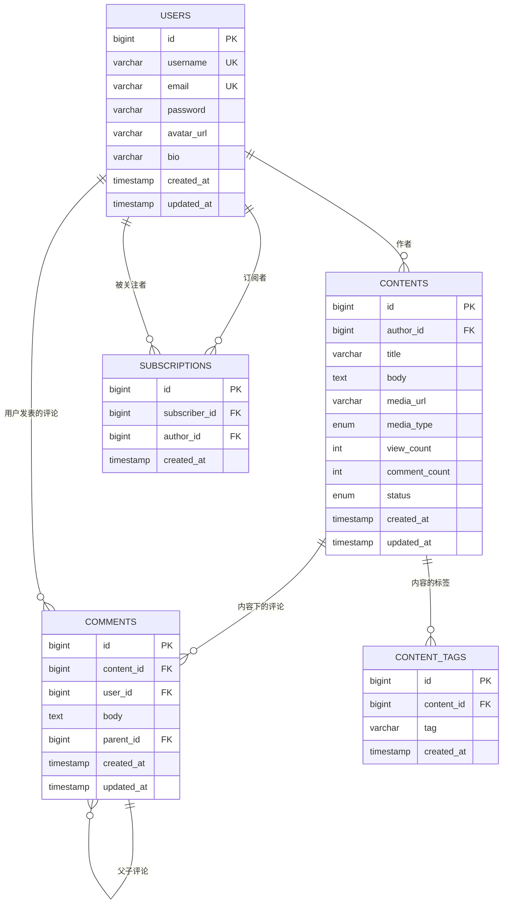
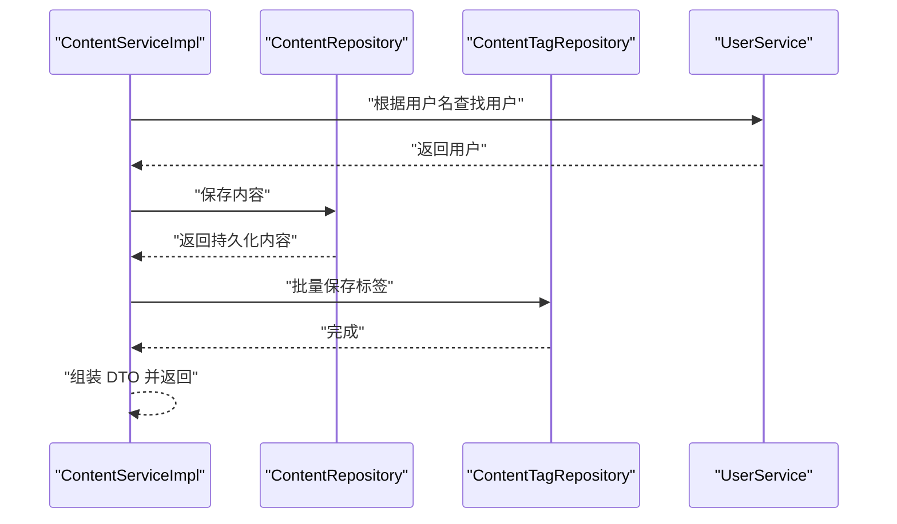
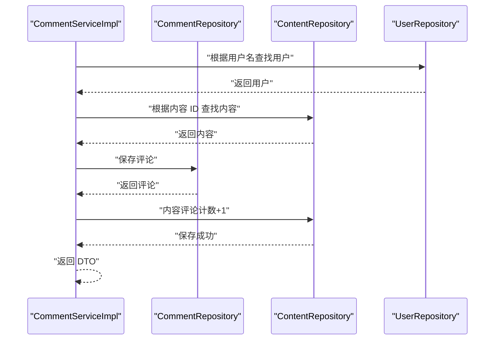
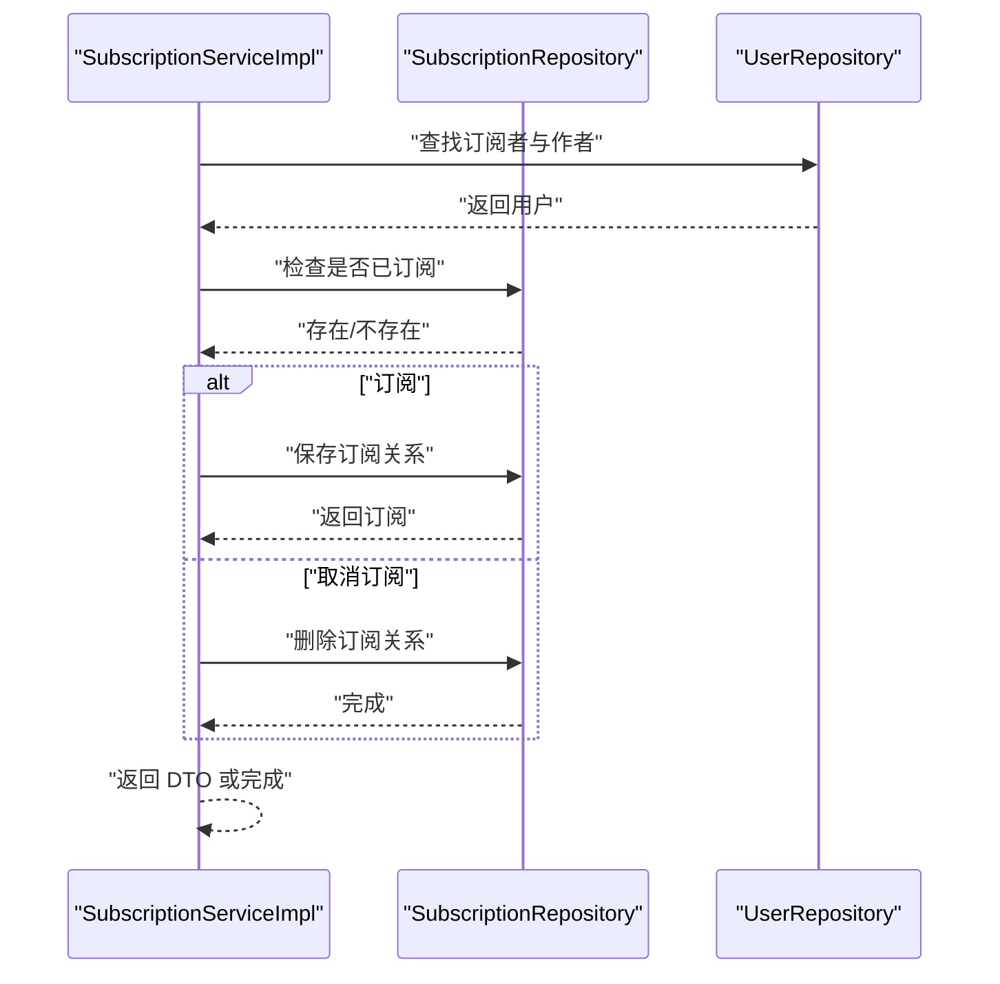
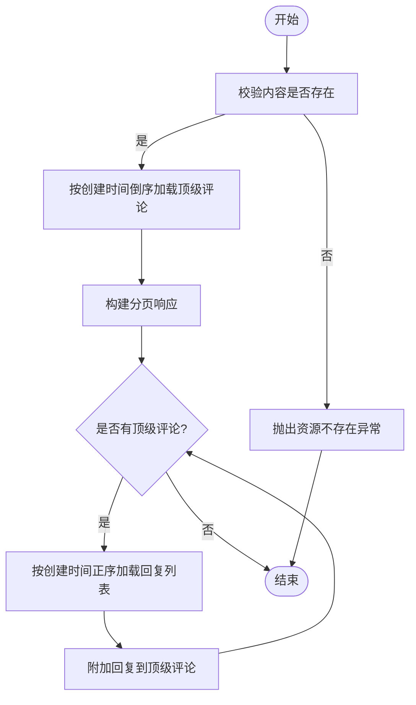
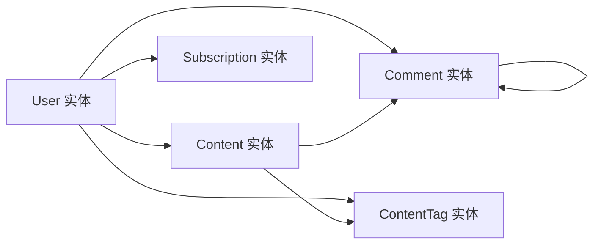

# 表关系设计

<cite>
**本文引用的文件**
- [V1__init_users.sql](file://communication-backend/src/main/resources/db/migration/V1__init_users.sql)
- [V2__create_contents.sql](file://communication-backend/src/main/resources/db/migration/V2__create_contents.sql)
- [V3__create_comments_subscriptions.sql](file://communication-backend/src/main/resources/db/migration/V3__create_comments_subscriptions.sql)
- [V4__create_content_tags.sql](file://communication-backend/src/main/resources/db/migration/V4__create_content_tags.sql)
- [User.java](file://communication-backend/src/main/java/com/communication/entity/User.java)
- [Content.java](file://communication-backend/src/main/java/com/communication/entity/Content.java)
- [Comment.java](file://communication-backend/src/main/java/com/communication/entity/Comment.java)
- [Subscription.java](file://communication-backend/src/main/java/com/communication/entity/Subscription.java)
- [ContentTag.java](file://communication-backend/src/main/java/com/communication/entity/ContentTag.java)
- [ContentRepository.java](file://communication-backend/src/main/java/com/communication/repository/ContentRepository.java)
- [CommentRepository.java](file://communication-backend/src/main/java/com/communication/repository/CommentRepository.java)
- [UserRepository.java](file://communication-backend/src/main/java/com/communication/repository/UserRepository.java)
- [SubscriptionRepository.java](file://communication-backend/src/main/java/com/communication/repository/SubscriptionRepository.java)
- [ContentTagRepository.java](file://communication-backend/src/main/java/com/communication/repository/ContentTagRepository.java)
- [ContentServiceImpl.java](file://communication-backend/src/main/java/com/communication/service/impl/ContentServiceImpl.java)
- [CommentServiceImpl.java](file://communication-backend/src/main/java/com/communication/service/impl/CommentServiceImpl.java)
- [SubscriptionServiceImpl.java](file://communication-backend/src/main/java/com/communication/service/impl/SubscriptionServiceImpl.java)
</cite>

## 目录
1. [简介](#简介)
2. [项目结构](#项目结构)
3. [核心组件](#核心组件)
4. [架构总览](#架构总览)
5. [详细组件分析](#详细组件分析)
6. [依赖分析](#依赖分析)
7. [性能考虑](#性能考虑)
8. [故障排查指南](#故障排查指南)
9. [结论](#结论)
10. [附录：关系查询示例与最佳实践](#附录关系查询示例与最佳实践)

## 简介
本文件系统化梳理通信平台的数据库关系设计，聚焦以下目标：
- 用户表、内容表、评论表、订阅表之间的外键关系与约束设计
- 一对多关系映射（用户与内容、用户与评论、内容与评论）
- 多对多关系设计（内容与标签）及其实现机制
- 完整的 ER 图与表关系图
- 级联操作策略（删除与更新）
- 索引设计与查询优化
- 数据完整性约束（唯一性、非空等）
- 关系查询示例与最佳实践

## 项目结构
后端采用 Spring Boot + JPA + MySQL 架构，数据库初始化通过 Flyway 迁移脚本完成，实体类使用 JPA 注解映射到表结构，Repository 层提供查询方法，Service 层封装业务逻辑。

图表来源
- [V1__init_users.sql](file://communication-backend/src/main/resources/db/migration/V1__init_users.sql#L1-L14)
- [V2__create_contents.sql](file://communication-backend/src/main/resources/db/migration/V2__create_contents.sql#L1-L19)
- [V3__create_comments_subscriptions.sql](file://communication-backend/src/main/resources/db/migration/V3__create_comments_subscriptions.sql#L1-L33)
- [V4__create_content_tags.sql](file://communication-backend/src/main/resources/db/migration/V4__create_content_tags.sql#L1-L14)
- [User.java](file://communication-backend/src/main/java/com/communication/entity/User.java#L1-L96)
- [Content.java](file://communication-backend/src/main/java/com/communication/entity/Content.java#L1-L135)
- [Comment.java](file://communication-backend/src/main/java/com/communication/entity/Comment.java#L1-L109)
- [Subscription.java](file://communication-backend/src/main/java/com/communication/entity/Subscription.java#L1-L67)
- [ContentTag.java](file://communication-backend/src/main/java/com/communication/entity/ContentTag.java#L1-L66)

章节来源
- [V1__init_users.sql](file://communication-backend/src/main/resources/db/migration/V1__init_users.sql#L1-L14)
- [V2__create_contents.sql](file://communication-backend/src/main/resources/db/migration/V2__create_contents.sql#L1-L19)
- [V3__create_comments_subscriptions.sql](file://communication-backend/src/main/resources/db/migration/V3__create_comments_subscriptions.sql#L1-L33)
- [V4__create_content_tags.sql](file://communication-backend/src/main/resources/db/migration/V4__create_content_tags.sql#L1-L14)

## 核心组件
- 用户表 users：存储用户基本信息，包含用户名、邮箱、头像、个人简介等，并维护创建/更新时间戳。
- 内容表 contents：存储文章/内容，包含作者、标题、正文、媒体类型、浏览量、状态、评论计数等。
- 评论表 comments：存储评论及其树形回复结构，支持父子评论关联。
- 订阅表 subscriptions：记录用户对作者的关注关系，保证“订阅者-被关注者”唯一性。
- 内容标签表 content_tags：实现内容与标签的多对多关系，支持标签检索与热门标签统计。

章节来源
- [User.java](file://communication-backend/src/main/java/com/communication/entity/User.java#L1-L96)
- [Content.java](file://communication-backend/src/main/java/com/communication/entity/Content.java#L1-L135)
- [Comment.java](file://communication-backend/src/main/java/com/communication/entity/Comment.java#L1-L109)
- [Subscription.java](file://communication-backend/src/main/java/com/communication/entity/Subscription.java#L1-L67)
- [ContentTag.java](file://communication-backend/src/main/java/com/communication/entity/ContentTag.java#L1-L66)

## 架构总览
下图展示数据库层面的实体关系与外键约束，以及 JPA 实体之间的映射关系。

图表来源
- [V1__init_users.sql](file://communication-backend/src/main/resources/db/migration/V1__init_users.sql#L2-L13)
- [V2__create_contents.sql](file://communication-backend/src/main/resources/db/migration/V2__create_contents.sql#L2-L18)
- [V3__create_comments_subscriptions.sql](file://communication-backend/src/main/resources/db/migration/V3__create_comments_subscriptions.sql#L1-L29)
- [V4__create_content_tags.sql](file://communication-backend/src/main/resources/db/migration/V4__create_content_tags.sql#L1-L10)
- [User.java](file://communication-backend/src/main/java/com/communication/entity/User.java#L9-L38)
- [Content.java](file://communication-backend/src/main/java/com/communication/entity/Content.java#L11-L55)
- [Comment.java](file://communication-backend/src/main/java/com/communication/entity/Comment.java#L9-L39)
- [Subscription.java](file://communication-backend/src/main/java/com/communication/entity/Subscription.java#L7-L24)
- [ContentTag.java](file://communication-backend/src/main/java/com/communication/entity/ContentTag.java#L7-L23)

## 详细组件分析

### 用户表 users
- 主键：自增 id
- 唯一约束：username、email
- 非空约束：username、email、password
- 索引：username、email
- 时间戳：created_at、updated_at

章节来源
- [V1__init_users.sql](file://communication-backend/src/main/resources/db/migration/V1__init_users.sql#L2-L13)
- [User.java](file://communication-backend/src/main/java/com/communication/entity/User.java#L17-L38)

### 内容表 contents
- 主键：自增 id
- 外键：author_id → users(id)，删除时级联
- 非空约束：author_id、title、media_type、status
- 索引：author_id、status、created_at（降序）、全文索引(title, body)
- 字段：view_count、comment_count、media_url、media_type、status

章节来源
- [V2__create_contents.sql](file://communication-backend/src/main/resources/db/migration/V2__create_contents.sql#L2-L18)
- [Content.java](file://communication-backend/src/main/java/com/communication/entity/Content.java#L19-L47)

### 评论表 comments
- 主键：自增 id
- 外键：content_id → contents(id)、user_id → users(id)、parent_id → comments(id)，删除时级联
- 非空约束：content_id、user_id、body
- 索引：content_id、user_id、parent_id
- 支持树形回复：parent_id 自引用

章节来源
- [V3__create_comments_subscriptions.sql](file://communication-backend/src/main/resources/db/migration/V3__create_comments_subscriptions.sql#L1-L16)
- [Comment.java](file://communication-backend/src/main/java/com/communication/entity/Comment.java#L17-L33)

### 订阅表 subscriptions
- 主键：自增 id
- 外键：subscriber_id → users(id)、author_id → users(id)，删除时级联
- 唯一约束：(subscriber_id, author_id)
- 索引：subscriber_id、author_id

章节来源
- [V3__create_comments_subscriptions.sql](file://communication-backend/src/main/resources/db/migration/V3__create_comments_subscriptions.sql#L18-L29)
- [Subscription.java](file://communication-backend/src/main/java/com/communication/entity/Subscription.java#L15-L21)

### 内容标签表 content_tags
- 主键：自增 id
- 外键：content_id → contents(id)，删除时级联
- 非空约束：content_id、tag
- 索引：content_id、tag

章节来源
- [V4__create_content_tags.sql](file://communication-backend/src/main/resources/db/migration/V4__create_content_tags.sql#L1-L10)
- [ContentTag.java](file://communication-backend/src/main/java/com/communication/entity/ContentTag.java#L15-L20)

### 一对多关系映射
- 用户 → 内容：一对一多（一个用户可发布多个内容）
- 用户 → 评论：一对一多（一个用户可发表多个评论）
- 内容 → 评论：一对一多（一个内容可有多条评论）
- 评论 → 评论：一对多（一个评论可有多个子回复）

章节来源
- [Content.java](file://communication-backend/src/main/java/com/communication/entity/Content.java#L19-L21)
- [Comment.java](file://communication-backend/src/main/java/com/communication/entity/Comment.java#L17-L23)
- [Comment.java](file://communication-backend/src/main/java/com/communication/entity/Comment.java#L28-L33)

### 多对多关系映射
- 内容 ↔ 标签：通过 content_tags 实现多对多
- 查询与统计：按标签检索内容、统计热门标签

章节来源
- [Content.java](file://communication-backend/src/main/java/com/communication/entity/Content.java#L46-L47)
- [ContentTag.java](file://communication-backend/src/main/java/com/communication/entity/ContentTag.java#L15-L17)
- [ContentTagRepository.java](file://communication-backend/src/main/java/com/communication/repository/ContentTagRepository.java#L14-L28)

### 级联操作策略
- 删除级联：
  - 用户删除：由于 contents 的 author_id 外键设置了删除级联，删除用户会级联删除其内容；但评论与订阅的外键未设置删除级联，需在应用层处理。
  - 内容删除：comments 的 content_id 外键设置删除级联，删除内容会级联删除其评论。
  - 评论删除：comments 的 user_id 与 parent_id 外键设置删除级联，删除评论会级联删除其回复。
  - 订阅删除：subscriptions 的 subscriber_id 与 author_id 外键设置删除级联，删除用户会级联取消其订阅。
  - 标签删除：content_tags 的 content_id 外键设置删除级联，删除内容会级联删除其标签。
- 更新级联：未显式声明 ON UPDATE CASCADE，因此不进行自动级联更新。

章节来源
- [V2__create_contents.sql](file://communication-backend/src/main/resources/db/migration/V2__create_contents.sql#L13)
- [V3__create_comments_subscriptions.sql](file://communication-backend/src/main/resources/db/migration/V3__create_comments_subscriptions.sql#L10-L12)
- [V3__create_comments_subscriptions.sql](file://communication-backend/src/main/resources/db/migration/V3__create_comments_subscriptions.sql#L24-L25)
- [V4__create_content_tags.sql](file://communication-backend/src/main/resources/db/migration/V4__create_content_tags.sql#L7)

### 索引设计与查询优化
- 用户表：username、email 唯一索引；额外搜索索引 idx_users_username_search
- 内容表：author_id、status、created_at（降序）、全文索引(title, body)
- 评论表：content_id、user_id、parent_id
- 订阅表：subscriber_id、author_id
- 标签表：content_id、tag
- 查询优化建议：
  - 使用分页查询（Pageable）避免全表扫描
  - 利用索引覆盖常见过滤条件（status、author_id、content_id）
  - 全文检索用于标题与正文模糊匹配
  - 对高频统计查询（如按作者汇总浏览量、评论数）使用聚合查询

章节来源
- [V1__init_users.sql](file://communication-backend/src/main/resources/db/migration/V1__init_users.sql#L11-L13)
- [V2__create_contents.sql](file://communication-backend/src/main/resources/db/migration/V2__create_contents.sql#L14-L17)
- [V3__create_comments_subscriptions.sql](file://communication-backend/src/main/resources/db/migration/V3__create_comments_subscriptions.sql#L13-L15)
- [V3__create_comments_subscriptions.sql](file://communication-backend/src/main/resources/db/migration/V3__create_comments_subscriptions.sql#L27-L28)
- [V4__create_content_tags.sql](file://communication-backend/src/main/resources/db/migration/V4__create_content_tags.sql#L8-L9)
- [V4__create_content_tags.sql](file://communication-backend/src/main/resources/db/migration/V4__create_content_tags.sql#L13)

### 数据完整性约束
- 唯一性约束：users.username、users.email；subscriptions(subscriber_id, author_id)
- 非空约束：users.username、email、password；contents.author_id、title、media_type、status；comments.content_id、user_id、body
- 外键约束：确保引用完整性，防止孤儿数据

章节来源
- [V1__init_users.sql](file://communication-backend/src/main/resources/db/migration/V1__init_users.sql#L4-L6)
- [V3__create_comments_subscriptions.sql](file://communication-backend/src/main/resources/db/migration/V3__create_comments_subscriptions.sql#L26)
- [Content.java](file://communication-backend/src/main/java/com/communication/entity/Content.java#L19-L47)
- [Comment.java](file://communication-backend/src/main/java/com/communication/entity/Comment.java#L17-L26)

### 业务流程与调用序列

#### 发布内容并写入标签

图表来源
- [ContentServiceImpl.java](file://communication-backend/src/main/java/com/communication/service/impl/ContentServiceImpl.java#L36-L58)
- [ContentRepository.java](file://communication-backend/src/main/java/com/communication/repository/ContentRepository.java#L17-L36)
- [ContentTagRepository.java](file://communication-backend/src/main/java/com/communication/repository/ContentTagRepository.java#L14-L16)

#### 创建评论并更新评论计数

图表来源
- [CommentServiceImpl.java](file://communication-backend/src/main/java/com/communication/service/impl/CommentServiceImpl.java#L37-L68)
- [CommentRepository.java](file://communication-backend/src/main/java/com/communication/repository/CommentRepository.java#L14-L28)
- [ContentRepository.java](file://communication-backend/src/main/java/com/communication/repository/ContentRepository.java#L28-L30)

#### 订阅与取消订阅

图表来源
- [SubscriptionServiceImpl.java](file://communication-backend/src/main/java/com/communication/service/impl/SubscriptionServiceImpl.java#L38-L75)
- [SubscriptionRepository.java](file://communication-backend/src/main/java/com/communication/repository/SubscriptionRepository.java#L17-L32)
- [UserRepository.java](file://communication-backend/src/main/java/com/communication/repository/UserRepository.java#L16-L22)

### 复杂逻辑流程：评论树形加载

图表来源
- [CommentServiceImpl.java](file://communication-backend/src/main/java/com/communication/service/impl/CommentServiceImpl.java#L77-L108)
- [CommentRepository.java](file://communication-backend/src/main/java/com/communication/repository/CommentRepository.java#L16-L18)

## 依赖分析
- 实体间依赖：JPA 注解定义了实体关系，Repository 接口承载查询能力，Service 层协调业务。
- 外键依赖：contents.author_id → users(id)；comments.content_id → contents(id)；comments.user_id → users(id)；comments.parent_id → comments(id)；subscriptions.subscriber_id → users(id)；subscriptions.author_id → users(id)；content_tags.content_id → contents(id)。
- 级联依赖：删除级联覆盖用户→内容、内容→评论、评论→回复、订阅→用户、内容→标签；更新级联未配置。

图表来源
- [Content.java](file://communication-backend/src/main/java/com/communication/entity/Content.java#L19-L21)
- [Comment.java](file://communication-backend/src/main/java/com/communication/entity/Comment.java#L17-L33)
- [Subscription.java](file://communication-backend/src/main/java/com/communication/entity/Subscription.java#L15-L21)
- [ContentTag.java](file://communication-backend/src/main/java/com/communication/entity/ContentTag.java#L15-L17)

章节来源
- [Content.java](file://communication-backend/src/main/java/com/communication/entity/Content.java#L19-L47)
- [Comment.java](file://communication-backend/src/main/java/com/communication/entity/Comment.java#L17-L33)
- [Subscription.java](file://communication-backend/src/main/java/com/communication/entity/Subscription.java#L15-L21)
- [ContentTag.java](file://communication-backend/src/main/java/com/communication/entity/ContentTag.java#L15-L17)

## 性能考虑
- 索引覆盖：利用 author_id、content_id、user_id、subscriber_id、author_id、tag 等索引减少回表与排序成本。
- 分页查询：使用 PageRequest 控制结果集大小，避免一次性加载大量数据。
- 聚合统计：通过 Repository 聚合查询（如按作者统计浏览量、评论数）降低应用层计算开销。
- 全文检索：对标题与正文使用全文索引，提升关键词搜索效率。
- 级联删除：在删除用户或内容时，数据库自动清理相关记录，减少应用层循环删除的复杂度。

[本节为通用性能指导，无需特定文件来源]

## 故障排查指南
- 外键约束错误：当尝试插入或更新违反外键约束的数据时，数据库会报错。应检查关联对象是否存在且状态正确。
- 唯一约束冲突：重复的用户名或邮箱会导致插入失败；重复的订阅关系也会失败。应在业务层先检查唯一性。
- 级联行为不符合预期：若删除用户后未删除其内容，请确认 contents.author_id 的外键定义是否为 CASCADE。
- 查询性能差：确认是否命中索引；对于高选择性过滤条件优先使用索引列；避免 SELECT * 导致不必要的 IO。

章节来源
- [V2__create_contents.sql](file://communication-backend/src/main/resources/db/migration/V2__create_contents.sql#L13)
- [V3__create_comments_subscriptions.sql](file://communication-backend/src/main/resources/db/migration/V3__create_comments_subscriptions.sql#L26)
- [UserRepository.java](file://communication-backend/src/main/java/com/communication/repository/UserRepository.java#L20-L22)
- [SubscriptionRepository.java](file://communication-backend/src/main/java/com/communication/repository/SubscriptionRepository.java#L17-L18)

## 结论
本设计以清晰的外键关系与索引策略为基础，实现了用户、内容、评论、订阅与标签之间的完整闭环。一对多关系通过 JPA 注解与数据库外键明确表达，多对多关系通过中间表 content_tags 实现。删除级联覆盖关键路径，配合合理的索引与分页查询，满足常见业务场景的性能需求。建议在生产环境中持续监控查询计划与热点表，结合业务增长迭代优化索引与分区策略。

[本节为总结性内容，无需特定文件来源]

## 附录：关系查询示例与最佳实践
- 查询某作者的所有已发布内容（按创建时间倒序分页）
  - Repository 方法：[ContentRepository.java](file://communication-backend/src/main/java/com/communication/repository/ContentRepository.java#L21)
  - 业务调用：[ContentServiceImpl.java](file://communication-backend/src/main/java/com/communication/service/impl/ContentServiceImpl.java#L129-L137)
- 获取内容的顶级评论（按创建时间倒序，附带回复）
  - Repository 方法：[CommentRepository.java](file://communication-backend/src/main/java/com/communication/repository/CommentRepository.java#L16)
  - 业务调用：[CommentServiceImpl.java](file://communication-backend/src/main/java/com/communication/service/impl/CommentServiceImpl.java#L77-L108)
- 订阅某作者
  - Repository 方法：[SubscriptionRepository.java](file://communication-backend/src/main/java/com/communication/repository/SubscriptionRepository.java#L17-L19)
  - 业务调用：[SubscriptionServiceImpl.java](file://communication-backend/src/main/java/com/communication/service/impl/SubscriptionServiceImpl.java#L38-L62)
- 搜索内容（标题或正文包含关键字）
  - Repository 方法：[ContentRepository.java](file://communication-backend/src/main/java/com/communication/repository/ContentRepository.java#L47-L51)
- 统计热门标签
  - Repository 方法：[ContentTagRepository.java](file://communication-backend/src/main/java/com/communication/repository/ContentTagRepository.java#L24-L25)

最佳实践
- 在高频过滤字段上建立索引，如 author_id、content_id、user_id、subscriber_id、author_id、tag
- 使用分页查询控制单次返回数据量
- 对全文检索使用全文索引，避免 LIKE 百分号开头导致的全表扫描
- 对于需要一致性读取的场景，合理使用事务边界与只读事务
- 对于删除操作，优先在应用层清理相关计数与缓存，再执行数据库删除

章节来源
- [ContentRepository.java](file://communication-backend/src/main/java/com/communication/repository/ContentRepository.java#L19-L55)
- [CommentRepository.java](file://communication-backend/src/main/java/com/communication/repository/CommentRepository.java#L16-L32)
- [SubscriptionRepository.java](file://communication-backend/src/main/java/com/communication/repository/SubscriptionRepository.java#L17-L32)
- [ContentTagRepository.java](file://communication-backend/src/main/java/com/communication/repository/ContentTagRepository.java#L18-L25)
- [ContentServiceImpl.java](file://communication-backend/src/main/java/com/communication/service/impl/ContentServiceImpl.java#L129-L154)
- [CommentServiceImpl.java](file://communication-backend/src/main/java/com/communication/service/impl/CommentServiceImpl.java#L77-L108)
- [SubscriptionServiceImpl.java](file://communication-backend/src/main/java/com/communication/service/impl/SubscriptionServiceImpl.java#L133-L167)