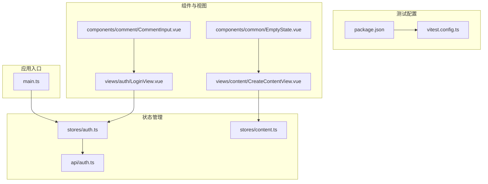
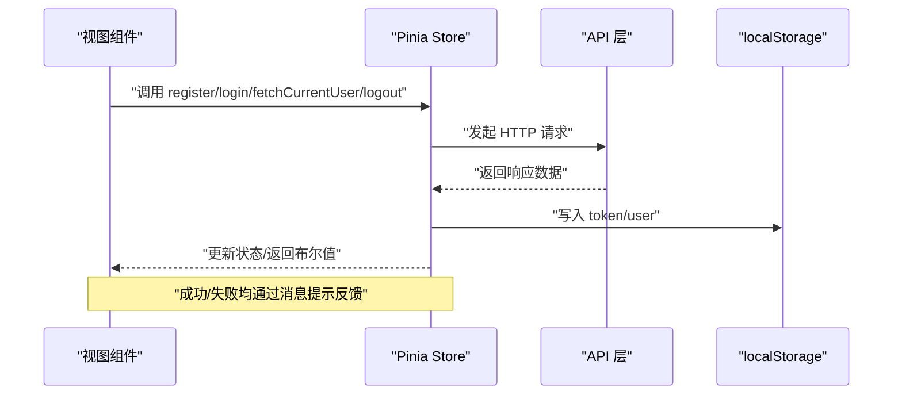
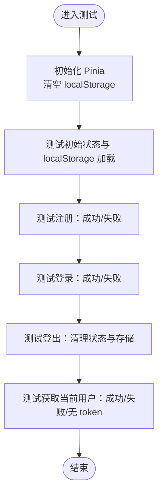
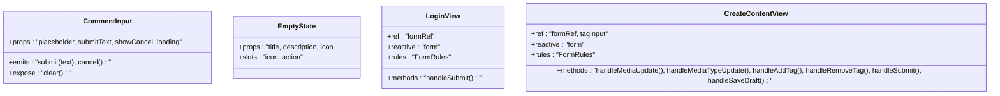
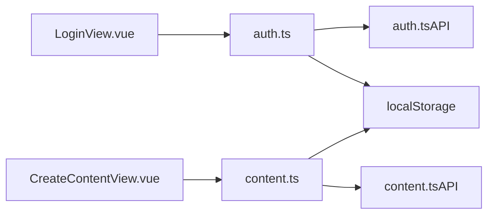

# 前端组件测试

<cite>
**本文引用的文件**
- [vitest.config.ts](file://vitest.config.ts)
- [auth.test.ts](file://src/stores/__tests__/auth.test.ts)
- [auth.ts](file://src/stores/auth.ts)
- [auth.ts（API）](file://src/api/auth.ts)
- [content.ts](file://src/stores/content.ts)
- [package.json](file://package.json)
- [main.ts](file://src/main.ts)
- [CommentInput.vue](file://src/components/comment/CommentInput.vue)
- [EmptyState.vue](file://src/components/common/EmptyState.vue)
- [LoginView.vue](file://src/views/auth/LoginView.vue)
- [CreateContentView.vue](file://src/views/content/CreateContentView.vue)
- [tsconfig.json](file://tsconfig.json)
</cite>

## 目录
1. [简介](#简介)
2. [项目结构](#项目结构)
3. [核心组件](#核心组件)
4. [架构总览](#架构总览)
5. [详细组件分析](#详细组件分析)
6. [依赖关系分析](#依赖关系分析)
7. [性能考量](#性能考量)
8. [故障排查指南](#故障排查指南)
9. [结论](#结论)
10. [附录](#附录)

## 简介
本文件面向通信平台前端，系统化梳理基于 Vitest 的 Vue 3 组件与 Pinia 状态管理测试方案，重点覆盖以下方面：
- 测试环境与工具链：Vitest、jsdom、@vitejs/plugin-vue、Element Plus 模拟
- Pinia 状态管理测试：auth.store 的状态变更、异步操作与错误处理
- 组件单元测试最佳实践：Composition API 使用、组件间数据传递、事件与暴露方法
- 覆盖率与执行流程：脚本命令、路径匹配规则、别名解析
- 实战参考：登录视图、内容创建视图、通用组件等

## 项目结构
前端位于 communication-frontend，测试集中在 src 目录下：
- stores/__tests__/auth.test.ts：Pinia auth store 的完整测试套件
- stores/auth.ts：基于组合式 API 的 Pinia store 实现
- api/auth.ts：认证相关 API 定义与封装
- views 与 components：承载业务逻辑与交互的 Vue 组件，便于进行集成/单元测试
- vitest.config.ts：Vitest 配置，包含 jsdom 环境、全局启用、路径别名与测试文件匹配规则
- package.json：测试脚本 test:unit、依赖与 devDependencies

图表来源
- [vitest.config.ts](file://vitest.config.ts#L1-L18)
- [package.json](file://package.json#L6-L14)
- [auth.ts](file://src/stores/auth.ts#L1-L96)
- [content.ts](file://src/stores/content.ts#L1-L150)
- [auth.ts（API）](file://src/api/auth.ts#L1-L49)
- [main.ts](file://src/main.ts#L1-L17)
- [LoginView.vue](file://src/views/auth/LoginView.vue#L1-L113)
- [CreateContentView.vue](file://src/views/content/CreateContentView.vue#L1-L228)
- [CommentInput.vue](file://src/components/comment/CommentInput.vue#L1-L84)
- [EmptyState.vue](file://src/components/common/EmptyState.vue#L1-L76)

章节来源
- [vitest.config.ts](file://vitest.config.ts#L1-L18)
- [package.json](file://package.json#L6-L14)
- [tsconfig.json](file://tsconfig.json#L1-L26)

## 核心组件
- 测试运行时与环境
  - Vitest 在 jsdom 环境中运行，支持全局断言与 DOM API
  - 通过 @vitejs/plugin-vue 提供 Vue 单文件组件支持
  - 路径别名 @ 指向 src，便于统一导入
- Pinia 状态管理
  - auth.store：注册、登录、获取当前用户、登出、更新用户信息
  - content.store：内容列表、详情、分页、增删改查与加载更多
- API 层
  - authApi：注册、登录、获取当前用户
- 应用入口
  - main.ts 中初始化 Pinia 并挂载应用

章节来源
- [vitest.config.ts](file://vitest.config.ts#L5-L17)
- [auth.ts](file://src/stores/auth.ts#L1-L96)
- [content.ts](file://src/stores/content.ts#L1-L150)
- [auth.ts（API）](file://src/api/auth.ts#L1-L49)
- [main.ts](file://src/main.ts#L10-L16)

## 架构总览
下图展示测试驱动下的典型调用链：视图组件触发 store 方法，store 通过 API 层发起请求，返回结果后更新本地状态与持久化存储，并通过消息提示反馈用户。

图表来源
- [LoginView.vue](file://src/views/auth/LoginView.vue#L26-L38)
- [auth.ts](file://src/stores/auth.ts#L13-L77)
- [auth.ts（API）](file://src/api/auth.ts#L36-L47)

## 详细组件分析

### Pinia 认证状态管理测试（auth.store）
- 测试目标
  - 初始状态：从空 localStorage 加载时 token/user 为空且未认证
  - 从 localStorage 恢复：token/user 正确恢复并标记已认证
  - 注册：成功时写入 token/user 并返回 true；失败时显示错误消息并返回 false
  - 登录：成功时写入 token/user 并返回 true；失败时显示错误消息并返回 false
  - 登出：清空 token/user 并移除 localStorage 条目
  - 获取当前用户：有 token 时拉取并更新 user；无 token 不请求；请求失败时自动登出
- 关键实现点
  - 使用 setActivePinia/createPinia 初始化测试上下文
  - 通过 vi.mock 对 Element Plus 与 auth API 进行模拟
  - 断言状态变化、localStorage 同步与消息提示行为
- 测试用例分布
  - 初始状态与 localStorage 加载
  - register 成功/失败分支
  - login 成功/失败分支
  - logout 行为
  - fetchCurrentUser 成功/失败/无 token 分支

图表来源
- [auth.test.ts](file://src/stores/__tests__/auth.test.ts#L24-L182)

章节来源
- [auth.test.ts](file://src/stores/__tests__/auth.test.ts#L1-L183)
- [auth.ts](file://src/stores/auth.ts#L6-L95)
- [auth.ts（API）](file://src/api/auth.ts#L36-L47)

### Vue 3 组件测试最佳实践
- 组件与 Composition API
  - 使用 <script setup> 与 ref/reactive 管理本地状态
  - 通过 defineProps/defineEmits 定义属性与事件，便于在测试中验证交互
  - 使用 defineExpose 暴露方法（如清空输入），便于外部调用
- 示例组件
  - CommentInput：文本域、提交与取消事件、禁用/加载态控制、暴露 clear 方法
  - EmptyState：插槽与图标映射，便于渲染不同场景的空状态
- 视图组件与状态管理
  - LoginView：表单校验、调用 authStore.login、根据路由参数重定向
  - CreateContentView：表单校验、标签管理、调用 contentStore.createContent、路由跳转

图表来源
- [CommentInput.vue](file://src/components/comment/CommentInput.vue#L25-L58)
- [EmptyState.vue](file://src/components/common/EmptyState.vue#L16-L39)
- [LoginView.vue](file://src/views/auth/LoginView.vue#L1-L39)
- [CreateContentView.vue](file://src/views/content/CreateContentView.vue#L1-L78)

章节来源
- [CommentInput.vue](file://src/components/comment/CommentInput.vue#L1-L84)
- [EmptyState.vue](file://src/components/common/EmptyState.vue#L1-L76)
- [LoginView.vue](file://src/views/auth/LoginView.vue#L1-L113)
- [CreateContentView.vue](file://src/views/content/CreateContentView.vue#L1-L228)

### 异步操作与错误处理测试策略
- 异步流程
  - 使用 vi.mocked(...) 对 API 返回值进行控制，模拟成功/失败
  - 在测试中 await store 方法，断言状态与副作用（localStorage、消息提示）
- 错误处理
  - 当 API 抛错时，store 返回 false 或抛出受控异常
  - fetchCurrentUser 失败时触发 logout，确保状态一致性
- 元素库模拟
  - 对 Element Plus 的消息提示进行函数模拟，避免真实 DOM 与副作用

章节来源
- [auth.test.ts](file://src/stores/__tests__/auth.test.ts#L6-L20)
- [auth.ts](file://src/stores/auth.ts#L27-L33)
- [auth.ts](file://src/stores/auth.ts#L50-L56)
- [auth.ts](file://src/stores/auth.ts#L66-L68)

### 测试环境配置与工具使用
- Vitest 配置
  - environment: jsdom，提供浏览器 DOM API
  - globals: true，允许直接使用 expect、describe、it 等
  - include: 匹配 src 下以 test/ 或 spec 结尾的文件
  - alias: @ -> src，简化导入路径
- 脚本命令
  - test:unit：运行单元测试
  - test:e2e：运行端到端测试（Playwright）
- 类型与路径
  - tsconfig.json 启用严格模式与模块解析，支持路径别名

章节来源
- [vitest.config.ts](file://vitest.config.ts#L7-L17)
- [package.json](file://package.json#L10-L11)
- [tsconfig.json](file://tsconfig.json#L1-L26)

## 依赖关系分析
- 组件到 store 的依赖
  - LoginView 依赖 auth.store
  - CreateContentView 依赖 content.store
- store 到 API 的依赖
  - auth.store 依赖 authApi
  - content.store 依赖 contentApi
- 测试对依赖的模拟
  - auth.test.ts 对 authApi 与 Element Plus 进行 vi.mock
- 应用启动与 Pinia 初始化
  - main.ts 创建并注入 Pinia，确保测试中也可通过 setActivePinia 初始化

图表来源
- [LoginView.vue](file://src/views/auth/LoginView.vue#L4-L9)
- [CreateContentView.vue](file://src/views/content/CreateContentView.vue#L4-L10)
- [auth.ts](file://src/stores/auth.ts#L3)
- [content.ts](file://src/stores/content.ts#L3)
- [main.ts](file://src/main.ts#L12)

章节来源
- [LoginView.vue](file://src/views/auth/LoginView.vue#L1-L113)
- [CreateContentView.vue](file://src/views/content/CreateContentView.vue#L1-L228)
- [auth.ts](file://src/stores/auth.ts#L1-L96)
- [content.ts](file://src/stores/content.ts#L1-L150)
- [main.ts](file://src/main.ts#L10-L16)

## 性能考量
- 测试隔离
  - beforeEach 中使用 setActivePinia(createPinia()) 与 localStorage.clear()，确保每次测试独立
- 模拟策略
  - vi.mock 仅在测试文件内生效，避免影响生产代码
- 异步测试
  - 使用 async/await 与 Promise 断言，减少不必要的等待时间
- 覆盖范围
  - 通过 include 规则确保仅运行 src 下的测试文件，提升执行效率

章节来源
- [auth.test.ts](file://src/stores/__tests__/auth.test.ts#L25-L29)
- [vitest.config.ts](file://vitest.config.ts#L10)

## 故障排查指南
- 常见问题
  - 未初始化 Pinia：在测试中缺少 setActivePinia(createPinia()) 导致 store 无法创建
  - localStorage 未清理：前一次测试残留导致后续测试状态污染
  - API 未模拟：未 vi.mock authApi 导致真实网络请求，测试不稳定
  - Element Plus 消息提示：未模拟导致控制台警告或副作用
- 排查步骤
  - 确认 vitest.config.ts 的 environment 与 include 设置
  - 在 beforeEach 中调用 localStorage.clear() 与 vi.clearAllMocks()
  - 检查 vi.mock 的作用域与导入顺序
  - 使用 expect.assertions 或显式断言确保异步流程被覆盖

章节来源
- [auth.test.ts](file://src/stores/__tests__/auth.test.ts#L25-L29)
- [vitest.config.ts](file://vitest.config.ts#L7-L11)

## 结论
本项目采用 Vitest + jsdom 的轻量级测试方案，结合 Pinia 组合式 API 与 Element Plus 模拟，实现了对认证与内容管理状态的全面测试覆盖。通过清晰的测试用例组织与依赖模拟策略，能够稳定地验证状态变更、异步流程与错误处理。建议在后续扩展中补充组件单元测试与覆盖率阈值配置，以进一步提升质量保障水平。

## 附录
- 测试执行流程
  - 执行 npm/yarn pnpm test:unit
  - Vitest 自动扫描 src 下的测试文件并运行
- 覆盖率建议
  - 可在 vitest.config.ts 中增加 coverage 配置项，设置阈值与输出格式
- 组件测试示例思路
  - 使用 defineProps/defineEmits 验证属性与事件
  - 使用 defineExpose 的暴露方法进行交互测试
  - 对外部依赖（如 API、UI 组件）进行 vi.mock