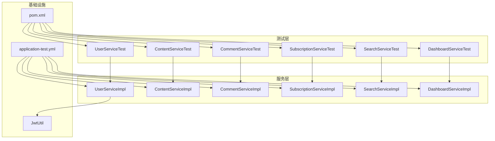
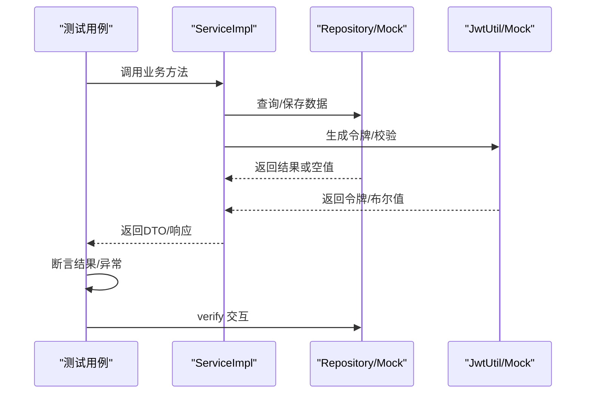
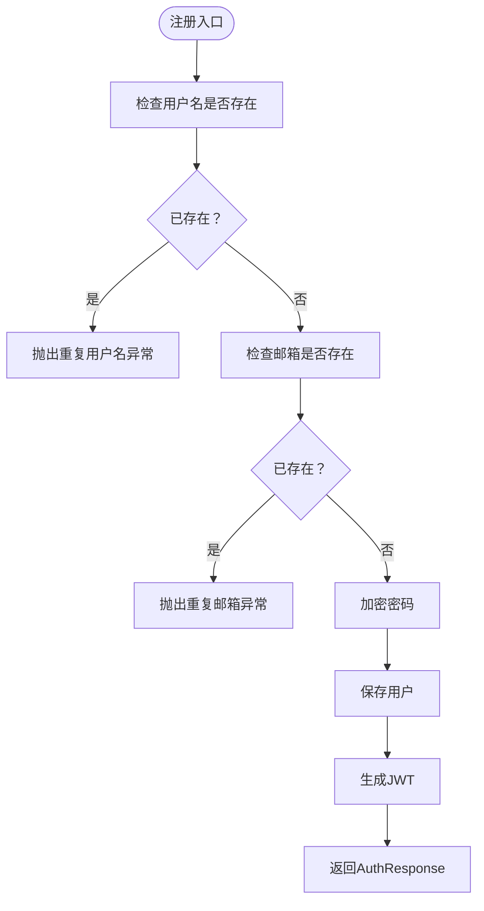
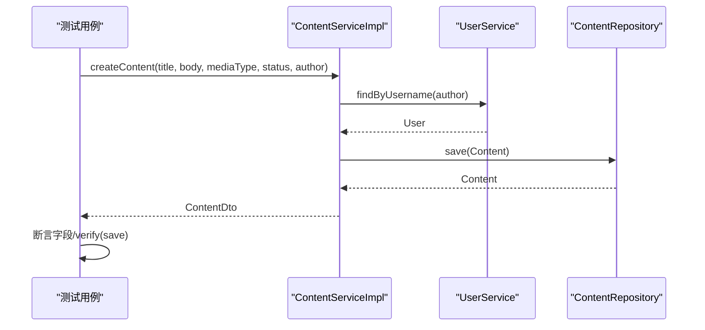
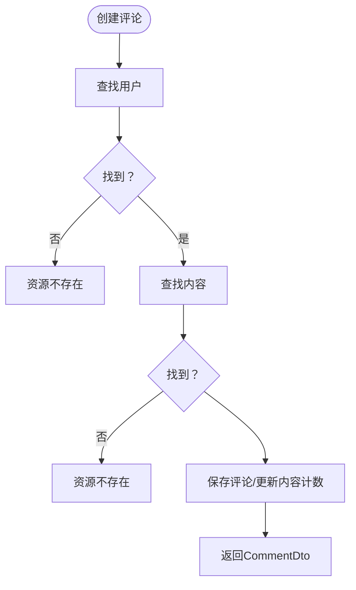
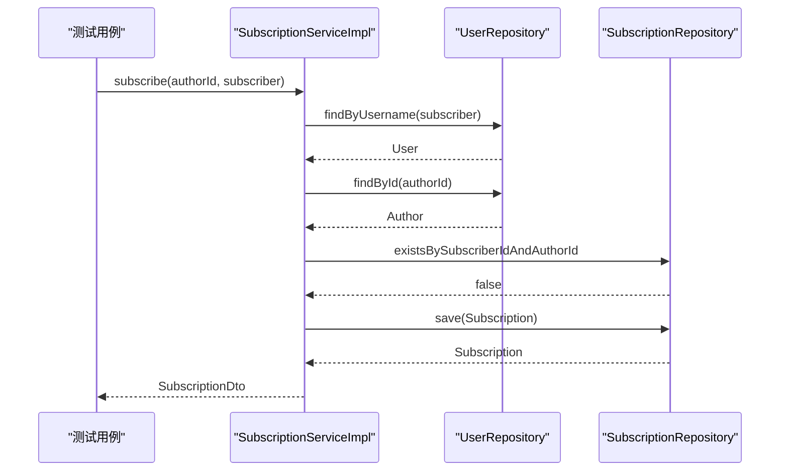
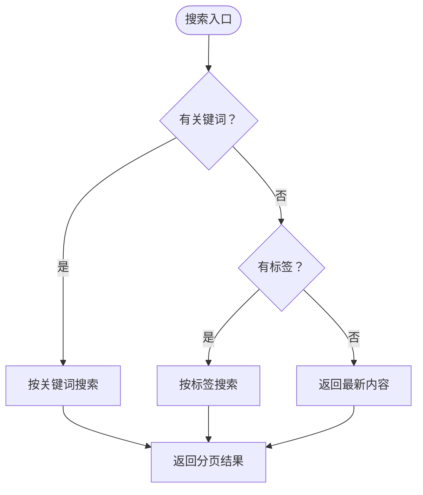
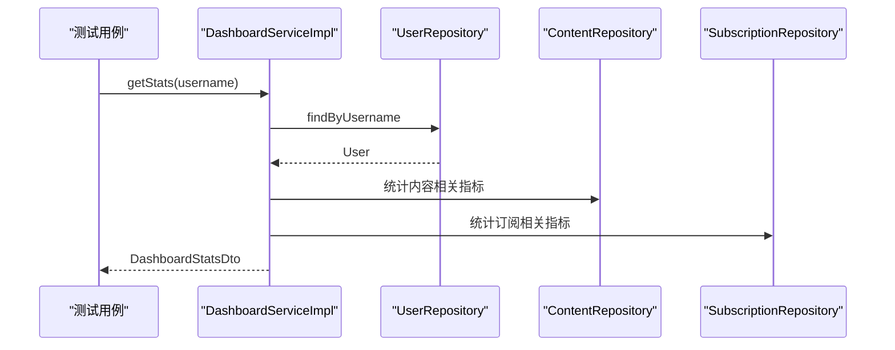
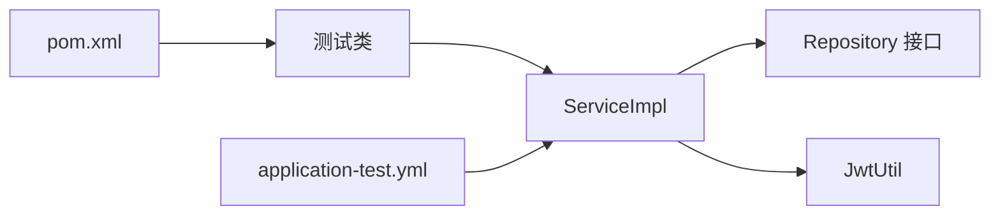

# 后端单元测试

<cite>
**本文引用的文件**
- [UserServiceTest.java](file://communication-backend/src/test/java/com/communication/service/UserServiceTest.java)
- [ContentServiceTest.java](file://communication-backend/src/test/java/com/communication/service/ContentServiceTest.java)
- [CommentServiceTest.java](file://communication-backend/src/test/java/com/communication/service/CommentServiceTest.java)
- [SubscriptionServiceTest.java](file://communication-backend/src/test/java/com/communication/service/SubscriptionServiceTest.java)
- [SearchServiceTest.java](file://communication-backend/src/test/java/com/communication/service/SearchServiceTest.java)
- [DashboardServiceTest.java](file://communication-backend/src/test/java/com/communication/service/DashboardServiceTest.java)
- [UserService.java](file://communication-backend/src/main/java/com/communication/service/UserService.java)
- [UserServiceImpl.java](file://communication-backend/src/main/java/com/communication/service/impl/UserServiceImpl.java)
- [JwtUtil.java](file://communication-backend/src/main/java/com/communication/util/JwtUtil.java)
- [application-test.yml](file://communication-backend/src/test/resources/application-test.yml)
- [pom.xml](file://communication-backend/pom.xml)
- [User.java](file://communication-backend/src/main/java/com/communication/entity/User.java)
- [UserRepository.java](file://communication-backend/src/main/java/com/communication/repository/UserRepository.java)
- [AuthResponse.java](file://communication-backend/src/main/java/com/communication/dto/AuthResponse.java)
</cite>

## 目录
1. [简介](#简介)
2. [项目结构](#项目结构)
3. [核心组件](#核心组件)
4. [架构总览](#架构总览)
5. [详细组件分析](#详细组件分析)
6. [依赖关系分析](#依赖关系分析)
7. [性能考量](#性能考量)
8. [故障排查指南](#故障排查指南)
9. [结论](#结论)
10. [附录](#附录)

## 简介
本文件系统性梳理通信平台后端的单元测试体系，重点覆盖基于 JUnit 5 和 Mockito 的测试实现，包括 UserServiceTest、ContentServiceTest、CommentServiceTest、SubscriptionServiceTest、SearchServiceTest、DashboardServiceTest 等核心服务测试策略。文档详细说明 Mock 对象的使用方法、测试数据准备与断言策略，解释测试用例设计原则（正常流程、异常与边界条件），并给出测试覆盖率要求与最佳实践建议，同时提供测试环境配置与执行流程说明。

## 项目结构
后端采用 Spring Boot + JPA 架构，测试位于 src/test 下，按服务分包组织；测试配置位于 src/test/resources/application-test.yml，使用内存数据库 H2 进行隔离测试。

图表来源
- [UserServiceTest.java](file://communication-backend/src/test/java/com/communication/service/UserServiceTest.java#L1-L159)
- [ContentServiceTest.java](file://communication-backend/src/test/java/com/communication/service/ContentServiceTest.java#L1-L228)
- [CommentServiceTest.java](file://communication-backend/src/test/java/com/communication/service/CommentServiceTest.java#L1-L244)
- [SubscriptionServiceTest.java](file://communication-backend/src/test/java/com/communication/service/SubscriptionServiceTest.java#L1-L237)
- [SearchServiceTest.java](file://communication-backend/src/test/java/com/communication/service/SearchServiceTest.java#L1-L186)
- [DashboardServiceTest.java](file://communication-backend/src/test/java/com/communication/service/DashboardServiceTest.java#L1-L158)
- [application-test.yml](file://communication-backend/src/test/resources/application-test.yml#L1-L19)
- [pom.xml](file://communication-backend/pom.xml#L1-L114)
- [JwtUtil.java](file://communication-backend/src/main/java/com/communication/util/JwtUtil.java#L1-L67)

章节来源
- [pom.xml](file://communication-backend/pom.xml#L1-L114)
- [application-test.yml](file://communication-backend/src/test/resources/application-test.yml#L1-L19)

## 核心组件
- 测试框架：JUnit 5 + Mockito 扩展，结合 AssertJ 断言库。
- 测试配置：application-test.yml 使用 H2 内存数据库，禁用 Flyway，开启 SQL 日志，便于调试。
- 关键依赖：Spring Boot Starter Test、Spring Security Test、H2 数据库驱动。
- 测试目标：验证业务逻辑正确性、异常路径与边界条件、鉴权与授权场景。

章节来源
- [pom.xml](file://communication-backend/pom.xml#L78-L93)
- [application-test.yml](file://communication-backend/src/test/resources/application-test.yml#L1-L19)

## 架构总览
单元测试围绕服务层进行，通过 @Mock 注入外部依赖（Repository、工具类等），@InjectMocks 创建被测服务实例，使用 when/then 配置行为，使用 verify 验证交互，使用断言验证结果。

图表来源
- [UserServiceTest.java](file://communication-backend/src/test/java/com/communication/service/UserServiceTest.java#L69-L82)
- [UserServiceImpl.java](file://communication-backend/src/main/java/com/communication/service/impl/UserServiceImpl.java#L28-L48)
- [JwtUtil.java](file://communication-backend/src/main/java/com/communication/util/JwtUtil.java#L28-L35)

## 详细组件分析

### 用户服务测试（UserServiceTest）
- 测试目标：注册、登录、查询当前用户、存在性检查。
- Mock 对象：UserRepository、PasswordEncoder、JwtUtil。
- 关键断言：AuthResponse 字段一致性、异常类型与消息、交互验证。
- 异常与边界：
  - 用户名已存在、邮箱已存在。
  - 登录用户名/邮箱不存在、密码错误。
- 设计原则：每个分支独立用例，前置条件清晰，断言覆盖响应体与异常路径。

图表来源
- [UserServiceTest.java](file://communication-backend/src/test/java/com/communication/service/UserServiceTest.java#L67-L107)
- [UserServiceImpl.java](file://communication-backend/src/main/java/com/communication/service/impl/UserServiceImpl.java#L28-L48)

章节来源
- [UserServiceTest.java](file://communication-backend/src/test/java/com/communication/service/UserServiceTest.java#L1-L159)
- [UserServiceImpl.java](file://communication-backend/src/main/java/com/communication/service/impl/UserServiceImpl.java#L1-L86)
- [UserService.java](file://communication-backend/src/main/java/com/communication/service/UserService.java#L1-L20)
- [UserRepository.java](file://communication-backend/src/main/java/com/communication/repository/UserRepository.java#L1-L27)
- [AuthResponse.java](file://communication-backend/src/main/java/com/communication/dto/AuthResponse.java#L1-L47)
- [JwtUtil.java](file://communication-backend/src/main/java/com/communication/util/JwtUtil.java#L1-L67)

### 内容服务测试（ContentServiceTest）
- 测试目标：创建、查询、更新、删除内容；分页查询；浏览量自增。
- Mock 对象：ContentRepository、UserService。
- 关键断言：DTO 字段一致性、分页结果、异常消息、交互验证。
- 权限与边界：
  - 更新/删除仅作者可操作。
  - 不存在内容抛异常。
- 设计原则：参数化构造测试数据，覆盖不同状态与分页场景。

图表来源
- [ContentServiceTest.java](file://communication-backend/src/test/java/com/communication/service/ContentServiceTest.java#L86-L97)
- [ContentServiceTest.java](file://communication-backend/src/test/java/com/communication/service/ContentServiceTest.java#L120-L142)

章节来源
- [ContentServiceTest.java](file://communication-backend/src/test/java/com/communication/service/ContentServiceTest.java#L1-L228)

### 评论服务测试（CommentServiceTest）
- 测试目标：创建评论/回复、获取评论列表、删除评论。
- Mock 对象：CommentRepository、ContentRepository、UserRepository。
- 关键断言：父子评论关系、权限判断、异常消息、交互验证。
- 边界与异常：
  - 用户不存在、内容不存在。
  - 父评论不属于该内容。
  - 删除权限不足。

图表来源
- [CommentServiceTest.java](file://communication-backend/src/test/java/com/communication/service/CommentServiceTest.java#L93-L137)
- [CommentServiceTest.java](file://communication-backend/src/test/java/com/communication/service/CommentServiceTest.java#L167-L189)

章节来源
- [CommentServiceTest.java](file://communication-backend/src/test/java/com/communication/service/CommentServiceTest.java#L1-L244)

### 订阅服务测试（SubscriptionServiceTest）
- 测试目标：订阅/取消订阅、检查订阅状态、获取关注/粉丝列表、订阅动态流、统计数量。
- Mock 对象：SubscriptionRepository、UserRepository、ContentRepository。
- 关键断言：DTO 字段、分页结果、布尔值、异常消息。
- 边界与异常：
  - 自己不能订阅自己。
  - 已订阅/未订阅的处理。
  - 动态流为空的边界。

图表来源
- [SubscriptionServiceTest.java](file://communication-backend/src/test/java/com/communication/service/SubscriptionServiceTest.java#L79-L92)
- [SubscriptionServiceTest.java](file://communication-backend/src/test/java/com/communication/service/SubscriptionServiceTest.java#L105-L115)

章节来源
- [SubscriptionServiceTest.java](file://communication-backend/src/test/java/com/communication/service/SubscriptionServiceTest.java#L1-L237)

### 搜索服务测试（SearchServiceTest）
- 测试目标：按关键词/标签搜索内容、无条件返回最新、搜索用户、热门标签与标签建议。
- Mock 对象：ContentRepository、ContentTagRepository、UserRepository。
- 关键断言：分页结果、标签集合、空结果处理。
- 边界与异常：
  - 标签无结果、空关键词返回空集。

图表来源
- [SearchServiceTest.java](file://communication-backend/src/test/java/com/communication/service/SearchServiceTest.java#L76-L90)
- [SearchServiceTest.java](file://communication-backend/src/test/java/com/communication/service/SearchServiceTest.java#L92-L105)
- [SearchServiceTest.java](file://communication-backend/src/test/java/com/communication/service/SearchServiceTest.java#L118-L130)

章节来源
- [SearchServiceTest.java](file://communication-backend/src/test/java/com/communication/service/SearchServiceTest.java#L1-L186)

### 仪表盘服务测试（DashboardServiceTest）
- 测试目标：获取统计数据、更新个人资料、更新头像。
- Mock 对象：UserRepository、ContentRepository、CommentRepository、SubscriptionRepository。
- 关键断言：统计聚合值、DTO 字段、异常消息。
- 边界与异常：
  - 用户不存在。
  - 统计为空时返回零。

图表来源
- [DashboardServiceTest.java](file://communication-backend/src/test/java/com/communication/service/DashboardServiceTest.java#L59-L80)

章节来源
- [DashboardServiceTest.java](file://communication-backend/src/test/java/com/communication/service/DashboardServiceTest.java#L1-L158)

## 依赖关系分析
- 测试与服务层解耦：通过 @Mock 将 Repository、工具类与第三方组件替换为模拟对象，确保测试稳定且可重复。
- 服务层内部协作：ServiceImpl 依赖 Repository 与工具类（如 JwtUtil），测试中对这些依赖进行行为配置与交互验证。
- 配置与运行：application-test.yml 提供 H2 内存数据库与 JWT 参数，pom.xml 提供测试依赖与编译插件。

图表来源
- [UserServiceTest.java](file://communication-backend/src/test/java/com/communication/service/UserServiceTest.java#L32-L42)
- [UserServiceImpl.java](file://communication-backend/src/main/java/com/communication/service/impl/UserServiceImpl.java#L18-L26)
- [JwtUtil.java](file://communication-backend/src/main/java/com/communication/util/JwtUtil.java#L14-L26)
- [application-test.yml](file://communication-backend/src/test/resources/application-test.yml#L1-L19)
- [pom.xml](file://communication-backend/pom.xml#L78-L93)

章节来源
- [pom.xml](file://communication-backend/pom.xml#L78-L93)
- [application-test.yml](file://communication-backend/src/test/resources/application-test.yml#L1-L19)

## 性能考量
- 测试隔离：使用 H2 内存数据库，避免磁盘 IO，提升测试速度。
- 分页测试：通过 PageRequest 控制分页大小与页码，验证大数据量场景下的性能与正确性。
- Mock 行为：合理设置 when/then，避免复杂链式调用导致测试脆弱。
- 并发与事务：当前测试未涉及并发场景，若引入并发需考虑线程安全与事务隔离。

## 故障排查指南
- 常见问题
  - Mock 未配置导致 NPE：确认所有外部依赖均通过 @Mock 注入并在测试方法中配置 when/then。
  - 断言失败：优先检查 DTO 字段映射是否一致，断言范围是否覆盖到关键字段。
  - 异常断言：确保捕获的异常类型与消息与业务逻辑一致。
  - 交互验证：使用 verify 确认关键方法被调用，避免遗漏边界条件。
- 环境问题
  - 数据库连接：application-test.yml 中 JDBC URL 使用 H2 内存模式，确保未被覆盖。
  - JWT 参数：jwt.secret 与 jwt.expiration 在测试配置中提供，确保与生产配置隔离。
- 执行建议
  - 单独运行某测试类以定位问题，再逐步合并。
  - 使用断点或日志辅助定位 Mock 行为与实际调用差异。

章节来源
- [application-test.yml](file://communication-backend/src/test/resources/application-test.yml#L1-L19)
- [UserServiceTest.java](file://communication-backend/src/test/java/com/communication/service/UserServiceTest.java#L67-L107)
- [ContentServiceTest.java](file://communication-backend/src/test/java/com/communication/service/ContentServiceTest.java#L100-L118)

## 结论
本项目的单元测试体系以 JUnit 5 + Mockito 为核心，围绕服务层进行高内聚、低耦合的测试设计。通过合理的 Mock 策略、完备的断言与边界条件覆盖，有效保障了核心业务逻辑的正确性与稳定性。建议持续补充边界与异常用例，并在 CI 中集成覆盖率报告以进一步提升质量。

## 附录

### 测试覆盖率要求与最佳实践
- 覆盖率目标
  - 服务层方法覆盖率：≥80%
  - 关键分支与异常路径覆盖率：≥90%
- 最佳实践
  - 每个业务场景至少一个正向用例与一个异常用例。
  - 使用 @BeforeEach 统一准备测试数据，减少重复代码。
  - 使用断言库（AssertJ）增强可读性与可维护性。
  - 对外部依赖（Repository、工具类）统一通过 @Mock 注入，避免真实依赖影响测试。

### 测试环境配置与执行流程
- 环境配置
  - application-test.yml：H2 内存数据库、SQL 显示、禁用 Flyway、JWT 参数。
  - pom.xml：Spring Boot Starter Test、Spring Security Test、H2、编译插件。
- 执行流程
  - Maven：mvn test 或 IDE 直接运行单个测试类。
  - CI：在构建阶段执行 mvn test，结合覆盖率插件输出报告。

章节来源
- [application-test.yml](file://communication-backend/src/test/resources/application-test.yml#L1-L19)
- [pom.xml](file://communication-backend/pom.xml#L78-L93)