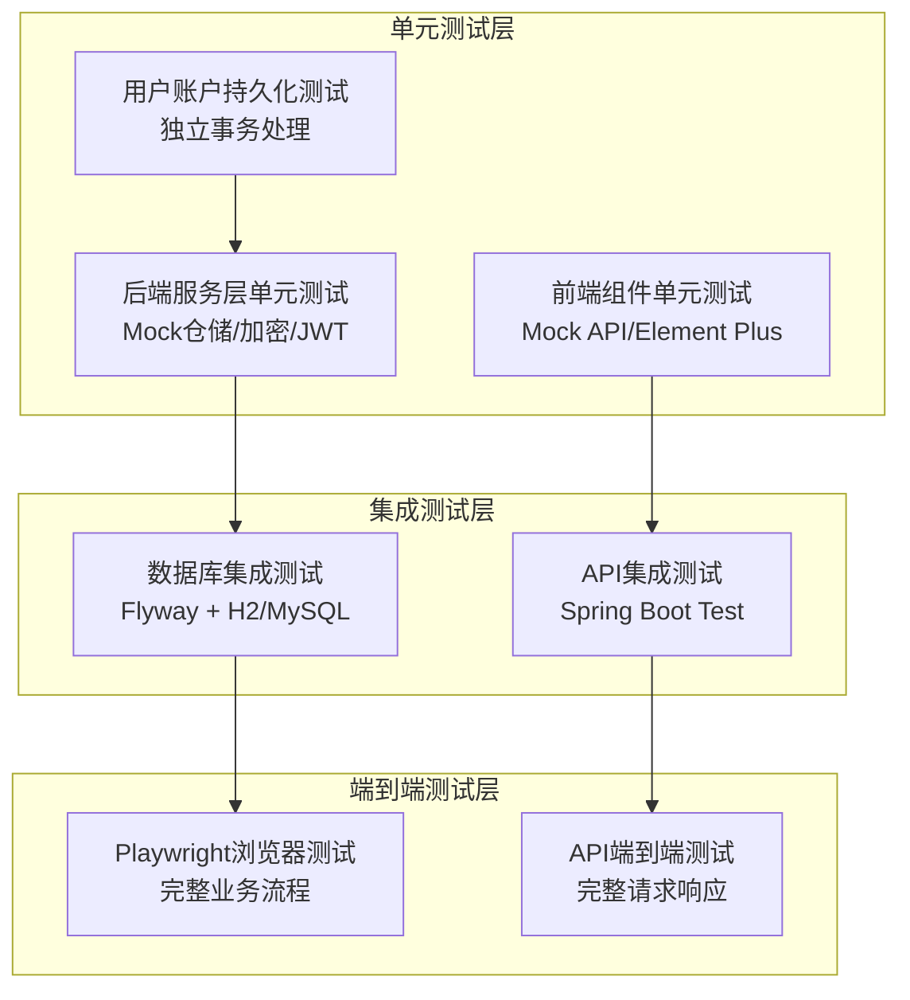
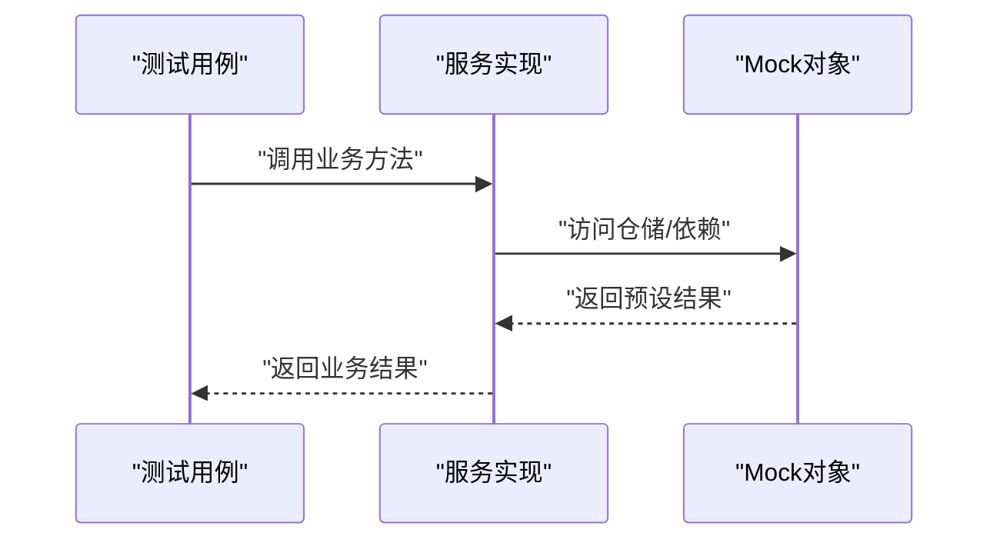
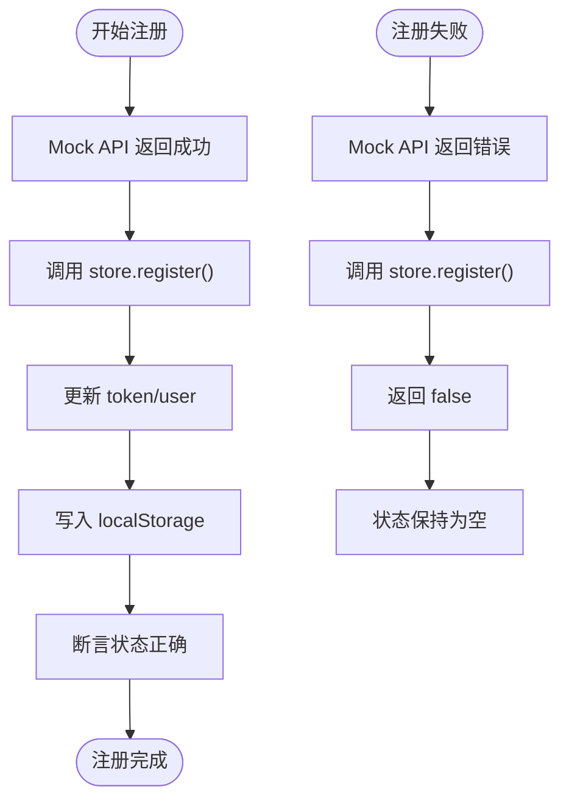
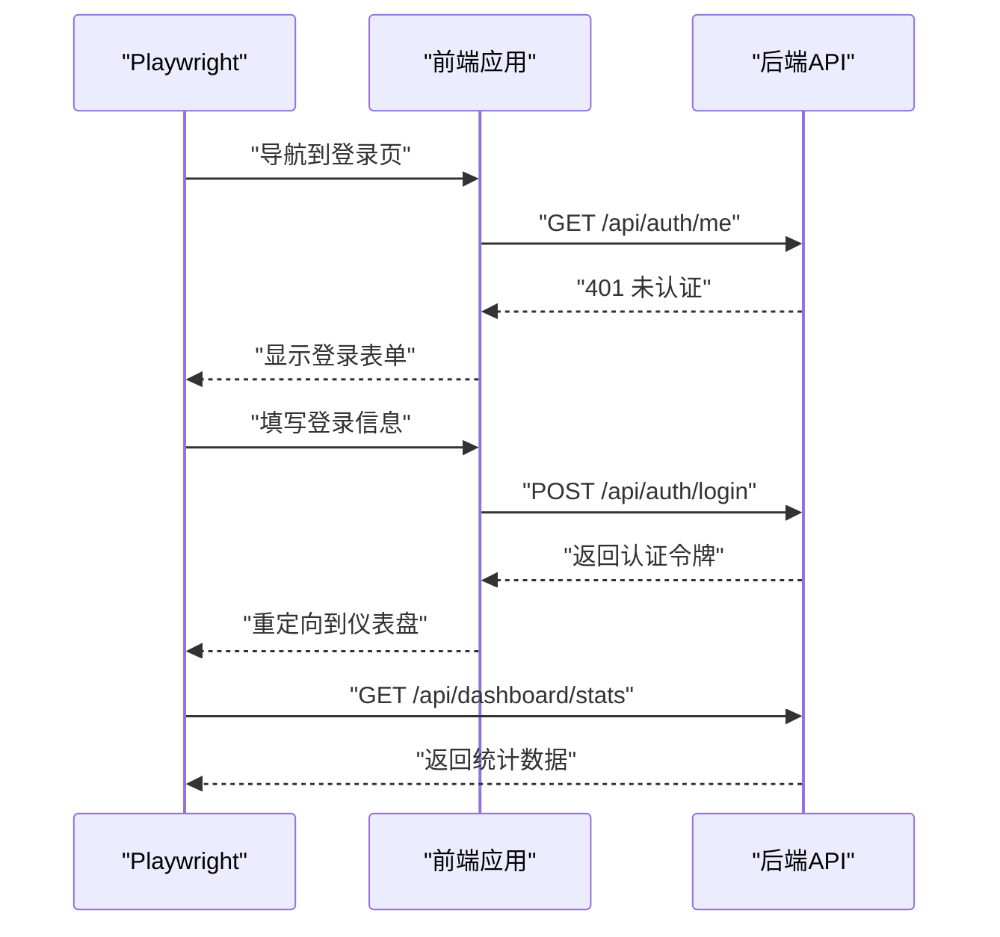
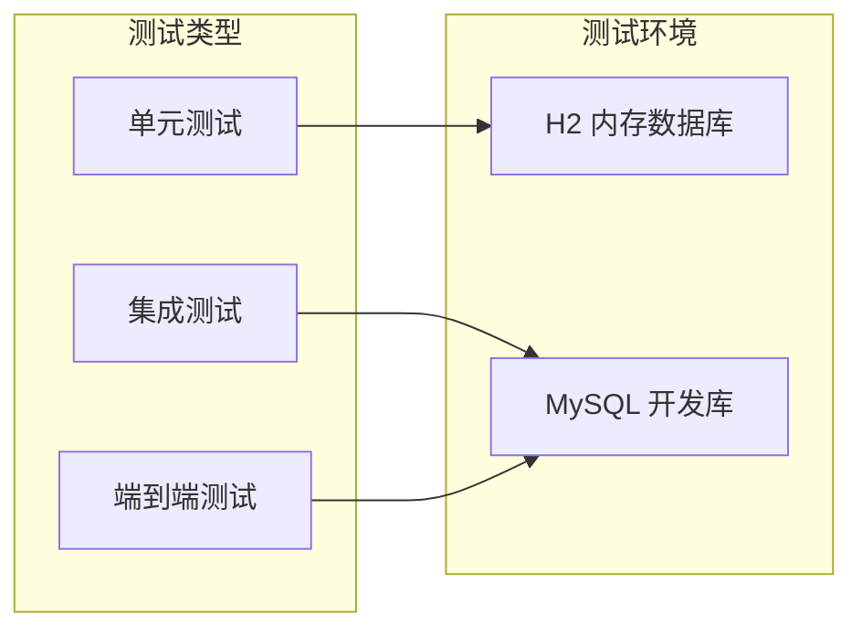

# 测试策略

<cite>
**本文引用的文件**
- [UserServiceTest.java](file://communication-backend/src/test/java/com/communication/service/UserServiceTest.java)
- [UserAccountPersistenceServiceTest.java](file://communication-backend/src/test/java/com/communication/service/UserAccountPersistenceServiceTest.java)
- [CommentServiceTest.java](file://communication-backend/src/test/java/com/communication/service/CommentServiceTest.java)
- [ContentServiceTest.java](file://communication-backend/src/test/java/com/communication/service/ContentServiceTest.java)
- [DashboardServiceTest.java](file://communication-backend/src/test/java/com/communication/service/DashboardServiceTest.java)
- [SearchServiceTest.java](file://communication-backend/src/test/java/com/communication/service/SearchServiceTest.java)
- [SubscriptionServiceTest.java](file://communication-backend/src/test/java/com/communication/service/SubscriptionServiceTest.java)
- [UserAccountPersistenceService.java](file://communication-backend/src/main/java/com/communication/service/UserAccountPersistenceService.java)
- [UserServiceImpl.java](file://communication-backend/src/main/java/com/communication/service/impl/UserServiceImpl.java)
- [auth.test.ts](file://communication-frontend/src/stores/__tests__/auth.test.ts)
- [vitest.config.ts](file://communication-frontend/vitest.config.ts)
- [playwright.config.ts](file://communication-frontend/playwright.config.ts)
- [auth.ts](file://communication-frontend/src/stores/auth.ts)
- [auth.ts](file://communication-frontend/src/api/auth.ts)
- [http.ts](file://communication-frontend/src/api/http.ts)
- [docker-compose.yml](file://docker-compose.yml)
- [application.yml](file://communication-backend/src/main/resources/application.yml)
- [application-test.yml](file://communication-backend/src/test/resources/application-test.yml)
- [pom.xml](file://communication-backend/pom.xml)
- [package.json](file://communication-frontend/package.json)
</cite>

## 更新摘要
**所做更改**
- 新增用户账户持久化服务的专门单元测试策略
- 增强用户服务的集成测试，包含UserAccountPersistenceService的测试
- 完善后端所有核心服务的单元测试策略说明
- 新增了前端组件测试和端到端测试的详细实现
- 补充了测试覆盖率要求和质量保证流程
- 增强了持续集成和自动化测试的配置指导
- 完善了测试数据管理和性能测试建议

## 目录
1. [简介](#简介)
2. [测试金字塔架构](#测试金字塔架构)
3. [后端单元测试策略](#后端单元测试策略)
4. [前端组件测试策略](#前端组件测试策略)
5. [端到端测试策略](#端到端测试策略)
6. [测试覆盖率与质量保证](#测试覆盖率与质量保证)
7. [持续集成与自动化测试](#持续集成与自动化测试)
8. [测试数据管理](#测试数据管理)
9. [性能测试与压力测试](#性能测试与压力测试)
10. [故障排查指南](#故障排查指南)
11. [最佳实践总结](#最佳实践总结)

## 简介
本测试策略文档为通信平台提供了完整的测试实施指南，涵盖后端服务层、前端组件、端到端测试的全栈测试体系。文档基于实际代码实现，详细说明了单元测试的Mock策略、断言方法、异常处理，以及前端Vitest和Playwright的配置与使用。通过建立完善的测试金字塔，确保代码质量、功能正确性和系统稳定性。

## 测试金字塔架构
通信平台采用三层测试架构，从底层到上层依次为：

**图表来源**
- [UserServiceTest.java:29-42](file://communication-backend/src/test/java/com/communication/service/UserServiceTest.java#L29-L42)
- [UserAccountPersistenceServiceTest.java:21-31](file://communication-backend/src/test/java/com/communication/service/UserAccountPersistenceServiceTest.java#L21-L31)
- [auth.test.ts:1-20](file://communication-frontend/src/stores/__tests__/auth.test.ts#L1-L20)
- [playwright.config.ts:1-26](file://communication-frontend/playwright.config.ts#L1-L26)

## 后端单元测试策略

### 服务层测试通用模式
所有后端服务均采用相同的测试模式，包括Mock对象配置、测试数据准备、断言策略和异常处理。

#### Mock对象配置
- **仓储接口Mock**：UserRepository、ContentRepository、CommentRepository等
- **外部依赖Mock**：PasswordEncoder、JwtUtil、UserAccountPersistenceService等
- **测试注入**：使用@InjectMocks注解创建被测试的服务实例

#### 测试数据准备
每个测试类都包含@BeforeEach方法，负责构建测试所需的实体对象和DTO：

**图表来源**
- [UserServiceTest.java:51-68](file://communication-backend/src/test/java/com/communication/service/UserServiceTest.java#L51-L68)

#### 断言策略
- **响应对象断言**：使用AssertJ验证返回值的各个字段
- **调用次数断言**：使用Mockito.verify验证方法调用次数
- **异常断言**：使用assertThatThrownBy验证异常类型和消息

### 核心服务测试详解

#### 用户账户持久化服务测试（UserAccountPersistenceServiceTest）
**新增** 专门针对用户账户持久化服务的单元测试，验证独立事务处理和数据一致性：

**注册流程测试**
- 成功注册：用户名和邮箱唯一性检查、密码编码、数据库保存和刷新
- 失败场景：用户名已存在、邮箱已存在

**事务隔离测试**
- 独立事务传播：REQUIRES_NEW传播行为
- 异常回滚保护：注册失败不影响上层事务
- 数据一致性保证：保存后立即刷新数据库

**图表来源**
- [UserAccountPersistenceServiceTest.java:51-88](file://communication-backend/src/test/java/com/communication/service/UserAccountPersistenceServiceTest.java#L51-L88)

#### 用户服务测试（UserServiceTest）
**更新** 增强了对UserAccountPersistenceService的集成测试，验证完整的用户注册流程：

**注册流程测试**
- 成功注册：委托UserAccountPersistenceService处理、JWT生成、返回AuthResponse
- 失败场景：用户名已存在、邮箱已存在

**登录流程测试**
- 支持用户名或邮箱登录
- 凭证验证：用户存在性、密码匹配、JWT生成
- 错误处理：用户不存在、密码错误

**集成测试策略**
- Mock UserAccountPersistenceService：验证服务间的协作
- 验证调用顺序：先持久化后生成JWT
- 异常传播测试：下层异常正确向上抛出

**图表来源**
- [UserServiceTest.java:70-161](file://communication-backend/src/test/java/com/communication/service/UserServiceTest.java#L70-L161)

#### 评论服务测试（CommentServiceTest）
覆盖评论创建、回复、查询和删除的完整生命周期：

**评论创建测试**
- 成功创建：用户存在性检查、内容存在性检查、评论保存
- 失败场景：用户不存在、内容不存在

**回复功能测试**
- 父评论验证：确保回复属于正确的父评论
- 层级结构：支持多级评论回复

**权限控制测试**
- 评论作者删除权限
- 内容作者删除权限
- 无权限删除的异常处理

**图表来源**
- [CommentServiceTest.java:93-242](file://communication-backend/src/test/java/com/communication/service/CommentServiceTest.java#L93-L242)

#### 内容服务测试（ContentServiceTest）
验证内容的CRUD操作和权限控制：

**内容管理测试**
- 创建内容：用户验证、内容保存
- 查询内容：ID查找、分页查询
- 更新内容：作者权限验证
- 删除内容：作者权限验证

**统计功能测试**
- 发布内容统计
- 作者内容查询
- 浏览量递增

**图表来源**
- [ContentServiceTest.java:86-226](file://communication-backend/src/test/java/com/communication/service/ContentServiceTest.java#L86-L226)

#### 仪表盘服务测试（DashboardServiceTest）
验证用户统计数据和资料更新功能：

**统计功能测试**
- 内容总数统计
- 发布/草稿内容统计
- 观看次数和评论统计
- 订阅者和关注者统计

**资料管理测试**
- 个人资料更新
- 头像更新
- 用户不存在的异常处理

**图表来源**
- [DashboardServiceTest.java:59-156](file://communication-backend/src/test/java/com/communication/service/DashboardServiceTest.java#L59-L156)

#### 搜索服务测试（SearchServiceTest）
覆盖内容搜索、用户搜索和标签管理功能：

**搜索功能测试**
- 关键词搜索：全文检索、分页返回
- 标签搜索：标签过滤、内容关联
- 默认排序：无条件时按最新排序

**标签管理测试**
- 热门标签获取
- 标签建议功能
- 空关键词处理

**图表来源**
- [SearchServiceTest.java:76-184](file://communication-backend/src/test/java/com/communication/service/SearchServiceTest.java#L76-L184)

#### 订阅服务测试（SubscriptionServiceTest）
验证订阅管理的完整功能：

**订阅功能测试**
- 成功订阅：用户验证、去重检查、保存订阅
- 失败场景：自订阅保护、重复订阅检测
- 取消订阅：权限验证、记录删除

**订阅管理测试**
- 订阅状态检查
- 关注列表查询
- 粉丝列表查询
- 订阅动态流
- 统计信息获取

**图表来源**
- [SubscriptionServiceTest.java:79-235](file://communication-backend/src/test/java/com/communication/service/SubscriptionServiceTest.java#L79-L235)

**章节来源**
- [UserServiceTest.java:1-163](file://communication-backend/src/test/java/com/communication/service/UserServiceTest.java#L1-L163)
- [UserAccountPersistenceServiceTest.java:1-90](file://communication-backend/src/test/java/com/communication/service/UserAccountPersistenceServiceTest.java#L1-L90)
- [CommentServiceTest.java:1-244](file://communication-backend/src/test/java/com/communication/service/CommentServiceTest.java#L1-L244)
- [ContentServiceTest.java:1-228](file://communication-backend/src/test/java/com/communication/service/ContentServiceTest.java#L1-L228)
- [DashboardServiceTest.java:1-158](file://communication-backend/src/test/java/com/communication/service/DashboardServiceTest.java#L1-L158)
- [SearchServiceTest.java:1-186](file://communication-backend/src/test/java/com/communication/service/SearchServiceTest.java#L1-L186)
- [SubscriptionServiceTest.java:1-237](file://communication-backend/src/test/java/com/communication/service/SubscriptionServiceTest.java#L1-L237)

## 前端组件测试策略

### Pinia Store测试（auth.store.test.ts）
采用Vitest进行状态管理测试，重点验证认证状态的完整生命周期：

#### 初始状态测试
- 空localStorage状态：token、user、isAuthenticated均为null/false
- localStorage恢复：重启后状态正确恢复

#### 注册流程测试

**图表来源**
- [auth.test.ts:50-90](file://communication-frontend/src/stores/__tests__/auth.test.ts#L50-L90)

#### 登录流程测试
- 成功登录：token存储、用户信息更新、认证状态切换
- 失败登录：错误消息显示、状态重置

#### 权限控制测试
- 无token时的保护机制
- 自动登出处理
- 当前用户信息获取

## 端到端测试策略

### Playwright配置详解
基于实际配置文件，端到端测试具备以下特性：

#### 环境配置
- **测试目录**：./e2e
- **并行执行**：完全并行测试
- **CI友好**：重试机制、工作进程控制
- **报告器**：HTML报告器

#### 开发服务器集成
- **启动命令**：pnpm dev
- **基础URL**：http://localhost:5173
- **服务器复用**：CI环境中复用现有服务器

#### 浏览器配置
- **目标浏览器**：Chrome桌面版
- **调试支持**：首次重试时启用trace

### 端到端测试场景设计

#### 用户认证流程

**图表来源**
- [playwright.config.ts:20-24](file://communication-frontend/playwright.config.ts#L20-L24)

#### 内容管理流程
- 内容创建：标题、正文、媒体上传
- 内容编辑：权限验证、保存更新
- 内容删除：权限验证、软删除

#### 搜索功能测试
- 关键词搜索：实时结果反馈
- 标签筛选：多标签组合搜索
- 搜索历史：最近搜索记录

**章节来源**
- [playwright.config.ts:1-26](file://communication-frontend/playwright.config.ts#L1-L26)

## 测试覆盖率与质量保证

### 覆盖率指标建议
基于服务复杂度和业务重要性，制定差异化覆盖率要求：

#### 后端覆盖率标准
- **核心服务**：方法级覆盖率≥85%，分支覆盖率≥75%
- **认证服务**：方法级覆盖率≥90%，分支覆盖率≥80%
- **业务逻辑**：关键业务流程100%覆盖
- **新增服务**：UserAccountPersistenceService达到95%以上覆盖率

#### 前端覆盖率标准
- **Store模块**：覆盖率≥90%，关键状态变更100%覆盖
- **API模块**：覆盖率≥85%，错误处理100%覆盖
- **组件测试**：核心交互100%覆盖

### 质量门禁
- **CI失败阻断**：任何测试失败阻止合并
- **覆盖率阈值**：低于阈值的PR拒绝合并
- **关键功能回归**：重要功能每次变更必须有回归测试
- **新增服务验证**：新服务必须有对应的单元测试

## 持续集成与自动化测试

### 吐司后端CI配置
基于pom.xml配置，后端测试在CI中执行：

#### Maven测试配置
- **测试插件**：maven-surefire-plugin
- **测试报告**：JUnit XML格式
- **覆盖率收集**：JaCoCo插件集成

#### 环境变量配置
- **数据库连接**：MySQL连接字符串
- **JWT密钥**：测试环境专用密钥
- **文件上传**：临时存储路径

### 前端CI配置
基于package.json和Vitest配置：

#### 测试命令
- **单元测试**：pnpm test:unit
- **端到端测试**：pnpm test:e2e
- **覆盖率报告**：测试覆盖率HTML报告

#### Docker集成
- **服务编排**：docker-compose启动依赖服务
- **数据库准备**：Flyway自动迁移
- **测试隔离**：独立测试网络

**章节来源**
- [pom.xml:96-112](file://communication-backend/pom.xml#L96-L112)
- [package.json:6-14](file://communication-frontend/package.json#L6-L14)
- [docker-compose.yml:25-56](file://docker-compose.yml#L25-L56)

## 测试数据管理

### 后端测试数据策略
- **内存数据库**：H2内存数据库用于单元测试
- **Flyway迁移**：测试中禁用自动迁移，手动建表
- **测试数据隔离**：每个测试用例独立的数据集
- **新增服务数据**：UserAccountPersistenceService测试数据独立管理

### 前端测试数据策略
- **API Mock数据**：固定JSON响应数据
- **本地存储模拟**：localStorage数据模拟
- **组件Props测试**：参数化测试数据

### 数据库测试策略

**图表来源**
- [application-test.yml:1-19](file://communication-backend/src/test/resources/application-test.yml#L1-L19)

## 性能测试与压力测试

### 单元测试性能优化
- **Mock策略**：完全隔离外部依赖
- **内存计算**：避免真实数据库和网络IO
- **批量执行**：Vitest并行执行提高效率
- **新增服务优化**：UserAccountPersistenceService使用独立事务减少锁竞争

### 集成测试性能考虑
- **数据库选择**：H2内存库优先，MySQL用于真实场景
- **迁移策略**：Flyway快速初始化
- **缓存利用**：测试间共享公共数据

### 端到端测试性能
- **浏览器管理**：单实例复用
- **网络模拟**：API响应时间控制
- **并发限制**：CI环境限制并行数量

### 压力测试建议
- **API层面**：使用JMeter或Gatling进行接口压力测试
- **数据库层面**：模拟高并发查询和写入
- **前端层面**：模拟大量用户同时访问的场景

## 故障排查指南

### 后端测试常见问题
- **Mock配置错误**：检查when链和参数匹配
- **JWT验证失败**：确认测试密钥和编码器配置
- **数据库连接问题**：检查H2内存数据库配置
- **新增服务问题**：UserAccountPersistenceService事务配置检查

### 前端测试常见问题
- **Store状态不一致**：检查localStorage同步时机
- **API调用失败**：确认Mock函数返回值
- **组件渲染问题**：检查props传递和事件处理

### 环境配置问题
- **Docker服务启动**：检查端口映射和健康检查
- **CI测试失败**：查看测试报告和日志输出
- **网络连接问题**：验证防火墙和代理设置

## 最佳实践总结

### 测试编写最佳实践
- **测试命名**：使用行为驱动的描述性名称
- **测试组织**：按功能模块组织测试套件
- **断言清晰**：使用AssertJ提供清晰的错误信息
- **Mock合理**：只Mock必要的外部依赖
- **新增服务测试**：为每个新服务编写专门的单元测试

### 代码质量保证
- **测试覆盖率**：定期审查覆盖率报告
- **测试维护**：及时更新过期的测试用例
- **性能监控**：监控测试执行时间和资源使用
- **文档同步**：测试代码与功能文档保持同步
- **服务分离**：将职责分离到专门的服务中，便于测试

通过实施这套完整的测试策略，通信平台能够确保代码质量、功能正确性和系统稳定性，为产品的持续迭代提供可靠保障。