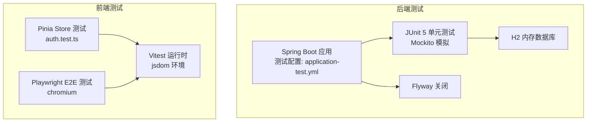
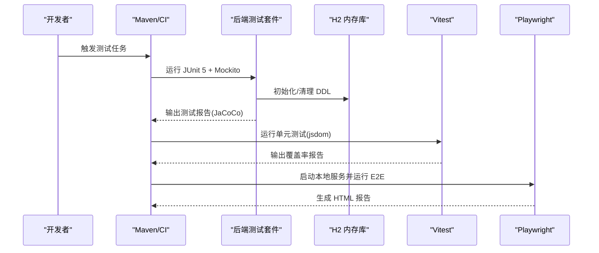
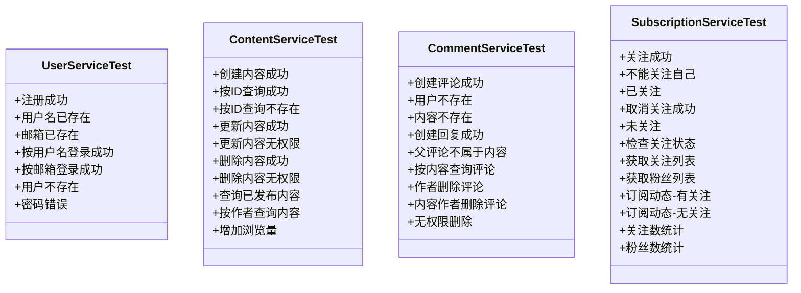
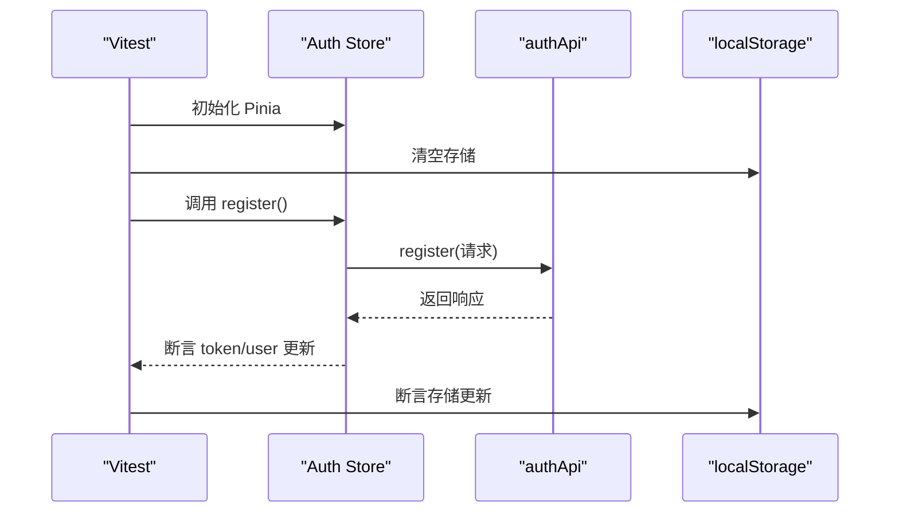
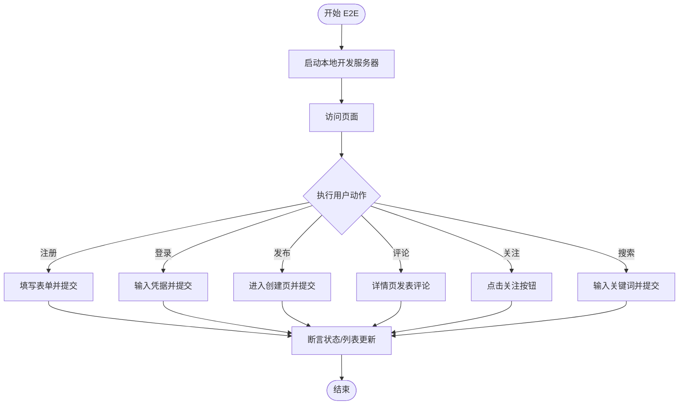
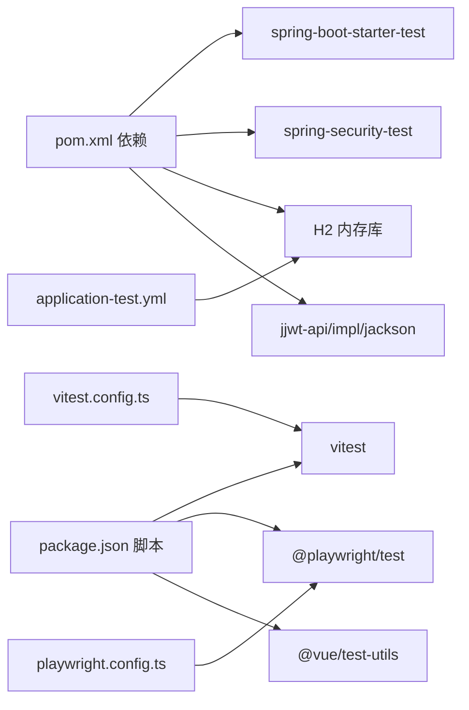

# 测试策略

<cite>
**本文引用的文件**
- [wiki/13-测试策略.md](file://wiki/13-测试策略.md)
- [communication-backend/pom.xml](file://communication-backend/pom.xml)
- [communication-backend/src/test/resources/application-test.yml](file://communication-backend/src/test/resources/application-test.yml)
- [communication-backend/src/test/java/com/communication/service/UserServiceTest.java](file://communication-backend/src/test/java/com/communication/service/UserServiceTest.java)
- [communication-backend/src/test/java/com/communication/service/ContentServiceTest.java](file://communication-backend/src/test/java/com/communication/service/ContentServiceTest.java)
- [communication-backend/src/test/java/com/communication/service/CommentServiceTest.java](file://communication-backend/src/test/java/com/communication/service/CommentServiceTest.java)
- [communication-backend/src/test/java/com/communication/service/SubscriptionServiceTest.java](file://communication-backend/src/test/java/com/communication/service/SubscriptionServiceTest.java)
- [communication-frontend/package.json](file://communication-frontend/package.json)
- [communication-frontend/vitest.config.ts](file://communication-frontend/vitest.config.ts)
- [communication-frontend/playwright.config.ts](file://communication-frontend/playwright.config.ts)
- [communication-frontend/src/stores/__tests__/auth.test.ts](file://communication-frontend/src/stores/__tests__/auth.test.ts)
- [communication-frontend/src/components/comment/CommentInput.vue](file://communication-frontend/src/components/comment/CommentInput.vue)
- [communication-frontend/src/components/common/EmptyState.vue](file://communication-frontend/src/components/common/EmptyState.vue)
</cite>

## 目录
1. [引言](#引言)
2. [项目结构](#项目结构)
3. [核心组件](#核心组件)
4. [架构总览](#架构总览)
5. [详细组件分析](#详细组件分析)
6. [依赖分析](#依赖分析)
7. [性能考虑](#性能考虑)
8. [故障排查指南](#故障排查指南)
9. [结论](#结论)
10. [附录](#附录)

## 引言
本文件系统化阐述项目的测试策略，覆盖后端单元测试、前端组件测试与端到端测试（E2E）。文档基于仓库现有配置与测试实现，明确测试框架、断言策略、数据与模拟对象使用方式、覆盖率目标与质量标准，并给出持续集成与自动化测试流程建议。同时补充性能测试与压力测试的实施思路，以及常见问题与最佳实践。

## 项目结构
测试相关的关键目录与文件分布如下：
- 后端（Spring Boot + JUnit 5 + Mockito + H2）：位于 communication-backend，测试资源在 src/test 下，数据库使用 H2 内存库，Flyway 在测试中关闭。
- 前端（Vitest + Vue Test Utils + Playwright）：位于 communication-frontend，单元测试位于 src/stores/__tests__，E2E 测试位于 e2e，Playwright 配置在 playwright.config.ts，Vitest 配置在 vitest.config.ts。

图表来源
- [communication-backend/src/test/resources/application-test.yml:1-19](file://communication-backend/src/test/resources/application-test.yml#L1-L19)
- [communication-backend/pom.xml:78-94](file://communication-backend/pom.xml#L78-L94)
- [communication-frontend/vitest.config.ts:7-11](file://communication-frontend/vitest.config.ts#L7-L11)
- [communication-frontend/playwright.config.ts:14-24](file://communication-frontend/playwright.config.ts#L14-L24)

章节来源
- [wiki/13-测试策略.md:1-261](file://wiki/13-测试策略.md#L1-L261)
- [communication-backend/src/test/resources/application-test.yml:1-19](file://communication-backend/src/test/resources/application-test.yml#L1-L19)
- [communication-backend/pom.xml:78-94](file://communication-backend/pom.xml#L78-L94)
- [communication-frontend/vitest.config.ts:1-18](file://communication-frontend/vitest.config.ts#L1-L18)
- [communication-frontend/playwright.config.ts:1-26](file://communication-frontend/playwright.config.ts#L1-L26)

## 核心组件
- 后端测试框架
  - JUnit 5：测试执行与生命周期管理
  - Mockito：模拟 Repository、Service 依赖，隔离被测单元
  - Spring Boot Test：加载应用上下文进行集成测试
  - H2 数据库：内存数据库，DDL 自动建模/销毁，禁用 Flyway
- 前端测试框架
  - Vitest：原生支持 Vite 的测试运行器，jsdom 环境
  - Vue Test Utils：组件挂载与交互模拟
  - Playwright：跨浏览器 E2E 测试，本地 Web 服务器启动
- 测试数据与模拟
  - 后端：使用 H2 内存库与测试配置，禁用 Flyway；使用 Mockito.when(...) 配置行为
  - 前端：使用 vi.mock(...) 对第三方库与 API 进行模拟，Pinia Store 使用 jsdom 环境初始化

章节来源
- [wiki/13-测试策略.md:20-118](file://wiki/13-测试策略.md#L20-L118)
- [communication-backend/src/test/resources/application-test.yml:1-19](file://communication-backend/src/test/resources/application-test.yml#L1-L19)
- [communication-backend/pom.xml:78-94](file://communication-backend/pom.xml#L78-L94)
- [communication-frontend/vitest.config.ts:7-11](file://communication-frontend/vitest.config.ts#L7-L11)
- [communication-frontend/playwright.config.ts:14-24](file://communication-frontend/playwright.config.ts#L14-L24)

## 架构总览
后端测试通过 Spring Boot Test 加载上下文，使用 Mockito 注入模拟依赖，H2 提供数据库支撑；前端测试分为两类：
- 组件级：Pinia Store 行为与状态断言
- 端到端：Playwright 控制浏览器访问本地开发服务器，覆盖真实用户路径

图表来源
- [communication-backend/pom.xml:96-112](file://communication-backend/pom.xml#L96-L112)
- [communication-backend/src/test/resources/application-test.yml:1-19](file://communication-backend/src/test/resources/application-test.yml#L1-L19)
- [communication-frontend/vitest.config.ts:7-11](file://communication-frontend/vitest.config.ts#L7-L11)
- [communication-frontend/playwright.config.ts:20-24](file://communication-frontend/playwright.config.ts#L20-L24)

## 详细组件分析

### 后端服务层测试（JUnit 5 + Mockito）
- 测试范围
  - 用户服务：注册、登录、用户名/邮箱重复校验、凭据错误处理
  - 内容服务：创建、查询、更新、删除、查看计数、分页查询
  - 评论服务：创建评论/回复、权限校验、内容存在性校验、回复归属校验、分页查询
  - 订阅服务：关注/取关、已关注校验、关注/粉丝列表、订阅动态、统计
- 断言策略
  - 使用 AssertJ 断言响应体字段与业务期望一致
  - 使用 Mockito.verify(...) 验证调用次数与参数匹配
  - 使用 assertThatThrownBy(...) 验证异常类型与消息
- 模拟对象
  - Repository：返回 Optional/实体或抛出异常，模拟成功/失败分支
  - 外部服务：如 JWT 工具、密码编码器、账户持久化服务
- 配置要点
  - application-test.yml：H2 内存库、JPA DDL 自动建模、禁用 Flyway
  - pom.xml：引入 spring-boot-starter-test、spring-security-test、H2

图表来源
- [communication-backend/src/test/java/com/communication/service/UserServiceTest.java:70-162](file://communication-backend/src/test/java/com/communication/service/UserServiceTest.java#L70-L162)
- [communication-backend/src/test/java/com/communication/service/ContentServiceTest.java:86-227](file://communication-backend/src/test/java/com/communication/service/ContentServiceTest.java#L86-L227)
- [communication-backend/src/test/java/com/communication/service/CommentServiceTest.java:93-243](file://communication-backend/src/test/java/com/communication/service/CommentServiceTest.java#L93-L243)
- [communication-backend/src/test/java/com/communication/service/SubscriptionServiceTest.java:79-236](file://communication-backend/src/test/java/com/communication/service/SubscriptionServiceTest.java#L79-L236)

章节来源
- [wiki/13-测试策略.md:20-84](file://wiki/13-测试策略.md#L20-L84)
- [communication-backend/src/test/java/com/communication/service/UserServiceTest.java:1-163](file://communication-backend/src/test/java/com/communication/service/UserServiceTest.java#L1-L163)
- [communication-backend/src/test/java/com/communication/service/ContentServiceTest.java:1-228](file://communication-backend/src/test/java/com/communication/service/ContentServiceTest.java#L1-L228)
- [communication-backend/src/test/java/com/communication/service/CommentServiceTest.java:1-244](file://communication-backend/src/test/java/com/communication/service/CommentServiceTest.java#L1-L244)
- [communication-backend/src/test/java/com/communication/service/SubscriptionServiceTest.java:1-237](file://communication-backend/src/test/java/com/communication/service/SubscriptionServiceTest.java#L1-L237)
- [communication-backend/src/test/resources/application-test.yml:1-19](file://communication-backend/src/test/resources/application-test.yml#L1-L19)
- [communication-backend/pom.xml:78-94](file://communication-backend/pom.xml#L78-L94)

### 前端组件测试（Vitest + Vue Test Utils）
- 测试范围
  - Pinia Store：认证状态初始化、登录/注册/登出、当前用户拉取与失败处理
  - 组件：评论输入框、空状态组件等 UI 行为与交互
- 断言策略
  - 断言 store 状态变化、localStorage 存储、API 调用次数与参数
  - 使用 vi.mock(...) 对第三方库与 API 进行模拟，避免真实网络请求
- 运行配置
  - Vitest：jsdom 环境、全局测试函数、别名 @ 指向 src
  - Playwright：本地开发服务器复用、HTML 报告、重试策略

图表来源
- [communication-frontend/src/stores/__tests__/auth.test.ts:50-90](file://communication-frontend/src/stores/__tests__/auth.test.ts#L50-L90)
- [communication-frontend/vitest.config.ts:7-11](file://communication-frontend/vitest.config.ts#L7-L11)

章节来源
- [wiki/13-测试策略.md:87-147](file://wiki/13-测试策略.md#L87-L147)
- [communication-frontend/src/stores/__tests__/auth.test.ts:1-183](file://communication-frontend/src/stores/__tests__/auth.test.ts#L1-L183)
- [communication-frontend/vitest.config.ts:1-18](file://communication-frontend/vitest.config.ts#L1-L18)

### 端到端测试（Playwright）
- 测试范围
  - 用户注册/登录、内容发布、评论互动、关注/取消关注、搜索功能
- 运行配置
  - Playwright：chromium 项目、本地开发服务器、HTML 报告、trace
  - 支持 UI 模式调试、按项目选择浏览器
- 断言策略
  - 页面元素可见性、路由跳转、列表渲染、交互反馈

图表来源
- [communication-frontend/playwright.config.ts:14-24](file://communication-frontend/playwright.config.ts#L14-L24)
- [wiki/13-测试策略.md:150-204](file://wiki/13-测试策略.md#L150-L204)

章节来源
- [wiki/13-测试策略.md:150-204](file://wiki/13-测试策略.md#L150-L204)
- [communication-frontend/playwright.config.ts:1-26](file://communication-frontend/playwright.config.ts#L1-L26)

## 依赖分析
- 后端
  - 测试依赖：spring-boot-starter-test、spring-security-test、H2、JWT 实现与 Jackson 绑定
  - 测试配置：application-test.yml 指定 H2 内存库、JPA DDL 自动建模、禁用 Flyway
- 前端
  - 测试依赖：vitest、@vue/test-utils、jsdom、@playwright/test
  - 运行脚本：test:unit、test:e2e
- CI 集成建议
  - 后端：Maven 测试命令 + JaCoCo 报告
  - 前端：Vitest 覆盖率 + Playwright E2E

图表来源
- [communication-backend/pom.xml:78-94](file://communication-backend/pom.xml#L78-L94)
- [communication-backend/src/test/resources/application-test.yml:1-19](file://communication-backend/src/test/resources/application-test.yml#L1-L19)
- [communication-frontend/package.json:6-14](file://communication-frontend/package.json#L6-L14)
- [communication-frontend/vitest.config.ts:1-18](file://communication-frontend/vitest.config.ts#L1-L18)
- [communication-frontend/playwright.config.ts:1-26](file://communication-frontend/playwright.config.ts#L1-L26)

章节来源
- [communication-backend/pom.xml:78-94](file://communication-backend/pom.xml#L78-L94)
- [communication-backend/src/test/resources/application-test.yml:1-19](file://communication-backend/src/test/resources/application-test.yml#L1-L19)
- [communication-frontend/package.json:1-36](file://communication-frontend/package.json#L1-L36)
- [communication-frontend/vitest.config.ts:1-18](file://communication-frontend/vitest.config.ts#L1-L18)
- [communication-frontend/playwright.config.ts:1-26](file://communication-frontend/playwright.config.ts#L1-L26)

## 性能考虑
- 单元测试性能
  - 使用 H2 内存库与最小化上下文，避免真实数据库 IO
  - 减少不必要的模拟调用，仅断言关键路径
- 前端测试性能
  - Vitest 使用 jsdom，避免真实浏览器开销
  - 通过 vi.clearAllMocks() 与 beforeEach 清理状态，避免跨用例干扰
- E2E 性能
  - 使用 reuseExistingServer 避免重复启动本地服务
  - 并行项目数量在 CI 中限制为 1，减少资源竞争
- 覆盖率与质量
  - 后端 JaCoCo 报告输出至 target/site/jacoco/index.html
  - 前端覆盖率输出至 coverage/index.html

章节来源
- [wiki/13-测试策略.md:207-226](file://wiki/13-测试策略.md#L207-L226)
- [communication-frontend/playwright.config.ts:5-8](file://communication-frontend/playwright.config.ts#L5-L8)

## 故障排查指南
- 后端测试常见问题
  - H2 初始化失败：检查 application-test.yml 中的 JDBC URL 与驱动配置
  - Flyway 生效导致迁移：确认测试配置中已禁用 Flyway
  - 异常断言失败：使用 assertThatThrownBy(...) 明确异常类型与消息
- 前端测试常见问题
  - 元素未找到：确保组件已正确挂载，使用 screen.getBy* 或测试工具提供的查找器
  - 模拟未生效：确认 vi.mock(...) 在 import 之前执行，或使用动态导入
  - localStorage 不可用：jsdom 默认支持 localStorage，若报错检查测试环境配置
- E2E 常见问题
  - 本地服务未启动：检查 webServer.command 与 url，CI 环境下避免复用已有服务
  - 截图/Trace：利用 trace on-first-retry 与 HTML 报告定位问题

章节来源
- [wiki/13-测试策略.md:227-251](file://wiki/13-测试策略.md#L227-L251)
- [communication-frontend/playwright.config.ts:20-24](file://communication-frontend/playwright.config.ts#L20-L24)

## 结论
本项目采用“单元测试（后端）+ 组件测试（前端）+ 端到端测试（Playwright）”的三层测试体系，结合 H2 内存库与 jsdom 环境，兼顾速度与稳定性。通过明确的断言策略、模拟对象使用与覆盖率目标，配合 CI 集成与报告输出，可有效保障核心业务质量。建议后续逐步完善 E2E 场景覆盖与性能测试基线，持续提升测试效率与可靠性。

## 附录
- 测试覆盖率与质量标准
  - 后端：核心 Service 模块覆盖率目标 ≥ 70%-80%
  - 前端：Store 与关键组件覆盖率目标 ≥ 70%
  - 质量门禁：PR 必须通过 CI 测试，代码审查至少 1 人通过
- 持续集成建议
  - 后端：Maven 测试 + JaCoCo 报告
  - 前端：Vitest 覆盖率 + Playwright E2E
- 性能与压力测试建议
  - 后端：使用 JMeter/Artillery 对关键接口进行并发与延迟压测，建立 SLO
  - 前端：Lighthouse/自定义脚本评估首屏与交互延迟，结合 E2E 场景做回归

章节来源
- [wiki/13-测试策略.md:74-84](file://wiki/13-测试策略.md#L74-L84)
- [wiki/13-测试策略.md:221-251](file://wiki/13-测试策略.md#L221-L251)