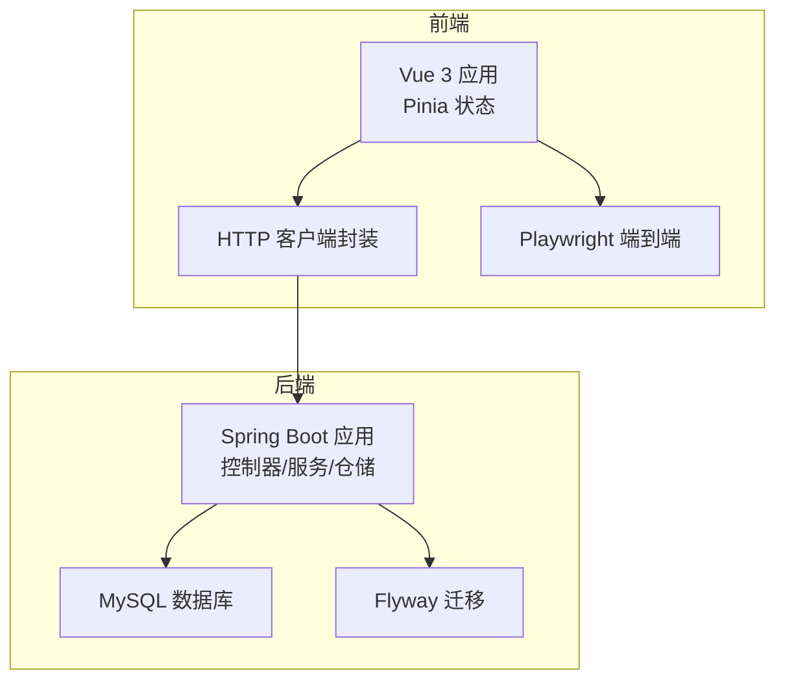
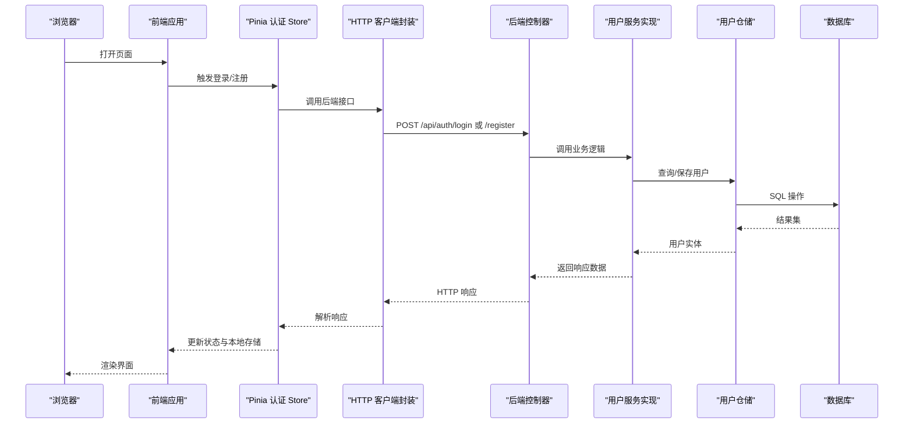
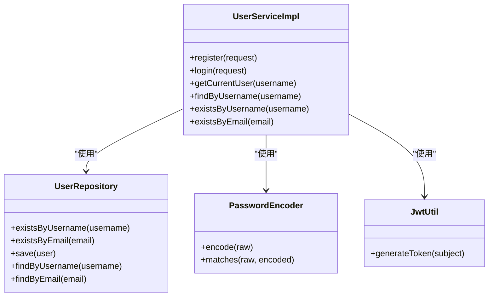
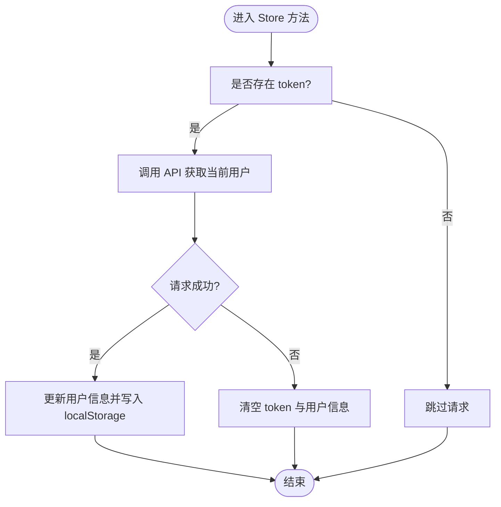
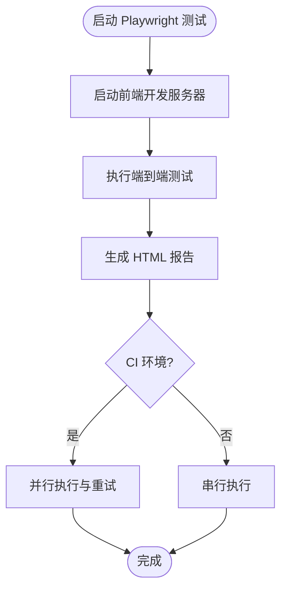
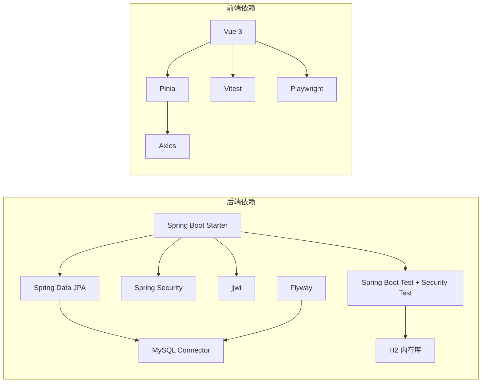

# 测试覆盖率与质量保证

<cite>
**本文引用的文件**
- [pom.xml](file://communication-backend/pom.xml)
- [application.yml](file://communication-backend/src/main/resources/application.yml)
- [application-test.yml](file://communication-backend/src/test/resources/application-test.yml)
- [docker-compose.yml](file://docker-compose.yml)
- [init.sql](file://init.sql)
- [UserServiceTest.java](file://communication-backend/src/test/java/com/communication/service/UserServiceTest.java)
- [UserServiceImpl.java](file://communication-backend/src/main/java/com/communication/service/impl/UserServiceImpl.java)
- [AuthController.java](file://communication-backend/src/main/java/com/communication/controller/AuthController.java)
- [package.json](file://communication-frontend/package.json)
- [vitest.config.ts](file://communication-frontend/vitest.config.ts)
- [playwright.config.ts](file://communication-frontend/playwright.config.ts)
- [auth.test.ts](file://communication-frontend/src/stores/__tests__/auth.test.ts)
- [auth.ts](file://communication-frontend/src/stores/auth.ts)
- [auth.ts（API）](file://communication-frontend/src/api/auth.ts)
</cite>

## 目录
1. [引言](#引言)
2. [项目结构](#项目结构)
3. [核心组件](#核心组件)
4. [架构总览](#架构总览)
5. [详细组件分析](#详细组件分析)
6. [依赖分析](#依赖分析)
7. [性能考虑](#性能考虑)
8. [故障排查指南](#故障排查指南)
9. [结论](#结论)
10. [附录](#附录)

## 引言
本文件面向通信平台的测试覆盖率与质量保证，系统性说明后端服务层、前端组件与端到端测试的覆盖率要求与测量方法；给出代码质量标准与测试质量保证流程；解释如何配置与运行 JaCoCo 与 Istanbul 覆盖率报告；定义测试质量指标与 KPI；描述持续集成中的测试执行与质量门禁；并提供测试数据管理、测试环境隔离与测试结果分析的方法与最佳实践。

## 项目结构
- 后端采用 Spring Boot，使用 Maven 构建，测试框架为 JUnit 5 + Mockito，数据库通过 Flyway 迁移，开发与测试分别使用 MySQL 与 H2 内存库。
- 前端采用 Vue 3 + Pinia + Vitest 单元测试 + Playwright 端到端测试，Vite 作为构建工具。

**图表来源**
- [AuthController.java](file://communication-backend/src/main/java/com/communication/controller/AuthController.java#L1-L42)
- [UserServiceImpl.java](file://communication-backend/src/main/java/com/communication/service/impl/UserServiceImpl.java#L1-L86)
- [application.yml](file://communication-backend/src/main/resources/application.yml#L1-L42)
- [docker-compose.yml](file://docker-compose.yml#L1-L60)
- [auth.ts（API）](file://communication-frontend/src/api/auth.ts#L1-L49)
- [auth.ts](file://communication-frontend/src/stores/auth.ts#L1-L96)
- [playwright.config.ts](file://communication-frontend/playwright.config.ts#L1-L26)

**章节来源**
- [pom.xml](file://communication-backend/pom.xml#L1-L114)
- [application.yml](file://communication-backend/src/main/resources/application.yml#L1-L42)
- [application-test.yml](file://communication-backend/src/test/resources/application-test.yml#L1-L19)
- [docker-compose.yml](file://docker-compose.yml#L1-L60)
- [package.json](file://communication-frontend/package.json#L1-L36)
- [vitest.config.ts](file://communication-frontend/vitest.config.ts#L1-L18)
- [playwright.config.ts](file://communication-frontend/playwright.config.ts#L1-L26)

## 核心组件
- 后端服务层：用户注册/登录逻辑由 UserServiceImpl 提供，控制器 AuthController 暴露 REST 接口，单元测试覆盖关键分支与异常路径。
- 前端状态层：Pinia store 封装认证状态与 API 调用，单元测试覆盖 store 的初始化、登录/注册成功与失败、登出与当前用户拉取等场景。
- 端到端测试：Playwright 配置了 Chromium 设备、HTML 报告器与本地开发服务器启动命令，便于在 CI 中重试与并行执行。

**章节来源**
- [UserServiceImpl.java](file://communication-backend/src/main/java/com/communication/service/impl/UserServiceImpl.java#L1-L86)
- [AuthController.java](file://communication-backend/src/main/java/com/communication/controller/AuthController.java#L1-L42)
- [UserServiceTest.java](file://communication-backend/src/test/java/com/communication/service/UserServiceTest.java#L1-L159)
- [auth.test.ts](file://communication-frontend/src/stores/__tests__/auth.test.ts#L1-L183)
- [auth.ts](file://communication-frontend/src/stores/auth.ts#L1-L96)
- [auth.ts（API）](file://communication-frontend/src/api/auth.ts#L1-L49)
- [playwright.config.ts](file://communication-frontend/playwright.config.ts#L1-L26)

## 架构总览
下图展示从浏览器到后端的典型认证流程，以及测试覆盖点：

**图表来源**
- [AuthController.java](file://communication-backend/src/main/java/com/communication/controller/AuthController.java#L1-L42)
- [UserServiceImpl.java](file://communication-backend/src/main/java/com/communication/service/impl/UserServiceImpl.java#L1-L86)
- [auth.ts](file://communication-frontend/src/stores/auth.ts#L1-L96)
- [auth.ts（API）](file://communication-frontend/src/api/auth.ts#L1-L49)

## 详细组件分析

### 后端服务层覆盖率与质量保证
- 覆盖范围：UserService 接口实现类 UserServiceImpl 的注册、登录、查询当前用户、存在性检查等方法。
- 关键测试点：
  - 注册：用户名/邮箱重复时抛出业务异常；密码加密与 Token 生成验证；仓储保存调用断言。
  - 登录：用户名或邮箱登录、凭据错误、密码不匹配等分支。
  - 当前用户：未找到用户时抛出资源不存在异常。
- 质量标准：
  - 单元测试使用 Mockito 注入依赖，避免真实数据库访问。
  - 使用 H2 内存库与 Flyway 关闭以提升测试速度与可重复性。
- 建议的覆盖率目标：
  - 行覆盖率 ≥ 80%，分支覆盖率 ≥ 70%，方法覆盖率 ≥ 90%。

**图表来源**
- [UserServiceImpl.java](file://communication-backend/src/main/java/com/communication/service/impl/UserServiceImpl.java#L1-L86)
- [UserServiceTest.java](file://communication-backend/src/test/java/com/communication/service/UserServiceTest.java#L1-L159)

**章节来源**
- [UserServiceImpl.java](file://communication-backend/src/main/java/com/communication/service/impl/UserServiceImpl.java#L1-L86)
- [UserServiceTest.java](file://communication-backend/src/test/java/com/communication/service/UserServiceTest.java#L1-L159)
- [application-test.yml](file://communication-backend/src/test/resources/application-test.yml#L1-L19)

### 前端组件覆盖率与质量保证
- 覆盖范围：Pinia 认证 Store 的注册、登录、登出、当前用户拉取等逻辑；API 封装模块。
- 关键测试点：
  - 初始化：空 localStorage 下的状态与鉴权态判断。
  - 注册/登录：成功与失败分支，消息提示与本地存储更新。
  - 登出：清除 token 与用户信息。
  - 当前用户：无 token 不请求；失败时自动登出。
- 质量标准：
  - 使用 Vitest + jsdom 环境，模拟第三方组件（如 Element Plus）与 API。
  - 通过断言 store 状态与 localStorage 变化验证行为。
- 建议的覆盖率目标：
  - 行覆盖率 ≥ 85%，分支覆盖率 ≥ 75%，函数覆盖率 ≥ 95%。

**图表来源**
- [auth.ts](file://communication-frontend/src/stores/auth.ts#L1-L96)
- [auth.test.ts](file://communication-frontend/src/stores/__tests__/auth.test.ts#L1-L183)

**章节来源**
- [auth.test.ts](file://communication-frontend/src/stores/__tests__/auth.test.ts#L1-L183)
- [auth.ts](file://communication-frontend/src/stores/auth.ts#L1-L96)
- [auth.ts（API）](file://communication-frontend/src/api/auth.ts#L1-L49)
- [vitest.config.ts](file://communication-frontend/vitest.config.ts#L1-L18)

### 端到端测试覆盖率与质量保证
- 覆盖范围：Playwright 配置了 Chromium 设备、HTML 报告器、CI 并行与重试策略，本地开发服务器命令指向前端 dev。
- 关键测试点：
  - 页面加载与路由导航。
  - 登录/注册表单交互与错误提示。
  - 登录后页面状态与用户信息展示。
- 质量标准：
  - 在 CI 中启用并行 worker 数限制与首次失败追踪，确保稳定性与可诊断性。
- 建议的覆盖率目标：
  - 场景覆盖率 ≥ 70%，关键用户旅程 ≥ 90%。

**图表来源**
- [playwright.config.ts](file://communication-frontend/playwright.config.ts#L1-L26)

**章节来源**
- [playwright.config.ts](file://communication-frontend/playwright.config.ts#L1-L26)
- [package.json](file://communication-frontend/package.json#L1-L36)

## 依赖分析
- 后端依赖：
  - Spring Web、JPA、Security、Validation、MySQL Connector、Flyway、JWT、JUnit 5、Mockito、H2。
- 前端依赖：
  - Vue 3、Vue Router、Pinia、Element Plus、Axios、Vitest、@vue/test-utils、jsdom、Playwright。
- 测试环境：
  - 开发环境使用 MySQL，测试环境使用 H2 内存库，Flyway 在测试中关闭。

**图表来源**
- [pom.xml](file://communication-backend/pom.xml#L1-L114)
- [package.json](file://communication-frontend/package.json#L1-L36)

**章节来源**
- [pom.xml](file://communication-backend/pom.xml#L1-L114)
- [package.json](file://communication-frontend/package.json#L1-L36)
- [application-test.yml](file://communication-backend/src/test/resources/application-test.yml#L1-L19)

## 性能考虑
- 测试执行性能优化建议：
  - 后端：使用 H2 内存库与最小化迁移配置，避免真实磁盘 IO；合理拆分测试类，减少事务回滚成本。
  - 前端：Vitest 默认 jsdom 环境已较高效；避免在单测中发起真实网络请求，统一通过 mock 控制。
  - 端到端：在 CI 中限制并发 worker 数，启用重试与首次失败追踪，平衡速度与稳定性。
- 覆盖率收集：
  - 后端建议使用 JaCoCo 插件在 Maven 中生成覆盖率报告，并在 CI 中上传至覆盖率平台。
  - 前端建议使用 Vitest 的覆盖率选项与 Playwright 的覆盖率插件，结合报告器输出 HTML/Clover/XML。

[本节为通用指导，无需列出具体文件来源]

## 故障排查指南
- 后端测试常见问题：
  - H2 与 MySQL 差异导致的迁移或方言问题：确认测试配置中关闭 Flyway 并使用内存库。
  - 密码编码与 JWT：确保测试中对 PasswordEncoder 与 JwtUtil 进行 mock，避免真实加密与签名。
- 前端测试常见问题：
  - 第三方组件渲染问题：通过 vi.mock 对外部组件进行模拟。
  - API 请求失败：统一断言错误消息与返回值，确保 store 行为符合预期。
- 端到端测试常见问题：
  - 本地服务器未就绪：确认 Playwright 的 webServer 命令与端口；在 CI 中复用已有进程避免冲突。
  - 截图与追踪：利用 trace 仅在首次重试时开启，降低 CI 日志体积。

**章节来源**
- [application-test.yml](file://communication-backend/src/test/resources/application-test.yml#L1-L19)
- [auth.test.ts](file://communication-frontend/src/stores/__tests__/auth.test.ts#L1-L183)
- [playwright.config.ts](file://communication-frontend/playwright.config.ts#L1-L26)

## 结论
本项目在后端与前端均已具备基础的单元测试与端到端测试能力。建议在现有基础上引入 JaCoCo 与 Istanbul 覆盖率报告，设定明确的覆盖率目标与质量门禁，并完善测试数据管理与环境隔离策略，以持续提升测试质量与交付可靠性。

[本节为总结性内容，无需列出具体文件来源]

## 附录

### 测试覆盖率要求与测量方法
- 后端服务层覆盖率：
  - 目标：行覆盖率 ≥ 80%，分支覆盖率 ≥ 70%，方法覆盖率 ≥ 90%。
  - 方法：使用 JaCoCo Maven 插件在测试阶段生成覆盖率报告，支持 HTML 与 XML 输出，便于 CI 集成。
- 前端组件覆盖率：
  - 目标：行覆盖率 ≥ 85%，分支覆盖率 ≥ 75%，函数覆盖率 ≥ 95%。
  - 方法：Vitest 配置覆盖率选项，结合 Playwright 的覆盖率插件输出报告。
- 端到端测试覆盖率：
  - 目标：关键用户旅程覆盖率 ≥ 90%，场景覆盖率 ≥ 70%。
  - 方法：Playwright 项目按设备与浏览器维度执行，生成 HTML 报告并在 CI 中归档。

**章节来源**
- [pom.xml](file://communication-backend/pom.xml#L1-L114)
- [vitest.config.ts](file://communication-frontend/vitest.config.ts#L1-L18)
- [playwright.config.ts](file://communication-frontend/playwright.config.ts#L1-L26)

### 代码质量标准与测试质量保证流程
- 后端：
  - 使用 JUnit 5 + Mockito 编写单元测试；对异常路径与边界条件进行充分验证。
  - 使用 H2 内存库与最小化配置，确保测试快速且可重复。
- 前端：
  - 使用 Vitest + jsdom；对外部依赖进行 mock，集中断言 store 状态与副作用。
- 端到端：
  - 使用 Playwright，配置并行与重试；在 CI 中启用追踪与报告器。

**章节来源**
- [UserServiceTest.java](file://communication-backend/src/test/java/com/communication/service/UserServiceTest.java#L1-L159)
- [auth.test.ts](file://communication-frontend/src/stores/__tests__/auth.test.ts#L1-L183)
- [playwright.config.ts](file://communication-frontend/playwright.config.ts#L1-L26)

### 覆盖率工具配置与运行
- JaCoCo（后端）：
  - 在 Maven 中添加 JaCoCo 插件，绑定到 test 生命周期；生成报告后在 CI 中上传。
  - 参考插件配置位置与目标产物目录。
- Istanbul（前端）：
  - 在 Vitest 中启用覆盖率选项；结合 Playwright 的覆盖率插件输出报告。
  - 参考前端脚本与配置文件。

**章节来源**
- [pom.xml](file://communication-backend/pom.xml#L96-L112)
- [package.json](file://communication-frontend/package.json#L1-L36)
- [vitest.config.ts](file://communication-frontend/vitest.config.ts#L1-L18)

### 测试质量指标与 KPI
- 覆盖率指标：
  - 行覆盖率、分支覆盖率、函数覆盖率、类覆盖率。
- 质量门禁：
  - CI 中设置最低覆盖率阈值，低于阈值阻断合并。
- 可观测性：
  - 生成 HTML 报告并归档；在 PR 中显示覆盖率变化趋势。

**章节来源**
- [pom.xml](file://communication-backend/pom.xml#L96-L112)
- [package.json](file://communication-frontend/package.json#L1-L36)

### 持续集成中的测试执行与质量门禁
- 后端：
  - Maven 生命周期中执行测试与覆盖率生成；在 CI 中上传覆盖率报告。
- 前端：
  - Vitest 执行单元测试；Playwright 执行端到端测试；在 CI 中并行执行并启用重试。
- 质量门禁：
  - 设置覆盖率阈值与测试失败阈值，未达标则阻止合并。

**章节来源**
- [docker-compose.yml](file://docker-compose.yml#L1-L60)
- [playwright.config.ts](file://communication-frontend/playwright.config.ts#L1-L26)

### 测试数据管理、测试环境隔离与测试结果分析
- 测试数据管理：
  - 后端使用 H2 内存库与 Flyway 关闭，确保每次测试独立、可重复。
  - 前端通过 mock API 与本地存储模拟数据，避免真实依赖。
- 测试环境隔离：
  - Docker Compose 提供后端与数据库容器；前端在本地或 CI 中独立运行。
- 测试结果分析：
  - 使用 HTML 报告与 CI 归档；结合覆盖率阈值与失败用例定位问题。

**章节来源**
- [application-test.yml](file://communication-backend/src/test/resources/application-test.yml#L1-L19)
- [docker-compose.yml](file://docker-compose.yml#L1-L60)
- [init.sql](file://init.sql#L1-L3)

### 测试质量改进建议与最佳实践
- 增加更多边界与异常场景的单元测试，尤其是空输入、超长字符串、特殊字符等。
- 在后端引入集成测试，验证控制器与服务层组合行为。
- 在前端增加更多交互场景的端到端测试，覆盖关键用户旅程。
- 在 CI 中引入覆盖率趋势监控与回归告警，持续改进覆盖率。

**章节来源**
- [UserServiceImpl.java](file://communication-backend/src/main/java/com/communication/service/impl/UserServiceImpl.java#L1-L86)
- [auth.ts](file://communication-frontend/src/stores/auth.ts#L1-L96)
- [playwright.config.ts](file://communication-frontend/playwright.config.ts#L1-L26)