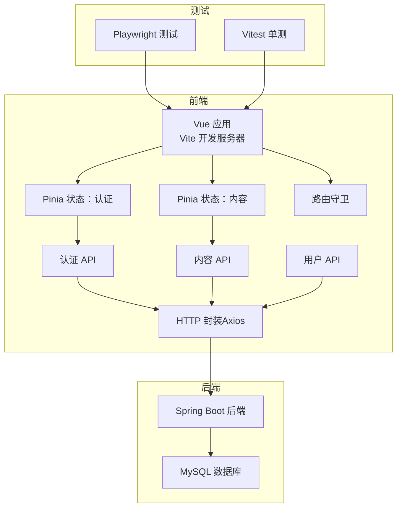
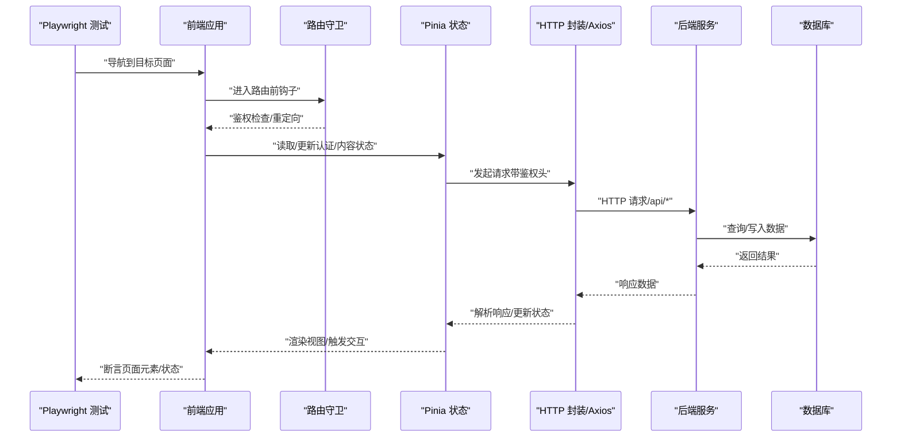
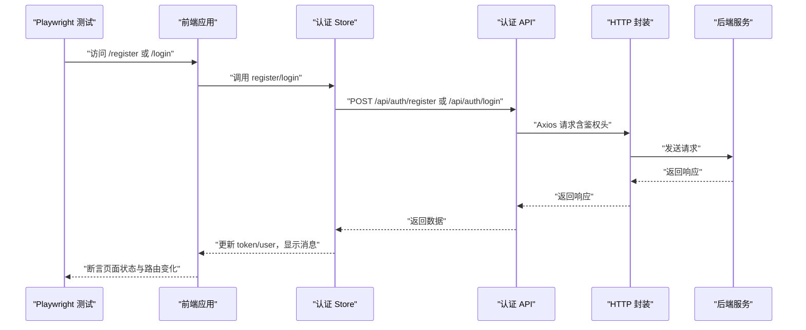
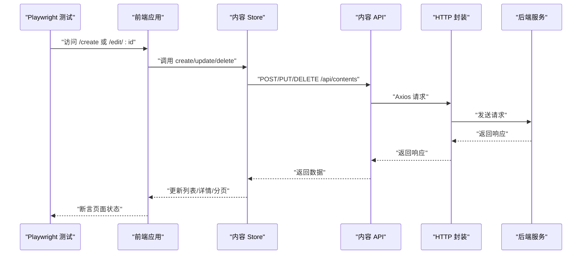
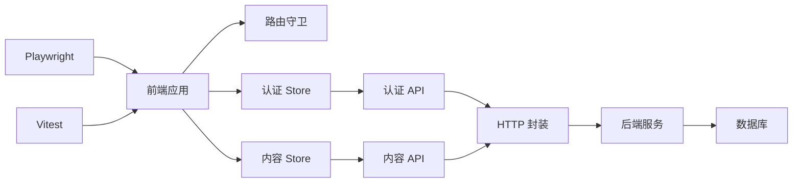

# 端到端测试

<cite>
**本文引用的文件**
- [playwright.config.ts](file://communication-frontend/playwright.config.ts)
- [package.json](file://communication-frontend/package.json)
- [vitest.config.ts](file://communication-frontend/vitest.config.ts)
- [README.md](file://README.md)
- [docker-compose.yml](file://docker-compose.yml)
- [auth.ts](file://communication-frontend/src/stores/auth.ts)
- [content.ts](file://communication-frontend/src/stores/content.ts)
- [http.ts](file://communication-frontend/src/api/http.ts)
- [auth.ts](file://communication-frontend/src/api/auth.ts)
- [content.ts](file://communication-frontend/src/api/content.ts)
- [user.ts](file://communication-frontend/src/api/user.ts)
- [index.ts](file://communication-frontend/src/router/index.ts)
- [auth.test.ts](file://communication-frontend/src/stores/__tests__/auth.test.ts)
</cite>

## 目录
1. [简介](#简介)
2. [项目结构](#项目结构)
3. [核心组件](#核心组件)
4. [架构总览](#架构总览)
5. [详细组件分析](#详细组件分析)
6. [依赖关系分析](#依赖关系分析)
7. [性能考虑](#性能考虑)
8. [故障排查指南](#故障排查指南)
9. [结论](#结论)
10. [附录](#附录)

## 简介
本文件面向通信平台的端到端测试，围绕基于 Playwright 的测试体系，系统梳理测试环境与配置、浏览器与项目设置、测试数据管理、异步与动态内容处理策略，并给出覆盖“用户注册—登录—内容发布—内容查看—内容编辑—内容删除—退出登录”的完整业务流程测试设计与脚本编写指南。同时提供测试报告生成、结果分析、维护与调试最佳实践，帮助团队在持续集成与日常开发中稳定保障用户体验。

## 项目结构
前端采用 Vue 3 + TypeScript + Vite 构建，使用 Pinia 管理状态，Axios 封装 HTTP 请求；Playwright 作为 E2E 测试框架，Vitest 提供单元测试能力。后端通过 Docker Compose 提供 API 服务与数据库，前端通过反向代理访问后端 API。

图表来源
- [playwright.config.ts](file://communication-frontend/playwright.config.ts#L1-L26)
- [package.json](file://communication-frontend/package.json#L1-L36)
- [vitest.config.ts](file://communication-frontend/vitest.config.ts#L1-L18)
- [auth.ts](file://communication-frontend/src/stores/auth.ts#L1-L96)
- [content.ts](file://communication-frontend/src/stores/content.ts#L1-L150)
- [http.ts](file://communication-frontend/src/api/http.ts#L1-L66)
- [auth.ts](file://communication-frontend/src/api/auth.ts#L1-L49)
- [content.ts](file://communication-frontend/src/api/content.ts#L1-L114)
- [user.ts](file://communication-frontend/src/api/user.ts#L1-L21)
- [index.ts](file://communication-frontend/src/router/index.ts#L1-L98)

章节来源
- [README.md](file://README.md#L1-L193)
- [docker-compose.yml](file://docker-compose.yml#L1-L60)

## 核心组件
- Playwright 配置与项目设置
  - 测试目录、并行执行、重试策略、工作进程、报告器、浏览器设备、Web 服务器启动命令与基地址。
- 前端状态与 API
  - 认证状态管理（Token、用户信息、登录/注册/登出/刷新）、内容状态管理（分页、加载、增删改查）、HTTP 拦截器（鉴权头、错误提示与跳转）。
- 路由守卫
  - 登录态校验、访客页面限制、未登录保护路由跳转。
- 单元测试基础
  - Vitest 环境、JS DOM 环境、Pinia 测试桩与 API Mock。

章节来源
- [playwright.config.ts](file://communication-frontend/playwright.config.ts#L1-L26)
- [auth.ts](file://communication-frontend/src/stores/auth.ts#L1-L96)
- [content.ts](file://communication-frontend/src/stores/content.ts#L1-L150)
- [http.ts](file://communication-frontend/src/api/http.ts#L1-L66)
- [index.ts](file://communication-frontend/src/router/index.ts#L1-L98)
- [vitest.config.ts](file://communication-frontend/vitest.config.ts#L1-L18)

## 架构总览
下图展示了 E2E 测试从 Playwright 到前端应用、状态管理、API 层以及后端服务的整体调用链路与数据流。

图表来源
- [playwright.config.ts](file://communication-frontend/playwright.config.ts#L1-L26)
- [index.ts](file://communication-frontend/src/router/index.ts#L76-L95)
- [auth.ts](file://communication-frontend/src/stores/auth.ts#L1-L96)
- [content.ts](file://communication-frontend/src/stores/content.ts#L1-L150)
- [http.ts](file://communication-frontend/src/api/http.ts#L1-L66)

## 详细组件分析

### Playwright 配置与测试环境
- 测试目录与并行：测试目录位于 e2e，启用完全并行以提升执行效率。
- CI 行为：CI 环境下启用重试与单工作进程，便于稳定回放与定位问题。
- 报告器：HTML 报告便于本地与 CI 中查看测试结果与截图/日志。
- 浏览器设备：默认 Chromium，可扩展其他设备类型。
- Web 服务器：通过 pnpm dev 启动前端开发服务器，基地址为 http://localhost:5173，自动复用已有服务避免重复启动。
- 调试追踪：首次重试时开启 trace，便于定位失败步骤。

章节来源
- [playwright.config.ts](file://communication-frontend/playwright.config.ts#L1-L26)
- [package.json](file://communication-frontend/package.json#L6-L14)

### 浏览器设置与项目配置
- 设备选择：桌面 Chrome，确保与生产环境一致的 UA 与渲染表现。
- 并行与重试：根据 CI/本地差异调整并发与重试次数，平衡速度与稳定性。
- 报告与追踪：HTML 报告与 trace 有助于快速复盘失败用例。

章节来源
- [playwright.config.ts](file://communication-frontend/playwright.config.ts#L14-L25)

### 测试数据管理
- 本地存储：认证 Token 与用户信息持久化于 localStorage，便于跨页面保持会话。
- 状态驱动：Pinia Store 统一管理认证与内容状态，减少对全局状态的直接依赖。
- API 层：统一的 HTTP 封装负责注入 Authorization 头、错误处理与消息提示，降低重复逻辑。

章节来源
- [auth.ts](file://communication-frontend/src/stores/auth.ts#L7-L24)
- [http.ts](file://communication-frontend/src/api/http.ts#L14-L25)
- [http.ts](file://communication-frontend/src/api/http.ts#L28-L63)

### 异步操作与动态内容加载
- 加载状态：Store 中普遍使用 loading 标志位，等待异步完成后再进行断言。
- 分页与滚动：内容分页与“加载更多”通过 pagination 控制，结合 append 模式追加内容，确保断言在完整数据集上进行。
- 路由守卫：在关键页面切换时，先进行鉴权检查，再渲染受保护内容，避免未授权状态下的误判。

章节来源
- [content.ts](file://communication-frontend/src/stores/content.ts#L18-L42)
- [content.ts](file://communication-frontend/src/stores/content.ts#L119-L122)
- [index.ts](file://communication-frontend/src/router/index.ts#L76-L95)

### 用户注册与登录流程（E2E）
- 注册流程
  - 打开注册页面，填写表单并提交，等待注册成功提示与本地存储更新，随后跳转首页。
  - 断言：表单校验、成功消息、localStorage 中 token 与 user 的存在、路由跳转。
- 登录流程
  - 打开登录页面，输入凭据并提交，等待登录成功提示与本地存储更新，随后跳转首页或原重定向地址。
  - 断言：成功消息、localStorage 中 token 与 user 的存在、路由跳转与页面标题更新。
- 会话失效与自动登出
  - 当后端返回 401 时，HTTP 拦截器清除本地存储并跳转登录页，E2E 中应验证该行为。

图表来源
- [auth.ts](file://communication-frontend/src/stores/auth.ts#L13-L57)
- [auth.ts](file://communication-frontend/src/api/auth.ts#L36-L47)
- [http.ts](file://communication-frontend/src/api/http.ts#L14-L25)
- [http.ts](file://communication-frontend/src/api/http.ts#L28-L63)

章节来源
- [auth.ts](file://communication-frontend/src/stores/auth.ts#L1-L96)
- [auth.ts](file://communication-frontend/src/api/auth.ts#L1-L49)
- [http.ts](file://communication-frontend/src/api/http.ts#L1-L66)

### 内容发布与管理流程（E2E）
- 发布内容
  - 进入“新建内容”页面，填写标题/正文/媒体类型/标签，提交后等待成功消息与列表首条插入。
  - 断言：成功消息、列表新增、详情页可见性。
- 查看内容
  - 通过内容 ID 访问详情页，断言标题、作者、媒体类型与内容体。
- 编辑内容
  - 进入“编辑内容”页面，修改字段并提交，断言列表与详情页同步更新。
- 删除内容
  - 触发删除操作，断言列表移除与详情页清空。

图表来源
- [content.ts](file://communication-frontend/src/stores/content.ts#L58-L117)
- [content.ts](file://communication-frontend/src/api/content.ts#L86-L96)
- [http.ts](file://communication-frontend/src/api/http.ts#L14-L25)

章节来源
- [content.ts](file://communication-frontend/src/stores/content.ts#L1-L150)
- [content.ts](file://communication-frontend/src/api/content.ts#L1-L114)

### 用户资料与订阅（E2E）
- 用户资料
  - 通过用户名或 ID 查询用户信息，断言头像、简介、创建时间等字段。
- 订阅管理
  - 访问订阅页面，断言关注/取消关注按钮状态与动态流变化。

章节来源
- [user.ts](file://communication-frontend/src/api/user.ts#L1-L21)
- [index.ts](file://communication-frontend/src/router/index.ts#L38-L47)

### 测试用例设计与脚本编写指南
- 用例结构
  - 准备：访问页面、等待加载、准备测试数据（如已注册账号）。
  - 执行：填写表单、点击按钮、等待异步完成（loading 结束）。
  - 断言：元素可见性、文本、URL、状态存储、API 响应。
- 断言策略
  - 使用页面对象模式封装常用交互与断言，提高可维护性。
  - 对异步操作使用显式等待（如 loading 结束、元素出现）。
- 数据准备
  - 使用后端 API 或数据库初始化脚本预置测试数据，避免依赖外部服务。
- 错误场景
  - 注册/登录失败（重复用户名、错误凭据）、权限不足、网络异常等，断言错误消息与路由行为。

### 测试报告生成与结果分析
- HTML 报告：Playwright 输出 HTML 报告，包含截图、视频与日志，便于 CI 回放与人工复核。
- 结果分析：结合 trace 与日志定位失败步骤，优先修复稳定性问题（超时、竞态）。

章节来源
- [playwright.config.ts](file://communication-frontend/playwright.config.ts#L9-L13)

### 处理异步与动态内容的挑战
- 显式等待：在关键交互后等待 loading 结束或元素出现，避免过早断言。
- 分页与滚动：使用“加载更多”接口与 append 模式，确保断言在完整数据集上进行。
- 路由守卫：在受保护页面切换时，先进行鉴权检查，再断言页面内容。

章节来源
- [content.ts](file://communication-frontend/src/stores/content.ts#L18-L42)
- [content.ts](file://communication-frontend/src/stores/content.ts#L119-L122)
- [index.ts](file://communication-frontend/src/router/index.ts#L76-L95)

### 测试维护与调试最佳实践
- 配置分离：区分本地与 CI 环境的重试与并发策略。
- 稳定性优先：优先保证用例的稳定性，再追求覆盖率。
- 截图与日志：在关键步骤截图与记录日志，便于回溯。
- 组件化：将常用交互封装为可复用函数，减少重复代码。
- 单元测试配合：通过 Vitest 与 Pinia Mock 验证状态逻辑，E2E 专注端到端行为。

章节来源
- [playwright.config.ts](file://communication-frontend/playwright.config.ts#L5-L8)
- [vitest.config.ts](file://communication-frontend/vitest.config.ts#L7-L11)
- [auth.test.ts](file://communication-frontend/src/stores/__tests__/auth.test.ts#L1-L183)

## 依赖关系分析
- 前端依赖
  - Playwright 用于 E2E 测试，Vitest 用于单元测试，Vite 提供开发与构建。
- 状态与 API
  - 认证与内容 Store 依赖对应 API 模块；API 模块依赖 HTTP 封装；HTTP 封装依赖 Axios。
- 路由与鉴权
  - 路由守卫依赖认证 Store，实现登录态控制与页面保护。
- 后端与数据库
  - Docker Compose 提供后端与数据库容器，前端通过 /api 前缀访问后端接口。

图表来源
- [playwright.config.ts](file://communication-frontend/playwright.config.ts#L1-L26)
- [vitest.config.ts](file://communication-frontend/vitest.config.ts#L1-L18)
- [index.ts](file://communication-frontend/src/router/index.ts#L1-L98)
- [auth.ts](file://communication-frontend/src/stores/auth.ts#L1-L96)
- [content.ts](file://communication-frontend/src/stores/content.ts#L1-L150)
- [http.ts](file://communication-frontend/src/api/http.ts#L1-L66)

章节来源
- [package.json](file://communication-frontend/package.json#L23-L34)
- [docker-compose.yml](file://docker-compose.yml#L25-L56)

## 性能考虑
- 并行执行：在本地启用并行以提升速度，CI 环境适度降并发以保证稳定性。
- 重试策略：CI 环境启用重试，减少偶发失败影响。
- 服务器复用：开发服务器复用避免重复启动带来的额外开销。
- 断言粒度：合理拆分用例，避免单个用例过长导致失败定位困难。

章节来源
- [playwright.config.ts](file://communication-frontend/playwright.config.ts#L5-L8)
- [playwright.config.ts](file://communication-frontend/playwright.config.ts#L20-L24)

## 故障排查指南
- 401 会话过期
  - 现象：页面跳转至登录页并弹出“会话过期，请重新登录”提示。
  - 排查：确认 HTTP 拦截器是否正确清除本地存储并跳转；E2E 中验证路由与消息提示。
- 403 权限不足
  - 现象：弹出“您没有权限执行此操作”的提示。
  - 排查：确认当前用户角色与目标资源权限；在 E2E 中断言错误消息与页面行为。
- 404 资源不存在
  - 现象：弹出“资源不存在”的提示。
  - 排查：确认请求路径与参数；在 E2E 中断言错误消息与页面状态。
- 网络错误
  - 现象：弹出“网络错误，请检查连接”的提示。
  - 排查：确认后端服务与数据库健康状态；在 E2E 中验证服务可用性与重试策略。

章节来源
- [http.ts](file://communication-frontend/src/api/http.ts#L28-L63)

## 结论
通过将 Playwright 的端到端测试与前端状态管理、API 封装、路由守卫相结合，可以系统性地覆盖用户注册—登录—内容发布—内容查看—内容编辑—内容删除—退出登录等关键业务流程。借助明确的异步处理策略、稳定的配置与报告机制，以及完善的故障排查与维护实践，能够有效保障通信平台在持续迭代中的用户体验与质量。

## 附录
- 快速开始
  - 启动后端与数据库：使用 Docker Compose 启动后端与数据库容器。
  - 启动前端：在前端目录执行开发服务器命令，确保前端可访问。
  - 运行 E2E：在前端目录执行 Playwright 测试命令，生成 HTML 报告。
- API 参考
  - 认证：注册、登录、获取当前用户。
  - 内容：分页获取、详情获取、创建、更新、删除、上传媒体。
  - 用户：按用户名/ID 查询用户信息。
- 单元测试参考
  - 使用 Vitest 与 Pinia Mock 验证认证 Store 的状态逻辑与错误处理。

章节来源
- [README.md](file://README.md#L40-L98)
- [docker-compose.yml](file://docker-compose.yml#L1-L60)
- [auth.ts](file://communication-frontend/src/api/auth.ts#L36-L47)
- [content.ts](file://communication-frontend/src/api/content.ts#L64-L112)
- [user.ts](file://communication-frontend/src/api/user.ts#L12-L20)
- [auth.test.ts](file://communication-frontend/src/stores/__tests__/auth.test.ts#L1-L183)