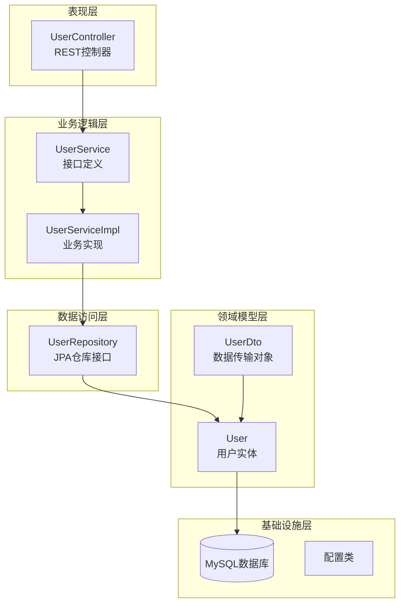
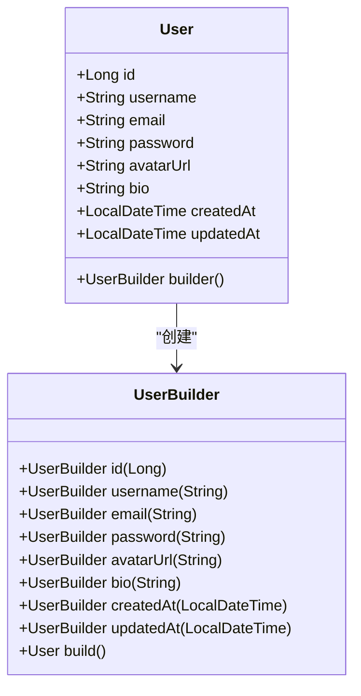
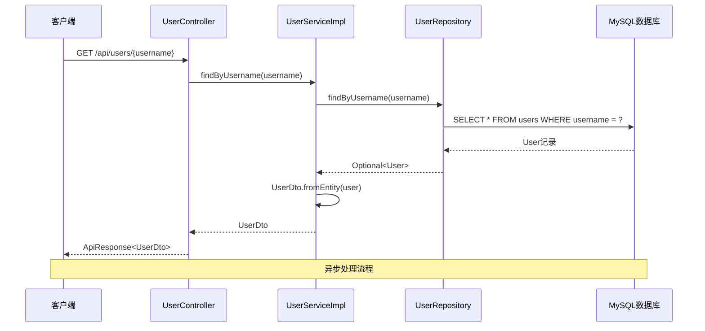
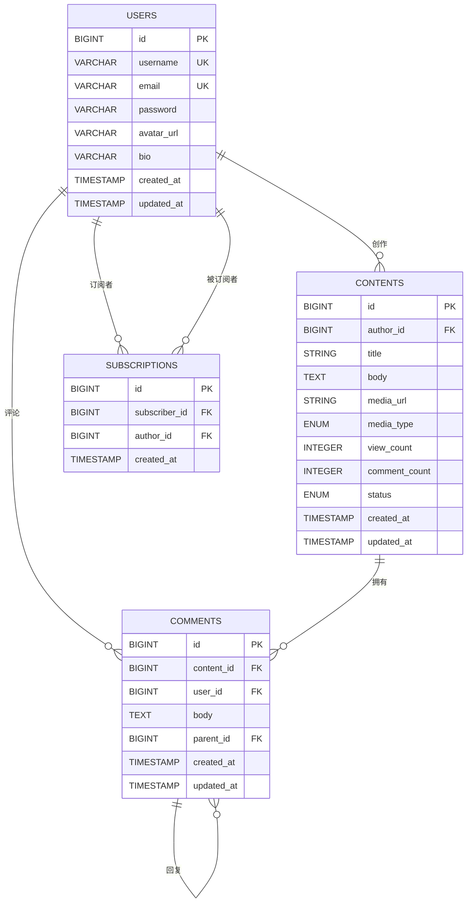
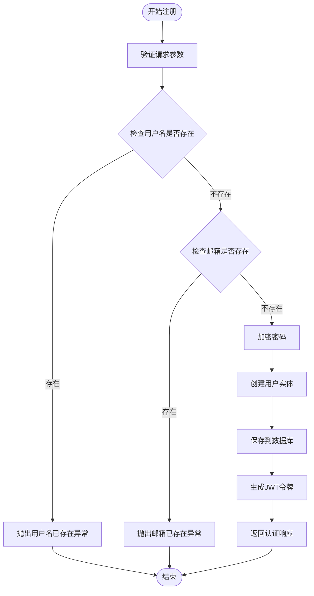
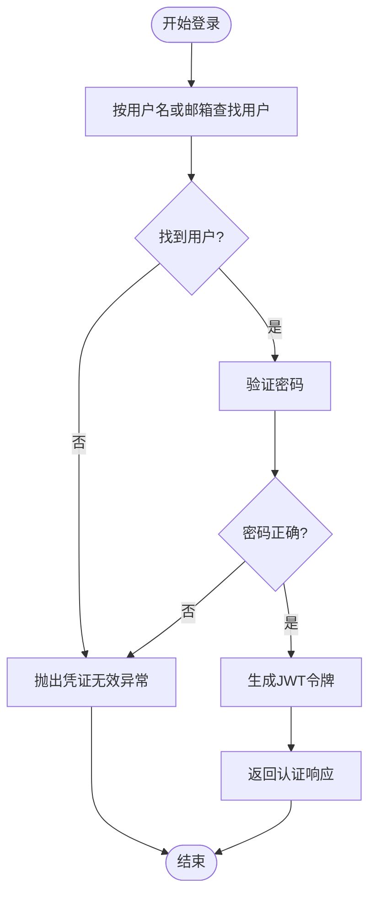
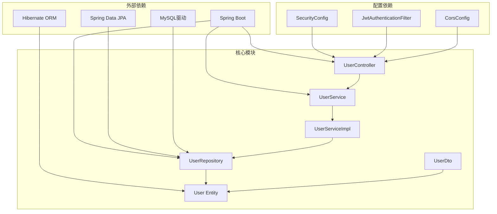

# 用户实体模型

<cite>
**本文档引用的文件**
- [User.java](file://communication-backend/src/main/java/com/communication/entity/User.java)
- [UserDto.java](file://communication-backend/src/main/java/com/communication/dto/UserDto.java)
- [UserRepository.java](file://communication-backend/src/main/java/com/communication/repository/UserRepository.java)
- [UserService.java](file://communication-backend/src/main/java/com/communication/service/UserService.java)
- [UserServiceImpl.java](file://communication-backend/src/main/java/com/communication/service/impl/UserServiceImpl.java)
- [UserController.java](file://communication-backend/src/main/java/com/communication/controller/UserController.java)
- [Content.java](file://communication-backend/src/main/java/com/communication/entity/Content.java)
- [Comment.java](file://communication-backend/src/main/java/com/communication/entity/Comment.java)
- [Subscription.java](file://communication-backend/src/main/java/com/communication/entity/Subscription.java)
- [V1__init_users.sql](file://communication-backend/src/main/resources/db/migration/V1__init_users.sql)
- [ContentStatus.java](file://communication-backend/src/main/java/com/communication/entity/ContentStatus.java)
- [MediaType.java](file://communication-backend/src/main/java/com/communication/entity/MediaType.java)
- [RegisterRequest.java](file://communication-backend/src/main/java/com/communication/dto/RegisterRequest.java)
- [LoginRequest.java](file://communication-backend/src/main/java/com/communication/dto/LoginRequest.java)
</cite>

## 目录
1. [简介](#简介)
2. [项目结构](#项目结构)
3. [核心组件](#核心组件)
4. [架构概览](#架构概览)
5. [详细组件分析](#详细组件分析)
6. [依赖关系分析](#依赖关系分析)
7. [性能考虑](#性能考虑)
8. [故障排除指南](#故障排除指南)
9. [结论](#结论)

## 简介

本文档为通信平台的用户实体模型提供了全面的技术文档。该系统采用Spring Boot + JPA + MySQL技术栈构建，实现了完整的用户管理功能，包括用户注册、登录认证、个人资料管理等核心业务场景。用户实体作为整个系统的核心数据模型，承载着用户身份信息、社交关系和内容创作能力等关键业务数据。

系统设计遵循分层架构原则，通过清晰的职责分离实现了高内聚低耦合的代码组织结构。用户相关的所有操作都通过标准的REST API接口提供，支持前后端分离的开发模式。

## 项目结构

基于MVC架构模式，项目采用分层组织方式：



**图表来源**
- [UserController.java](file://communication-backend/src/main/java/com/communication/controller/UserController.java#L1-L26)
- [UserService.java](file://communication-backend/src/main/java/com/communication/service/UserService.java#L1-L20)
- [UserServiceImpl.java](file://communication-backend/src/main/java/com/communication/service/impl/UserServiceImpl.java#L1-L86)
- [UserRepository.java](file://communication-backend/src/main/java/com/communication/repository/UserRepository.java#L1-L27)

**章节来源**
- [User.java](file://communication-backend/src/main/java/com/communication/entity/User.java#L1-L96)
- [UserDto.java](file://communication-backend/src/main/java/com/communication/dto/UserDto.java#L1-L72)
- [UserRepository.java](file://communication-backend/src/main/java/com/communication/repository/UserRepository.java#L1-L27)

## 核心组件

### 用户实体模型

用户实体是系统的核心数据模型，采用JPA注解进行ORM映射，定义了完整的用户信息存储结构。

#### 字段定义与约束

| 字段名 | 数据类型 | 约束条件 | 描述 | 业务含义 |
|--------|----------|----------|------|----------|
| id | BIGINT | 主键, 自增 | 用户唯一标识符 | 系统内部用户识别码 |
| username | VARCHAR(50) | 非空, 唯一 | 用户名 | 登录标识, 显示名称 |
| email | VARCHAR(100) | 非空, 唯一 | 邮箱地址 | 账户绑定, 通知接收 |
| password | VARCHAR(255) | 非空 | 密码哈希值 | 认证凭据 |
| avatar_url | VARCHAR(500) | 可空 | 头像URL | 用户头像展示 |
| bio | VARCHAR(500) | 可空 | 个人简介 | 用户自我介绍 |
| created_at | TIMESTAMP | 非空, 默认值 | 创建时间 | 账户创建时间 |
| updated_at | TIMESTAMP | 非空, 默认值 | 更新时间 | 最后修改时间 |

#### 时间戳管理

系统使用Hibernate提供的自动时间戳注解：
- `@CreationTimestamp`: 自动设置创建时间，不可更新
- `@UpdateTimestamp`: 自动跟踪最后更新时间

#### 构建器模式

实现了完整的Builder模式，支持链式调用和灵活的对象创建：



**图表来源**
- [User.java](file://communication-backend/src/main/java/com/communication/entity/User.java#L72-L95)

**章节来源**
- [User.java](file://communication-backend/src/main/java/com/communication/entity/User.java#L1-L96)

### 数据传输对象

UserDto作为数据传输对象，负责在不同层之间传递用户信息，实现了数据封装和转换功能。

#### DTO字段映射

| DTO字段 | 实体字段 | 序列化规则 | 验证规则 |
|---------|----------|------------|----------|
| id | id | JSON序列化 | 无 |
| username | username | JSON序列化 | 无 |
| email | email | JSON序列化 | 无 |
| avatarUrl | avatarUrl | JSON序列化 | 无 |
| bio | bio | JSON序列化 | 无 |
| createdAt | createdAt | ISO格式 | 无 |

#### 转换机制

提供了从实体到DTO的转换方法，确保数据在不同层之间的正确传递。

**章节来源**
- [UserDto.java](file://communication-backend/src/main/java/com/communication/dto/UserDto.java#L1-L72)

### 数据访问接口

UserRepository继承Spring Data JPA的JpaRepository，提供了丰富的数据访问方法。

#### 查询方法

| 方法签名 | 功能描述 | SQL语句 |
|----------|----------|---------|
| findByUsername(String username) | 按用户名查找用户 | SELECT * FROM users WHERE username = ? |
| findByEmail(String email) | 按邮箱查找用户 | SELECT * FROM users WHERE email = ? |
| existsByUsername(String username) | 检查用户名是否存在 | SELECT EXISTS(SELECT 1 FROM users WHERE username = ?) |
| existsByEmail(String email) | 检查邮箱是否存在 | SELECT EXISTS(SELECT 1 FROM users WHERE email = ?) |
| searchByUsername(@Param("keyword") String keyword, Pageable pageable) | 模糊搜索用户 | SELECT * FROM users WHERE LOWER(username) LIKE LOWER(CONCAT('%', ?, '%')) |

#### 自定义查询

使用JPQL实现模糊搜索功能，支持大小写不敏感的用户名匹配。

**章节来源**
- [UserRepository.java](file://communication-backend/src/main/java/com/communication/repository/UserRepository.java#L1-L27)

## 架构概览

系统采用经典的三层架构模式，各层职责明确，耦合度低。



**图表来源**
- [UserController.java](file://communication-backend/src/main/java/com/communication/controller/UserController.java#L20-L24)
- [UserServiceImpl.java](file://communication-backend/src/main/java/com/communication/service/impl/UserServiceImpl.java#L70-L74)
- [UserRepository.java](file://communication-backend/src/main/java/com/communication/repository/UserRepository.java#L16-L18)

**章节来源**
- [UserController.java](file://communication-backend/src/main/java/com/communication/controller/UserController.java#L1-L26)
- [UserServiceImpl.java](file://communication-backend/src/main/java/com/communication/service/impl/UserServiceImpl.java#L1-L86)

## 详细组件分析

### 用户实体关系映射

用户实体与多个实体存在复杂的关联关系，体现了完整的社交网络功能。



**图表来源**
- [User.java](file://communication-backend/src/main/java/com/communication/entity/User.java#L1-L96)
- [Content.java](file://communication-backend/src/main/java/com/communication/entity/Content.java#L1-L135)
- [Comment.java](file://communication-backend/src/main/java/com/communication/entity/Comment.java#L1-L109)
- [Subscription.java](file://communication-backend/src/main/java/com/communication/entity/Subscription.java#L1-L67)

#### 内容关联关系

用户与内容之间是一对多的关系，一个用户可以创作多篇文章：

- **作者关系**: Content.author -> User
- **级联操作**: CASCADE.ALL, orphanRemoval = true
- **延迟加载**: FetchType.LAZY

#### 评论关联关系

用户与评论之间同样是一对多关系，支持嵌套评论结构：

- **用户关系**: Comment.user -> User
- **内容关系**: Comment.content -> Content  
- **父子关系**: Comment.parent -> Comment (自关联)
- **回复关系**: Comment.replies -> List<Comment>

#### 订阅关联关系

用户与订阅之间是多对多关系的中间表实现：

- **订阅者**: Subscription.subscriber -> User
- **被订阅者**: Subscription.author -> User
- **复合唯一约束**: subscriber_id + author_id

**章节来源**
- [Content.java](file://communication-backend/src/main/java/com/communication/entity/Content.java#L19-L21)
- [Comment.java](file://communication-backend/src/main/java/com/communication/entity/Comment.java#L17-L23)
- [Subscription.java](file://communication-backend/src/main/java/com/communication/entity/Subscription.java#L15-L21)

### 业务服务层实现

UserService接口定义了用户管理的核心业务方法，UserServiceImpl提供了完整的实现。

#### 注册流程



**图表来源**
- [UserServiceImpl.java](file://communication-backend/src/main/java/com/communication/service/impl/UserServiceImpl.java#L30-L48)

#### 登录流程



**图表来源**
- [UserServiceImpl.java](file://communication-backend/src/main/java/com/communication/service/impl/UserServiceImpl.java#L50-L62)

**章节来源**
- [UserService.java](file://communication-backend/src/main/java/com/communication/service/UserService.java#L1-L20)
- [UserServiceImpl.java](file://communication-backend/src/main/java/com/communication/service/impl/UserServiceImpl.java#L1-L86)

### 数据验证规则

系统在多个层面实现了数据验证，确保数据的完整性和一致性。

#### 请求参数验证

**注册请求验证规则**:

| 字段 | 验证规则 | 错误消息 |
|------|----------|----------|
| username | @NotBlank, @Size(3,50) | 用户名必须为3-50字符 |
| email | @NotBlank, @Email | 邮箱格式无效 |
| password | @NotBlank, @Size(6,100) | 密码必须为6-100字符 |

**登录请求验证规则**:

| 字段 | 验证规则 | 错误消息 |
|------|----------|----------|
| usernameOrEmail | @NotBlank | 用户名或邮箱不能为空 |
| password | @NotBlank | 密码不能为空 |

**章节来源**
- [RegisterRequest.java](file://communication-backend/src/main/java/com/communication/dto/RegisterRequest.java#L1-L30)
- [LoginRequest.java](file://communication-backend/src/main/java/com/communication/dto/LoginRequest.java#L1-L20)

## 依赖关系分析

系统采用松耦合的设计，通过接口抽象实现依赖注入。



**图表来源**
- [UserServiceImpl.java](file://communication-backend/src/main/java/com/communication/service/impl/UserServiceImpl.java#L1-L26)
- [UserController.java](file://communication-backend/src/main/java/com/communication/controller/UserController.java#L1-L26)

### 关键依赖关系

1. **控制反转**: 通过构造函数注入实现依赖注入
2. **接口隔离**: 使用接口定义抽象，降低实现耦合
3. **事务管理**: 在业务层使用@Transactional注解管理事务
4. **异常处理**: 统一的异常处理机制

**章节来源**
- [UserServiceImpl.java](file://communication-backend/src/main/java/com/communication/service/impl/UserServiceImpl.java#L22-L26)
- [UserController.java](file://communication-backend/src/main/java/com/communication/controller/UserController.java#L14-L18)

## 性能考虑

### 数据库优化策略

#### 索引设计

基于迁移脚本分析，系统建立了以下索引：

```sql
-- 用户表索引
INDEX idx_username (username)  -- 支持用户名快速查找
INDEX idx_email (email)        -- 支持邮箱快速查找
```

#### 查询优化建议

1. **懒加载策略**: 对于一对多关系使用FetchType.LAZY避免N+1问题
2. **批量查询**: 对于列表查询使用Pageable进行分页
3. **连接优化**: 合理使用JOIN减少查询次数
4. **缓存策略**: 对于频繁读取的用户信息考虑Redis缓存

### 缓存策略

建议实现多级缓存：

1. **应用层缓存**: 使用ConcurrentHashMap缓存热点用户数据
2. **分布式缓存**: 使用Redis缓存用户会话信息
3. **数据库缓存**: 利用MySQL查询缓存机制

### 并发控制

1. **乐观锁**: 对于需要并发更新的场景使用版本号控制
2. **限流策略**: 对注册、登录等高频操作实施限流
3. **重试机制**: 对于临时性错误实施指数退避重试

## 故障排除指南

### 常见问题及解决方案

#### 用户名重复错误

**症状**: 注册时抛出"用户名已存在"异常
**原因**: 数据库唯一约束冲突
**解决方案**: 
- 在注册前先检查用户名是否存在
- 提供实时用户名可用性检测

#### 邮箱重复错误

**症状**: 注册时抛出"邮箱已存在"异常
**原因**: 邮箱字段唯一性约束
**解决方案**:
- 实现邮箱唯一性验证
- 提供邮箱格式验证

#### 凭证验证失败

**症状**: 登录时抛出"凭证无效"异常
**原因**: 用户名/邮箱不存在或密码错误
**解决方案**:
- 提供详细的错误提示
- 实施账户锁定机制防止暴力破解

#### 数据库连接问题

**症状**: 数据库操作超时或连接失败
**原因**: 连接池配置不当或数据库负载过高
**解决方案**:
- 调整连接池大小和超时设置
- 实施数据库连接监控
- 优化慢查询SQL

**章节来源**
- [UserServiceImpl.java](file://communication-backend/src/main/java/com/communication/service/impl/UserServiceImpl.java#L31-L36)
- [UserServiceImpl.java](file://communication-backend/src/main/java/com/communication/service/impl/UserServiceImpl.java#L52-L58)

## 结论

用户实体模型设计充分体现了现代Web应用的需求，通过合理的数据结构设计、完善的业务逻辑实现和良好的扩展性考虑，为整个通信平台奠定了坚实的基础。

### 设计亮点

1. **清晰的职责分离**: 分层架构确保了代码的可维护性和可测试性
2. **完整的数据验证**: 多层次的数据验证保证了数据质量
3. **灵活的扩展性**: 接口抽象和依赖注入为功能扩展提供了便利
4. **性能优化考虑**: 懒加载、索引设计等优化策略提升了系统性能

### 改进建议

1. **增加审计日志**: 记录用户关键操作便于追踪
2. **实现软删除**: 对重要数据采用软删除保护
3. **增强安全防护**: 添加更多安全防护措施如CSRF保护
4. **完善监控告警**: 建立完整的系统监控和告警机制

该用户实体模型为后续的功能扩展和系统演进提供了良好的基础，通过持续的优化和完善，能够满足不断增长的业务需求。