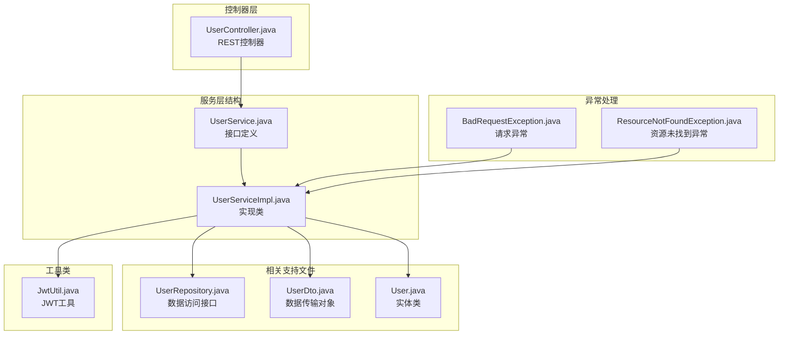
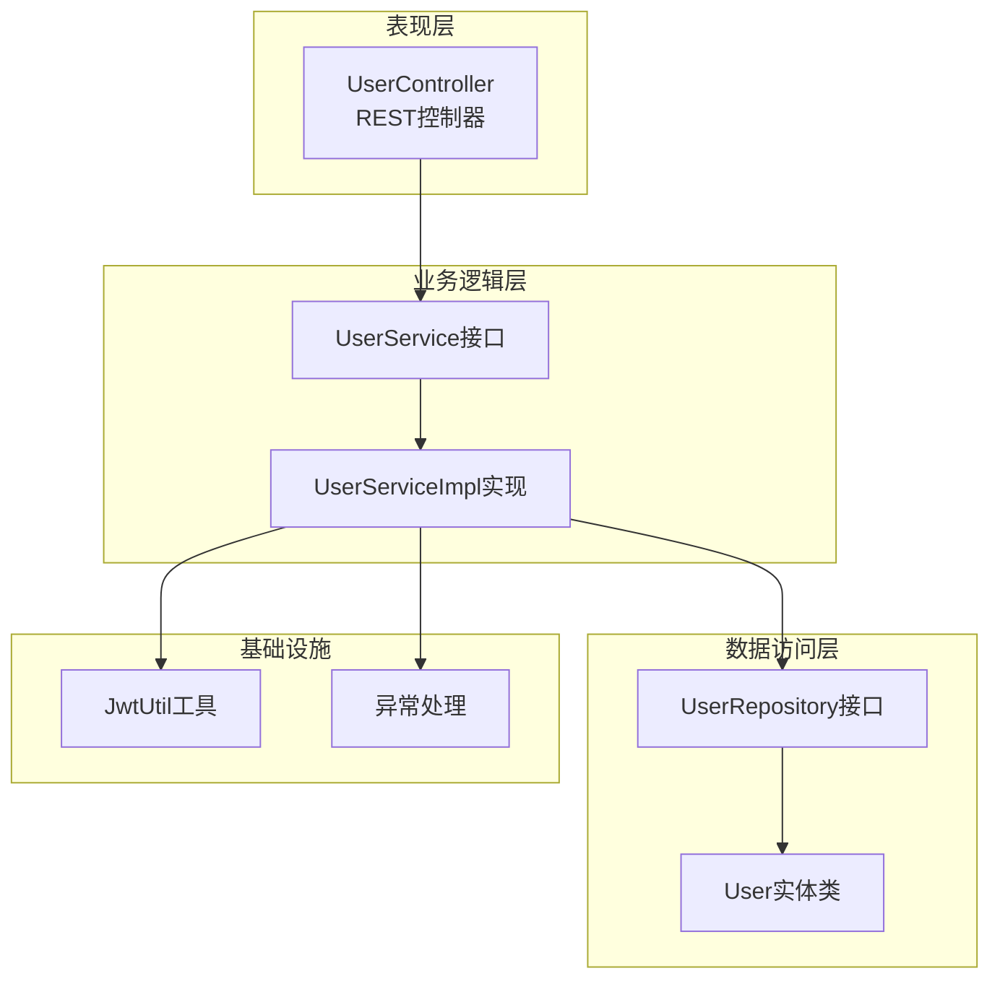
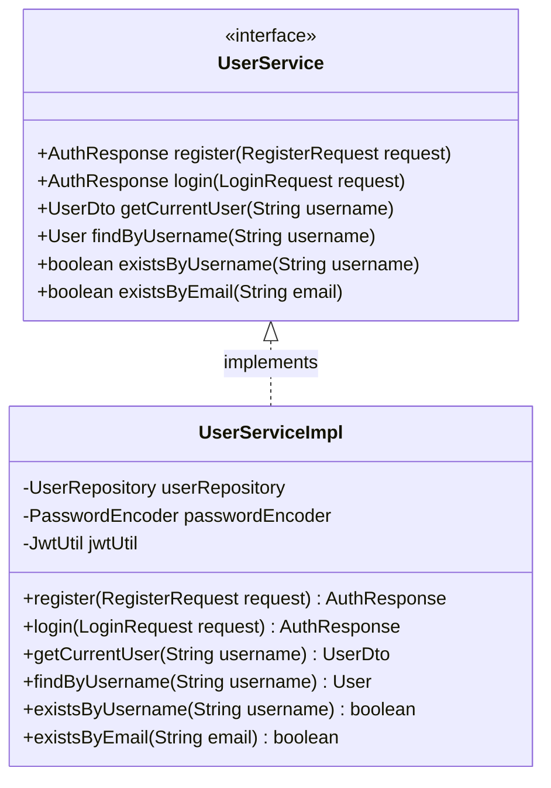
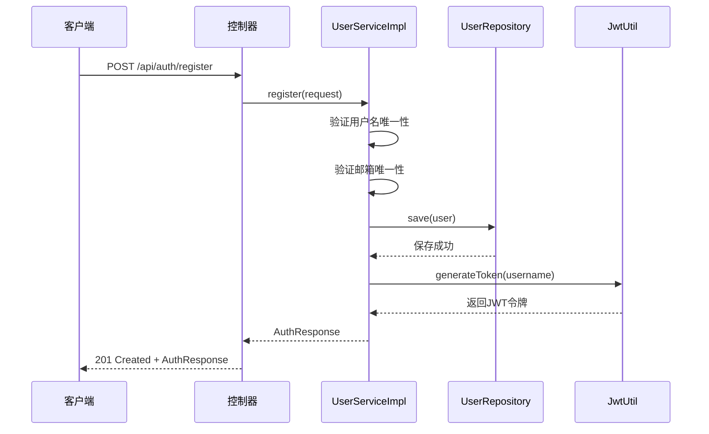
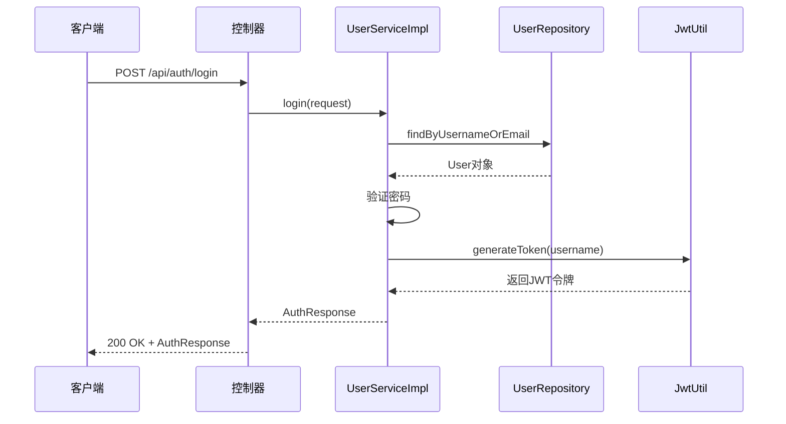
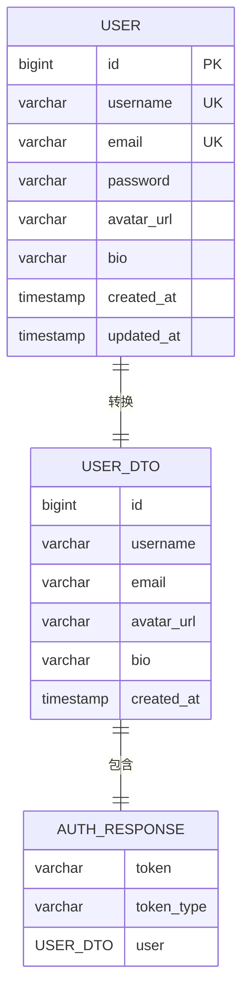
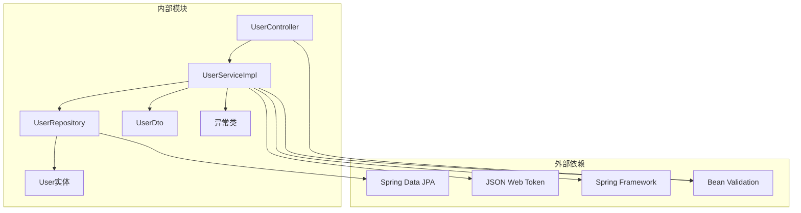

# 用户服务层

<cite>
**本文档引用的文件**
- [UserService.java](file://communication-backend/src/main/java/com/communication/service/UserService.java)
- [UserServiceImpl.java](file://communication-backend/src/main/java/com/communication/service/impl/UserServiceImpl.java)
- [UserController.java](file://communication-backend/src/main/java/com/communication/controller/UserController.java)
- [UserRepository.java](file://communication-backend/src/main/java/com/communication/repository/UserRepository.java)
- [UserDto.java](file://communication-backend/src/main/java/com/communication/dto/UserDto.java)
- [RegisterRequest.java](file://communication-backend/src/main/java/com/communication/dto/RegisterRequest.java)
- [LoginRequest.java](file://communication-backend/src/main/java/com/communication/dto/LoginRequest.java)
- [AuthResponse.java](file://communication-backend/src/main/java/com/communication/dto/AuthResponse.java)
- [BadRequestException.java](file://communication-backend/src/main/java/com/communication/exception/BadRequestException.java)
- [ResourceNotFoundException.java](file://communication-backend/src/main/java/com/communication/exception/ResourceNotFoundException.java)
- [JwtUtil.java](file://communication-backend/src/main/java/com/communication/util/JwtUtil.java)
- [User.java](file://communication-backend/src/main/java/com/communication/entity/User.java)
- [UserServiceTest.java](file://communication-backend/src/test/java/com/communication/service/UserServiceTest.java)
</cite>

## 目录
1. [简介](#简介)
2. [项目结构](#项目结构)
3. [核心组件](#核心组件)
4. [架构概览](#架构概览)
5. [详细组件分析](#详细组件分析)
6. [依赖关系分析](#依赖关系分析)
7. [性能考虑](#性能考虑)
8. [故障排除指南](#故障排除指南)
9. [结论](#结论)

## 简介

用户服务层是通信平台后端系统的核心业务逻辑层，负责处理用户相关的业务操作。该层实现了完整的用户生命周期管理，包括用户注册、登录认证、信息查询等功能。通过清晰的分层架构设计，用户服务层有效地隔离了业务逻辑与数据访问层，提供了稳定的服务接口供控制器层调用。

本服务层采用Spring框架的标准架构模式，结合JWT令牌认证机制，为整个应用提供了安全可靠的用户身份管理功能。

## 项目结构

用户服务层位于`communication-backend/src/main/java/com/communication/service`目录下，主要包含以下文件结构：

**图表来源**
- [UserService.java](file://communication-backend/src/main/java/com/communication/service/UserService.java#L1-L20)
- [UserServiceImpl.java](file://communication-backend/src/main/java/com/communication/service/impl/UserServiceImpl.java#L1-L86)
- [UserRepository.java](file://communication-backend/src/main/java/com/communication/repository/UserRepository.java#L1-L27)

**章节来源**
- [UserService.java](file://communication-backend/src/main/java/com/communication/service/UserService.java#L1-L20)
- [UserServiceImpl.java](file://communication-backend/src/main/java/com/communication/service/impl/UserServiceImpl.java#L1-L86)

## 核心组件

用户服务层由多个核心组件构成，每个组件都有明确的职责分工：

### 接口层组件

**UserService接口**：定义了用户服务的所有公共方法，包括注册、登录、用户查询等核心功能。

**UserController控制器**：作为服务层的入口点，接收HTTP请求并调用相应的服务方法。

### 实现层组件

**UserServiceImpl类**：实现了UserService接口的所有方法，包含了完整的业务逻辑处理。

### 数据传输层组件

**UserDto数据传输对象**：封装了用户信息的传输格式，提供了从实体类到DTO的转换方法。

**RegisterRequest和LoginRequest**：分别定义了用户注册和登录时的请求参数规范。

### 支持组件

**JwtUtil工具类**：提供了JWT令牌的生成和验证功能。

**异常处理类**：包括BadRequestException和ResourceNotFoundException，用于处理各种业务异常情况。

**章节来源**
- [UserService.java](file://communication-backend/src/main/java/com/communication/service/UserService.java#L6-L19)
- [UserServiceImpl.java](file://communication-backend/src/main/java/com/communication/service/impl/UserServiceImpl.java#L15-L26)
- [UserDto.java](file://communication-backend/src/main/java/com/communication/dto/UserDto.java#L7-L48)

## 架构概览

用户服务层采用了经典的三层架构模式，各层之间职责清晰，耦合度低：

**图表来源**
- [UserController.java](file://communication-backend/src/main/java/com/communication/controller/UserController.java#L10-L25)
- [UserService.java](file://communication-backend/src/main/java/com/communication/service/UserService.java#L6-L19)
- [UserServiceImpl.java](file://communication-backend/src/main/java/com/communication/service/impl/UserServiceImpl.java#L15-L26)

### 控制器交互模式

控制器层通过依赖注入的方式获取UserService实例，然后根据HTTP请求调用相应的方法。这种设计确保了控制器只负责请求处理和响应封装，不包含任何业务逻辑。

### 服务层内部交互

UserServiceImpl类内部协调多个组件的工作：验证输入参数、调用数据访问层、生成JWT令牌、处理异常等。所有这些操作都在事务性上下文中执行，确保数据的一致性和完整性。

**章节来源**
- [UserController.java](file://communication-backend/src/main/java/com/communication/controller/UserController.java#L14-L24)
- [UserServiceImpl.java](file://communication-backend/src/main/java/com/communication/service/impl/UserServiceImpl.java#L22-L26)

## 详细组件分析

### UserService接口设计

UserService接口定义了用户服务的核心功能，采用简洁明了的方法签名设计：

**图表来源**
- [UserService.java](file://communication-backend/src/main/java/com/communication/service/UserService.java#L6-L19)
- [UserServiceImpl.java](file://communication-backend/src/main/java/com/communication/service/impl/UserServiceImpl.java#L16-L85)

#### 方法规范详解

**register方法**
- 参数：RegisterRequest对象，包含用户名、邮箱、密码信息
- 返回值：AuthResponse对象，包含JWT令牌和用户信息
- 业务逻辑：验证用户唯一性、加密密码、保存用户、生成令牌

**login方法**
- 参数：LoginRequest对象，包含用户名或邮箱、密码信息
- 返回值：AuthResponse对象，包含JWT令牌和用户信息
- 业务逻辑：查找用户、验证凭据、生成令牌

**getCurrentUser方法**
- 参数：用户名字符串
- 返回值：UserDto对象
- 业务逻辑：查询用户并转换为DTO格式

**findByUsername方法**
- 参数：用户名字符串
- 返回值：User实体对象
- 业务逻辑：根据用户名查询用户，不存在时抛出ResourceNotFoundException

**existsByUsername和existsByEmail方法**
- 参数：用户名或邮箱字符串
- 返回值：布尔值
- 业务逻辑：检查用户是否存在

**章节来源**
- [UserService.java](file://communication-backend/src/main/java/com/communication/service/UserService.java#L8-L18)

### UserServiceImpl实现分析

UserServiceImpl类提供了UserService接口的完整实现，包含了复杂的业务逻辑处理：

#### 注册流程实现

**图表来源**
- [UserServiceImpl.java](file://communication-backend/src/main/java/com/communication/service/impl/UserServiceImpl.java#L28-L48)
- [UserRepository.java](file://communication-backend/src/main/java/com/communication/repository/UserRepository.java#L14-L22)

#### 登录流程实现

**图表来源**
- [UserServiceImpl.java](file://communication-backend/src/main/java/com/communication/service/impl/UserServiceImpl.java#L50-L62)

#### 异常处理机制

UserServiceImpl类实现了完善的异常处理机制：

**BadRequestException使用场景**：
- 用户名已存在时的注册请求
- 邮箱已存在时的注册请求
- 处理策略：抛出400状态码的BadRequestException

**ResourceNotFoundException使用场景**：
- 根据用户名查询用户时用户不存在
- 处理策略：抛出404状态码的ResourceNotFoundException

**BadCredentialsException使用场景**：
- 登录时用户名或邮箱不存在
- 登录时密码验证失败
- 处理策略：抛出Spring Security的BadCredentialsException

**章节来源**
- [UserServiceImpl.java](file://communication-backend/src/main/java/com/communication/service/impl/UserServiceImpl.java#L30-L61)
- [BadRequestException.java](file://communication-backend/src/main/java/com/communication/exception/BadRequestException.java#L6-L12)
- [ResourceNotFoundException.java](file://communication-backend/src/main/java/com/communication/exception/ResourceNotFoundException.java#L6-L16)

### 数据模型和转换

用户服务层涉及多个数据模型之间的转换：

**图表来源**
- [User.java](file://communication-backend/src/main/java/com/communication/entity/User.java#L11-L38)
- [UserDto.java](file://communication-backend/src/main/java/com/communication/dto/UserDto.java#L7-L48)
- [AuthResponse.java](file://communication-backend/src/main/java/com/communication/dto/AuthResponse.java#L3-L29)

#### DTO转换策略

UserDto提供了静态工厂方法fromEntity，用于将User实体转换为DTO对象。这种设计确保了数据传输的安全性和一致性。

**章节来源**
- [UserDto.java](file://communication-backend/src/main/java/com/communication/dto/UserDto.java#L39-L48)
- [User.java](file://communication-backend/src/main/java/com/communication/entity/User.java#L40-L51)

## 依赖关系分析

用户服务层的依赖关系体现了良好的分层架构设计：

**图表来源**
- [UserServiceImpl.java](file://communication-backend/src/main/java/com/communication/service/impl/UserServiceImpl.java#L3-L13)
- [UserRepository.java](file://communication-backend/src/main/java/com/communication/repository/UserRepository.java#L3-L9)

### 关键依赖关系

**数据访问依赖**：UserServiceImpl依赖UserRepository进行数据库操作，遵循了依赖倒置原则。

**安全依赖**：使用Spring Security的PasswordEncoder进行密码加密，使用JwtUtil进行令牌管理。

**验证依赖**：通过Bean Validation注解确保输入参数的有效性。

**异常处理依赖**：自定义异常类提供统一的错误处理机制。

**章节来源**
- [UserServiceImpl.java](file://communication-backend/src/main/java/com/communication/service/impl/UserServiceImpl.java#L18-L26)
- [UserRepository.java](file://communication-backend/src/main/java/com/communication/repository/UserRepository.java#L14-L22)

## 性能考虑

用户服务层在设计时充分考虑了性能优化：

### 缓存策略
- 用户查询结果可以考虑使用缓存机制，减少数据库查询次数
- JWT令牌可以缓存以提高认证效率

### 数据库优化
- 使用exists查询避免不必要的数据加载
- 合理的索引设计确保查询性能

### 异步处理
- 对于非关键路径的操作可以考虑异步处理
- 批量操作时使用事务优化

### 内存管理
- DTO转换时注意内存使用效率
- 及时释放不需要的对象引用

## 故障排除指南

### 常见问题及解决方案

**注册失败问题**
- 检查用户名和邮箱的唯一性约束
- 验证密码长度和复杂度要求
- 确认数据库连接正常

**登录失败问题**
- 检查用户名或邮箱是否正确
- 验证密码是否匹配
- 确认JWT配置正确

**用户查询失败问题**
- 检查用户是否存在
- 验证用户名格式
- 确认数据库中用户数据完整

### 调试建议

**日志记录**
- 在关键业务节点添加日志
- 记录异常堆栈信息
- 监控性能指标

**单元测试**
- 使用UserServiceTest验证核心功能
- 测试边界条件和异常情况
- 验证依赖注入配置

**章节来源**
- [UserServiceTest.java](file://communication-backend/src/test/java/com/communication/service/UserServiceTest.java#L67-L157)

## 结论

用户服务层通过清晰的接口设计、完善的异常处理机制和合理的依赖关系，构建了一个健壮、可维护的用户管理系统。该层不仅满足了当前的功能需求，还为未来的扩展提供了良好的基础。

主要优势包括：
- **职责分离**：接口与实现分离，便于测试和维护
- **异常处理**：统一的异常处理机制，提供一致的错误体验
- **安全性**：采用JWT令牌和密码加密，确保用户信息安全
- **可扩展性**：模块化设计支持功能扩展和性能优化

通过遵循本文档的最佳实践，开发团队可以高效地维护和扩展用户服务层功能，为整个通信平台提供稳定可靠的服务支持。