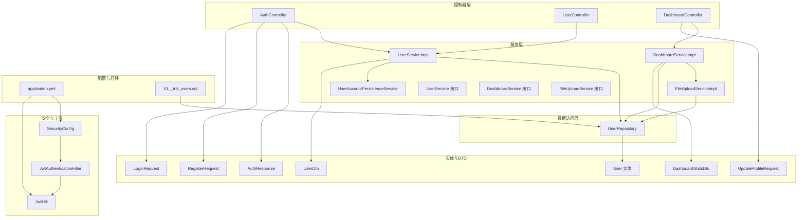
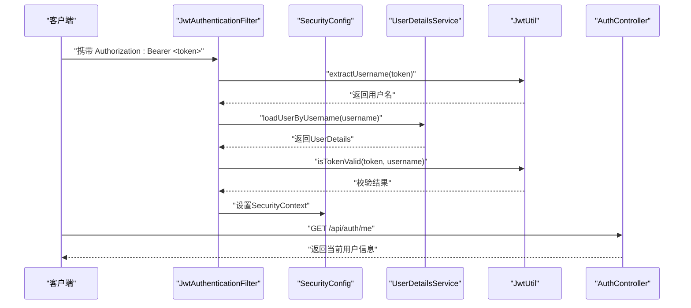
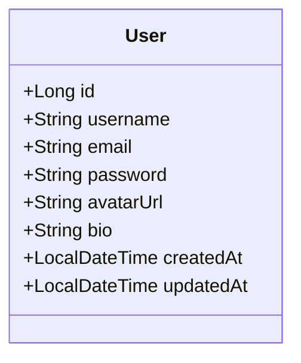
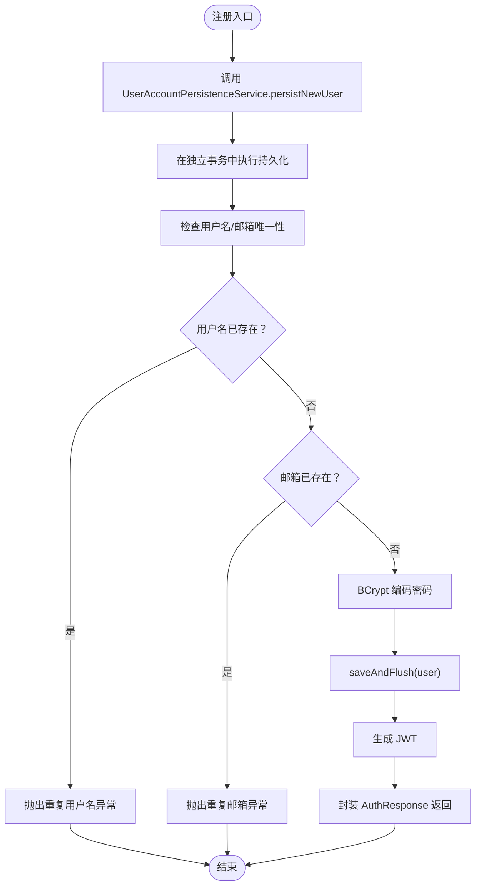
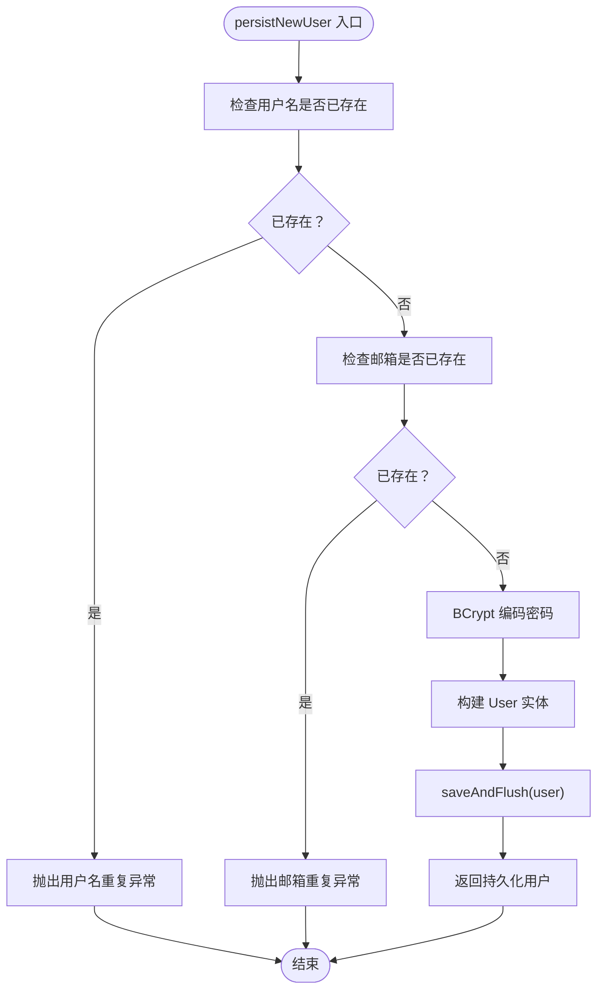
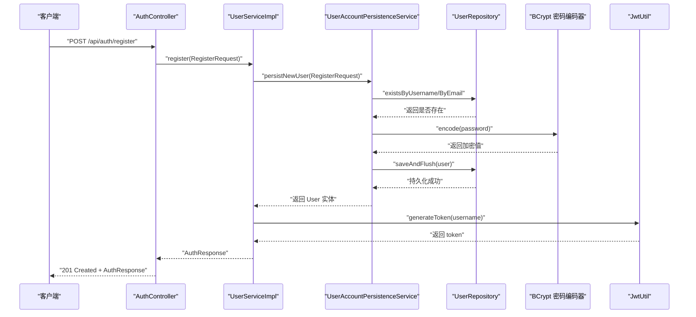
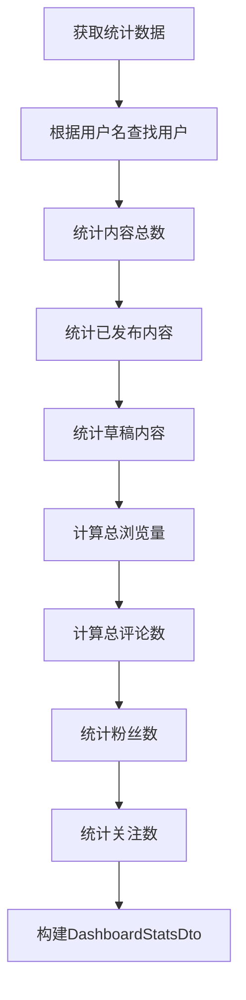
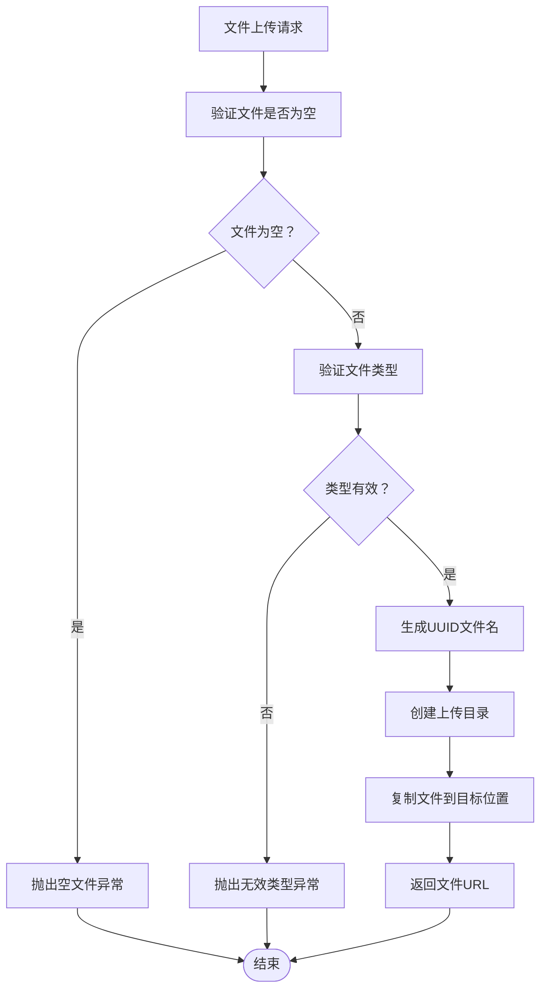
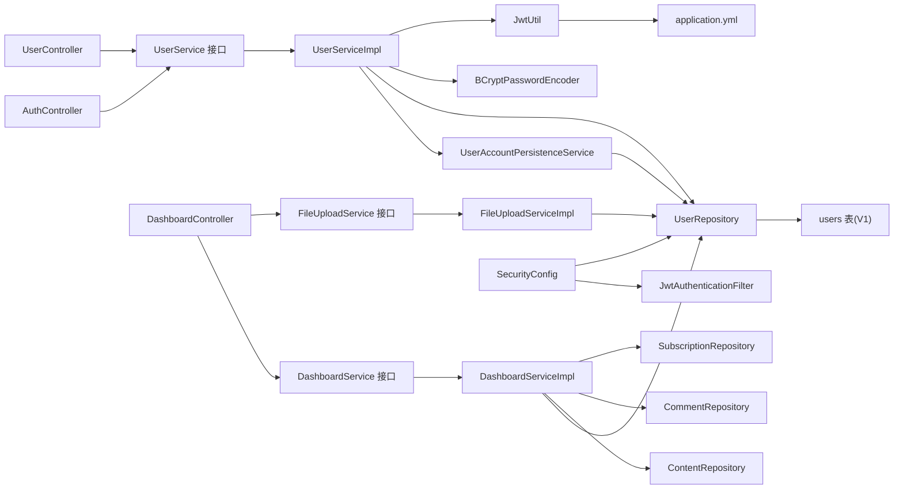

# 用户管理系统

<cite>
**本文引用的文件**
- [User.java](file://communication-backend/src/main/java/com/communication/entity/User.java)
- [UserService.java](file://communication-backend/src/main/java/com/communication/service/UserService.java)
- [UserServiceImpl.java](file://communication-backend/src/main/java/com/communication/service/impl/UserServiceImpl.java)
- [UserAccountPersistenceService.java](file://communication-backend/src/main/java/com/communication/service/UserAccountPersistenceService.java)
- [UserController.java](file://communication-backend/src/main/java/com/communication/controller/UserController.java)
- [DashboardController.java](file://communication-backend/src/main/java/com/communication/controller/DashboardController.java)
- [UserDto.java](file://communication-backend/src/main/java/com/communication/dto/UserDto.java)
- [UpdateProfileRequest.java](file://communication-backend/src/main/java/com/communication/dto/UpdateProfileRequest.java)
- [DashboardStatsDto.java](file://communication-backend/src/main/java/com/communication/dto/DashboardStatsDto.java)
- [JwtUtil.java](file://communication-backend/src/main/java/com/communication/util/JwtUtil.java)
- [JwtAuthenticationFilter.java](file://communication-backend/src/main/java/com/communication/config/JwtAuthenticationFilter.java)
- [SecurityConfig.java](file://communication-backend/src/main/java/com/communication/config/SecurityConfig.java)
- [AuthController.java](file://communication-backend/src/main/java/com/communication/controller/AuthController.java)
- [AuthResponse.java](file://communication-backend/src/main/java/com/communication/dto/AuthResponse.java)
- [RegisterRequest.java](file://communication-backend/src/main/java/com/communication/dto/RegisterRequest.java)
- [LoginRequest.java](file://communication-backend/src/main/java/com/communication/dto/LoginRequest.java)
- [UserRepository.java](file://communication-backend/src/main/java/com/communication/repository/UserRepository.java)
- [DashboardService.java](file://communication-backend/src/main/java/com/communication/service/DashboardService.java)
- [DashboardServiceImpl.java](file://communication-backend/src/main/java/com/communication/service/impl/DashboardServiceImpl.java)
- [FileUploadService.java](file://communication-backend/src/main/java/com/communication/service/FileUploadService.java)
- [FileUploadServiceImpl.java](file://communication-backend/src/main/java/com/communication/service/impl/FileUploadServiceImpl.java)
- [application.yml](file://communication-backend/src/main/resources/application.yml)
- [V1__init_users.sql](file://communication-backend/src/main/resources/db/migration/V1__init_users.sql)
- [UserAccountPersistenceServiceTest.java](file://communication-backend/src/test/java/com/communication/service/UserAccountPersistenceServiceTest.java)
- [UserServiceTest.java](file://communication-backend/src/test/java/com/communication/service/UserServiceTest.java)
</cite>

## 更新摘要
**所做更改**
- 新增UserAccountPersistenceService专门处理用户注册事务，改进了事务管理分离
- 更新用户服务层实现，将注册流程分解为持久化和认证两个独立的服务
- 增强用户注册的可靠性，避免签发JWT失败导致用户未写入数据库
- 完善测试用例，验证新的事务分离架构

## 目录
1. [简介](#简介)
2. [项目结构](#项目结构)
3. [核心组件](#核心组件)
4. [架构总览](#架构总览)
5. [详细组件分析](#详细组件分析)
6. [用户仪表板功能](#用户仪表板功能)
7. [文件上传与媒体管理](#文件上传与媒体管理)
8. [依赖关系分析](#依赖关系分析)
9. [性能与安全考虑](#性能与安全考虑)
10. [故障排查指南](#故障排查指南)
11. [结论](#结论)
12. [附录：API 接口文档](#附录api-接口文档)

## 简介
本文件为"用户管理系统"的完整功能与技术文档，覆盖用户注册、登录、当前用户信息查询以及个人资料管理等核心功能。系统采用Spring Boot + Spring Security + JWT的现代化架构，实现了完整的用户生命周期管理。文档深入解析基于JWT的认证机制（生成、验证与过期策略），剖析用户实体模型设计（字段、约束与业务规则），说明服务层实现（密码加密、用户验证、权限控制），并提供完整的API接口文档（请求参数、响应格式、错误处理），辅以流程图与时序图帮助开发者理解与扩展。

**更新** 系统现已重构为三层事务分离架构：UserAccountPersistenceService专门处理用户注册事务，UserServiceImpl负责业务逻辑协调，确保注册过程的可靠性和数据一致性。

## 项目结构
后端采用Spring Boot分层架构：controller负责HTTP入口，service提供业务逻辑，repository访问数据库，entity定义数据模型，dto承载传输对象，util封装工具类，config配置安全与过滤器，resources存放配置与Flyway迁移脚本。

**图表来源**
- [AuthController.java:1-42](file://communication-backend/src/main/java/com/communication/controller/AuthController.java#L1-L42)
- [UserController.java:1-26](file://communication-backend/src/main/java/com/communication/controller/UserController.java#L1-L26)
- [DashboardController.java:1-65](file://communication-backend/src/main/java/com/communication/controller/DashboardController.java#L1-L65)
- [UserServiceImpl.java:1-76](file://communication-backend/src/main/java/com/communication/service/impl/UserServiceImpl.java#L1-L76)
- [UserAccountPersistenceService.java:1-45](file://communication-backend/src/main/java/com/communication/service/UserAccountPersistenceService.java#L1-L45)
- [DashboardServiceImpl.java:1-87](file://communication-backend/src/main/java/com/communication/service/impl/DashboardServiceImpl.java#L1-L87)
- [FileUploadServiceImpl.java:1-88](file://communication-backend/src/main/java/com/communication/service/impl/FileUploadServiceImpl.java#L1-L88)
- [UserService.java:1-20](file://communication-backend/src/main/java/com/communication/service/UserService.java#L1-L20)
- [DashboardService.java:1-15](file://communication-backend/src/main/java/com/communication/service/DashboardService.java#L1-L15)
- [FileUploadService.java:1-15](file://communication-backend/src/main/java/com/communication/service/FileUploadService.java#L1-L15)
- [UserRepository.java:1-27](file://communication-backend/src/main/java/com/communication/repository/UserRepository.java#L1-L27)
- [User.java:1-96](file://communication-backend/src/main/java/com/communication/entity/User.java#L1-L96)
- [UserDto.java:1-72](file://communication-backend/src/main/java/com/communication/dto/UserDto.java#L1-L72)
- [AuthResponse.java:1-47](file://communication-backend/src/main/java/com/communication/dto/AuthResponse.java#L1-L47)
- [RegisterRequest.java:1-30](file://communication-backend/src/main/java/com/communication/dto/RegisterRequest.java#L1-L30)
- [LoginRequest.java:1-20](file://communication-backend/src/main/java/com/communication/dto/LoginRequest.java#L1-L20)
- [UpdateProfileRequest.java:1-19](file://communication-backend/src/main/java/com/communication/dto/UpdateProfileRequest.java#L1-L19)
- [DashboardStatsDto.java:1-64](file://communication-backend/src/main/java/com/communication/dto/DashboardStatsDto.java#L1-L64)
- [SecurityConfig.java:1-89](file://communication-backend/src/main/java/com/communication/config/SecurityConfig.java#L1-L89)
- [JwtAuthenticationFilter.java:1-69](file://communication-backend/src/main/java/com/communication/config/JwtAuthenticationFilter.java#L1-L69)
- [JwtUtil.java:1-67](file://communication-backend/src/main/java/com/communication/util/JwtUtil.java#L1-L67)
- [application.yml:1-42](file://communication-backend/src/main/resources/application.yml#L1-L42)
- [V1__init_users.sql:1-14](file://communication-backend/src/main/resources/db/migration/V1__init_users.sql#L1-L14)

## 核心组件
- **用户实体模型**：定义用户标识、唯一性约束、敏感字段存储策略、时间戳字段
- **用户服务接口与实现**：提供注册、登录、当前用户查询、用户名/邮箱存在性检查
- **用户账户持久化服务**：专门处理用户注册事务，确保数据持久化的可靠性
- **仪表板服务**：提供用户统计数据、个人资料更新、头像管理功能
- **文件上传服务**：支持图片和视频文件的安全上传与类型验证
- **控制器**：对外暴露注册、登录、获取用户信息、仪表板操作等REST接口
- **JWT工具与安全过滤器**：负责token生成、解析、校验，并在请求链路中注入认证上下文
- **数据访问层**：基于Spring Data JPA提供用户查询、去重校验与分页搜索
- **DTO**：封装传输对象，避免直接暴露实体细节
- **配置**：Spring Security无状态策略、公开端点、拦截器链与密码编码器

**章节来源**
- [User.java:1-96](file://communication-backend/src/main/java/com/communication/entity/User.java#L1-L96)
- [UserService.java:1-20](file://communication-backend/src/main/java/com/communication/service/UserService.java#L1-L20)
- [UserServiceImpl.java:1-76](file://communication-backend/src/main/java/com/communication/service/impl/UserServiceImpl.java#L1-L76)
- [UserAccountPersistenceService.java:1-45](file://communication-backend/src/main/java/com/communication/service/UserAccountPersistenceService.java#L1-L45)
- [DashboardService.java:1-15](file://communication-backend/src/main/java/com/communication/service/DashboardService.java#L1-L15)
- [DashboardServiceImpl.java:1-87](file://communication-backend/src/main/java/com/communication/service/impl/DashboardServiceImpl.java#L1-L87)
- [FileUploadService.java:1-15](file://communication-backend/src/main/java/com/communication/service/FileUploadService.java#L1-L15)
- [FileUploadServiceImpl.java:1-88](file://communication-backend/src/main/java/com/communication/service/impl/FileUploadServiceImpl.java#L1-L88)
- [UserController.java:1-26](file://communication-backend/src/main/java/com/communication/controller/UserController.java#L1-L26)
- [DashboardController.java:1-65](file://communication-backend/src/main/java/com/communication/controller/DashboardController.java#L1-L65)
- [JwtUtil.java:1-67](file://communication-backend/src/main/java/com/communication/util/JwtUtil.java#L1-L67)
- [JwtAuthenticationFilter.java:1-69](file://communication-backend/src/main/java/com/communication/config/JwtAuthenticationFilter.java#L1-L69)
- [SecurityConfig.java:1-89](file://communication-backend/src/main/java/com/communication/config/SecurityConfig.java#L1-L89)
- [UserRepository.java:1-27](file://communication-backend/src/main/java/com/communication/repository/UserRepository.java#L1-L27)
- [UserDto.java:1-72](file://communication-backend/src/main/java/com/communication/dto/UserDto.java#L1-L72)
- [AuthResponse.java:1-47](file://communication-backend/src/main/java/com/communication/dto/AuthResponse.java#L1-L47)
- [RegisterRequest.java:1-30](file://communication-backend/src/main/java/com/communication/dto/RegisterRequest.java#L1-L30)
- [LoginRequest.java:1-20](file://communication-backend/src/main/java/com/communication/dto/LoginRequest.java#L1-L20)
- [UpdateProfileRequest.java:1-19](file://communication-backend/src/main/java/com/communication/dto/UpdateProfileRequest.java#L1-L19)
- [DashboardStatsDto.java:1-64](file://communication-backend/src/main/java/com/communication/dto/DashboardStatsDto.java#L1-L64)

## 架构总览
系统采用前后端分离，后端通过Spring MVC暴露REST API，Spring Security结合JWT实现无状态认证。请求进入时由JwtAuthenticationFilter解析Authorization头中的Bearer Token，解析成功后将认证信息写入SecurityContext，后续控制器可基于注解获取当前用户。

**更新** 现在采用三层事务分离架构：UserAccountPersistenceService在独立的REQUIRES_NEW事务中处理用户注册，确保即使JWT签发失败也不会影响用户数据的持久化。

**图表来源**
- [JwtAuthenticationFilter.java:1-69](file://communication-backend/src/main/java/com/communication/config/JwtAuthenticationFilter.java#L1-L69)
- [SecurityConfig.java:1-89](file://communication-backend/src/main/java/com/communication/config/SecurityConfig.java#L1-L89)
- [JwtUtil.java:1-67](file://communication-backend/src/main/java/com/communication/util/JwtUtil.java#L1-L67)
- [AuthController.java:1-42](file://communication-backend/src/main/java/com/communication/controller/AuthController.java#L1-L42)

## 详细组件分析

### 用户实体模型 User
- **字段与约束**
  - 主键自增id
  - 唯一且非空用户名（长度限制50字符）
  - 唯一且非空邮箱（长度限制100字符）
  - 密码（非空，经BCrypt编码存储）
  - 可选头像URL与个人简介
  - 创建与更新时间戳自动维护
- **业务规则**
  - 注册时需保证用户名与邮箱唯一
  - 登录支持使用用户名或邮箱任一作为凭据
  - 用户信息查询按用户名精确匹配
- **复杂度与索引**
  - 查询按用户名与邮箱的唯一性校验为O(logN)（数据库索引）
  - 搜索接口对用户名进行模糊匹配，适合分页场景

**图表来源**
- [User.java:1-96](file://communication-backend/src/main/java/com/communication/entity/User.java#L1-L96)

**章节来源**
- [User.java:1-96](file://communication-backend/src/main/java/com/communication/entity/User.java#L1-L96)
- [V1__init_users.sql:1-14](file://communication-backend/src/main/resources/db/migration/V1__init_users.sql#L1-L14)

### 用户服务层 UserService 与实现 UserServiceImpl
- **关键职责**
  - 注册：委托UserAccountPersistenceService处理用户持久化，然后签发JWT并封装响应
  - 登录：支持用户名或邮箱登录、密码匹配、签发JWT
  - 当前用户：根据用户名查询并映射为DTO
  - 查询与存在性：按用户名/邮箱查询与去重校验
- **事务管理分离**
  - 注册流程：UserServiceImpl在当前事务中调用UserAccountPersistenceService
  - UserAccountPersistenceService在独立的REQUIRES_NEW事务中执行
  - 确保即使JWT签发失败，用户数据仍会持久化
- **错误处理**
  - 重复注册抛出业务异常
  - 凭据无效抛出认证异常
  - 用户不存在抛出资源未找到异常
- **性能与事务**
  - 注册使用事务确保一致性
  - 使用密码编码器进行单向加密

**更新** UserServiceImpl现在依赖UserAccountPersistenceService进行用户注册的事务处理，实现了业务逻辑与数据持久化的分离。

**图表来源**
- [UserServiceImpl.java:33-38](file://communication-backend/src/main/java/com/communication/service/impl/UserServiceImpl.java#L33-L38)
- [UserAccountPersistenceService.java:27-43](file://communication-backend/src/main/java/com/communication/service/UserAccountPersistenceService.java#L27-L43)

**章节来源**
- [UserService.java:1-20](file://communication-backend/src/main/java/com/communication/service/UserService.java#L1-L20)
- [UserServiceImpl.java:1-76](file://communication-backend/src/main/java/com/communication/service/impl/UserServiceImpl.java#L1-L76)
- [UserAccountPersistenceService.java:1-45](file://communication-backend/src/main/java/com/communication/service/UserAccountPersistenceService.java#L1-L45)
- [UserRepository.java:1-27](file://communication-backend/src/main/java/com/communication/repository/UserRepository.java#L1-L27)

### 用户账户持久化服务 UserAccountPersistenceService
- **设计目的**
  - 专门处理用户注册事务，避免签发JWT失败导致用户未写入数据库
  - 在独立的REQUIRES_NEW事务中执行，确保数据持久化的可靠性
- **事务特性**
  - 使用Propagation.REQUIRES_NEW传播行为
  - rollbackFor = Exception.class，确保任何异常都会触发回滚
  - 在独立事务中执行用户数据的持久化操作
- **核心流程**
  - 验证用户名和邮箱唯一性
  - 编码密码
  - 保存并强制刷新到数据库
  - 返回持久化的用户实体
- **错误处理**
  - 用户名重复：抛出BadRequestException("Username already exists")
  - 邮箱重复：抛出BadRequestException("Email already exists")

**更新** 这是本次重构的核心组件，专门负责用户注册的事务处理，确保数据持久化的可靠性。

**图表来源**
- [UserAccountPersistenceService.java:27-43](file://communication-backend/src/main/java/com/communication/service/UserAccountPersistenceService.java#L27-L43)

**章节来源**
- [UserAccountPersistenceService.java:1-45](file://communication-backend/src/main/java/com/communication/service/UserAccountPersistenceService.java#L1-L45)
- [UserAccountPersistenceServiceTest.java:1-90](file://communication-backend/src/test/java/com/communication/service/UserAccountPersistenceServiceTest.java#L1-L90)

### JWT 认证机制
- **配置项**
  - 密钥与过期时间从应用配置读取
  - 默认有效期24小时（86400000毫秒）
- **生成流程**
  - 使用对称密钥签名，包含签发时间与过期时间
- **验证流程**
  - 解析签名、提取用户名与过期时间，判断是否与用户一致且未过期
- **过滤器集成**
  - 从Authorization头解析Bearer Token
  - 若有效则构建UsernamePasswordAuthenticationToken写入SecurityContext
- **刷新策略**
  - 本项目未实现专用"刷新令牌"端点；可通过重新登录获取新token

**图表来源**
- [AuthController.java:1-42](file://communication-backend/src/main/java/com/communication/controller/AuthController.java#L1-L42)
- [UserServiceImpl.java:33-38](file://communication-backend/src/main/java/com/communication/service/impl/UserServiceImpl.java#L33-L38)
- [UserAccountPersistenceService.java:27-43](file://communication-backend/src/main/java/com/communication/service/UserAccountPersistenceService.java#L27-L43)
- [UserRepository.java:1-27](file://communication-backend/src/main/java/com/communication/repository/UserRepository.java#L1-L27)
- [JwtUtil.java:1-67](file://communication-backend/src/main/java/com/communication/util/JwtUtil.java#L1-L67)
- [application.yml:33-42](file://communication-backend/src/main/resources/application.yml#L33-L42)

**章节来源**
- [JwtUtil.java:1-67](file://communication-backend/src/main/java/com/communication/util/JwtUtil.java#L1-L67)
- [JwtAuthenticationFilter.java:1-69](file://communication-backend/src/main/java/com/communication/config/JwtAuthenticationFilter.java#L1-L69)
- [SecurityConfig.java:1-89](file://communication-backend/src/main/java/com/communication/config/SecurityConfig.java#L1-L89)
- [application.yml:33-42](file://communication-backend/src/main/resources/application.yml#L33-L42)

### 控制器层：AuthController、UserController与DashboardController
- **AuthController**
  - POST /api/auth/register：接收RegisterRequest，调用UserService.register，返回AuthResponse
  - POST /api/auth/login：接收LoginRequest，调用UserService.login，返回AuthResponse
  - GET /api/auth/me：基于@AuthenticationPrincipal获取当前用户，返回UserDto
- **UserController**
  - GET /api/users/{username}：按用户名查询用户并返回UserDto
- **DashboardController**
  - GET /api/dashboard/stats：获取用户统计数据
  - GET /api/dashboard/contents：获取用户内容列表
  - PUT /api/dashboard/profile：更新用户个人资料
  - POST /api/dashboard/avatar：上传用户头像

**章节来源**
- [AuthController.java:1-42](file://communication-backend/src/main/java/com/communication/controller/AuthController.java#L1-L42)
- [UserController.java:1-26](file://communication-backend/src/main/java/com/communication/controller/UserController.java#L1-L26)
- [DashboardController.java:1-65](file://communication-backend/src/main/java/com/communication/controller/DashboardController.java#L1-L65)

### DTO 与响应封装
- **UserDto**：用于对外传输用户信息，屏蔽实体细节
- **AuthResponse**：统一承载token、token类型与用户信息，便于前端统一处理
- **DashboardStatsDto**：用户仪表板统计数据封装
- **UpdateProfileRequest**：个人资料更新请求封装

**章节来源**
- [UserDto.java:1-72](file://communication-backend/src/main/java/com/communication/dto/UserDto.java#L1-L72)
- [AuthResponse.java:1-47](file://communication-backend/src/main/java/com/communication/dto/AuthResponse.java#L1-L47)
- [DashboardStatsDto.java:1-64](file://communication-backend/src/main/java/com/communication/dto/DashboardStatsDto.java#L1-L64)
- [UpdateProfileRequest.java:1-19](file://communication-backend/src/main/java/com/communication/dto/UpdateProfileRequest.java#L1-L19)

## 用户仪表板功能

### 统计数据管理
仪表板提供用户内容创作的综合统计信息，包括内容总数、发布状态分布、浏览量统计和关注者数据。

- **统计维度**
  - 总内容数：用户创建的所有内容数量
  - 已发布内容：按PUBLISHED状态统计
  - 草稿内容：按DRAFT状态统计
  - 总浏览量：所有内容浏览量合计
  - 总评论数：所有内容评论数合计
  - 粉丝数：被关注数量
  - 关注数：关注他人数量

**图表来源**
- [DashboardServiceImpl.java:33-57](file://communication-backend/src/main/java/com/communication/service/impl/DashboardServiceImpl.java#L33-L57)
- [DashboardStatsDto.java:1-64](file://communication-backend/src/main/java/com/communication/dto/DashboardStatsDto.java#L1-L64)

### 个人资料管理
提供用户个人资料的灵活更新功能，支持简介修改和头像更换。

- **更新规则**
  - 仅更新提供的字段，未提供的字段保持不变
  - 简介长度限制200字符
  - 支持头像URL直接更新或文件上传
- **事务保证**
  - 所有更新操作在事务中执行，确保数据一致性

**章节来源**
- [DashboardServiceImpl.java:59-85](file://communication-backend/src/main/java/com/communication/service/impl/DashboardServiceImpl.java#L59-L85)
- [UpdateProfileRequest.java:1-19](file://communication-backend/src/main/java/com/communication/dto/UpdateProfileRequest.java#L1-L19)
- [DashboardStatsDto.java:1-64](file://communication-backend/src/main/java/com/communication/dto/DashboardStatsDto.java#L1-L64)

## 文件上传与媒体管理

### 文件上传服务
提供安全的文件上传功能，支持图片和视频文件的类型验证和存储管理。

- **支持的文件类型**
  - 图片：JPEG、PNG、GIF、WEBP
  - 视频：MP4、WEBM、QuickTime
- **安全策略**
  - 文件大小限制：100MB
  - 类型白名单验证
  - UUID文件名生成，防止冲突
- **存储结构**
  - 头像存储：`{upload.path}/avatars/`
  - 统一URL格式：`/uploads/{subDirectory}/{filename}`

**图表来源**
- [FileUploadServiceImpl.java:31-61](file://communication-backend/src/main/java/com/communication/service/impl/FileUploadServiceImpl.java#L31-L61)

### 头像管理集成
头像上传与用户资料更新无缝集成，支持多种头像来源。

- **上传流程**
  - 文件上传到服务器
  - 生成可访问的URL
  - 更新用户记录中的avatarUrl字段
- **删除机制**
  - 提供文件删除接口
  - 异常处理不影响主要业务流程

**章节来源**
- [FileUploadServiceImpl.java:1-88](file://communication-backend/src/main/java/com/communication/service/impl/FileUploadServiceImpl.java#L1-L88)
- [DashboardController.java:56-63](file://communication-backend/src/main/java/com/communication/controller/DashboardController.java#L56-L63)

## 依赖关系分析
- 控制器依赖服务接口，服务实现依赖仓库、密码编码器与JWT工具
- **更新** UserServiceImpl现在依赖UserAccountPersistenceService进行用户注册事务处理
- 仪表板服务依赖多个仓库进行数据聚合统计
- 文件上传服务独立运行，提供通用的文件处理能力
- 安全配置依赖用户仓库与JWT过滤器，构建无状态认证链
- 实体与仓库通过Flyway初始化表结构，建立唯一索引与时间戳字段

**更新** 依赖关系现在体现了三层事务分离架构：UserServiceImpl依赖UserAccountPersistenceService，后者独立处理用户注册事务。

**图表来源**
- [AuthController.java:1-42](file://communication-backend/src/main/java/com/communication/controller/AuthController.java#L1-L42)
- [UserController.java:1-26](file://communication-backend/src/main/java/com/communication/controller/UserController.java#L1-L26)
- [DashboardController.java:1-65](file://communication-backend/src/main/java/com/communication/controller/DashboardController.java#L1-L65)
- [UserService.java:1-20](file://communication-backend/src/main/java/com/communication/service/UserService.java#L1-L20)
- [UserServiceImpl.java:1-76](file://communication-backend/src/main/java/com/communication/service/impl/UserServiceImpl.java#L1-L76)
- [UserAccountPersistenceService.java:1-45](file://communication-backend/src/main/java/com/communication/service/UserAccountPersistenceService.java#L1-L45)
- [DashboardService.java:1-15](file://communication-backend/src/main/java/com/communication/service/DashboardService.java#L1-L15)
- [DashboardServiceImpl.java:1-87](file://communication-backend/src/main/java/com/communication/service/impl/DashboardServiceImpl.java#L1-L87)
- [FileUploadService.java:1-15](file://communication-backend/src/main/java/com/communication/service/FileUploadService.java#L1-L15)
- [FileUploadServiceImpl.java:1-88](file://communication-backend/src/main/java/com/communication/service/impl/FileUploadServiceImpl.java#L1-L88)
- [UserRepository.java:1-27](file://communication-backend/src/main/java/com/communication/repository/UserRepository.java#L1-L27)
- [SecurityConfig.java:1-89](file://communication-backend/src/main/java/com/communication/config/SecurityConfig.java#L1-L89)
- [JwtAuthenticationFilter.java:1-69](file://communication-backend/src/main/java/com/communication/config/JwtAuthenticationFilter.java#L1-L69)
- [JwtUtil.java:1-67](file://communication-backend/src/main/java/com/communication/util/JwtUtil.java#L1-L67)
- [application.yml:1-42](file://communication-backend/src/main/resources/application.yml#L1-L42)
- [V1__init_users.sql:1-14](file://communication-backend/src/main/resources/db/migration/V1__init_users.sql#L1-L14)

**章节来源**
- [UserServiceImpl.java:1-76](file://communication-backend/src/main/java/com/communication/service/impl/UserServiceImpl.java#L1-L76)
- [UserAccountPersistenceService.java:1-45](file://communication-backend/src/main/java/com/communication/service/UserAccountPersistenceService.java#L1-L45)
- [DashboardServiceImpl.java:1-87](file://communication-backend/src/main/java/com/communication/service/impl/DashboardServiceImpl.java#L1-L87)
- [FileUploadServiceImpl.java:1-88](file://communication-backend/src/main/java/com/communication/service/impl/FileUploadServiceImpl.java#L1-L88)
- [SecurityConfig.java:1-89](file://communication-backend/src/main/java/com/communication/config/SecurityConfig.java#L1-L89)
- [application.yml:1-42](file://communication-backend/src/main/resources/application.yml#L1-L42)

## 性能与安全考虑
- **密码安全**
  - 使用BCrypt编码，成本因子默认为10，不可逆，降低泄露风险
- **JWT安全**
  - 密钥长度建议满足256位以上，过期时间适中（默认24小时）
  - 建议在生产环境启用HTTPS与安全的Cookie存储（如需要）
- **文件安全**
  - 文件类型白名单验证，防止恶意文件上传
  - 文件大小限制，防止存储空间滥用
  - UUID文件名生成，避免路径遍历攻击
- **数据库优化**
  - 用户名与邮箱建立唯一索引，查询与去重高效
  - 统计查询使用聚合函数，减少数据传输
- **事务与一致性**
  - **更新** 注册流程采用三层事务分离：UserAccountPersistenceService在独立事务中执行，确保数据持久化可靠性
  - UserServiceImpl在当前事务中协调业务逻辑，避免JWT签发失败影响用户数据
  - 仪表板更新操作在事务内执行，保证数据一致性
- **无状态与扩展性**
  - 采用无状态认证，便于水平扩展与微服务拆分

**更新** 事务管理的改进显著提升了系统的可靠性，确保用户注册过程不会因为JWT签发失败而丢失数据。

## 故障排查指南
- **注册失败**：用户名或邮箱重复
  - 现象：抛出业务异常
  - 排查：确认用户名/邮箱唯一性，检查数据库索引
- **登录失败**：凭据无效
  - 现象：抛出认证异常
  - 排查：确认用户名或邮箱输入正确，密码匹配逻辑
- **用户不存在**
  - 现象：资源未找到异常
  - 排查：确认用户是否已创建，查询路径是否正确
- **JWT校验失败**
  - 现象：过滤器忽略无效token
  - 排查：核对密钥与过期时间配置，确认Authorization头格式
- **文件上传失败**
  - 现象：文件类型不支持或文件过大
  - 排查：检查文件类型白名单，确认文件大小限制
- **仪表板统计异常**
  - 现象：统计数据不准确
  - 排查：检查相关仓库的聚合查询，确认数据完整性
- **注册事务异常**
  - 现象：用户名/邮箱重复但用户仍被创建
  - 排查：检查UserAccountPersistenceService的事务配置，确认REQUIRES_NEW传播行为

**更新** 新增了注册事务异常的排查指南，重点关注UserAccountPersistenceService的事务隔离机制。

**章节来源**
- [UserServiceImpl.java:1-76](file://communication-backend/src/main/java/com/communication/service/impl/UserServiceImpl.java#L1-L76)
- [UserAccountPersistenceService.java:1-45](file://communication-backend/src/main/java/com/communication/service/UserAccountPersistenceService.java#L1-L45)
- [DashboardServiceImpl.java:1-87](file://communication-backend/src/main/java/com/communication/service/impl/DashboardServiceImpl.java#L1-L87)
- [FileUploadServiceImpl.java:1-88](file://communication-backend/src/main/java/com/communication/service/impl/FileUploadServiceImpl.java#L1-L88)
- [JwtAuthenticationFilter.java:1-69](file://communication-backend/src/main/java/com/communication/config/JwtAuthenticationFilter.java#L1-L69)
- [application.yml:33-42](file://communication-backend/src/main/resources/application.yml#L33-L42)

## 结论
该用户管理系统以清晰的分层架构实现用户注册、登录与当前用户查询，结合Spring Security与JWT实现无状态认证。系统扩展了完整的仪表板功能，包括统计数据聚合、个人资料管理和文件上传服务。

**更新** 本次重构引入了UserAccountPersistenceService专门处理用户注册事务，实现了业务逻辑与数据持久化的分离。三层事务分离架构显著提升了系统的可靠性，确保即使JWT签发失败，用户数据也会被正确持久化。实体模型与数据库迁移脚本明确约束与索引，服务层通过密码编码与事务保障安全性与一致性。建议在生产环境中完善刷新令牌、HTTPS与更细粒度的权限控制，并持续监控日志与指标。

## 附录：API 接口文档

### 认证接口
- **注册**
  - 方法与路径：POST /api/auth/register
  - 请求体：RegisterRequest
    - username：必填，长度3-50
    - email：必填，合法邮箱格式
    - password：必填，长度6-100
  - 成功响应：201 Created，Body：ApiResponse<AuthResponse>
  - 失败响应：400 Bad Request（用户名或邮箱已存在）

- **登录**
  - 方法与路径：POST /api/auth/login
  - 请求体：LoginRequest
    - usernameOrEmail：必填，用户名或邮箱
    - password：必填
  - 成功响应：200 OK，Body：ApiResponse<AuthResponse>
  - 失败响应：401 Unauthorized（凭据无效）

- **获取当前用户**
  - 方法与路径：GET /api/auth/me
  - 认证：需要Bearer Token
  - 成功响应：200 OK，Body：ApiResponse<UserDto>
  - 失败响应：401 Unauthorized（Token无效或过期）

### 用户信息接口
- **获取指定用户**
  - 方法与路径：GET /api/users/{username}
  - 成功响应：200 OK，Body：ApiResponse<UserDto>
  - 失败响应：404 Not Found（用户不存在）

### 仪表板接口
- **获取统计数据**
  - 方法与路径：GET /api/dashboard/stats
  - 认证：需要Bearer Token
  - 成功响应：200 OK，Body：ApiResponse<DashboardStatsDto>
  - 失败响应：404 Not Found（用户不存在）

- **获取用户内容**
  - 方法与路径：GET /api/dashboard/contents
  - 参数：status（可选）、page（默认0）、size（默认10）
  - 认证：需要Bearer Token
  - 成功响应：200 OK，Body：ApiResponse<PageResponse<ContentDto>>

- **更新个人资料**
  - 方法与路径：PUT /api/dashboard/profile
  - 请求体：UpdateProfileRequest
    - bio：可选，长度不超过200
    - avatarUrl：可选
  - 认证：需要Bearer Token
  - 成功响应：200 OK，Body：ApiResponse<UserDto>

- **上传头像**
  - 方法与路径：POST /api/dashboard/avatar
  - 参数：file（multipart/form-data）
  - 认证：需要Bearer Token
  - 成功响应：200 OK，Body：ApiResponse<UserDto>
  - 失败响应：400 Bad Request（文件类型不支持或文件过大）

**章节来源**
- [AuthController.java:1-42](file://communication-backend/src/main/java/com/communication/controller/AuthController.java#L1-L42)
- [UserController.java:1-26](file://communication-backend/src/main/java/com/communication/controller/UserController.java#L1-L26)
- [DashboardController.java:1-65](file://communication-backend/src/main/java/com/communication/controller/DashboardController.java#L1-L65)
- [RegisterRequest.java:1-30](file://communication-backend/src/main/java/com/communication/dto/RegisterRequest.java#L1-L30)
- [LoginRequest.java:1-20](file://communication-backend/src/main/java/com/communication/dto/LoginRequest.java#L1-L20)
- [UpdateProfileRequest.java:1-19](file://communication-backend/src/main/java/com/communication/dto/UpdateProfileRequest.java#L1-L19)
- [AuthResponse.java:1-47](file://communication-backend/src/main/java/com/communication/dto/AuthResponse.java#L1-L47)
- [UserDto.java:1-72](file://communication-backend/src/main/java/com/communication/dto/UserDto.java#L1-L72)
- [DashboardStatsDto.java:1-64](file://communication-backend/src/main/java/com/communication/dto/DashboardStatsDto.java#L1-L64)