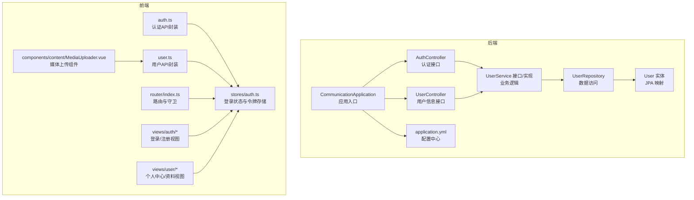
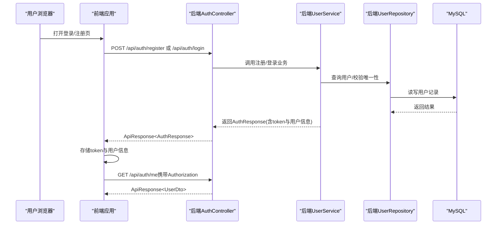
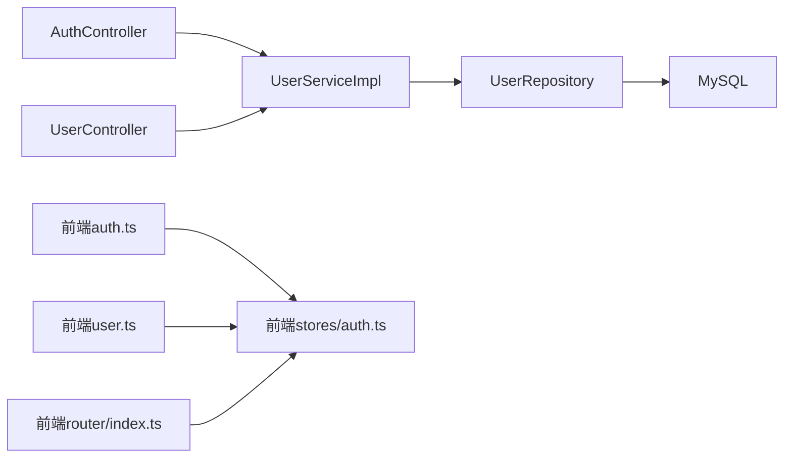

# 用户管理系统

<cite>
**本文引用的文件**
- [CommunicationApplication.java](file://communication-backend/src/main/java/com/communication/CommunicationApplication.java)
- [application.yml](file://communication-backend/src/main/resources/application.yml)
- [AuthController.java](file://communication-backend/src/main/java/com/communication/controller/AuthController.java)
- [UserController.java](file://communication-backend/src/main/java/com/communication/controller/UserController.java)
- [UserService.java](file://communication-backend/src/main/java/com/communication/service/UserService.java)
- [UserServiceImpl.java](file://communication-backend/src/main/java/com/communication/service/impl/UserServiceImpl.java)
- [UserRepository.java](file://communication-backend/src/main/java/com/communication/repository/UserRepository.java)
- [User.java](file://communication-backend/src/main/java/com/communication/entity/User.java)
- [UserDTO.java](file://communication-backend/src/main/java/com/communication/dto/UserDTO.java)
- [AuthResponse.java](file://communication-backend/src/main/java/com/communication/dto/AuthResponse.java)
- [LoginRequest.java](file://communication-backend/src/main/java/com/communication/dto/LoginRequest.java)
- [RegisterRequest.java](file://communication-backend/src/main/java/com/communication/dto/RegisterRequest.java)
- [ApiResponse.java](file://communication-backend/src/main/java/com/communication/dto/ApiResponse.java)
- [BadgeService.java](file://communication-backend/src/main/java/com/communication/service/BadgeService.java)
- [auth.ts](file://communication-frontend/src/api/auth.ts)
- [user.ts](file://communication-frontend/src/api/user.ts)
- [auth.ts（前端存储）](file://communication-frontend/src/stores/auth.ts)
- [index.ts（前端路由）](file://communication-frontend/src/router/index.ts)
- [LoginView.vue](file://communication-frontend/src/views/auth/LoginView.vue)
- [RegisterView.vue](file://communication-frontend/src/views/auth/RegisterView.vue)
- [ProfileView.vue](file://communication-frontend/src/views/user/ProfileView.vue)
- [DashboardView.vue](file://communication-frontend/src/views/user/DashboardView.vue)
- [MediaUploader.vue](file://communication-frontend/src/components/content/MediaUploader.vue)
- [04-用户管理系统.md](file://wiki/04-用户管理系统.md)
- [10-API接口文档.md](file://wiki/10-API接口文档.md)
- [11-数据库设计.md](file://wiki/11-数据库设计.md)
</cite>

## 目录
1. [简介](#简介)
2. [项目结构](#项目结构)
3. [核心组件](#核心组件)
4. [架构总览](#架构总览)
5. [详细组件分析](#详细组件分析)
6. [依赖分析](#依赖分析)
7. [性能考虑](#性能考虑)
8. [故障排查指南](#故障排查指南)
9. [结论](#结论)
10. [附录](#附录)

## 简介
本文件面向“用户管理系统”的功能文档，覆盖用户注册、登录与认证流程（含JWT令牌生成、验证与过期处理）、用户实体模型与业务规则、密码策略与安全防护、会话与权限控制、用户资料管理与头像上传、API接口规范与错误码说明，以及前端登录状态持久化与路由保护的实现要点。文档同时提供常见问题排查与性能优化建议，帮助开发者与运维人员高效落地与维护系统。

## 项目结构
后端采用Spring Boot + Spring Data JPA + Flyway的分层架构；前端采用Vue 3 + TypeScript + Vite，使用Pinia进行状态管理，结合路由守卫实现权限控制。配置通过application.yml集中管理，包含JWT密钥、过期时间、文件上传路径与类型等。

图表来源
- [CommunicationApplication.java:1-13](file://communication-backend/src/main/java/com/communication/CommunicationApplication.java#L1-L13)
- [application.yml:1-42](file://communication-backend/src/main/resources/application.yml#L1-L42)
- [AuthController.java:1-47](file://communication-backend/src/main/java/com/communication/controller/AuthController.java#L1-L47)
- [UserController.java:1-26](file://communication-backend/src/main/java/com/communication/controller/UserController.java#L1-L26)
- [UserService.java:1-20](file://communication-backend/src/main/java/com/communication/service/UserService.java#L1-L20)
- [UserRepository.java:1-27](file://communication-backend/src/main/java/com/communication/repository/UserRepository.java#L1-L27)
- [User.java:1-96](file://communication-backend/src/main/java/com/communication/entity/User.java#L1-L96)
- [auth.ts](file://communication-frontend/src/api/auth.ts)
- [user.ts](file://communication-frontend/src/api/user.ts)
- [auth.ts（前端存储）](file://communication-frontend/src/stores/auth.ts)
- [index.ts（前端路由）](file://communication-frontend/src/router/index.ts)

章节来源
- [CommunicationApplication.java:1-13](file://communication-backend/src/main/java/com/communication/CommunicationApplication.java#L1-L13)
- [application.yml:1-42](file://communication-backend/src/main/resources/application.yml#L1-L42)

## 核心组件
- 认证控制器：提供注册、登录与当前用户查询接口，返回统一响应包装与徽章发放触发。
- 用户服务：定义注册、登录、获取当前用户、按用户名查找用户及存在性校验等契约。
- 用户仓库：基于JPA提供用户名/邮箱查询、去重校验与关键词分页检索。
- 用户实体：映射users表，包含基础字段、创建/更新时间戳与Builder模式支持。
- DTO与响应：RegisterRequest/LoginRequest/RegisterResponse等，统一输出结构。
- 前端认证模块：封装HTTP调用、本地存储令牌、路由守卫与视图联动。

章节来源
- [AuthController.java:1-47](file://communication-backend/src/main/java/com/communication/controller/AuthController.java#L1-L47)
- [UserService.java:1-20](file://communication-backend/src/main/java/com/communication/service/UserService.java#L1-L20)
- [UserRepository.java:1-27](file://communication-backend/src/main/java/com/communication/repository/UserRepository.java#L1-L27)
- [User.java:1-96](file://communication-backend/src/main/java/com/communication/entity/User.java#L1-L96)
- [UserDTO.java:1-72](file://communication-backend/src/main/java/com/communication/dto/UserDTO.java#L1-L72)
- [AuthResponse.java:1-47](file://communication-backend/src/main/java/com/communication/dto/AuthResponse.java#L1-L47)
- [LoginRequest.java:1-20](file://communication-backend/src/main/java/com/communication/dto/LoginRequest.java#L1-L20)
- [RegisterRequest.java:1-30](file://communication-backend/src/main/java/com/communication/dto/RegisterRequest.java#L1-L30)

## 架构总览
后端通过REST接口暴露认证与用户能力，前端以API模块与状态管理配合路由守卫实现登录态控制与页面保护。JWT配置由后端统一管理，前端负责携带Authorization头并持久化令牌。

图表来源
- [AuthController.java:25-45](file://communication-backend/src/main/java/com/communication/controller/AuthController.java#L25-L45)
- [UserService.java:6-19](file://communication-backend/src/main/java/com/communication/service/UserService.java#L6-L19)
- [UserRepository.java:14-25](file://communication-backend/src/main/java/com/communication/repository/UserRepository.java#L14-L25)
- [application.yml:33-41](file://communication-backend/src/main/resources/application.yml#L33-L41)

## 详细组件分析

### 用户实体模型与业务规则
- 实体映射：users表，主键自增，用户名与邮箱唯一，密码必填，头像URL与简介可空，带创建/更新时间戳。
- 字段约束：用户名长度3-50字符，邮箱格式校验，密码长度6-100字符。
- Builder模式：支持链式构建，便于测试与工厂场景。
- 业务规则：注册时需唯一性校验；登录时支持用户名或邮箱登录；当前用户查询基于已认证主体。

章节来源
- [User.java:11-51](file://communication-backend/src/main/java/com/communication/entity/User.java#L11-L51)
- [RegisterRequest.java:9-19](file://communication-backend/src/main/java/com/communication/dto/RegisterRequest.java#L9-L19)
- [LoginRequest.java:7-11](file://communication-backend/src/main/java/com/communication/dto/LoginRequest.java#L7-L11)

### 认证与JWT机制
- 注册/登录流程：接收RegisterRequest/LoginRequest，返回AuthResponse，包含token、tokenType与用户信息。
- 当前用户查询：GET /api/auth/me，基于@AuthenticationPrincipal解析当前用户。
- JWT配置：密钥与过期时间在application.yml中集中配置，建议生产环境使用强密钥与合理过期策略。
- 安全建议：生产环境启用HTTPS、设置HttpOnly SameSite Cookie（如使用Cookie方案）、限制跨域来源、开启CORS白名单。

章节来源
- [AuthController.java:25-45](file://communication-backend/src/main/java/com/communication/controller/AuthController.java#L25-L45)
- [AuthResponse.java:23-29](file://communication-backend/src/main/java/com/communication/dto/AuthResponse.java#L23-L29)
- [application.yml:33-36](file://communication-backend/src/main/resources/application.yml#L33-L36)

### 密码加密策略
- 当前仓库未展示具体加密实现细节，建议采用BCrypt或Argon2等现代哈希算法，并在注册/修改密码时进行不可逆加密存储。
- 配合盐值与迭代次数参数，确保抗彩虹表与暴力破解能力。

章节来源
- [User.java:23-24](file://communication-backend/src/main/java/com/communication/entity/User.java#L23-L24)

### 会话管理与权限控制
- 后端：基于Spring Security的UserDetails解析当前用户，接口通过@AuthenticationPrincipal获取身份。
- 前端：通过Pinia状态管理保存token与用户信息；路由守卫根据登录状态拦截未授权访问；API调用统一添加Authorization头。
- 权限控制：当前仓库未暴露细粒度角色/权限接口，建议后续引入RBAC并在路由与组件层面扩展。

章节来源
- [AuthController.java:41-45](file://communication-backend/src/main/java/com/communication/controller/AuthController.java#L41-L45)
- [auth.ts（前端存储）](file://communication-frontend/src/stores/auth.ts)
- [index.ts（前端路由）](file://communication-frontend/src/router/index.ts)

### 用户资料管理与头像上传
- 用户资料：后端提供按用户名查询用户信息接口；前端提供个人中心与资料视图。
- 头像上传：前端提供MediaUploader组件，后端application.yml配置了文件上传大小与类型限制，建议结合鉴权与文件名校验、MIME检查与病毒扫描。

章节来源
- [UserController.java:20-24](file://communication-backend/src/main/java/com/communication/controller/UserController.java#L20-L24)
- [application.yml:38-41](file://communication-backend/src/main/resources/application.yml#L38-L41)
- [MediaUploader.vue](file://communication-frontend/src/components/content/MediaUploader.vue)

### API接口规范
- 统一响应：所有接口返回ApiResponse包装，包含状态码、消息与数据体。
- 认证接口
  - POST /api/auth/register：请求体RegisterRequest，成功返回201与ApiResponse<AuthResponse>。
  - POST /api/auth/login：请求体LoginRequest，成功返回200与ApiResponse<AuthResponse>。
  - GET /api/auth/me：返回当前用户ApiResponse<UserDto>。
- 用户接口
  - GET /api/users/{username}：返回ApiResponse<UserDto>。
- 错误码：遵循后端统一异常与响应约定，前端根据状态码与消息提示用户。

章节来源
- [AuthController.java:25-45](file://communication-backend/src/main/java/com/communication/controller/AuthController.java#L25-L45)
- [UserController.java:20-24](file://communication-backend/src/main/java/com/communication/controller/UserController.java#L20-L24)
- [ApiResponse.java](file://communication-backend/src/main/java/com/communication/dto/ApiResponse.java)

### 前端登录状态持久化与路由保护
- 登录状态：前端store保存token与用户信息，刷新页面后恢复登录态。
- 路由保护：路由守卫在进入受保护页面前检查登录状态，未登录跳转至登录页。
- 视图联动：登录/注册视图与个人中心视图分别承载认证与资料管理功能。

章节来源
- [auth.ts（前端存储）](file://communication-frontend/src/stores/auth.ts)
- [index.ts（前端路由）](file://communication-frontend/src/router/index.ts)
- [LoginView.vue](file://communication-frontend/src/views/auth/LoginView.vue)
- [RegisterView.vue](file://communication-frontend/src/views/auth/RegisterView.vue)
- [ProfileView.vue](file://communication-frontend/src/views/user/ProfileView.vue)

## 依赖分析
后端模块间依赖清晰，控制器依赖服务接口，服务依赖仓库接口，仓库依赖JPA与数据库；配置集中在application.yml。前端模块通过API封装与状态管理解耦视图与后端交互。

图表来源
- [AuthController.java:1-47](file://communication-backend/src/main/java/com/communication/controller/AuthController.java#L1-L47)
- [UserController.java:1-26](file://communication-backend/src/main/java/com/communication/controller/UserController.java#L1-L26)
- [UserServiceImpl.java](file://communication-backend/src/main/java/com/communication/service/impl/UserServiceImpl.java)
- [UserRepository.java:1-27](file://communication-backend/src/main/java/com/communication/repository/UserRepository.java#L1-L27)
- [auth.ts](file://communication-frontend/src/api/auth.ts)
- [user.ts](file://communication-frontend/src/api/user.ts)
- [auth.ts（前端存储）](file://communication-frontend/src/stores/auth.ts)
- [index.ts（前端路由）](file://communication-frontend/src/router/index.ts)

## 性能考虑
- 数据库层
  - 为username与email建立索引，提升查询与去重效率。
  - 使用分页查询与LIMIT避免大结果集。
- 应用层
  - 缓存热点用户信息（如最近活跃用户），降低数据库压力。
  - 对高频接口启用轻量级缓存与CDN加速静态资源（头像）。
- 网络层
  - 控制单次请求体大小与并发数，避免内存溢出。
  - 合理设置超时与重试策略，避免雪崩效应。
- 前端
  - 懒加载与虚拟列表优化长列表渲染。
  - 图片懒加载与压缩，减少首屏时间。

## 故障排查指南
- 认证失败
  - 检查请求体字段是否符合校验规则（用户名/邮箱/密码长度与格式）。
  - 确认JWT密钥与过期时间配置正确，前后端一致。
- 用户不存在或重复
  - 核对用户名/邮箱唯一性校验逻辑与数据库索引。
- 文件上传失败
  - 检查application.yml中的上传大小与类型限制，确认前端组件传参正确。
- 前端路由跳转异常
  - 检查store中token与用户信息是否正确持久化，路由守卫逻辑是否生效。

章节来源
- [RegisterRequest.java:9-19](file://communication-backend/src/main/java/com/communication/dto/RegisterRequest.java#L9-L19)
- [LoginRequest.java:7-11](file://communication-backend/src/main/java/com/communication/dto/LoginRequest.java#L7-L11)
- [application.yml:33-41](file://communication-backend/src/main/resources/application.yml#L33-L41)
- [auth.ts（前端存储）](file://communication-frontend/src/stores/auth.ts)
- [index.ts（前端路由）](file://communication-frontend/src/router/index.ts)

## 结论
该用户管理系统以清晰的分层架构实现了注册、登录与认证能力，结合统一响应与配置化的JWT策略，具备良好的扩展性。建议后续完善密码加密、权限体系、头像安全策略与监控告警，以满足生产环境的安全与性能要求。

## 附录
- 参考文档
  - [04-用户管理系统.md](file://wiki/04-用户管理系统.md)
  - [10-API接口文档.md](file://wiki/10-API接口文档.md)
  - [11-数据库设计.md](file://wiki/11-数据库设计.md)