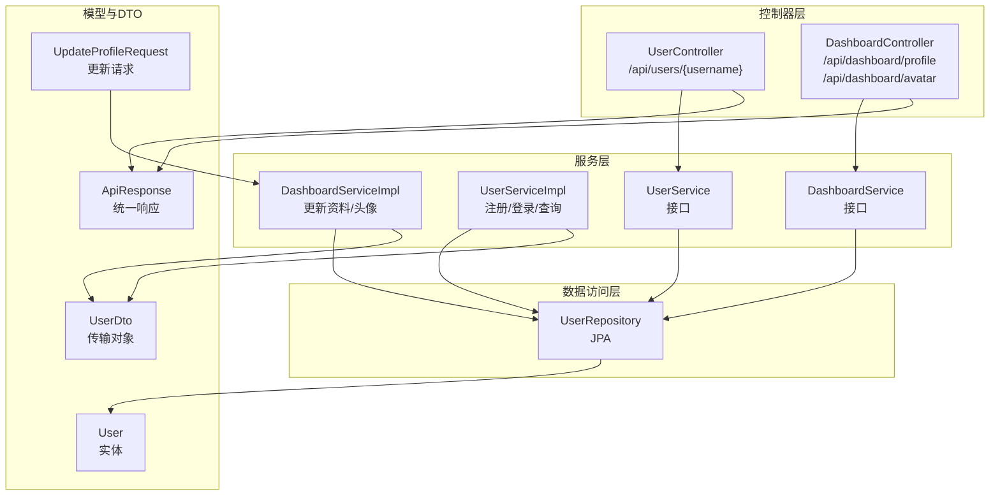
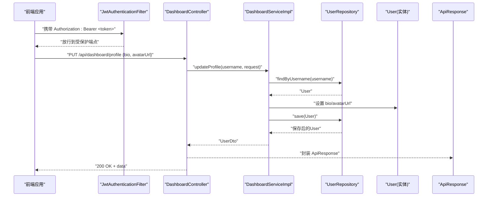
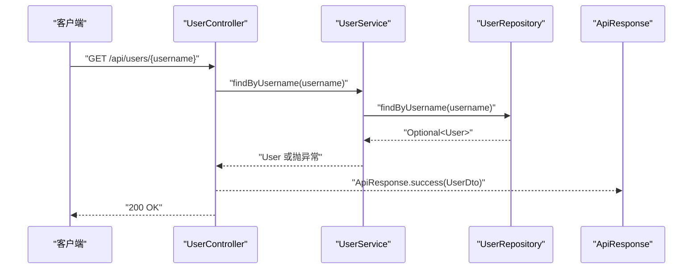
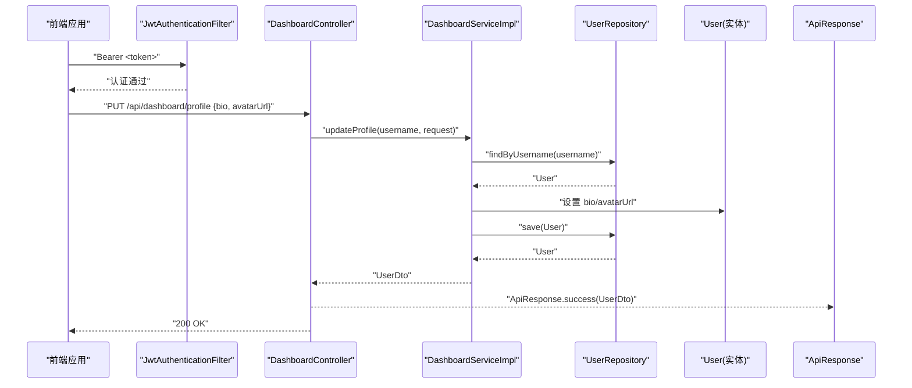
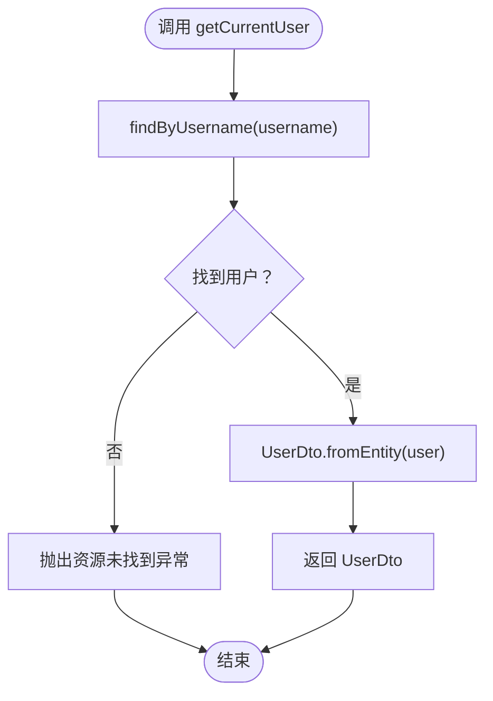
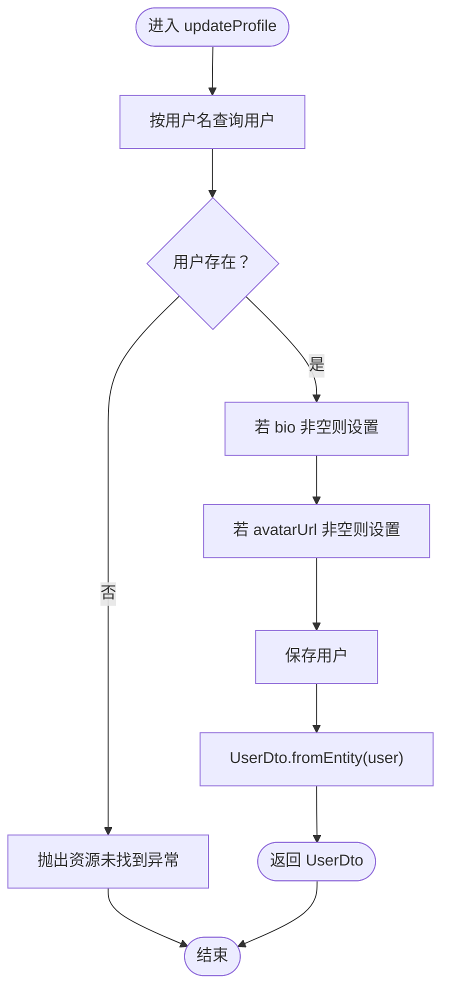
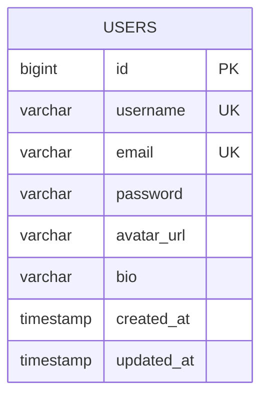
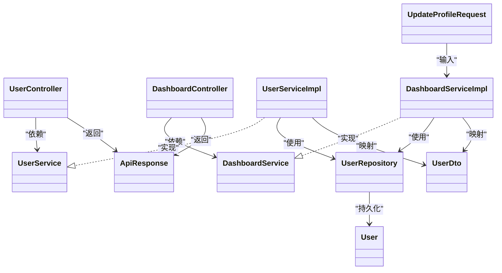

# 用户资料管理

<cite>
**本文引用的文件**
- [UserController.java](file://communication-backend/src/main/java/com/communication/controller/UserController.java)
- [DashboardController.java](file://communication-backend/src/main/java/com/communication/controller/DashboardController.java)
- [UserServiceImpl.java](file://communication-backend/src/main/java/com/communication/service/impl/UserServiceImpl.java)
- [DashboardServiceImpl.java](file://communication-backend/src/main/java/com/communication/service/impl/DashboardServiceImpl.java)
- [UserService.java](file://communication-backend/src/main/java/com/communication/service/UserService.java)
- [DashboardService.java](file://communication-backend/src/main/java/com/communication/service/DashboardService.java)
- [User.java](file://communication-backend/src/main/java/com/communication/entity/User.java)
- [UserDto.java](file://communication-backend/src/main/java/com/communication/dto/UserDto.java)
- [UpdateProfileRequest.java](file://communication-backend/src/main/java/com/communication/dto/UpdateProfileRequest.java)
- [ApiResponse.java](file://communication-backend/src/main/java/com/communication/dto/ApiResponse.java)
- [UserRepository.java](file://communication-backend/src/main/java/com/communication/repository/UserRepository.java)
- [JwtAuthenticationFilter.java](file://communication-backend/src/main/java/com/communication/config/JwtAuthenticationFilter.java)
- [V1__init_users.sql](file://communication-backend/src/main/resources/db/migration/V1__init_users.sql)
- [user.ts](file://communication-frontend/src/api/user.ts)
- [UserServiceTest.java](file://communication-backend/src/test/java/com/communication/service/UserServiceTest.java)
</cite>

## 目录
1. [引言](#引言)
2. [项目结构](#项目结构)
3. [核心组件](#核心组件)
4. [架构总览](#架构总览)
5. [详细组件分析](#详细组件分析)
6. [依赖关系分析](#依赖关系分析)
7. [性能考虑](#性能考虑)
8. [故障排查指南](#故障排查指南)
9. [结论](#结论)
10. [附录：API 接口文档](#附录api-接口文档)

## 引言
本文件围绕“用户资料管理”功能，系统梳理后端控制器、服务层与数据模型之间的协作关系，重点覆盖以下目标：
- 用户个人资料的查看与编辑流程
- UserController 中 /api/users/{username} 端点的实现逻辑（含鉴权与数据返回）
- UserServiceImpl 与 DashboardServiceImpl 的用户资料查询与更新方法
- User 实体模型的字段定义、约束与业务规则
- 完整的 API 接口文档（请求参数、响应格式、权限控制）
- 基于现有代码的使用场景与扩展建议

## 项目结构
后端采用分层架构：
- 控制器层：处理 HTTP 请求，负责路由与响应封装
- 服务层：编排业务逻辑，执行数据校验与持久化
- 数据访问层：通过 JPA Repository 访问数据库
- DTO 层：传输对象，用于 API 响应与请求参数
- 实体层：数据库映射对象
- 配置层：安全过滤器与跨域配置

图表来源
- [UserController.java](file://communication-backend/src/main/java/com/communication/controller/UserController.java#L10-L25)
- [DashboardController.java](file://communication-backend/src/main/java/com/communication/controller/DashboardController.java#L13-L64)
- [UserServiceImpl.java](file://communication-backend/src/main/java/com/communication/service/impl/UserServiceImpl.java#L15-L85)
- [DashboardServiceImpl.java](file://communication-backend/src/main/java/com/communication/service/impl/DashboardServiceImpl.java#L17-L86)
- [UserRepository.java](file://communication-backend/src/main/java/com/communication/repository/UserRepository.java#L13-L26)
- [User.java](file://communication-backend/src/main/java/com/communication/entity/User.java#L9-L50)
- [UserDto.java](file://communication-backend/src/main/java/com/communication/dto/UserDto.java#L7-L48)
- [UpdateProfileRequest.java](file://communication-backend/src/main/java/com/communication/dto/UpdateProfileRequest.java#L5-L18)
- [ApiResponse.java](file://communication-backend/src/main/java/com/communication/dto/ApiResponse.java#L8-L56)

章节来源
- [UserController.java](file://communication-backend/src/main/java/com/communication/controller/UserController.java#L10-L25)
- [DashboardController.java](file://communication-backend/src/main/java/com/communication/controller/DashboardController.java#L13-L64)
- [UserServiceImpl.java](file://communication-backend/src/main/java/com/communication/service/impl/UserServiceImpl.java#L15-L85)
- [DashboardServiceImpl.java](file://communication-backend/src/main/java/com/communication/service/impl/DashboardServiceImpl.java#L17-L86)
- [UserRepository.java](file://communication-backend/src/main/java/com/communication/repository/UserRepository.java#L13-L26)
- [User.java](file://communication-backend/src/main/java/com/communication/entity/User.java#L9-L50)
- [UserDto.java](file://communication-backend/src/main/java/com/communication/dto/UserDto.java#L7-L48)
- [UpdateProfileRequest.java](file://communication-backend/src/main/java/com/communication/dto/UpdateProfileRequest.java#L5-L18)
- [ApiResponse.java](file://communication-backend/src/main/java/com/communication/dto/ApiResponse.java#L8-L56)

## 核心组件
- 控制器
  - UserController：提供按用户名查询用户的公开端点
  - DashboardController：提供更新个人资料与上传头像的受保护端点
- 服务层
  - UserService/UserServiceImpl：用户注册、登录、按用户名查询
  - DashboardService/DashboardServiceImpl：统计、更新个人资料、更新头像
- 数据模型与 DTO
  - User：用户实体，包含基础字段与时间戳
  - UserDto：对外传输对象
  - UpdateProfileRequest：更新个人资料的请求体
  - ApiResponse：统一响应包装
- 数据访问
  - UserRepository：基于 Spring Data JPA 的用户数据访问

章节来源
- [UserController.java](file://communication-backend/src/main/java/com/communication/controller/UserController.java#L10-L25)
- [DashboardController.java](file://communication-backend/src/main/java/com/communication/controller/DashboardController.java#L13-L64)
- [UserService.java](file://communication-backend/src/main/java/com/communication/service/UserService.java#L6-L19)
- [UserServiceImpl.java](file://communication-backend/src/main/java/com/communication/service/impl/UserServiceImpl.java#L15-L85)
- [DashboardService.java](file://communication-backend/src/main/java/com/communication/service/DashboardService.java#L7-L14)
- [DashboardServiceImpl.java](file://communication-backend/src/main/java/com/communication/service/impl/DashboardServiceImpl.java#L17-L86)
- [User.java](file://communication-backend/src/main/java/com/communication/entity/User.java#L9-L50)
- [UserDto.java](file://communication-backend/src/main/java/com/communication/dto/UserDto.java#L7-L48)
- [UpdateProfileRequest.java](file://communication-backend/src/main/java/com/communication/dto/UpdateProfileRequest.java#L5-L18)
- [ApiResponse.java](file://communication-backend/src/main/java/com/communication/dto/ApiResponse.java#L8-L56)
- [UserRepository.java](file://communication-backend/src/main/java/com/communication/repository/UserRepository.java#L13-L26)

## 架构总览
用户资料管理涉及两条主要路径：
- 公开查询：通过 UserController 获取用户信息
- 受保护更新：通过 DashboardController 更新个人资料或头像，需要 JWT 鉴权

图表来源
- [JwtAuthenticationFilter.java](file://communication-backend/src/main/java/com/communication/config/JwtAuthenticationFilter.java#L31-L67)
- [DashboardController.java](file://communication-backend/src/main/java/com/communication/controller/DashboardController.java#L48-L54)
- [DashboardServiceImpl.java](file://communication-backend/src/main/java/com/communication/service/impl/DashboardServiceImpl.java#L59-L74)
- [UserRepository.java](file://communication-backend/src/main/java/com/communication/repository/UserRepository.java#L16-L18)
- [User.java](file://communication-backend/src/main/java/com/communication/entity/User.java#L13-L38)
- [ApiResponse.java](file://communication-backend/src/main/java/com/communication/dto/ApiResponse.java#L32-L39)

## 详细组件分析

### UserController：按用户名查询用户
- 路径与方法
  - GET /api/users/{username}
- 处理流程
  - 从 UserService 查询用户
  - 将 User 映射为 UserDto
  - 使用 ApiResponse 包装并返回 200 OK
- 权限与安全
  - 当前实现未显式进行权限校验；该端点为公开查询
- 错误处理
  - 若用户不存在，UserService.findByUsername 抛出资源未找到异常

图表来源
- [UserController.java](file://communication-backend/src/main/java/com/communication/controller/UserController.java#L20-L24)
- [UserServiceImpl.java](file://communication-backend/src/main/java/com/communication/service/impl/UserServiceImpl.java#L70-L74)
- [UserRepository.java](file://communication-backend/src/main/java/com/communication/repository/UserRepository.java#L16-L18)
- [UserDto.java](file://communication-backend/src/main/java/com/communication/dto/UserDto.java#L39-L48)
- [ApiResponse.java](file://communication-backend/src/main/java/com/communication/dto/ApiResponse.java#L32-L39)

章节来源
- [UserController.java](file://communication-backend/src/main/java/com/communication/controller/UserController.java#L10-L25)
- [UserServiceImpl.java](file://communication-backend/src/main/java/com/communication/service/impl/UserServiceImpl.java#L70-L74)
- [UserRepository.java](file://communication-backend/src/main/java/com/communication/repository/UserRepository.java#L16-L18)
- [UserDto.java](file://communication-backend/src/main/java/com/communication/dto/UserDto.java#L39-L48)
- [ApiResponse.java](file://communication-backend/src/main/java/com/communication/dto/ApiResponse.java#L32-L39)

### DashboardController：更新个人资料与头像
- 路径与方法
  - PUT /api/dashboard/profile
  - POST /api/dashboard/avatar
- 处理流程
  - 通过 Authentication 获取当前用户名
  - 调用 DashboardServiceImpl 执行更新
  - 返回 ApiResponse 包装的 UserDto
- 权限与安全
  - 通过 JwtAuthenticationFilter 进行 JWT 校验，仅允许已认证用户访问
- 参数与校验
  - 更新个人资料：UpdateProfileRequest（可选字段：bio、avatarUrl）
  - 上传头像：multipart/form-data，字段名为 file

图表来源
- [JwtAuthenticationFilter.java](file://communication-backend/src/main/java/com/communication/config/JwtAuthenticationFilter.java#L31-L67)
- [DashboardController.java](file://communication-backend/src/main/java/com/communication/controller/DashboardController.java#L48-L54)
- [DashboardServiceImpl.java](file://communication-backend/src/main/java/com/communication/service/impl/DashboardServiceImpl.java#L59-L74)
- [UserRepository.java](file://communication-backend/src/main/java/com/communication/repository/UserRepository.java#L16-L18)
- [User.java](file://communication-backend/src/main/java/com/communication/entity/User.java#L13-L38)
- [ApiResponse.java](file://communication-backend/src/main/java/com/communication/dto/ApiResponse.java#L32-L39)

章节来源
- [DashboardController.java](file://communication-backend/src/main/java/com/communication/controller/DashboardController.java#L48-L63)
- [DashboardServiceImpl.java](file://communication-backend/src/main/java/com/communication/service/impl/DashboardServiceImpl.java#L59-L85)
- [JwtAuthenticationFilter.java](file://communication-backend/src/main/java/com/communication/config/JwtAuthenticationFilter.java#L31-L67)
- [UpdateProfileRequest.java](file://communication-backend/src/main/java/com/communication/dto/UpdateProfileRequest.java#L5-L18)
- [UserRepository.java](file://communication-backend/src/main/java/com/communication/repository/UserRepository.java#L16-L18)

### UserServiceImpl：用户资料相关方法
- 方法概览
  - getCurrentUser(String username)：根据用户名获取当前用户并映射为 UserDto
  - findByUsername(String username)：按用户名查询用户，不存在则抛异常
  - existsByUsername/existsByEmail：存在性检查
  - register/login：注册与登录（与资料管理相关）
- 数据流
  - 通过 UserRepository 完成查询与保存
  - 使用 UserDto.fromEntity 进行对象转换
- 异常处理
  - 资源未找到：ResourceNotFoundException
  - 注册重复：BadRequestException

图表来源
- [UserServiceImpl.java](file://communication-backend/src/main/java/com/communication/service/impl/UserServiceImpl.java#L64-L68)
- [UserServiceImpl.java](file://communication-backend/src/main/java/com/communication/service/impl/UserServiceImpl.java#L70-L74)
- [UserDto.java](file://communication-backend/src/main/java/com/communication/dto/UserDto.java#L39-L48)

章节来源
- [UserServiceImpl.java](file://communication-backend/src/main/java/com/communication/service/impl/UserServiceImpl.java#L64-L85)
- [UserService.java](file://communication-backend/src/main/java/com/communication/service/UserService.java#L12-L18)
- [UserDto.java](file://communication-backend/src/main/java/com/communication/dto/UserDto.java#L39-L48)

### DashboardServiceImpl：个人资料更新与头像更新
- 方法概览
  - updateProfile(String username, UpdateProfileRequest)：更新 bio 与 avatarUrl
  - updateAvatar(String username, String avatarUrl)：仅更新头像 URL
- 数据流
  - 按用户名查询用户
  - 设置对应字段（若请求体非空）
  - 保存并返回 UserDto
- 并发与事务
  - 使用 @Transactional 保证更新原子性

图表来源
- [DashboardServiceImpl.java](file://communication-backend/src/main/java/com/communication/service/impl/DashboardServiceImpl.java#L59-L74)
- [UserRepository.java](file://communication-backend/src/main/java/com/communication/repository/UserRepository.java#L16-L18)
- [User.java](file://communication-backend/src/main/java/com/communication/entity/User.java#L13-L38)
- [UserDto.java](file://communication-backend/src/main/java/com/communication/dto/UserDto.java#L39-L48)

章节来源
- [DashboardServiceImpl.java](file://communication-backend/src/main/java/com/communication/service/impl/DashboardServiceImpl.java#L59-L85)
- [UpdateProfileRequest.java](file://communication-backend/src/main/java/com/communication/dto/UpdateProfileRequest.java#L5-L18)

### User 实体模型设计
- 字段定义与约束
  - id：主键，自增
  - username：非空、唯一，长度上限 50
  - email：非空、唯一，长度上限 100
  - password：非空
  - avatarUrl：可空，长度上限 500
  - bio：可空，长度上限 500
  - created_at/updated_at：自动维护时间戳
- 索引
  - 对 username 与 email 建有索引，提升查询性能
- 业务规则
  - 注册时需确保 username 与 email 唯一
  - 登录时支持以 username 或 email 进行凭据匹配

图表来源
- [User.java](file://communication-backend/src/main/java/com/communication/entity/User.java#L13-L38)
- [V1__init_users.sql](file://communication-backend/src/main/resources/db/migration/V1__init_users.sql#L2-L13)

章节来源
- [User.java](file://communication-backend/src/main/java/com/communication/entity/User.java#L9-L50)
- [V1__init_users.sql](file://communication-backend/src/main/resources/db/migration/V1__init_users.sql#L1-L14)

### DTO 与统一响应
- UserDto
  - 用于对外传输用户基本信息（不包含敏感字段如密码）
  - 提供 fromEntity 工厂方法
- UpdateProfileRequest
  - 支持可选更新 bio 与 avatarUrl
  - bio 最大长度限制
- ApiResponse
  - 统一响应结构，包含 code、message、data、timestamp
  - 提供 success/error 工厂方法

章节来源
- [UserDto.java](file://communication-backend/src/main/java/com/communication/dto/UserDto.java#L7-L48)
- [UpdateProfileRequest.java](file://communication-backend/src/main/java/com/communication/dto/UpdateProfileRequest.java#L5-L18)
- [ApiResponse.java](file://communication-backend/src/main/java/com/communication/dto/ApiResponse.java#L8-L56)

## 依赖关系分析
- 控制器依赖服务接口，服务实现依赖仓库接口
- 实体与 DTO 之间通过工厂方法进行转换
- 统一响应包装贯穿控制器层

图表来源
- [UserController.java](file://communication-backend/src/main/java/com/communication/controller/UserController.java#L10-L25)
- [DashboardController.java](file://communication-backend/src/main/java/com/communication/controller/DashboardController.java#L13-L64)
- [UserService.java](file://communication-backend/src/main/java/com/communication/service/UserService.java#L6-L19)
- [UserServiceImpl.java](file://communication-backend/src/main/java/com/communication/service/impl/UserServiceImpl.java#L15-L85)
- [DashboardService.java](file://communication-backend/src/main/java/com/communication/service/DashboardService.java#L7-L14)
- [DashboardServiceImpl.java](file://communication-backend/src/main/java/com/communication/service/impl/DashboardServiceImpl.java#L17-L86)
- [UserRepository.java](file://communication-backend/src/main/java/com/communication/repository/UserRepository.java#L13-L26)
- [User.java](file://communication-backend/src/main/java/com/communication/entity/User.java#L9-L50)
- [UserDto.java](file://communication-backend/src/main/java/com/communication/dto/UserDto.java#L7-L48)
- [UpdateProfileRequest.java](file://communication-backend/src/main/java/com/communication/dto/UpdateProfileRequest.java#L5-L18)
- [ApiResponse.java](file://communication-backend/src/main/java/com/communication/dto/ApiResponse.java#L8-L56)

章节来源
- [UserServiceImpl.java](file://communication-backend/src/main/java/com/communication/service/impl/UserServiceImpl.java#L15-L85)
- [DashboardServiceImpl.java](file://communication-backend/src/main/java/com/communication/service/impl/DashboardServiceImpl.java#L17-L86)
- [UserRepository.java](file://communication-backend/src/main/java/com/communication/repository/UserRepository.java#L13-L26)

## 性能考虑
- 索引优化
  - users 表对 username 与 email 建有索引，有利于高频查询
- 查询与更新
  - 按用户名查询与更新均走单字段索引，复杂度 O(log N)
- DTO 映射
  - 使用 fromEntity 减少重复字段拷贝，降低内存占用
- 事务边界
  - 更新资料与头像使用 @Transactional，避免部分更新状态

章节来源
- [V1__init_users.sql](file://communication-backend/src/main/resources/db/migration/V1__init_users.sql#L11-L12)
- [DashboardServiceImpl.java](file://communication-backend/src/main/java/com/communication/service/impl/DashboardServiceImpl.java#L59-L85)

## 故障排查指南
- 用户不存在
  - 现象：查询或更新时抛出资源未找到异常
  - 排查：确认用户名是否正确；检查数据库是否存在该用户
- JWT 无效或缺失
  - 现象：受保护端点返回 401 或被拒绝
  - 排查：确认 Authorization 头格式为 Bearer <token>；检查 token 是否过期或签名有效
- 请求参数校验失败
  - 现象：更新个人资料时返回参数错误
  - 排查：确认 bio 长度不超过限制；avatarUrl 格式正确
- 单元测试参考
  - 注册/登录成功与失败场景、用户名或邮箱重复等边界情况

章节来源
- [JwtAuthenticationFilter.java](file://communication-backend/src/main/java/com/communication/config/JwtAuthenticationFilter.java#L31-L67)
- [UpdateProfileRequest.java](file://communication-backend/src/main/java/com/communication/dto/UpdateProfileRequest.java#L7-L8)
- [UserServiceTest.java](file://communication-backend/src/test/java/com/communication/service/UserServiceTest.java#L84-L107)

## 结论
- 用户资料管理功能由公开查询与受保护更新两部分组成
- 控制器层负责路由与响应封装，服务层承担业务编排与数据校验
- User 实体与 DTO 明确分离，便于扩展与演进
- 建议后续在 UserController 上增加鉴权校验，并补充更完善的字段校验与审计日志

## 附录：API 接口文档

### 公开查询
- GET /api/users/{username}
  - 功能：按用户名查询用户信息
  - 权限：匿名可访问
  - 成功响应：200 OK，data 为 UserDto
  - 失败响应：404 Not Found（用户不存在）

章节来源
- [UserController.java](file://communication-backend/src/main/java/com/communication/controller/UserController.java#L20-L24)
- [UserServiceImpl.java](file://communication-backend/src/main/java/com/communication/service/impl/UserServiceImpl.java#L70-L74)
- [ApiResponse.java](file://communication-backend/src/main/java/com/communication/dto/ApiResponse.java#L32-L39)
- [UserDto.java](file://communication-backend/src/main/java/com/communication/dto/UserDto.java#L39-L48)

### 受保护更新
- PUT /api/dashboard/profile
  - 功能：更新个人资料（可选更新 bio 与 avatarUrl）
  - 权限：Bearer JWT
  - 请求体：UpdateProfileRequest（JSON）
    - bio：字符串，最大长度 200
    - avatarUrl：字符串，可空
  - 成功响应：200 OK，data 为 UserDto
  - 失败响应：404 Not Found（用户不存在）或 400 Bad Request（参数错误）

- POST /api/dashboard/avatar
  - 功能：上传头像并更新头像 URL
  - 权限：Bearer JWT
  - 请求体：multipart/form-data
    - file：二进制文件
  - 成功响应：200 OK，data 为 UserDto
  - 失败响应：404 Not Found（用户不存在）

章节来源
- [DashboardController.java](file://communication-backend/src/main/java/com/communication/controller/DashboardController.java#L48-L63)
- [DashboardServiceImpl.java](file://communication-backend/src/main/java/com/communication/service/impl/DashboardServiceImpl.java#L59-L85)
- [JwtAuthenticationFilter.java](file://communication-backend/src/main/java/com/communication/config/JwtAuthenticationFilter.java#L31-L67)
- [UpdateProfileRequest.java](file://communication-backend/src/main/java/com/communication/dto/UpdateProfileRequest.java#L5-L18)
- [ApiResponse.java](file://communication-backend/src/main/java/com/communication/dto/ApiResponse.java#L32-L39)
- [UserDto.java](file://communication-backend/src/main/java/com/communication/dto/UserDto.java#L39-L48)

### 前端对接参考
- 前端用户模块示例接口
  - getUserByUsername(username: string)
  - getUserById(id: number)

章节来源
- [user.ts](file://communication-frontend/src/api/user.ts#L12-L20)