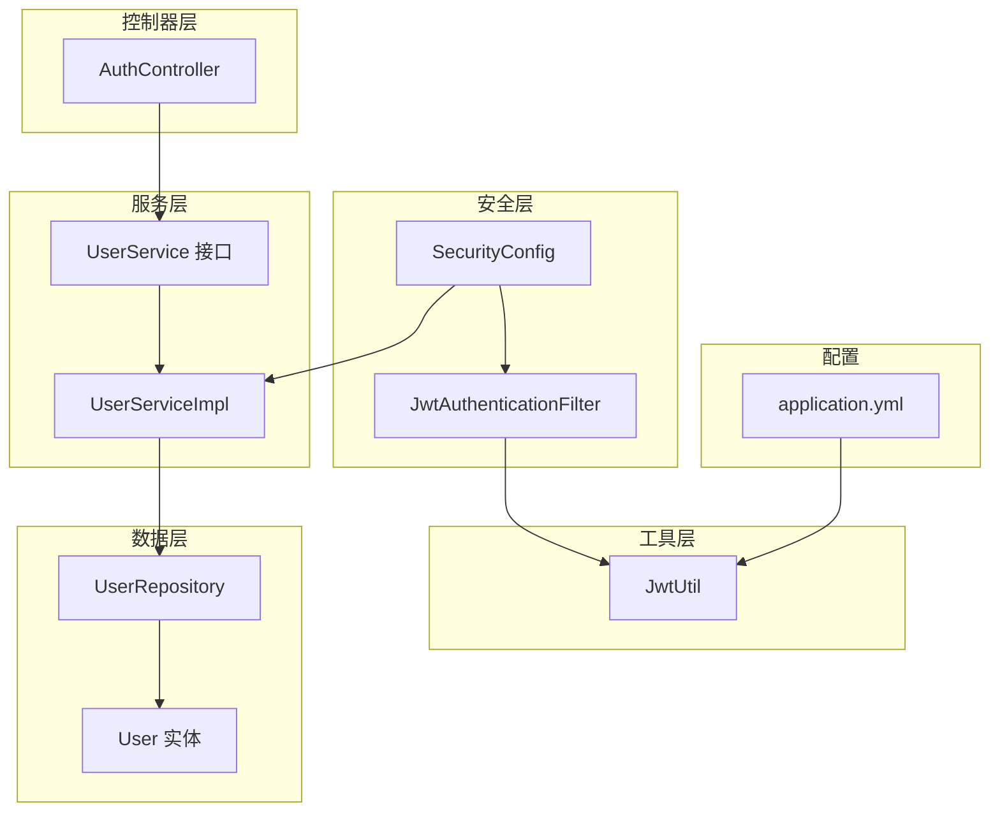
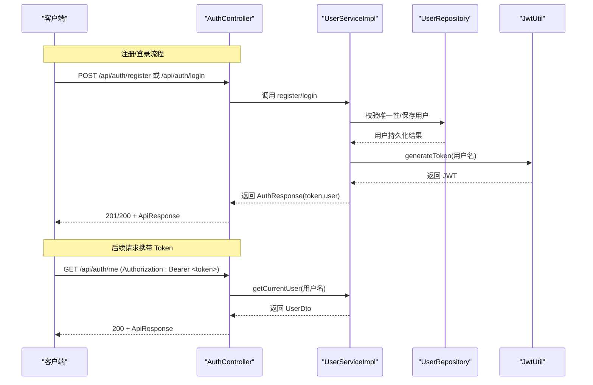
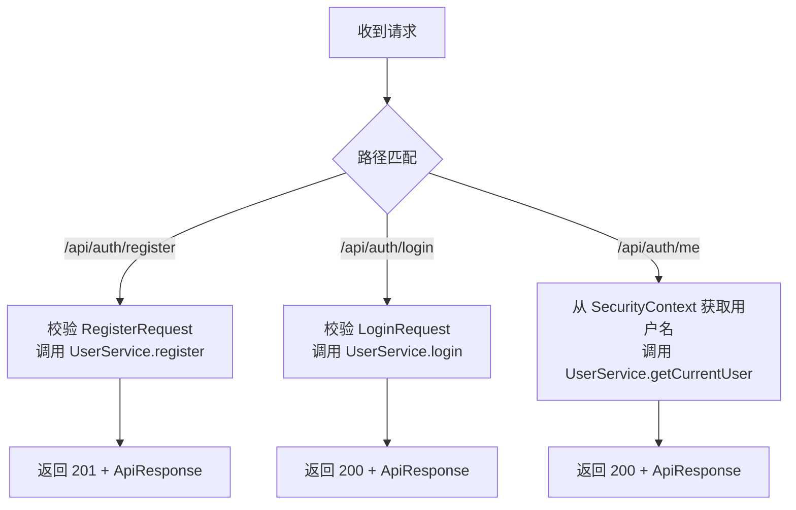
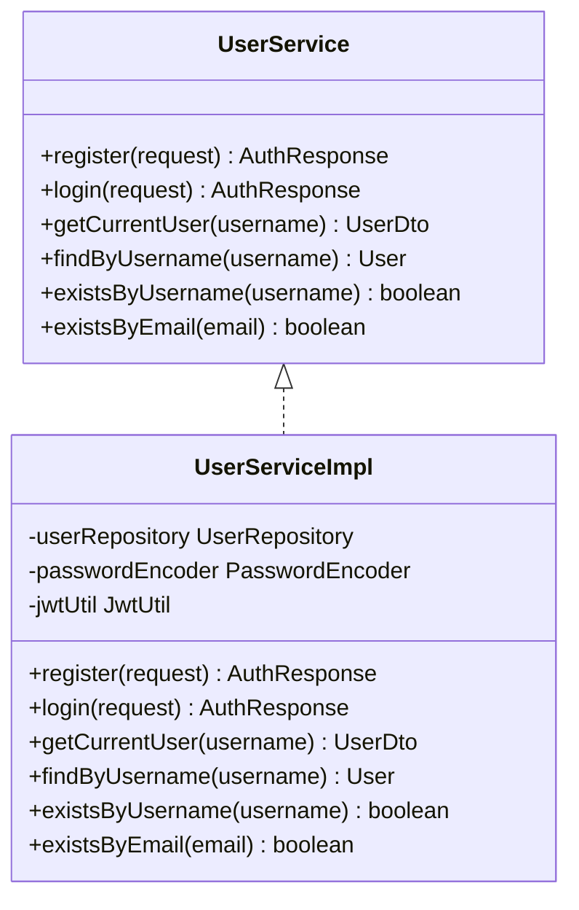
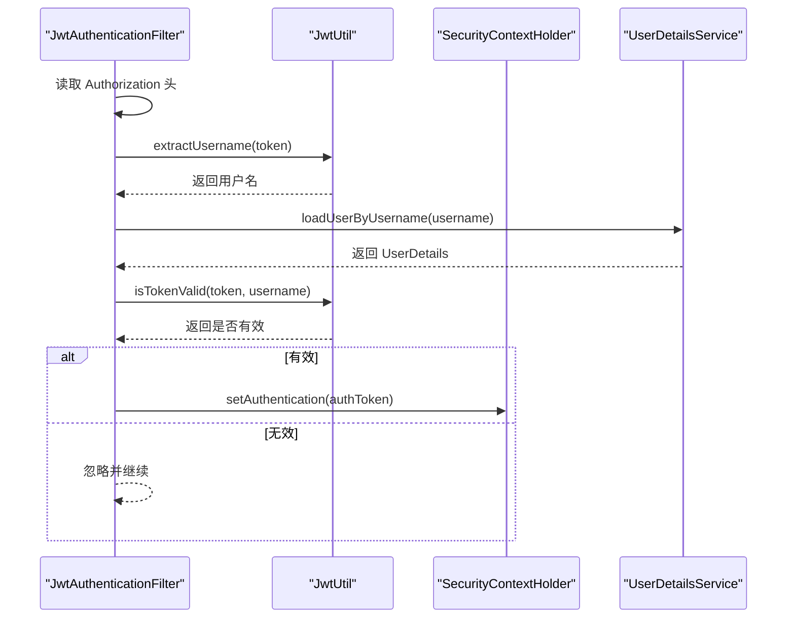
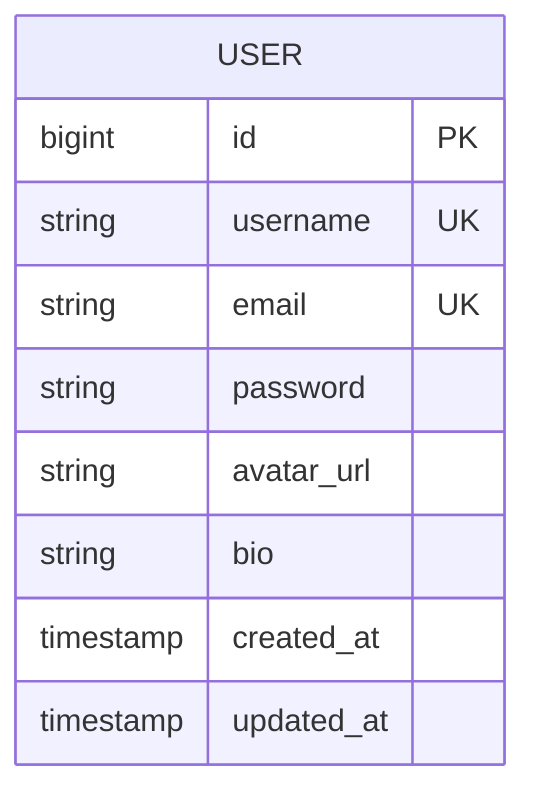
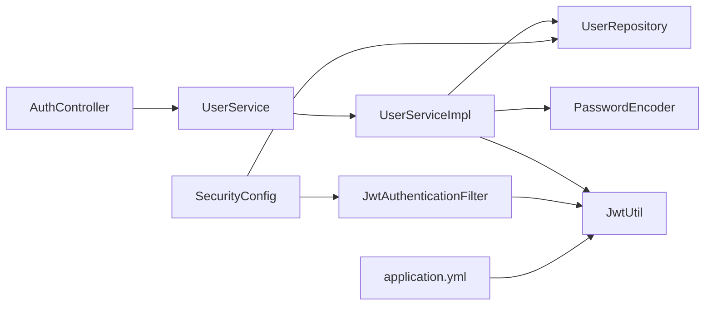
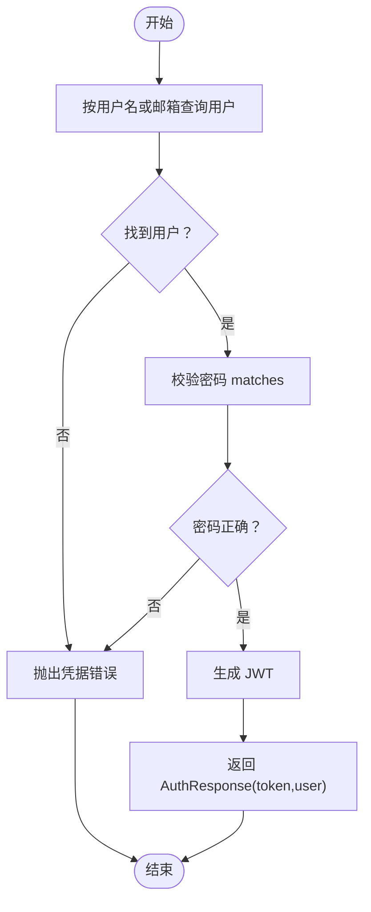

# 认证机制

<cite>
**本文引用的文件**
- [AuthController.java](file://communication-backend/src/main/java/com/communication/controller/AuthController.java)
- [UserService.java](file://communication-backend/src/main/java/com/communication/service/UserService.java)
- [UserServiceImpl.java](file://communication-backend/src/main/java/com/communication/service/impl/UserServiceImpl.java)
- [JwtUtil.java](file://communication-backend/src/main/java/com/communication/util/JwtUtil.java)
- [JwtAuthenticationFilter.java](file://communication-backend/src/main/java/com/communication/config/JwtAuthenticationFilter.java)
- [SecurityConfig.java](file://communication-backend/src/main/java/com/communication/config/SecurityConfig.java)
- [AuthResponse.java](file://communication-backend/src/main/java/com/communication/dto/AuthResponse.java)
- [LoginRequest.java](file://communication-backend/src/main/java/com/communication/dto/LoginRequest.java)
- [RegisterRequest.java](file://communication-backend/src/main/java/com/communication/dto/RegisterRequest.java)
- [UserDto.java](file://communication-backend/src/main/java/com/communication/dto/UserDto.java)
- [User.java](file://communication-backend/src/main/java/com/communication/entity/User.java)
- [UserRepository.java](file://communication-backend/src/main/java/com/communication/repository/UserRepository.java)
- [application.yml](file://communication-backend/src/main/resources/application.yml)
- [auth.ts](file://communication-frontend/src/api/auth.ts)
- [auth.ts（Pinia Store）](file://communication-frontend/src/stores/auth.ts)
- [UserServiceTest.java](file://communication-backend/src/test/java/com/communication/service/UserServiceTest.java)
</cite>

## 目录
1. [简介](#简介)
2. [项目结构](#项目结构)
3. [核心组件](#核心组件)
4. [架构总览](#架构总览)
5. [详细组件分析](#详细组件分析)
6. [依赖关系分析](#依赖关系分析)
7. [性能与安全考量](#性能与安全考量)
8. [故障排查指南](#故障排查指南)
9. [结论](#结论)
10. [附录：API 调用示例与错误处理](#附录api-调用示例与错误处理)

## 简介
本文件系统性阐述后端认证机制，围绕 JWT（JSON Web Token）的生成、验证与续期策略，详解用户注册与登录流程（含请求参数校验、密码加密、Token 返回），并解析 AuthController 与 UserService 的实现细节。同时提供前后端联调示例与常见错误处理建议，帮助开发者快速集成与排障。

## 项目结构
后端采用 Spring Boot + Spring Security 架构，认证相关代码集中在以下模块：
- 控制器层：AuthController 提供 /api/auth 下的注册、登录、当前用户查询接口
- 服务层：UserService 接口及其实现 UserServiceImpl，负责业务逻辑与数据访问
- 安全层：SecurityConfig 配置无状态认证；JwtAuthenticationFilter 解析 Authorization 头并注入认证上下文
- 工具层：JwtUtil 封装 JWT 的签发与解析
- 数据模型：User 实体、UserRepository 持久化、UserDto 对外传输对象
- 配置：application.yml 中定义 JWT 密钥与过期时间

图表来源
- [AuthController.java](file://communication-backend/src/main/java/com/communication/controller/AuthController.java#L1-L42)
- [UserService.java](file://communication-backend/src/main/java/com/communication/service/UserService.java#L1-L20)
- [UserServiceImpl.java](file://communication-backend/src/main/java/com/communication/service/impl/UserServiceImpl.java#L1-L86)
- [SecurityConfig.java](file://communication-backend/src/main/java/com/communication/config/SecurityConfig.java#L1-L86)
- [JwtAuthenticationFilter.java](file://communication-backend/src/main/java/com/communication/config/JwtAuthenticationFilter.java#L1-L65)
- [JwtUtil.java](file://communication-backend/src/main/java/com/communication/util/JwtUtil.java#L1-L67)
- [UserRepository.java](file://communication-backend/src/main/java/com/communication/repository/UserRepository.java#L1-L27)
- [User.java](file://communication-backend/src/main/java/com/communication/entity/User.java#L1-L96)
- [application.yml](file://communication-backend/src/main/resources/application.yml#L33-L36)

章节来源
- [AuthController.java](file://communication-backend/src/main/java/com/communication/controller/AuthController.java#L1-L42)
- [SecurityConfig.java](file://communication-backend/src/main/java/com/communication/config/SecurityConfig.java#L1-L86)
- [application.yml](file://communication-backend/src/main/resources/application.yml#L1-L42)

## 核心组件
- AuthController：暴露 /api/auth/register、/api/auth/login、/api/auth/me 三个端点，分别用于注册、登录与获取当前用户信息
- UserService 接口：定义注册、登录、获取当前用户、按用户名查找用户、判断用户名/邮箱是否存在等契约
- UserServiceImpl：实现注册/登录的核心逻辑，包含参数校验、重复性检查、密码加密、Token 生成与返回
- JwtUtil：封装 JWT 的签名密钥生成、Token 签发、载荷提取、有效性校验
- JwtAuthenticationFilter：从请求头 Authorization 中提取 Bearer Token，解析用户名并注入 Spring Security 上下文
- SecurityConfig：配置无状态会话、放行公开端点、添加 JWT 过滤器、设置密码编码器
- DTO 与实体：RegisterRequest/LoginRequest 参数校验，AuthResponse 统一响应载体，User/UserDto 实体与传输对象

章节来源
- [AuthController.java](file://communication-backend/src/main/java/com/communication/controller/AuthController.java#L12-L41)
- [UserService.java](file://communication-backend/src/main/java/com/communication/service/UserService.java#L6-L19)
- [UserServiceImpl.java](file://communication-backend/src/main/java/com/communication/service/impl/UserServiceImpl.java#L15-L86)
- [JwtUtil.java](file://communication-backend/src/main/java/com/communication/util/JwtUtil.java#L14-L67)
- [JwtAuthenticationFilter.java](file://communication-backend/src/main/java/com/communication/config/JwtAuthenticationFilter.java#L20-L65)
- [SecurityConfig.java](file://communication-backend/src/main/java/com/communication/config/SecurityConfig.java#L25-L86)
- [RegisterRequest.java](file://communication-backend/src/main/java/com/communication/dto/RegisterRequest.java#L1-L30)
- [LoginRequest.java](file://communication-backend/src/main/java/com/communication/dto/LoginRequest.java#L1-L20)
- [AuthResponse.java](file://communication-backend/src/main/java/com/communication/dto/AuthResponse.java#L1-L47)
- [User.java](file://communication-backend/src/main/java/com/communication/entity/User.java#L9-L38)
- [UserDto.java](file://communication-backend/src/main/java/com/communication/dto/UserDto.java#L7-L24)

## 架构总览
下图展示认证端到端流程：客户端发起注册/登录请求 → 控制器调用服务层 → 服务层持久化或校验用户 → 生成 JWT 并返回 → 前端存储 Token；后续请求由过滤器解析 Token 注入认证上下文，交由安全链路处理。

图表来源
- [AuthController.java](file://communication-backend/src/main/java/com/communication/controller/AuthController.java#L22-L40)
- [UserServiceImpl.java](file://communication-backend/src/main/java/com/communication/service/impl/UserServiceImpl.java#L28-L68)
- [UserRepository.java](file://communication-backend/src/main/java/com/communication/repository/UserRepository.java#L14-L22)
- [JwtUtil.java](file://communication-backend/src/main/java/com/communication/util/JwtUtil.java#L28-L35)

## 详细组件分析

### AuthController：端点与请求处理
- /api/auth/register
  - 请求体：RegisterRequest（用户名、邮箱、密码）
  - 处理：调用 UserService.register，返回 201 + ApiResponse<AuthResponse>
- /api/auth/login
  - 请求体：LoginRequest（用户名或邮箱、密码）
  - 处理：调用 UserService.login，返回 200 + ApiResponse<AuthResponse>
- /api/auth/me
  - 请求头：Authorization: Bearer <token>
  - 处理：通过 @AuthenticationPrincipal 获取当前用户，调用 UserService.getCurrentUser 返回 ApiResponse<UserDto>

图表来源
- [AuthController.java](file://communication-backend/src/main/java/com/communication/controller/AuthController.java#L22-L40)

章节来源
- [AuthController.java](file://communication-backend/src/main/java/com/communication/controller/AuthController.java#L12-L41)

### UserService 与 UserServiceImpl：认证与授权关键实现
- 注册 register(RegisterRequest)
  - 重复性检查：用户名与邮箱不存在
  - 密码加密：使用 PasswordEncoder 编码
  - 持久化：保存用户
  - Token 生成：以用户名签发 JWT
  - 返回：AuthResponse（token、tokenType、user）
- 登录 login(LoginRequest)
  - 查询用户：支持按用户名或邮箱查找
  - 密码校验：使用 PasswordEncoder.matches
  - Token 生成：以用户名签发 JWT
  - 返回：AuthResponse
- 当前用户 getCurrentUser(String username)
  - 通过用户名查找用户并转换为 UserDto
- 其他辅助
  - findByUsername：按用户名查找用户，不存在抛出资源未找到异常
  - existsByUsername/existsByEmail：存在性检查

图表来源
- [UserService.java](file://communication-backend/src/main/java/com/communication/service/UserService.java#L6-L19)
- [UserServiceImpl.java](file://communication-backend/src/main/java/com/communication/service/impl/UserServiceImpl.java#L15-L86)

章节来源
- [UserService.java](file://communication-backend/src/main/java/com/communication/service/UserService.java#L1-L20)
- [UserServiceImpl.java](file://communication-backend/src/main/java/com/communication/service/impl/UserServiceImpl.java#L28-L84)

### JWT 工具与过滤器：签发、解析与注入
- JwtUtil
  - generateToken(username)：签发带过期时间的 JWT
  - extractUsername(token)/extractExpiration(token)：提取载荷
  - isTokenValid(token, username)：校验用户名一致且未过期
- JwtAuthenticationFilter
  - 从 Authorization 头解析 Bearer Token
  - 使用 JwtUtil 提取用户名并校验有效性
  - 通过 UserDetailsService 加载用户详情，构建 UsernamePasswordAuthenticationToken 注入 SecurityContextHolder
- SecurityConfig
  - 无状态会话策略
  - 放行 /api/auth/** 与部分 GET 路径
  - 添加 JwtAuthenticationFilter 到过滤链

图表来源
- [JwtAuthenticationFilter.java](file://communication-backend/src/main/java/com/communication/config/JwtAuthenticationFilter.java#L27-L63)
- [JwtUtil.java](file://communication-backend/src/main/java/com/communication/util/JwtUtil.java#L37-L65)
- [SecurityConfig.java](file://communication-backend/src/main/java/com/communication/config/SecurityConfig.java#L63-L81)

章节来源
- [JwtUtil.java](file://communication-backend/src/main/java/com/communication/util/JwtUtil.java#L14-L67)
- [JwtAuthenticationFilter.java](file://communication-backend/src/main/java/com/communication/config/JwtAuthenticationFilter.java#L20-L65)
- [SecurityConfig.java](file://communication-backend/src/main/java/com/communication/config/SecurityConfig.java#L25-L86)

### 数据模型与持久化
- User 实体字段：id、username、email、password、avatarUrl、bio、createdAt、updatedAt
- UserRepository 提供按用户名/邮箱查询、存在性检查与关键词分页查询
- UserDto 作为对外传输对象，提供 fromEntity 工厂方法

图表来源
- [User.java](file://communication-backend/src/main/java/com/communication/entity/User.java#L9-L38)
- [UserRepository.java](file://communication-backend/src/main/java/com/communication/repository/UserRepository.java#L14-L25)

章节来源
- [User.java](file://communication-backend/src/main/java/com/communication/entity/User.java#L1-L96)
- [UserRepository.java](file://communication-backend/src/main/java/com/communication/repository/UserRepository.java#L1-L27)
- [UserDto.java](file://communication-backend/src/main/java/com/communication/dto/UserDto.java#L7-L24)

## 依赖关系分析
- 控制器依赖服务接口，服务实现依赖仓库、密码编码器与 JWT 工具
- 安全配置依赖用户仓库与 JWT 过滤器，过滤器依赖 JWT 工具与用户详情服务
- 应用配置提供 JWT 密钥与过期时长

图表来源
- [AuthController.java](file://communication-backend/src/main/java/com/communication/controller/AuthController.java#L16-L20)
- [UserServiceImpl.java](file://communication-backend/src/main/java/com/communication/service/impl/UserServiceImpl.java#L18-L26)
- [SecurityConfig.java](file://communication-backend/src/main/java/com/communication/config/SecurityConfig.java#L30-L31)
- [JwtAuthenticationFilter.java](file://communication-backend/src/main/java/com/communication/config/JwtAuthenticationFilter.java#L24-L25)
- [application.yml](file://communication-backend/src/main/resources/application.yml#L33-L36)

章节来源
- [AuthController.java](file://communication-backend/src/main/java/com/communication/controller/AuthController.java#L1-L42)
- [UserServiceImpl.java](file://communication-backend/src/main/java/com/communication/service/impl/UserServiceImpl.java#L1-L86)
- [SecurityConfig.java](file://communication-backend/src/main/java/com/communication/config/SecurityConfig.java#L1-L86)
- [JwtAuthenticationFilter.java](file://communication-backend/src/main/java/com/communication/config/JwtAuthenticationFilter.java#L1-L65)
- [application.yml](file://communication-backend/src/main/resources/application.yml#L33-L36)

## 性能与安全考量
- Token 过期时间：默认 24 小时，可在配置中调整
- 密码加密：使用 BCrypt，确保不可逆存储
- 无状态会话：禁用 Session，降低服务器状态管理开销
- 过滤器链：仅在必要路径执行认证，减少对静态资源与公开接口的影响
- 建议
  - 生产环境务必使用 HTTPS 传输
  - 密钥长度至少 256 位，妥善保管环境变量
  - 可考虑引入刷新 Token 机制（当前实现未包含刷新端点）

[本节为通用指导，不直接分析具体文件]

## 故障排查指南
- 注册失败（用户名已存在/邮箱已存在）
  - 触发条件：用户名或邮箱重复
  - 异常类型：BadRequestException
  - 前端提示：显示“用户名已存在”或“邮箱已存在”
- 登录失败（用户不存在/密码错误）
  - 触发条件：找不到用户或密码不匹配
  - 异常类型：BadCredentialsException
  - 前端提示：显示“账号或密码错误”
- Token 无效或过期
  - 触发条件：Authorization 头缺失、格式不正确或 Token 校验失败
  - 表现：过滤器忽略认证，需重新登录
- 资源未找到
  - 触发条件：按用户名查询用户不存在
  - 异常类型：ResourceNotFoundException
  - 前端提示：根据业务反馈“用户不存在”

章节来源
- [UserServiceImpl.java](file://communication-backend/src/main/java/com/communication/service/impl/UserServiceImpl.java#L31-L36)
- [UserServiceImpl.java](file://communication-backend/src/main/java/com/communication/service/impl/UserServiceImpl.java#L52-L58)
- [JwtAuthenticationFilter.java](file://communication-backend/src/main/java/com/communication/config/JwtAuthenticationFilter.java#L33-L38)
- [JwtAuthenticationFilter.java](file://communication-backend/src/main/java/com/communication/config/JwtAuthenticationFilter.java#L42-L60)
- [UserService.java](file://communication-backend/src/main/java/com/communication/service/UserService.java#L12-L14)

## 结论
该认证体系基于 Spring Security 与 JWT 实现，具备清晰的职责分离与可扩展性。注册/登录流程完整覆盖参数校验、重复性检查、密码加密与 Token 返回；JWT 过滤器在请求进入业务层前完成身份注入，保证后续接口的安全性。建议在生产环境中完善密钥管理、HTTPS 与刷新 Token 等安全措施，并结合前端 Pinia Store 完成 Token 的本地持久化与自动续传。

[本节为总结性内容，不直接分析具体文件]

## 附录：API 调用示例与错误处理

### 后端端点与请求体
- POST /api/auth/register
  - 请求体字段：username、email、password
  - 成功响应：201 Created，返回 ApiResponse<AuthResponse>
- POST /api/auth/login
  - 请求体字段：usernameOrEmail、password
  - 成功响应：200 OK，返回 ApiResponse<AuthResponse>
- GET /api/auth/me
  - 请求头：Authorization: Bearer <token>
  - 成功响应：200 OK，返回 ApiResponse<UserDto>

章节来源
- [AuthController.java](file://communication-backend/src/main/java/com/communication/controller/AuthController.java#L22-L40)
- [RegisterRequest.java](file://communication-backend/src/main/java/com/communication/dto/RegisterRequest.java#L7-L19)
- [LoginRequest.java](file://communication-backend/src/main/java/com/communication/dto/LoginRequest.java#L5-L11)
- [AuthResponse.java](file://communication-backend/src/main/java/com/communication/dto/AuthResponse.java#L3-L6)
- [UserDto.java](file://communication-backend/src/main/java/com/communication/dto/UserDto.java#L7-L13)

### 前端调用与状态管理
- 注册/登录成功后，将 token 与 user 写入 localStorage，并更新 Pinia store
- 获取当前用户：若 token 存在则调用 /api/auth/me 更新用户信息
- 登出：清除 token 与 user，提示“登出成功”

章节来源
- [auth.ts](file://communication-frontend/src/api/auth.ts#L36-L48)
- [auth.ts（Pinia Store）](file://communication-frontend/src/stores/auth.ts#L13-L77)

### 关键流程图：登录校验算法

图表来源
- [UserServiceImpl.java](file://communication-backend/src/main/java/com/communication/service/impl/UserServiceImpl.java#L51-L62)

### 单元测试要点（参考）
- 注册成功：用户名/邮箱不存在、保存成功、生成 Token
- 注册失败：用户名已存在、邮箱已存在
- 登录成功：用户名/邮箱均可登录、密码正确、生成 Token
- 登录失败：用户不存在、密码错误

章节来源
- [UserServiceTest.java](file://communication-backend/src/test/java/com/communication/service/UserServiceTest.java#L67-L157)