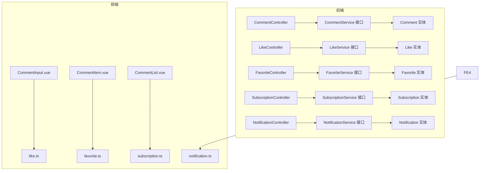
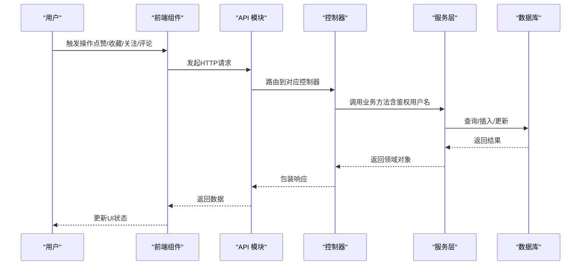
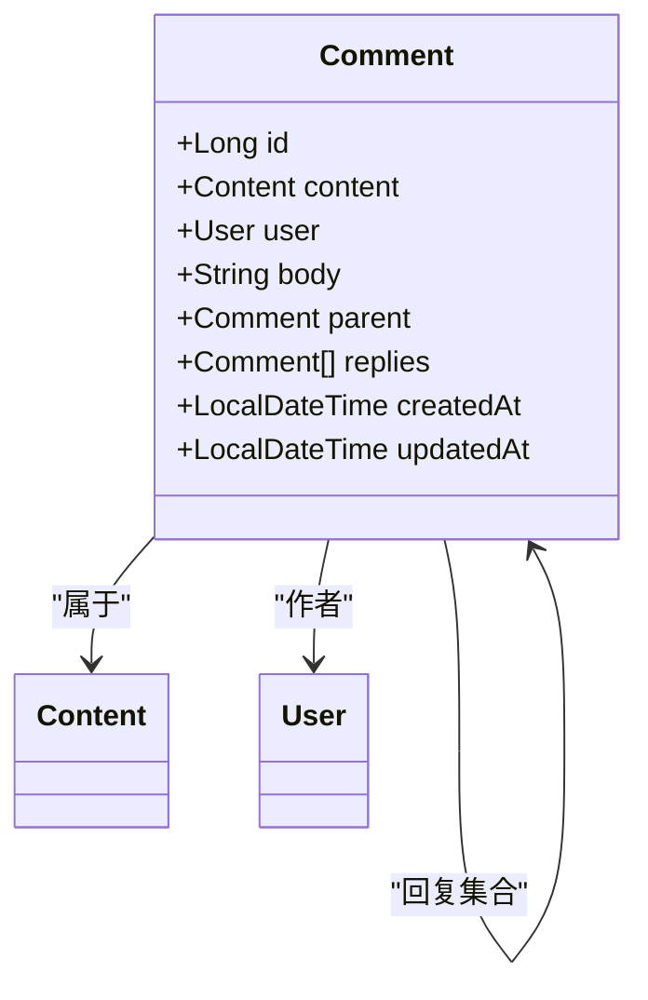
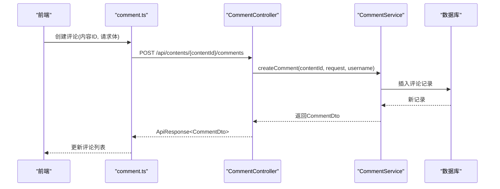
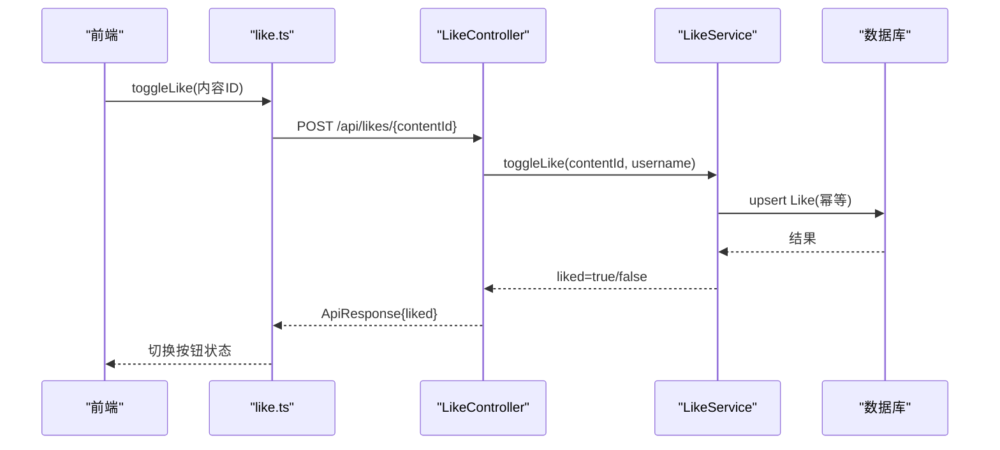
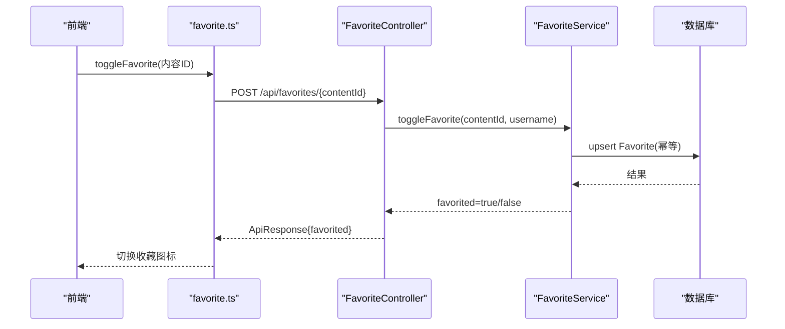
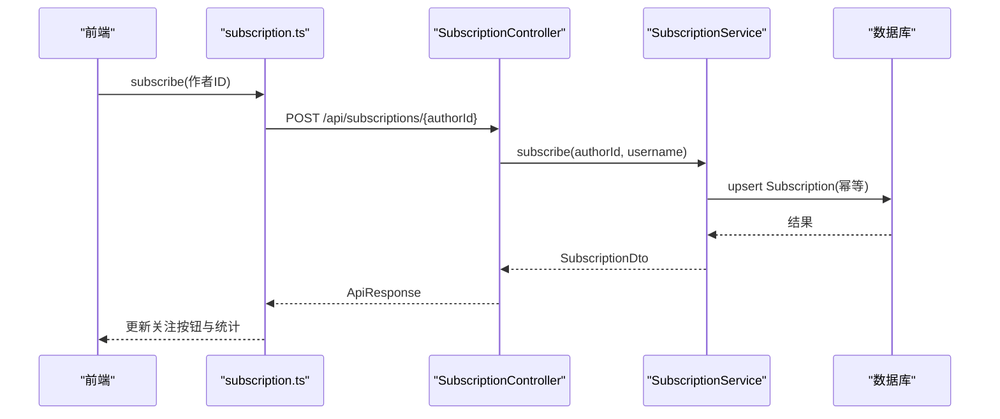
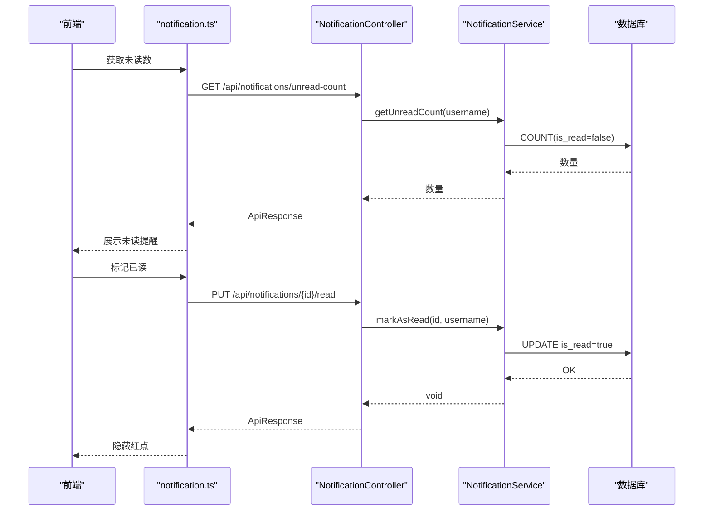
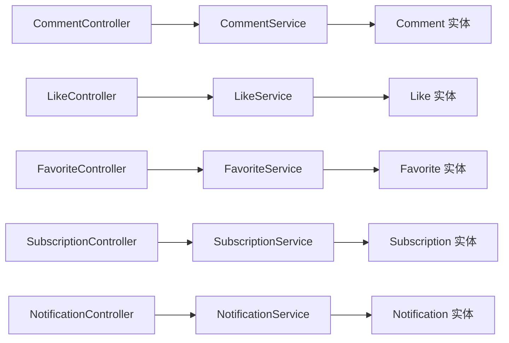

# 社交互动系统

<cite>
**本文引用的文件**
- [CommentController.java](file://communication-backend/src/main/java/com/communication/controller/CommentController.java)
- [LikeController.java](file://communication-backend/src/main/java/com/communication/controller/LikeController.java)
- [FavoriteController.java](file://communication-backend/src/main/java/com/communication/controller/FavoriteController.java)
- [SubscriptionController.java](file://communication-backend/src/main/java/com/communication/controller/SubscriptionController.java)
- [NotificationController.java](file://communication-backend/src/main/java/com/communication/controller/NotificationController.java)
- [CommentService.java](file://communication-backend/src/main/java/com/communication/service/CommentService.java)
- [LikeService.java](file://communication-backend/src/main/java/com/communication/service/LikeService.java)
- [FavoriteService.java](file://communication-backend/src/main/java/com/communication/service/FavoriteService.java)
- [SubscriptionService.java](file://communication-backend/src/main/java/com/communication/service/SubscriptionService.java)
- [NotificationService.java](file://communication-backend/src/main/java/com/communication/service/NotificationService.java)
- [Comment.java](file://communication-backend/src/main/java/com/communication/entity/Comment.java)
- [Like.java](file://communication-backend/src/main/java/com/communication/entity/Like.java)
- [Favorite.java](file://communication-backend/src/main/java/com/communication/entity/Favorite.java)
- [Subscription.java](file://communication-backend/src/main/java/com/communication/entity/Subscription.java)
- [Notification.java](file://communication-backend/src/main/java/com/communication/entity/Notification.java)
- [CommentInput.vue](file://communication-frontend/src/components/comment/CommentInput.vue)
- [CommentItem.vue](file://communication-frontend/src/components/comment/CommentItem.vue)
- [CommentList.vue](file://communication-frontend/src/components/comment/CommentList.vue)
- [like.ts](file://communication-frontend/src/api/like.ts)
- [favorite.ts](file://communication-frontend/src/api/favorite.ts)
- [subscription.ts](file://communication-frontend/src/api/subscription.ts)
- [notification.ts](file://communication-frontend/src/api/notification.ts)
</cite>

## 目录
1. [简介](#简介)
2. [项目结构](#项目结构)
3. [核心组件](#核心组件)
4. [架构总览](#架构总览)
5. [详细组件分析](#详细组件分析)
6. [依赖分析](#依赖分析)
7. [性能考虑](#性能考虑)
8. [故障排查指南](#故障排查指南)
9. [结论](#结论)
10. [附录](#附录)

## 简介
本文件面向社交互动系统，围绕评论、点赞、收藏、关注/取消关注以及通知等核心功能，提供从后端接口到前端组件的完整技术文档。重点覆盖：
- 嵌套评论与回复机制及权限控制
- 点赞/收藏的去重逻辑与统计更新
- 关注/取消关注与动态流生成
- 实时性与缓存策略建议
- 通知系统的集成方案（消息推送与未读提醒）
- 前端社交组件设计与交互要点
- 数据一致性与并发控制策略

## 项目结构
后端采用分层架构：控制器层负责HTTP接口与鉴权信息注入；服务层封装业务逻辑；实体层映射数据库表结构。前端采用Vue组件化组织，通过API模块与后端交互。

图表来源
- [CommentController.java:1-55](file://communication-backend/src/main/java/com/communication/controller/CommentController.java#L1-L55)
- [LikeController.java:1-47](file://communication-backend/src/main/java/com/communication/controller/LikeController.java#L1-L47)
- [FavoriteController.java:1-52](file://communication-backend/src/main/java/com/communication/controller/FavoriteController.java#L1-L52)
- [SubscriptionController.java:1-77](file://communication-backend/src/main/java/com/communication/controller/SubscriptionController.java#L1-L77)
- [NotificationController.java:1-47](file://communication-backend/src/main/java/com/communication/controller/NotificationController.java#L1-L47)
- [CommentService.java:1-19](file://communication-backend/src/main/java/com/communication/service/CommentService.java#L1-L19)
- [LikeService.java:1-19](file://communication-backend/src/main/java/com/communication/service/LikeService.java#L1-L19)
- [FavoriteService.java:1-21](file://communication-backend/src/main/java/com/communication/service/FavoriteService.java#L1-L21)
- [SubscriptionService.java:1-26](file://communication-backend/src/main/java/com/communication/service/SubscriptionService.java#L1-L26)
- [NotificationService.java:1-19](file://communication-backend/src/main/java/com/communication/service/NotificationService.java#L1-L19)
- [Comment.java:1-109](file://communication-backend/src/main/java/com/communication/entity/Comment.java#L1-L109)
- [Like.java:1-47](file://communication-backend/src/main/java/com/communication/entity/Like.java#L1-L47)
- [Favorite.java:1-47](file://communication-backend/src/main/java/com/communication/entity/Favorite.java#L1-L47)
- [Subscription.java:1-67](file://communication-backend/src/main/java/com/communication/entity/Subscription.java#L1-L67)
- [Notification.java:1-69](file://communication-backend/src/main/java/com/communication/entity/Notification.java#L1-L69)
- [CommentInput.vue](file://communication-frontend/src/components/comment/CommentInput.vue)
- [CommentItem.vue](file://communication-frontend/src/components/comment/CommentItem.vue)
- [CommentList.vue](file://communication-frontend/src/components/comment/CommentList.vue)
- [like.ts](file://communication-frontend/src/api/like.ts)
- [favorite.ts](file://communication-frontend/src/api/favorite.ts)
- [subscription.ts](file://communication-frontend/src/api/subscription.ts)
- [notification.ts](file://communication-frontend/src/api/notification.ts)

章节来源
- [CommentController.java:1-55](file://communication-backend/src/main/java/com/communication/controller/CommentController.java#L1-L55)
- [LikeController.java:1-47](file://communication-backend/src/main/java/com/communication/controller/LikeController.java#L1-L47)
- [FavoriteController.java:1-52](file://communication-backend/src/main/java/com/communication/controller/FavoriteController.java#L1-L52)
- [SubscriptionController.java:1-77](file://communication-backend/src/main/java/com/communication/controller/SubscriptionController.java#L1-L77)
- [NotificationController.java:1-47](file://communication-backend/src/main/java/com/communication/controller/NotificationController.java#L1-L47)

## 核心组件
- 评论系统：支持嵌套评论与回复，按内容维度分页查询，删除时进行权限校验。
- 点赞/收藏：提供单个与批量状态检查，支持我的列表分页查看与数量统计，具备幂等去重能力。
- 关注/取消关注：提供订阅关系管理、粉丝列表、关注数与粉丝数统计，以及订阅动态流生成。
- 通知系统：支持分页获取、未读计数、单条与全部标记已读。

章节来源
- [CommentService.java:1-19](file://communication-backend/src/main/java/com/communication/service/CommentService.java#L1-L19)
- [LikeService.java:1-19](file://communication-backend/src/main/java/com/communication/service/LikeService.java#L1-L19)
- [FavoriteService.java:1-21](file://communication-backend/src/main/java/com/communication/service/FavoriteService.java#L1-L21)
- [SubscriptionService.java:1-26](file://communication-backend/src/main/java/com/communication/service/SubscriptionService.java#L1-L26)
- [NotificationService.java:1-19](file://communication-backend/src/main/java/com/communication/service/NotificationService.java#L1-L19)

## 架构总览
后端以REST控制器为入口，统一返回包装对象；服务层处理业务规则与数据访问；实体层定义持久化模型。前端通过API模块调用后端接口，组件负责渲染与交互。

图表来源
- [LikeController.java:23-27](file://communication-backend/src/main/java/com/communication/controller/LikeController.java#L23-L27)
- [FavoriteController.java:23-27](file://communication-backend/src/main/java/com/communication/controller/FavoriteController.java#L23-L27)
- [SubscriptionController.java:19-25](file://communication-backend/src/main/java/com/communication/controller/SubscriptionController.java#L19-L25)
- [CommentController.java:23-30](file://communication-backend/src/main/java/com/communication/controller/CommentController.java#L23-L30)
- [NotificationController.java:22-28](file://communication-backend/src/main/java/com/communication/controller/NotificationController.java#L22-L28)

## 详细组件分析

### 评论系统
- 嵌套与回复
  - 实体模型支持父子评论关系，使用一对多映射维护回复列表。
  - 控制器提供按内容分页查询、按ID查询单条评论、创建与删除。
- 权限控制
  - 删除接口在服务层基于当前登录用户名进行权限校验，防止越权删除。
- 分页与排序
  - 后端提供分页参数，前端可结合滚动加载或分页控件展示。

图表来源
- [Comment.java:1-109](file://communication-backend/src/main/java/com/communication/entity/Comment.java#L1-L109)

图表来源
- [CommentController.java:23-30](file://communication-backend/src/main/java/com/communication/controller/CommentController.java#L23-L30)
- [CommentService.java:9-10](file://communication-backend/src/main/java/com/communication/service/CommentService.java#L9-L10)
- [Comment.java:1-109](file://communication-backend/src/main/java/com/communication/entity/Comment.java#L1-L109)

章节来源
- [CommentController.java:1-55](file://communication-backend/src/main/java/com/communication/controller/CommentController.java#L1-L55)
- [CommentService.java:1-19](file://communication-backend/src/main/java/com/communication/service/CommentService.java#L1-L19)
- [Comment.java:1-109](file://communication-backend/src/main/java/com/communication/entity/Comment.java#L1-L109)

### 点赞功能
- 去重逻辑
  - 通过唯一约束或幂等写法避免重复点赞；toggleLike返回布尔值表示当前状态。
- 统计更新
  - 服务层负责增删计数；前端可结合批量检查接口减少请求次数。
- 我的点赞内容
  - 提供分页接口返回内容列表，便于“我的”页面展示。

图表来源
- [LikeController.java:23-27](file://communication-backend/src/main/java/com/communication/controller/LikeController.java#L23-L27)
- [LikeService.java:11-11](file://communication-backend/src/main/java/com/communication/service/LikeService.java#L11-L11)
- [Like.java:1-47](file://communication-backend/src/main/java/com/communication/entity/Like.java#L1-L47)

章节来源
- [LikeController.java:1-47](file://communication-backend/src/main/java/com/communication/controller/LikeController.java#L1-L47)
- [LikeService.java:1-19](file://communication-backend/src/main/java/com/communication/service/LikeService.java#L1-L19)
- [Like.java:1-47](file://communication-backend/src/main/java/com/communication/entity/Like.java#L1-L47)

### 收藏功能
- 去重逻辑
  - toggleFavorite提供幂等切换，返回是否收藏。
- 批量检查
  - 支持批量检查多个内容的收藏状态，降低网络开销。
- 统计与列表
  - 提供收藏数量与“我的收藏”分页列表。

图表来源
- [FavoriteController.java:23-27](file://communication-backend/src/main/java/com/communication/controller/FavoriteController.java#L23-L27)
- [FavoriteService.java:11-11](file://communication-backend/src/main/java/com/communication/service/FavoriteService.java#L11-L11)
- [Favorite.java:1-47](file://communication-backend/src/main/java/com/communication/entity/Favorite.java#L1-L47)

章节来源
- [FavoriteController.java:1-52](file://communication-backend/src/main/java/com/communication/controller/FavoriteController.java#L1-L52)
- [FavoriteService.java:1-21](file://communication-backend/src/main/java/com/communication/service/FavoriteService.java#L1-L21)
- [Favorite.java:1-47](file://communication-backend/src/main/java/com/communication/entity/Favorite.java#L1-L47)

### 关注/取消关注与动态流
- 订阅关系管理
  - 提供关注/取消关注、订阅关系检查、我的订阅列表、某用户的粉丝列表。
- 动态流生成
  - 提供订阅动态流接口，按分页返回内容列表，用于首页动态。
- 统计
  - 提供关注数与粉丝数查询。

图表来源
- [SubscriptionController.java:19-25](file://communication-backend/src/main/java/com/communication/controller/SubscriptionController.java#L19-L25)
- [SubscriptionService.java:10-10](file://communication-backend/src/main/java/com/communication/service/SubscriptionService.java#L10-L10)
- [Subscription.java:1-67](file://communication-backend/src/main/java/com/communication/entity/Subscription.java#L1-L67)

章节来源
- [SubscriptionController.java:1-77](file://communication-backend/src/main/java/com/communication/controller/SubscriptionController.java#L1-L77)
- [SubscriptionService.java:1-26](file://communication-backend/src/main/java/com/communication/service/SubscriptionService.java#L1-L26)
- [Subscription.java:1-67](file://communication-backend/src/main/java/com/communication/entity/Subscription.java#L1-L67)

### 通知系统
- 通知创建
  - 服务层接收收件人、发送者、类型、内容与评论ID、消息文本等参数创建通知。
- 获取与未读计数
  - 提供分页获取通知与未读计数接口。
- 已读管理
  - 支持单条与全部标记已读。

图表来源
- [NotificationController.java:30-33](file://communication-backend/src/main/java/com/communication/controller/NotificationController.java#L30-L33)
- [NotificationController.java:35-39](file://communication-backend/src/main/java/com/communication/controller/NotificationController.java#L35-L39)
- [NotificationService.java:13-13](file://communication-backend/src/main/java/com/communication/service/NotificationService.java#L13-L13)
- [NotificationService.java:15-15](file://communication-backend/src/main/java/com/communication/service/NotificationService.java#L15-L15)
- [Notification.java:1-69](file://communication-backend/src/main/java/com/communication/entity/Notification.java#L1-L69)

章节来源
- [NotificationController.java:1-47](file://communication-backend/src/main/java/com/communication/controller/NotificationController.java#L1-L47)
- [NotificationService.java:1-19](file://communication-backend/src/main/java/com/communication/service/NotificationService.java#L1-L19)
- [Notification.java:1-69](file://communication-backend/src/main/java/com/communication/entity/Notification.java#L1-L69)

### 前端社交组件设计
- 点赞按钮
  - 状态：根据后端返回的布尔值切换样式；支持批量检查优化。
  - 交互：点击触发toggle，成功后更新本地状态与未读计数。
- 收藏图标
  - 状态：根据后端返回的布尔值切换选中态；支持批量检查。
  - 交互：点击触发toggle，成功后更新收藏列表。
- 关注状态显示
  - 状态：根据后端返回的布尔值切换“关注/已关注”。
  - 交互：点击触发subscribe/unsubscribe，成功后更新关注数与动态流。
- 评论组件
  - 输入框：提交后刷新评论列表。
  - 列表：支持嵌套渲染与分页加载。
  - 权限：仅评论作者可见删除按钮。

章节来源
- [CommentInput.vue](file://communication-frontend/src/components/comment/CommentInput.vue)
- [CommentItem.vue](file://communication-frontend/src/components/comment/CommentItem.vue)
- [CommentList.vue](file://communication-frontend/src/components/comment/CommentList.vue)
- [like.ts](file://communication-frontend/src/api/like.ts)
- [favorite.ts](file://communication-frontend/src/api/favorite.ts)
- [subscription.ts](file://communication-frontend/src/api/subscription.ts)
- [notification.ts](file://communication-frontend/src/api/notification.ts)

## 依赖分析
- 控制器与服务层
  - 控制器仅负责路由、参数与鉴权注入，业务逻辑集中在服务层。
- 服务层与实体层
  - 服务层通过JPA对实体进行持久化操作，实体间通过外键关联维护关系。
- 前端API模块
  - API模块封装HTTP请求，控制器返回统一包装格式，便于前端统一处理。

图表来源
- [CommentController.java:1-55](file://communication-backend/src/main/java/com/communication/controller/CommentController.java#L1-L55)
- [LikeController.java:1-47](file://communication-backend/src/main/java/com/communication/controller/LikeController.java#L1-L47)
- [FavoriteController.java:1-52](file://communication-backend/src/main/java/com/communication/controller/FavoriteController.java#L1-L52)
- [SubscriptionController.java:1-77](file://communication-backend/src/main/java/com/communication/controller/SubscriptionController.java#L1-L77)
- [NotificationController.java:1-47](file://communication-backend/src/main/java/com/communication/controller/NotificationController.java#L1-L47)
- [CommentService.java:1-19](file://communication-backend/src/main/java/com/communication/service/CommentService.java#L1-L19)
- [LikeService.java:1-19](file://communication-backend/src/main/java/com/communication/service/LikeService.java#L1-L19)
- [FavoriteService.java:1-21](file://communication-backend/src/main/java/com/communication/service/FavoriteService.java#L1-L21)
- [SubscriptionService.java:1-26](file://communication-backend/src/main/java/com/communication/service/SubscriptionService.java#L1-L26)
- [NotificationService.java:1-19](file://communication-backend/src/main/java/com/communication/service/NotificationService.java#L1-L19)

## 性能考虑
- 批量检查
  - 点赞与收藏提供批量检查接口，减少请求次数，提升前端渲染效率。
- 分页与懒加载
  - 评论、动态流、通知均支持分页参数，结合虚拟列表或滚动加载优化长列表性能。
- 缓存策略建议
  - 对热点内容的点赞/收藏状态与关注数进行短期缓存，结合事件驱动失效（如用户操作后异步更新）。
  - 对动态流进行分片缓存（按时间窗口），定期预热热门作者内容。
- 并发控制
  - 点赞/收藏/订阅采用幂等写法，必要时引入数据库唯一索引与分布式锁，确保高并发下的一致性。
- 数据库索引
  - likes/favorites/subscriptions/notifications 表应建立 (user_id, content_id) 或 (subscriber_id, author_id) 的复合索引，加速查询与去重。

## 故障排查指南
- 权限相关错误
  - 删除评论失败：确认当前登录用户与评论作者一致；检查控制器到服务层的用户名传递链路。
- 幂等性问题
  - 点赞/收藏/关注重复：检查后端幂等写法与数据库唯一约束；前端避免重复提交。
- 分页异常
  - 参数非法：校验page与size默认值与边界；后端对异常参数进行兜底。
- 通知未读计数不准确
  - 核查未读字段更新逻辑与事务一致性；必要时增加补偿任务修复异常数据。
- 前端状态不同步
  - 使用后端返回值更新本地状态；对批量操作使用批量检查接口回填状态。

章节来源
- [CommentController.java:47-53](file://communication-backend/src/main/java/com/communication/controller/CommentController.java#L47-L53)
- [LikeController.java:34-37](file://communication-backend/src/main/java/com/communication/controller/LikeController.java#L34-L37)
- [FavoriteController.java:34-37](file://communication-backend/src/main/java/com/communication/controller/FavoriteController.java#L34-L37)
- [NotificationController.java:30-33](file://communication-backend/src/main/java/com/communication/controller/NotificationController.java#L30-L33)

## 结论
本系统通过清晰的分层架构与统一的接口设计，实现了评论、点赞、收藏、关注与通知等核心社交功能。后端以实体关系与幂等写法保障数据一致性，前端通过组件化与API模块实现良好的用户体验。建议在生产环境中完善缓存与并发控制策略，并持续优化分页与批量接口以提升性能。

## 附录
- 前端社交组件交互要点
  - 点赞/收藏/关注：点击即发请求，成功后立即更新本地状态与未读计数。
  - 评论：输入框提交后刷新列表；嵌套评论按层级渲染。
  - 通知：未读计数作为全局状态管理；进入通知页时清零对应红点。
- 数据一致性与并发控制
  - 使用幂等写法与数据库唯一索引；对关键路径加分布式锁；对热点数据做缓存与异步刷新。