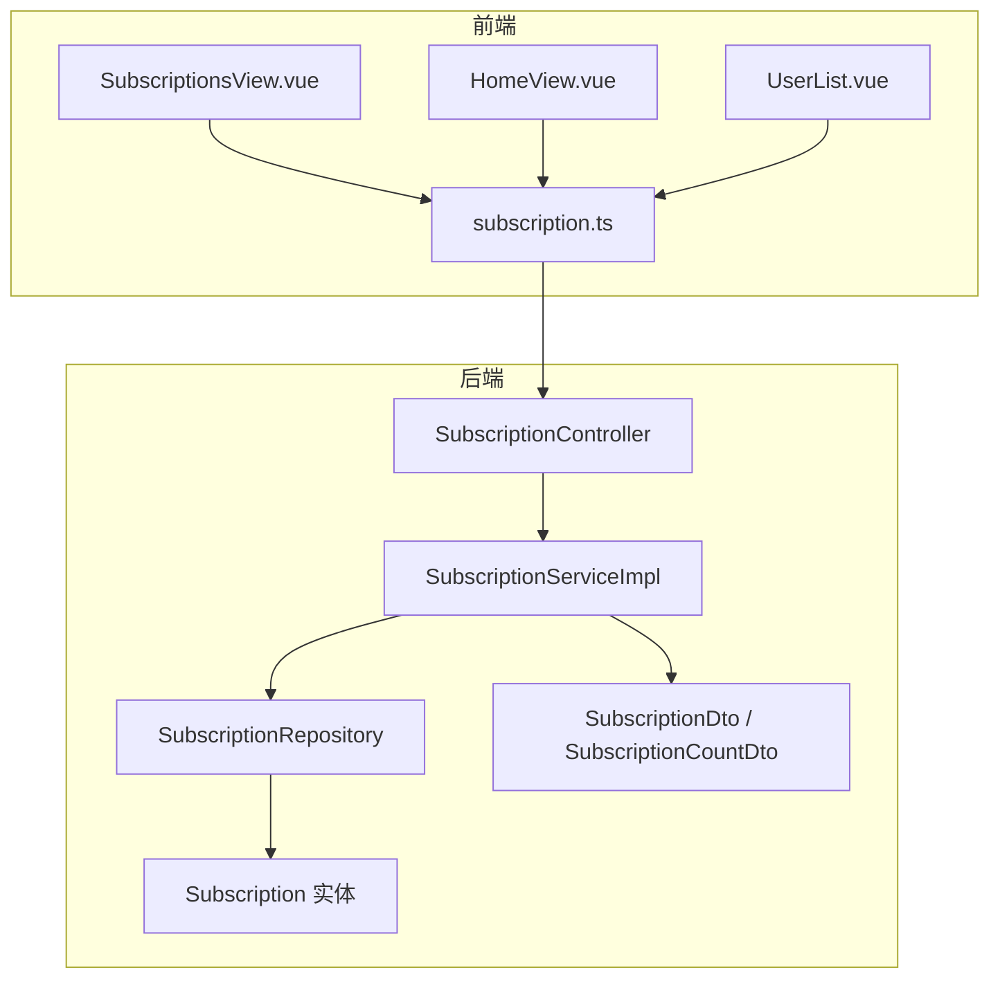
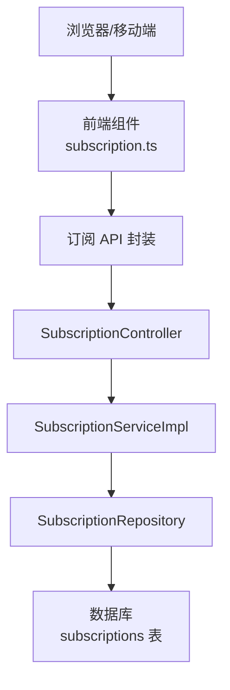
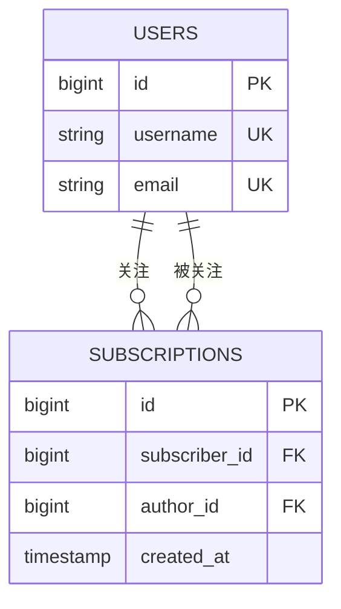
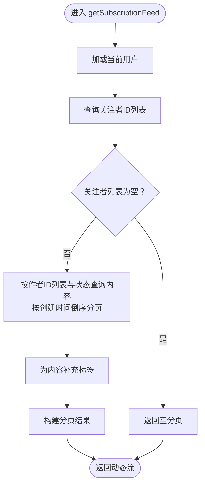
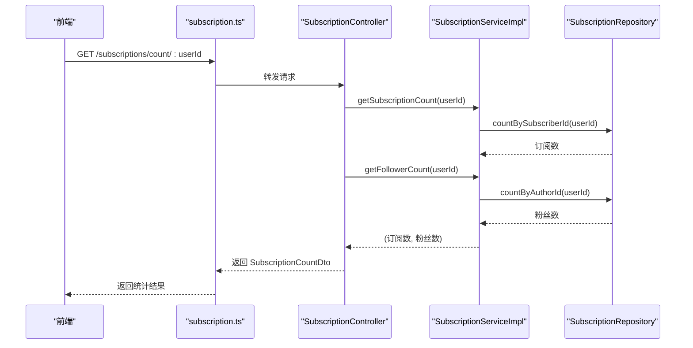
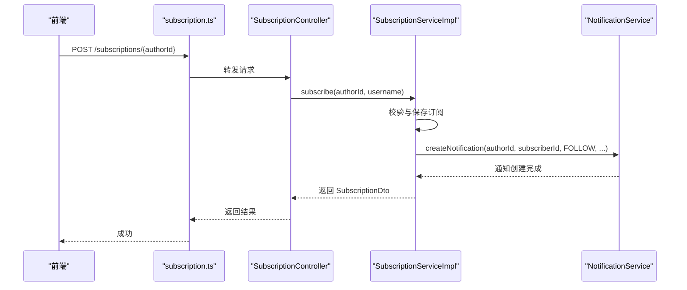
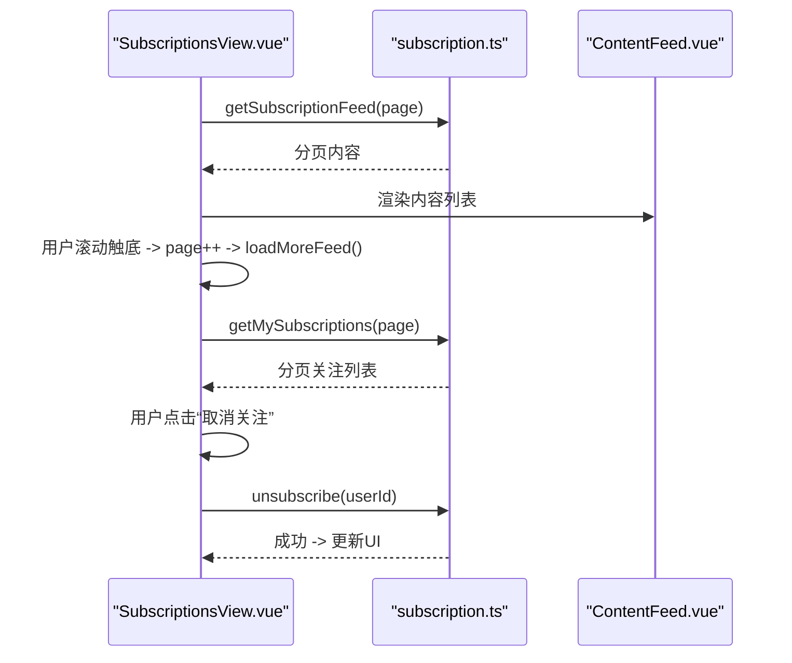
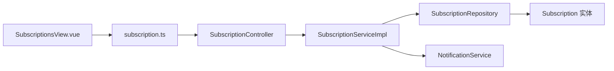

# 订阅系统

<cite>
**本文引用的文件**
- [07-订阅系统.md](file://wiki/07-订阅系统.md)
- [Subscription.java](file://communication-backend/src/main/java/com/communication/entity/Subscription.java)
- [SubscriptionController.java](file://communication-backend/src/main/java/com/communication/controller/SubscriptionController.java)
- [SubscriptionService.java](file://communication-backend/src/main/java/com/communication/service/SubscriptionService.java)
- [SubscriptionServiceImpl.java](file://communication-backend/src/main/java/com/communication/service/impl/SubscriptionServiceImpl.java)
- [SubscriptionRepository.java](file://communication-backend/src/main/java/com/communication/repository/SubscriptionRepository.java)
- [SubscriptionDto.java](file://communication-backend/src/main/java/com/communication/dto/SubscriptionDto.java)
- [SubscriptionCountDto.java](file://communication-backend/src/main/java/com/communication/dto/SubscriptionCountDto.java)
- [subscription.ts](file://communication-frontend/src/api/subscription.ts)
- [SubscriptionsView.vue](file://communication-frontend/src/views/user/SubscriptionsView.vue)
- [HomeView.vue](file://communication-frontend/src/views/HomeView.vue)
- [UserList.vue](file://communication-frontend/src/components/user/UserList.vue)
</cite>

## 目录
1. [简介](#简介)
2. [项目结构](#项目结构)
3. [核心组件](#核心组件)
4. [架构总览](#架构总览)
5. [详细组件分析](#详细组件分析)
6. [依赖分析](#依赖分析)
7. [性能考虑](#性能考虑)
8. [故障排查指南](#故障排查指南)
9. [结论](#结论)
10. [附录](#附录)

## 简介
本文件为订阅系统的专门技术文档，围绕以下目标展开：
- 订阅关系的数据模型设计：用户间的关系映射与订阅状态管理
- 动态流生成算法：时间线排序、内容过滤与个性化（基于关注者集合）
- 订阅统计功能：关注数、粉丝数统计
- 订阅通知机制：新内容提醒与订阅变更通知
- API 接口规范：订阅/取消订阅与动态流获取
- 前端订阅组件设计：关注按钮状态切换与动态流渲染
- 性能优化策略：分页加载与懒加载

## 项目结构
订阅系统由后端 Spring Boot 控制器、服务层、仓库层与 DTO，以及前端 Vue 组件与 API 封装组成。核心模块如下：
- 后端
  - 控制器：处理订阅相关请求
  - 服务：封装订阅业务逻辑与统计
  - 仓库：访问订阅与用户数据
  - 实体与 DTO：描述订阅关系与对外数据结构
- 前端
  - API 封装：统一调用后端订阅接口
  - 视图组件：订阅列表页、首页动态切换、用户列表等

图表来源
- [SubscriptionController.java:19-75](file://communication-backend/src/main/java/com/communication/controller/SubscriptionController.java#L19-L75)
- [SubscriptionServiceImpl.java:28-45](file://communication-backend/src/main/java/com/communication/service/impl/SubscriptionServiceImpl.java#L28-L45)
- [SubscriptionRepository.java:14-33](file://communication-backend/src/main/java/com/communication/repository/SubscriptionRepository.java#L14-L33)
- [Subscription.java:7-29](file://communication-backend/src/main/java/com/communication/entity/Subscription.java#L7-L29)
- [SubscriptionDto.java:7-39](file://communication-backend/src/main/java/com/communication/dto/SubscriptionDto.java#L7-L39)
- [SubscriptionCountDto.java:3-18](file://communication-backend/src/main/java/com/communication/dto/SubscriptionCountDto.java#L3-L18)
- [subscription.ts:22-91](file://communication-frontend/src/api/subscription.ts#L22-L91)
- [SubscriptionsView.vue:1-230](file://communication-frontend/src/views/user/SubscriptionsView.vue#L1-L230)
- [HomeView.vue:1-172](file://communication-frontend/src/views/HomeView.vue#L1-L172)
- [UserList.vue:1-106](file://communication-frontend/src/components/user/UserList.vue#L1-L106)

章节来源
- [SubscriptionController.java:1-77](file://communication-backend/src/main/java/com/communication/controller/SubscriptionController.java#L1-L77)
- [SubscriptionServiceImpl.java:1-197](file://communication-backend/src/main/java/com/communication/service/impl/SubscriptionServiceImpl.java#L1-L197)
- [SubscriptionRepository.java:1-34](file://communication-backend/src/main/java/com/communication/repository/SubscriptionRepository.java#L1-L34)
- [Subscription.java:1-67](file://communication-backend/src/main/java/com/communication/entity/Subscription.java#L1-L67)
- [SubscriptionDto.java:1-59](file://communication-backend/src/main/java/com/communication/dto/SubscriptionDto.java#L1-L59)
- [SubscriptionCountDto.java:1-19](file://communication-backend/src/main/java/com/communication/dto/SubscriptionCountDto.java#L1-L19)
- [subscription.ts:1-92](file://communication-frontend/src/api/subscription.ts#L1-L92)
- [SubscriptionsView.vue:1-230](file://communication-frontend/src/views/user/SubscriptionsView.vue#L1-L230)
- [HomeView.vue:1-172](file://communication-frontend/src/views/HomeView.vue#L1-L172)
- [UserList.vue:1-106](file://communication-frontend/src/components/user/UserList.vue#L1-L106)

## 核心组件
- 订阅实体与关系
  - 实体字段：主键、订阅者、被订阅者、创建时间
  - 约束与索引：唯一约束防止重复订阅；按订阅者与作者分别建立索引
- 订阅服务
  - 订阅/取消订阅：校验用户存在性、禁止自订阅、重复订阅检查、持久化与通知
  - 订阅统计：订阅数、粉丝数
  - 动态流：根据关注者集合筛选已发布内容并分页排序
- 订阅控制器
  - 提供关注、取消关注、检查关注、我的订阅、粉丝列表、订阅动态流、订阅统计等接口
- 前端 API 与组件
  - API 封装统一调用后端接口
  - 订阅列表页与动态流渲染，支持分页与懒加载

章节来源
- [Subscription.java:7-29](file://communication-backend/src/main/java/com/communication/entity/Subscription.java#L7-L29)
- [SubscriptionServiceImpl.java:47-195](file://communication-backend/src/main/java/com/communication/service/impl/SubscriptionServiceImpl.java#L47-L195)
- [SubscriptionController.java:19-75](file://communication-backend/src/main/java/com/communication/controller/SubscriptionController.java#L19-L75)
- [subscription.ts:22-91](file://communication-frontend/src/api/subscription.ts#L22-L91)
- [SubscriptionsView.vue:74-174](file://communication-frontend/src/views/user/SubscriptionsView.vue#L74-L174)

## 架构总览
订阅系统采用经典的三层架构：
- 表现层：前端 Vue 组件与 API 封装
- 控制器层：REST 控制器接收请求并返回标准响应
- 服务层：封装业务规则与跨仓库操作
- 数据访问层：JPA 仓库负责数据持久化与查询

图表来源
- [SubscriptionController.java:19-75](file://communication-backend/src/main/java/com/communication/controller/SubscriptionController.java#L19-L75)
- [SubscriptionServiceImpl.java:28-45](file://communication-backend/src/main/java/com/communication/service/impl/SubscriptionServiceImpl.java#L28-L45)
- [SubscriptionRepository.java:14-33](file://communication-backend/src/main/java/com/communication/repository/SubscriptionRepository.java#L14-L33)
- [subscription.ts:22-91](file://communication-frontend/src/api/subscription.ts#L22-L91)

## 详细组件分析

### 数据模型与关系映射
- 订阅实体
  - 字段：id、subscriber（订阅者）、author（被订阅者）、created_at
  - 生命周期：保存前自动填充创建时间
- 关系语义
  - 订阅者关注被订阅者，订阅成功后可在动态流中看到其已发布内容
  - 粉丝是所有以某作者为主人的订阅记录
- 约束与索引
  - 唯一约束：(subscriber_id, author_id)，防止重复订阅
  - 索引：按 subscriber_id 查询我的订阅；按 author_id 查询粉丝列表

图表来源
- [Subscription.java:7-29](file://communication-backend/src/main/java/com/communication/entity/Subscription.java#L7-L29)
- [SubscriptionRepository.java:14-33](file://communication-backend/src/main/java/com/communication/repository/SubscriptionRepository.java#L14-L33)

章节来源
- [Subscription.java:1-67](file://communication-backend/src/main/java/com/communication/entity/Subscription.java#L1-L67)
- [SubscriptionRepository.java:1-34](file://communication-backend/src/main/java/com/communication/repository/SubscriptionRepository.java#L1-L34)
- [07-订阅系统.md:3-21](file://wiki/07-订阅系统.md#L3-L21)

### 动态流生成算法
- 输入：当前用户 ID
- 步骤
  1) 查询当前用户的所有关注者 ID 列表
  2) 若为空，返回空分页结果
  3) 使用关注者 ID 列表查询已发布内容，按创建时间倒序，分页返回
  4) 为每条内容补充标签信息
- 复杂度
  - 查询关注者 ID：O(1) 或 O(log N)（依赖索引）
  - 查询内容分页：O(log N + M)，其中 M 为分页大小
- 过滤与排序
  - 内容状态过滤：仅已发布
  - 时间排序：created_at DESC

图表来源
- [SubscriptionServiceImpl.java:145-185](file://communication-backend/src/main/java/com/communication/service/impl/SubscriptionServiceImpl.java#L145-L185)

章节来源
- [SubscriptionServiceImpl.java:145-185](file://communication-backend/src/main/java/com/communication/service/impl/SubscriptionServiceImpl.java#L145-L185)
- [07-订阅系统.md:112-127](file://wiki/07-订阅系统.md#L112-L127)

### 订阅统计功能
- 订阅数：统计某用户作为订阅者的订阅数量
- 粉丝数：统计某用户作为被订阅者的关注数量
- 实现方式：通过仓库计数方法按条件统计

图表来源
- [SubscriptionController.java:70-75](file://communication-backend/src/main/java/com/communication/controller/SubscriptionController.java#L70-L75)
- [SubscriptionServiceImpl.java:187-195](file://communication-backend/src/main/java/com/communication/service/impl/SubscriptionServiceImpl.java#L187-L195)
- [SubscriptionRepository.java:25-27](file://communication-backend/src/main/java/com/communication/repository/SubscriptionRepository.java#L25-L27)

章节来源
- [SubscriptionServiceImpl.java:187-195](file://communication-backend/src/main/java/com/communication/service/impl/SubscriptionServiceImpl.java#L187-L195)
- [SubscriptionCountDto.java:1-19](file://communication-backend/src/main/java/com/communication/dto/SubscriptionCountDto.java#L1-L19)

### 订阅通知机制
- 订阅变更通知
  - 当用户 A 关注用户 B 时，系统创建一条“关注”类型的通知，通知 B
- 新内容提醒
  - 动态流按作者集合与已发布状态筛选，用户在订阅动态流中自然看到作者的新内容
- 通知服务集成
  - 服务层在订阅成功后调用通知服务创建通知记录

图表来源
- [SubscriptionController.java:19-33](file://communication-backend/src/main/java/com/communication/controller/SubscriptionController.java#L19-L33)
- [SubscriptionServiceImpl.java:47-75](file://communication-backend/src/main/java/com/communication/service/impl/SubscriptionServiceImpl.java#L47-L75)

章节来源
- [SubscriptionServiceImpl.java:47-75](file://communication-backend/src/main/java/com/communication/service/impl/SubscriptionServiceImpl.java#L47-L75)

### API 接口规范
- 关注用户
  - 方法与路径：POST /api/subscriptions/{authorId}
  - 认证：Bearer Token
  - 业务规则：不可关注自己；重复关注返回错误；返回订阅 DTO
- 取消关注
  - 方法与路径：DELETE /api/subscriptions/{authorId}
  - 认证：Bearer Token
  - 业务规则：未关注则返回错误；成功删除订阅记录
- 检查是否已关注
  - 方法与路径：GET /api/subscriptions/check/{authorId}
  - 认证：Bearer Token
  - 返回：布尔值，用于按钮状态切换
- 获取我的订阅列表
  - 方法与路径：GET /api/subscriptions/my?page=&size=
  - 认证：Bearer Token
  - 返回：分页用户 DTO 列表
- 获取粉丝列表
  - 方法与路径：GET /api/subscriptions/followers/{userId}?page=&size=
  - 认证：无需认证
  - 返回：分页用户 DTO 列表
- 获取订阅/粉丝数量
  - 方法与路径：GET /api/subscriptions/count/{userId}
  - 认证：无需认证
  - 返回：订阅数与粉丝数
- 订阅动态流
  - 方法与路径：GET /api/subscriptions/feed?page=&size=
  - 认证：Bearer Token
  - 返回：分页内容 DTO 列表（按作者集合与已发布状态筛选）

章节来源
- [SubscriptionController.java:19-75](file://communication-backend/src/main/java/com/communication/controller/SubscriptionController.java#L19-L75)
- [07-订阅系统.md:38-110](file://wiki/07-订阅系统.md#L38-L110)

### 前端订阅组件设计
- 关注/取消关注按钮
  - 在用户主页根据检查接口初始化按钮状态
  - 已关注状态下显示“取消关注”，点击触发取消关注流程
- 订阅列表页（SubscriptionsView）
  - 提供“订阅动态”和“关注列表”两个标签页
  - 支持动态流分页加载与关注列表分页加载
  - 关注列表支持取消关注并即时更新 UI
- 首页 Feed 切换
  - 登录状态下提供“订阅”动态流入口
- 用户列表组件（UserList）
  - 通用用户列表渲染与“加载更多”事件

图表来源
- [SubscriptionsView.vue:74-174](file://communication-frontend/src/views/user/SubscriptionsView.vue#L74-L174)
- [subscription.ts:72-81](file://communication-frontend/src/api/subscription.ts#L72-L81)

章节来源
- [SubscriptionsView.vue:1-230](file://communication-frontend/src/views/user/SubscriptionsView.vue#L1-L230)
- [subscription.ts:22-91](file://communication-frontend/src/api/subscription.ts#L22-L91)
- [UserList.vue:1-106](file://communication-frontend/src/components/user/UserList.vue#L1-L106)
- [HomeView.vue:1-172](file://communication-frontend/src/views/HomeView.vue#L1-L172)

## 依赖分析
- 控制器依赖服务层，服务层依赖仓库层与通知服务
- 仓库层依赖 JPA，使用索引与分页提升查询性能
- 前端通过 API 封装统一调用后端接口，组件之间通过 props 与事件解耦

图表来源
- [SubscriptionController.java:13-17](file://communication-backend/src/main/java/com/communication/controller/SubscriptionController.java#L13-L17)
- [SubscriptionServiceImpl.java:37-44](file://communication-backend/src/main/java/com/communication/service/impl/SubscriptionServiceImpl.java#L37-L44)
- [SubscriptionRepository.java:14-33](file://communication-backend/src/main/java/com/communication/repository/SubscriptionRepository.java#L14-L33)
- [subscription.ts:22-91](file://communication-frontend/src/api/subscription.ts#L22-L91)
- [SubscriptionsView.vue:72-72](file://communication-frontend/src/views/user/SubscriptionsView.vue#L72-L72)

章节来源
- [SubscriptionController.java:1-77](file://communication-backend/src/main/java/com/communication/controller/SubscriptionController.java#L1-L77)
- [SubscriptionServiceImpl.java:1-197](file://communication-backend/src/main/java/com/communication/service/impl/SubscriptionServiceImpl.java#L1-L197)
- [SubscriptionRepository.java:1-34](file://communication-backend/src/main/java/com/communication/repository/SubscriptionRepository.java#L1-L34)
- [subscription.ts:1-92](file://communication-frontend/src/api/subscription.ts#L1-L92)
- [SubscriptionsView.vue:1-230](file://communication-frontend/src/views/user/SubscriptionsView.vue#L1-L230)

## 性能考虑
- 分页加载
  - 所有列表接口均支持 page 与 size 参数，避免一次性传输大量数据
- 懒加载
  - 动态流与关注列表在滚动触底或点击“加载更多”时继续请求下一页
- 索引优化
  - 对订阅表按 subscriber_id 与 author_id 建立索引，加速查询与统计
- 查询优化
  - 动态流先查询关注者 ID 列表，再以 IN 查询内容，减少全表扫描
- 缓存建议
  - 可对热点用户（高粉丝数）的订阅/粉丝数进行缓存，降低数据库压力

章节来源
- [SubscriptionRepository.java:18-30](file://communication-backend/src/main/java/com/communication/repository/SubscriptionRepository.java#L18-L30)
- [SubscriptionServiceImpl.java:145-185](file://communication-backend/src/main/java/com/communication/service/impl/SubscriptionServiceImpl.java#L145-L185)
- [SubscriptionsView.vue:113-145](file://communication-frontend/src/views/user/SubscriptionsView.vue#L113-L145)

## 故障排查指南
- 无法关注自己
  - 现象：提交关注请求返回错误
  - 原因：业务校验禁止自订阅
  - 处理：引导用户选择其他作者
- 重复关注
  - 现象：提示已关注该作者
  - 原因：唯一约束导致重复插入失败
  - 处理：前端检查关注状态，避免重复提交
- 未关注却取消关注
  - 现象：取消关注失败
  - 原因：不存在对应订阅记录
  - 处理：前端在取消关注前调用检查接口确认状态
- 动态流为空
  - 现象：订阅动态流无内容
  - 原因：当前用户未关注任何作者或关注者均未发布内容
  - 处理：提示用户关注更多创作者
- 统计数异常
  - 现象：订阅数或粉丝数不正确
  - 原因：数据一致性问题或缓存未刷新
  - 处理：检查数据库计数与索引，必要时重建索引或清理缓存

章节来源
- [SubscriptionServiceImpl.java:56-87](file://communication-backend/src/main/java/com/communication/service/impl/SubscriptionServiceImpl.java#L56-L87)
- [SubscriptionController.java:70-75](file://communication-backend/src/main/java/com/communication/controller/SubscriptionController.java#L70-L75)

## 结论
订阅系统通过简洁的实体模型与清晰的服务边界，实现了关注、动态流、统计与通知的完整闭环。前后端配合采用统一的分页与懒加载策略，保证了良好的用户体验与系统性能。后续可在热点数据缓存与动态流个性化方面进一步优化。

## 附录
- 数据库表设计要点
  - 表名：subscriptions
  - 唯一约束：(subscriber_id, author_id)
  - 索引：subscriber_id、author_id
- 前端交互要点
  - 关注按钮状态依赖检查接口
  - 订阅动态流与关注列表均支持分页与懒加载
  - 取消关注后即时更新 UI 并提示反馈

章节来源
- [07-订阅系统.md:3-21](file://wiki/07-订阅系统.md#L3-L21)
- [subscription.ts:22-91](file://communication-frontend/src/api/subscription.ts#L22-L91)
- [SubscriptionsView.vue:147-162](file://communication-frontend/src/views/user/SubscriptionsView.vue#L147-L162)