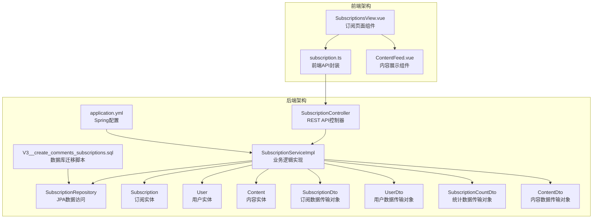
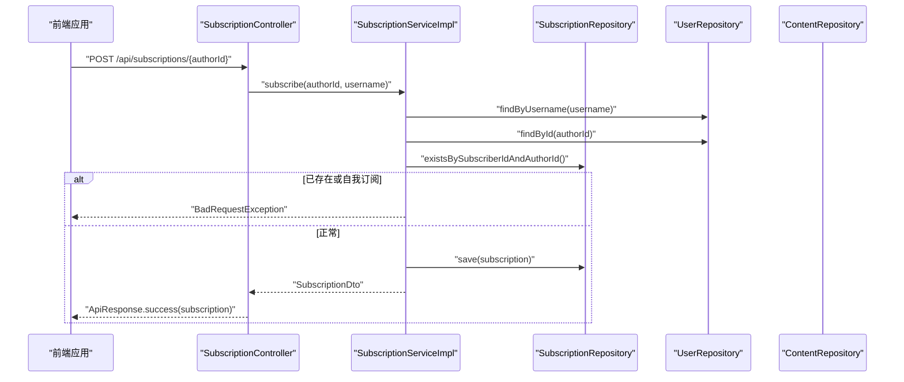
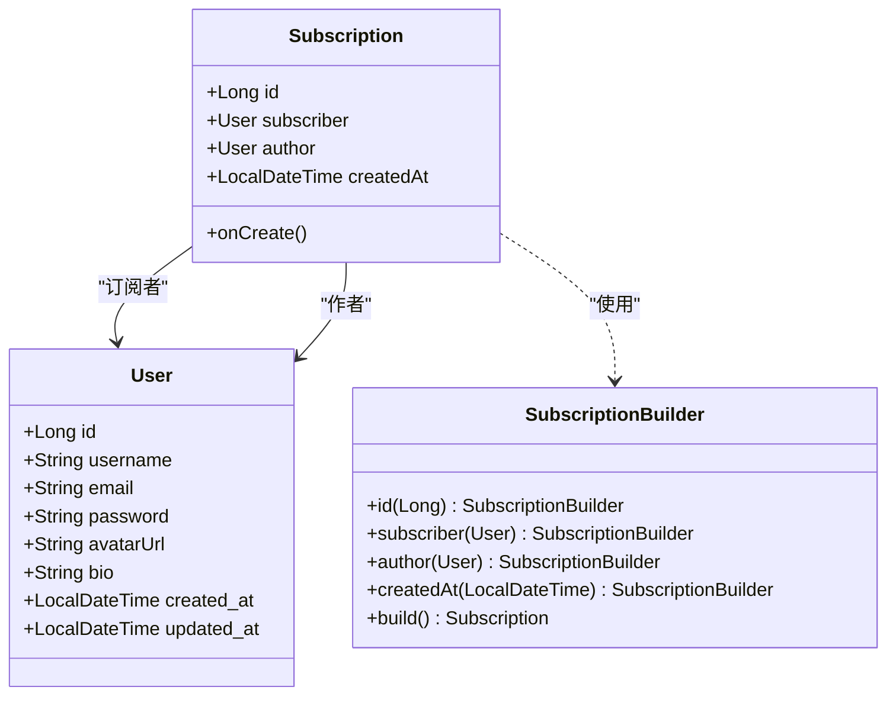
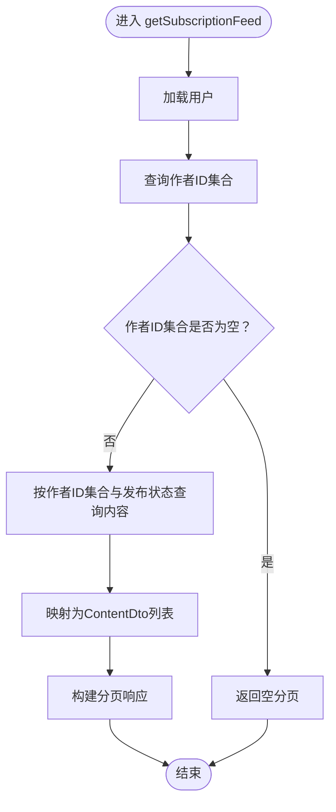
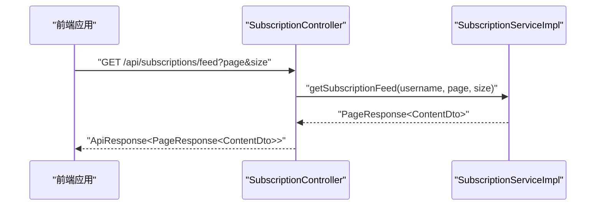
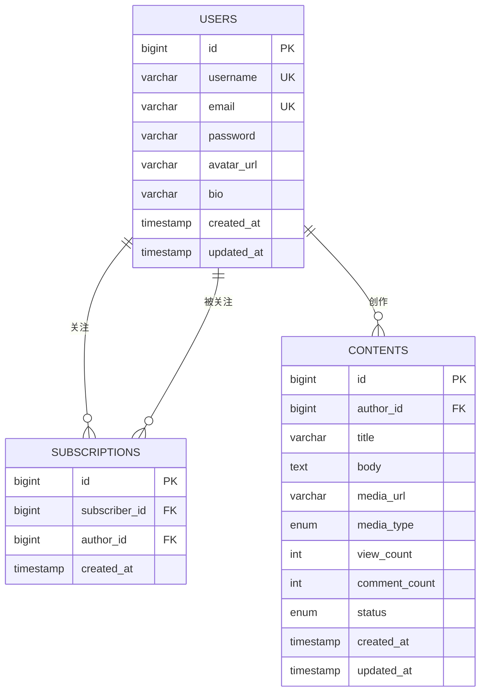
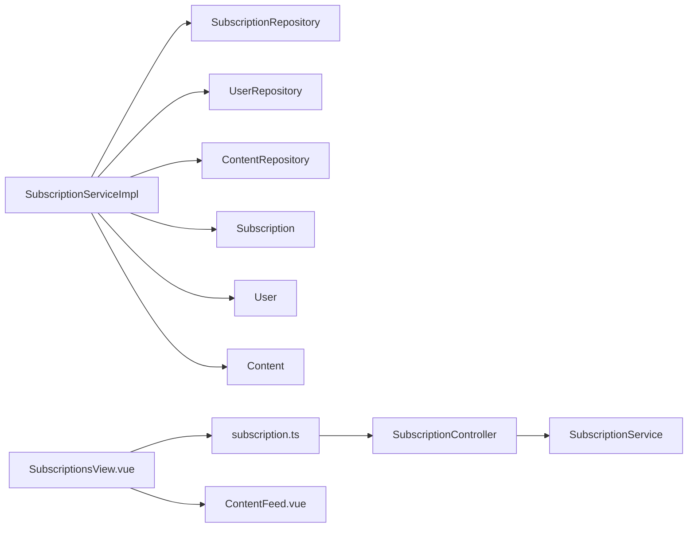

# 订阅系统

<cite>
**本文引用的文件**
- [Subscription.java](file://communication-backend/src/main/java/com/communication/entity/Subscription.java)
- [SubscriptionController.java](file://communication-backend/src/main/java/com/communication/controller/SubscriptionController.java)
- [SubscriptionService.java](file://communication-backend/src/main/java/com/communication/service/SubscriptionService.java)
- [SubscriptionServiceImpl.java](file://communication-backend/src/main/java/com/communication/service/impl/SubscriptionServiceImpl.java)
- [SubscriptionRepository.java](file://communication-backend/src/main/java/com/communication/repository/SubscriptionRepository.java)
- [SubscriptionDto.java](file://communication-backend/src/main/java/com/communication/dto/SubscriptionDto.java)
- [SubscriptionCountDto.java](file://communication-backend/src/main/java/com/communication/dto/SubscriptionCountDto.java)
- [User.java](file://communication-backend/src/main/java/com/communication/entity/User.java)
- [UserDto.java](file://communication-backend/src/main/java/com/communication/dto/UserDto.java)
- [Content.java](file://communication-backend/src/main/java/com/communication/entity/Content.java)
- [ContentDto.java](file://communication-backend/src/main/java/com/communication/dto/ContentDto.java)
- [V3__create_comments_subscriptions.sql](file://communication-backend/src/main/resources/db/migration/V3__create_comments_subscriptions.sql)
- [application.yml](file://communication-backend/src/main/resources/application.yml)
- [SubscriptionServiceTest.java](file://communication-backend/src/test/java/com/communication/service/SubscriptionServiceTest.java)
- [subscription.ts](file://communication-frontend/src/api/subscription.ts)
- [SubscriptionsView.vue](file://communication-frontend/src/views/user/SubscriptionsView.vue)
</cite>

## 更新摘要
**变更内容**
- 完善了订阅系统的核心功能实现细节
- 新增了详细的API设计和前端集成说明
- 补充了完整的测试用例分析
- 增强了性能优化和故障排查指南
- 扩展了订阅Feed生成算法的技术细节

## 目录
1. [简介](#简介)
2. [项目结构](#项目结构)
3. [核心组件](#核心组件)
4. [架构总览](#架构总览)
5. [详细组件分析](#详细组件分析)
6. [依赖分析](#依赖分析)
7. [性能考虑](#性能考虑)
8. [故障排查指南](#故障排查指南)
9. [结论](#结论)
10. [附录](#附录)

## 简介
订阅系统是通信平台的核心社交功能模块，为用户提供关注其他用户、管理订阅关系以及获取个性化内容动态的能力。该系统实现了完整的社交网络功能，包括用户关注机制、订阅关系管理、Feed流聚合等核心特性。

系统采用Spring Boot微服务架构，通过RESTful API提供标准化的接口服务，支持高并发场景下的用户关注和内容分发需求。后端使用Spring Data JPA进行数据持久化，前端采用Vue.js框架实现响应式的用户界面。

**章节来源**
- [SubscriptionController.java](file://communication-backend/src/main/java/com/communication/controller/SubscriptionController.java#L1-L77)
- [SubscriptionServiceImpl.java](file://communication-backend/src/main/java/com/communication/service/impl/SubscriptionServiceImpl.java#L1-L179)

## 项目结构
后端采用标准的三层架构设计：controller（控制器层）、service（服务层）、repository（数据访问层），配合entity（实体模型）和dto（数据传输对象）。数据库迁移脚本定义了完整的数据结构，包括用户表、内容表和订阅关系表。

**图表来源**
- [SubscriptionController.java](file://communication-backend/src/main/java/com/communication/controller/SubscriptionController.java#L1-L77)
- [SubscriptionServiceImpl.java](file://communication-backend/src/main/java/com/communication/service/impl/SubscriptionServiceImpl.java#L1-L179)
- [SubscriptionRepository.java](file://communication-backend/src/main/java/com/communication/repository/SubscriptionRepository.java#L1-L34)
- [Subscription.java](file://communication-backend/src/main/java/com/communication/entity/Subscription.java#L1-L67)
- [User.java](file://communication-backend/src/main/java/com/communication/entity/User.java#L1-L96)
- [Content.java](file://communication-backend/src/main/java/com/communication/entity/Content.java#L1-L135)
- [SubscriptionDto.java](file://communication-backend/src/main/java/com/communication/dto/SubscriptionDto.java#L1-L59)
- [UserDto.java](file://communication-backend/src/main/java/com/communication/dto/UserDto.java#L1-L72)
- [SubscriptionCountDto.java](file://communication-backend/src/main/java/com/communication/dto/SubscriptionCountDto.java#L1-L19)
- [ContentDto.java](file://communication-backend/src/main/java/com/communication/dto/ContentDto.java#L1-L118)
- [application.yml](file://communication-backend/src/main/resources/application.yml#L1-L42)
- [V3__create_comments_subscriptions.sql](file://communication-backend/src/main/resources/db/migration/V3__create_comments_subscriptions.sql#L1-L33)
- [subscription.ts](file://communication-frontend/src/api/subscription.ts#L1-L92)
- [SubscriptionsView.vue](file://communication-frontend/src/views/user/SubscriptionsView.vue#L1-L230)

**章节来源**
- [SubscriptionController.java](file://communication-backend/src/main/java/com/communication/controller/SubscriptionController.java#L1-L77)
- [SubscriptionServiceImpl.java](file://communication-backend/src/main/java/com/communication/service/impl/SubscriptionServiceImpl.java#L1-L179)
- [SubscriptionRepository.java](file://communication-backend/src/main/java/com/communication/repository/SubscriptionRepository.java#L1-L34)
- [Subscription.java](file://communication-backend/src/main/java/com/communication/entity/Subscription.java#L1-L67)
- [User.java](file://communication-backend/src/main/java/com/communication/entity/User.java#L1-L96)
- [Content.java](file://communication-backend/src/main/java/com/communication/entity/Content.java#L1-L135)
- [SubscriptionDto.java](file://communication-backend/src/main/java/com/communication/dto/SubscriptionDto.java#L1-L59)
- [UserDto.java](file://communication-backend/src/main/java/com/communication/dto/UserDto.java#L1-L72)
- [SubscriptionCountDto.java](file://communication-backend/src/main/java/com/communication/dto/SubscriptionCountDto.java#L1-L19)
- [ContentDto.java](file://communication-backend/src/main/java/com/communication/dto/ContentDto.java#L1-L118)
- [application.yml](file://communication-backend/src/main/resources/application.yml#L1-L42)
- [V3__create_comments_subscriptions.sql](file://communication-backend/src/main/resources/db/migration/V3__create_comments_subscriptions.sql#L1-L33)
- [subscription.ts](file://communication-frontend/src/api/subscription.ts#L1-L92)
- [SubscriptionsView.vue](file://communication-frontend/src/views/user/SubscriptionsView.vue#L1-L230)

## 核心组件
订阅系统由多个核心组件构成，每个组件都有明确的职责分工：

- **订阅实体模型**：包含订阅主键、订阅者与作者的多对一关系、创建时间戳，以及基于JPA的生命周期回调
- **服务接口与实现**：提供关注、取消关注、订阅状态检查、关注列表、粉丝列表、订阅动态、订阅/粉丝数量统计等完整功能
- **控制器层**：暴露REST API，处理鉴权上下文中的用户名，返回统一响应包装
- **数据传输对象**：用于序列化订阅关系与用户信息，支持前后端数据交换
- **仓储层**：基于JPA的查询方法与自定义原生查询，支持分页、计数与作者ID集合查询
- **前端API封装与视图**：提供关注动态、关注列表的加载与交互，支持实时更新

**章节来源**
- [Subscription.java](file://communication-backend/src/main/java/com/communication/entity/Subscription.java#L1-L67)
- [SubscriptionService.java](file://communication-backend/src/main/java/com/communication/service/SubscriptionService.java#L1-L26)
- [SubscriptionServiceImpl.java](file://communication-backend/src/main/java/com/communication/service/impl/SubscriptionServiceImpl.java#L1-L179)
- [SubscriptionController.java](file://communication-backend/src/main/java/com/communication/controller/SubscriptionController.java#L1-L77)
- [SubscriptionDto.java](file://communication-backend/src/main/java/com/communication/dto/SubscriptionDto.java#L1-L59)
- [SubscriptionCountDto.java](file://communication-backend/src/main/java/com/communication/dto/SubscriptionCountDto.java#L1-L19)
- [SubscriptionRepository.java](file://communication-backend/src/main/java/com/communication/repository/SubscriptionRepository.java#L1-L34)
- [subscription.ts](file://communication-frontend/src/api/subscription.ts#L1-L92)
- [SubscriptionsView.vue](file://communication-frontend/src/views/user/SubscriptionsView.vue#L1-L230)

## 架构总览
订阅系统遵循经典的MVC+分层架构模式，采用RESTful API设计原则，通过HTTP协议实现前后端分离。后端使用Spring Data JPA访问MySQL数据库，通过Flyway进行数据库版本管理，确保数据结构的一致性和可维护性。

**图表来源**
- [SubscriptionController.java](file://communication-backend/src/main/java/com/communication/controller/SubscriptionController.java#L19-L33)
- [SubscriptionServiceImpl.java](file://communication-backend/src/main/java/com/communication/service/impl/SubscriptionServiceImpl.java#L40-L62)
- [SubscriptionRepository.java](file://communication-backend/src/main/java/com/communication/repository/SubscriptionRepository.java#L17-L18)
- [User.java](file://communication-backend/src/main/java/com/communication/entity/User.java#L1-L96)

**章节来源**
- [SubscriptionController.java](file://communication-backend/src/main/java/com/communication/controller/SubscriptionController.java#L1-L77)
- [SubscriptionServiceImpl.java](file://communication-backend/src/main/java/com/communication/service/impl/SubscriptionServiceImpl.java#L1-L179)
- [SubscriptionRepository.java](file://communication-backend/src/main/java/com/communication/repository/SubscriptionRepository.java#L1-L34)

## 详细组件分析

### 订阅实体模型设计
订阅实体是整个订阅系统的核心数据模型，采用JPA注解进行映射，确保数据的完整性和一致性。

- **字段与关系**
  - 主键：自增Long类型，使用GenerationType.IDENTITY策略
  - 订阅者：多对一关联User实体，外键为subscriber_id，fetch策略为LAZY
  - 作者：多对一关联User实体，外键为author_id，fetch策略为LAZY
  - 创建时间：持久化前自动设置，使用@PrePersist注解
- **约束与索引**
  - 唯一约束：(subscriber_id, author_id)，防止重复关注
  - 索引：subscriber_id、author_id，提升查询性能
- **生命周期**
  - 使用@PrePersist在保存时自动填充创建时间
  - 支持Builder模式，便于测试和数据构造

**图表来源**
- [Subscription.java](file://communication-backend/src/main/java/com/communication/entity/Subscription.java#L9-L47)
- [User.java](file://communication-backend/src/main/java/com/communication/entity/User.java#L11-L68)

**章节来源**
- [Subscription.java](file://communication-backend/src/main/java/com/communication/entity/Subscription.java#L1-L67)
- [V3__create_comments_subscriptions.sql](file://communication-backend/src/main/resources/db/migration/V3__create_comments_subscriptions.sql#L18-L29)

### 订阅服务层实现逻辑
服务层实现了订阅系统的所有核心业务逻辑，包括关注、取消关注、状态检查、列表查询和Feed生成等功能。

- **关注功能**
  - 校验订阅者与作者存在性
  - 自我关注校验
  - 重复关注校验
  - 保存订阅并返回DTO
- **取消关注功能**
  - 校验订阅者存在性
  - 存在性校验后删除
- **状态检查功能**
  - 基于订阅者与作者ID判断是否存在
- **列表查询功能**
  - 关注列表：按创建时间倒序分页查询
  - 粉丝列表：按创建时间倒序分页查询
- **Feed生成算法**
  - 查询订阅者的作者ID集合
  - 若为空则返回空分页
  - 否则按作者ID集合与发布状态查询内容并分页
- **统计功能**
  - 计算订阅数与粉丝数

**图表来源**
- [SubscriptionServiceImpl.java](file://communication-backend/src/main/java/com/communication/service/impl/SubscriptionServiceImpl.java#L132-L167)
- [SubscriptionRepository.java](file://communication-backend/src/main/java/com/communication/repository/SubscriptionRepository.java#L29-L30)
- [Content.java](file://communication-backend/src/main/java/com/communication/entity/Content.java#L42-L44)

**章节来源**
- [SubscriptionServiceImpl.java](file://communication-backend/src/main/java/com/communication/service/impl/SubscriptionServiceImpl.java#L1-L179)
- [SubscriptionRepository.java](file://communication-backend/src/main/java/com/communication/repository/SubscriptionRepository.java#L1-L34)

### 订阅控制器API设计
控制器层提供了完整的RESTful API接口，支持用户进行关注、取消关注和获取订阅相关信息。

- **关注操作**：POST /api/subscriptions/{authorId}
- **取消关注**：DELETE /api/subscriptions/{authorId}
- **检查订阅**：GET /api/subscriptions/check/{authorId}
- **我的关注**：GET /api/subscriptions/my?page=&size=
- **粉丝列表**：GET /api/subscriptions/followers/{userId}?page=&size=
- **订阅动态**：GET /api/subscriptions/feed?page=&size=
- **订阅统计**：GET /api/subscriptions/count/{userId}

**图表来源**
- [SubscriptionController.java](file://communication-backend/src/main/java/com/communication/controller/SubscriptionController.java#L61-L68)
- [SubscriptionServiceImpl.java](file://communication-backend/src/main/java/com/communication/service/impl/SubscriptionServiceImpl.java#L132-L167)

**章节来源**
- [SubscriptionController.java](file://communication-backend/src/main/java/com/communication/controller/SubscriptionController.java#L1-L77)

### 订阅Feed生成算法
订阅Feed生成算法是系统的核心功能之一，负责为用户生成个性化的动态内容流。

- **输入参数**：当前用户、分页参数（page、size）
- **算法步骤**：
  1) 获取订阅者ID对应的作者ID集合
  2) 若集合为空，直接返回空分页响应
  3) 否则按作者ID集合与发布状态查询内容，按创建时间倒序分页
  4) 映射为ContentDto并构建分页响应
- **性能优化**：
  - 使用IN查询优化批量内容检索
  - 通过索引支持高效的作者ID过滤
  - 分页查询限制单次数据量
- **复杂度分析**：
  - 查询作者ID集合：O(1) + 索引查找
  - 内容查询：O(log N + 分页大小)（受索引与分页影响）

**章节来源**
- [SubscriptionServiceImpl.java](file://communication-backend/src/main/java/com/communication/service/impl/SubscriptionServiceImpl.java#L132-L167)
- [SubscriptionRepository.java](file://communication-backend/src/main/java/com/communication/repository/SubscriptionRepository.java#L29-L30)
- [Content.java](file://communication-backend/src/main/java/com/communication/entity/Content.java#L42-L44)

### 数据库模型与索引
订阅系统使用MySQL作为数据存储，通过Flyway进行数据库版本管理，确保数据结构的一致性和可维护性。

- **订阅表结构**：包含主键、订阅者ID、作者ID、创建时间，唯一约束与索引确保去重与高效查询
- **用户表结构**：包含用户基本信息、认证凭据、个人资料和时间戳
- **内容表结构**：包含内容详情、媒体信息、状态管理和统计字段
- **索引策略**：
  - 订阅表：唯一索引(订阅者ID, 作者ID) + 普通索引(subscriber_id, author_id)
  - 内容表：按作者ID和状态的复合索引
  - 用户表：按用户名和邮箱的唯一索引

**图表来源**
- [V3__create_comments_subscriptions.sql](file://communication-backend/src/main/resources/db/migration/V3__create_comments_subscriptions.sql#L18-L32)
- [User.java](file://communication-backend/src/main/java/com/communication/entity/User.java#L11-L68)
- [Subscription.java](file://communication-backend/src/main/java/com/communication/entity/Subscription.java#L9-L21)
- [Content.java](file://communication-backend/src/main/java/com/communication/entity/Content.java#L11-L99)

**章节来源**
- [V3__create_comments_subscriptions.sql](file://communication-backend/src/main/resources/db/migration/V3__create_comments_subscriptions.sql#L1-L33)
- [application.yml](file://communication-backend/src/main/resources/application.yml#L20-L23)

## 依赖分析
订阅系统的依赖关系清晰明确，遵循单一职责原则和依赖倒置原则。

- **控制器依赖服务接口**：通过构造函数注入SubscriptionService接口，支持依赖注入和测试
- **服务实现依赖仓储**：服务层依赖SubscriptionRepository、UserRepository、ContentRepository接口
- **仓储接口继承JPA基础能力**：扩展自JpaRepository，提供基础CRUD操作和分页查询
- **前端通过API封装调用**：subscription.ts封装所有订阅相关的HTTP请求，SubscriptionsView.vue负责UI逻辑

**图表来源**
- [SubscriptionController.java](file://communication-backend/src/main/java/com/communication/controller/SubscriptionController.java#L1-L77)
- [SubscriptionServiceImpl.java](file://communication-backend/src/main/java/com/communication/service/impl/SubscriptionServiceImpl.java#L1-L179)
- [SubscriptionRepository.java](file://communication-backend/src/main/java/com/communication/repository/SubscriptionRepository.java#L1-L34)
- [subscription.ts](file://communication-frontend/src/api/subscription.ts#L1-L92)
- [SubscriptionsView.vue](file://communication-frontend/src/views/user/SubscriptionsView.vue#L1-L230)

**章节来源**
- [SubscriptionController.java](file://communication-backend/src/main/java/com/communication/controller/SubscriptionController.java#L1-L77)
- [SubscriptionServiceImpl.java](file://communication-backend/src/main/java/com/communication/service/impl/SubscriptionServiceImpl.java#L1-L179)
- [SubscriptionRepository.java](file://communication-backend/src/main/java/com/communication/repository/SubscriptionRepository.java#L1-L34)
- [subscription.ts](file://communication-frontend/src/api/subscription.ts#L1-L92)
- [SubscriptionsView.vue](file://communication-frontend/src/views/user/SubscriptionsView.vue#L1-L230)

## 性能考虑
订阅系统在设计时充分考虑了性能优化，采用了多种策略来确保高并发场景下的稳定运行。

- **数据库层面优化**
  - 订阅表的唯一约束与索引可避免重复关注并加速查询
  - Feed查询使用作者ID集合与发布状态，结合分页减少结果集
  - 通过IN查询优化批量内容检索，避免N+1查询问题
  - 索引策略针对高频查询场景进行优化
- **应用层面优化**
  - 使用分页参数控制单次查询规模，默认每页10条内容
  - 在高并发场景下，可引入Redis缓存订阅者关注的作者ID集合
  - 对频繁访问的统计数据（订阅数/粉丝数）可做本地缓存或定期刷新
  - 使用懒加载策略减少不必要的关联查询
- **配置层面优化**
  - JPA方言与格式化SQL便于调试与优化
  - Flyway确保数据库结构一致性，避免因索引缺失导致的性能问题
  - Spring Data JPA的Pageable接口支持高效的分页查询

**章节来源**
- [V3__create_comments_subscriptions.sql](file://communication-backend/src/main/resources/db/migration/V3__create_comments_subscriptions.sql#L18-L29)
- [application.yml](file://communication-backend/src/main/resources/application.yml#L11-L18)
- [SubscriptionServiceImpl.java](file://communication-backend/src/main/java/com/communication/service/impl/SubscriptionServiceImpl.java#L132-L167)

## 故障排查指南
订阅系统提供了完善的异常处理机制，能够及时发现和处理各种异常情况。

- **常见异常类型与触发条件**
  - 不能关注自己：当订阅者ID等于作者ID时抛出BadRequestException
  - 已关注：重复关注同一作者时抛出BadRequestException
  - 未关注：尝试取消未关注的作者时抛出BadRequestException
  - 资源不存在：用户或内容不存在时抛出ResourceNotFoundException
- **单元测试覆盖范围**
  - 成功关注/取消关注/检查订阅的正向测试
  - 无订阅时的订阅动态返回空分页的边界测试
  - 关注/粉丝数量统计正确性的功能测试
  - 异常情况的负向测试，包括自我关注、重复关注等
- **调试建议**
  - 检查数据库索引是否正确创建
  - 验证用户身份认证是否正常工作
  - 确认分页参数是否在合理范围内
  - 查看日志输出定位具体问题

**章节来源**
- [SubscriptionServiceTest.java](file://communication-backend/src/test/java/com/communication/service/SubscriptionServiceTest.java#L94-L137)
- [SubscriptionServiceImpl.java](file://communication-backend/src/main/java/com/communication/service/impl/SubscriptionServiceImpl.java#L47-L53)
- [SubscriptionServiceImpl.java](file://communication-backend/src/main/java/com/communication/service/impl/SubscriptionServiceImpl.java#L70-L72)

## 结论
订阅系统通过清晰的分层设计与完善的校验逻辑，实现了关注、取消关注与订阅动态的核心功能。服务层对Feed生成进行了合理优化，结合数据库索引与分页策略，具备良好的扩展性。

系统的主要优势包括：
- **完整的功能覆盖**：从基本的关注功能到复杂的Feed生成算法
- **良好的性能表现**：通过索引优化和分页策略支持高并发场景
- **清晰的架构设计**：遵循分层架构原则，便于维护和扩展
- **完善的异常处理**：提供友好的错误提示和调试信息

建议在生产环境中进一步优化：
- 引入Redis缓存机制，缓存热门用户的订阅关系
- 实现异步任务处理，后台计算统计数据
- 添加监控指标，实时跟踪系统性能
- 考虑读写分离，提高数据库查询性能

## 附录
- **前端集成要点**
  - 使用subscription.ts封装的API进行关注/取消关注、动态加载与分页
  - SubscriptionsView.vue中根据标签切换加载订阅动态与关注列表，并处理空态与加载态
  - ContentFeed.vue组件负责内容的展示和交互
- **测试参考**
  - 通过SubscriptionServiceTest验证关注、取消关注、Feed与统计等关键路径
  - 包含正向测试、边界测试和异常测试的完整测试套件
- **扩展建议**
  - 可以添加关注分类功能，支持不同类型的订阅
  - 可以实现关注推荐算法，帮助用户发现感兴趣的内容
  - 可以添加关注通知功能，及时提醒用户关注者的动态

**章节来源**
- [subscription.ts](file://communication-frontend/src/api/subscription.ts#L16-L91)
- [SubscriptionsView.vue](file://communication-frontend/src/views/user/SubscriptionsView.vue#L89-L166)
- [SubscriptionServiceTest.java](file://communication-backend/src/test/java/com/communication/service/SubscriptionServiceTest.java#L79-L235)