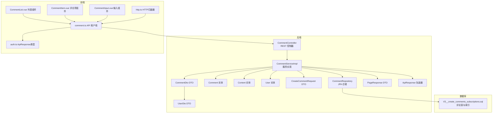
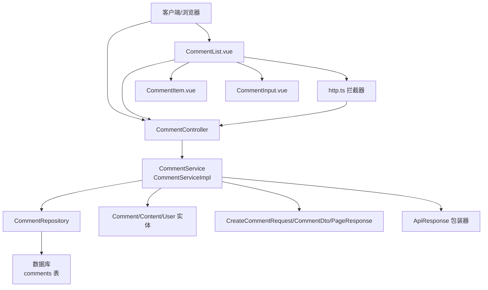
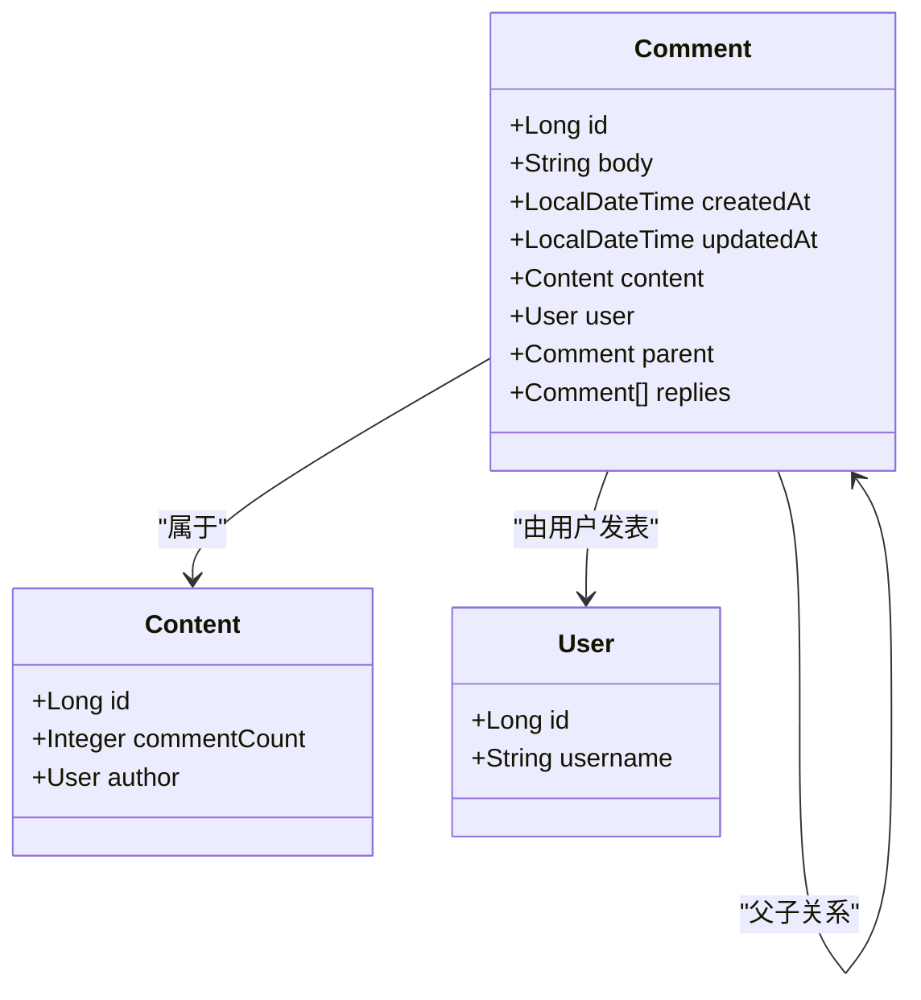
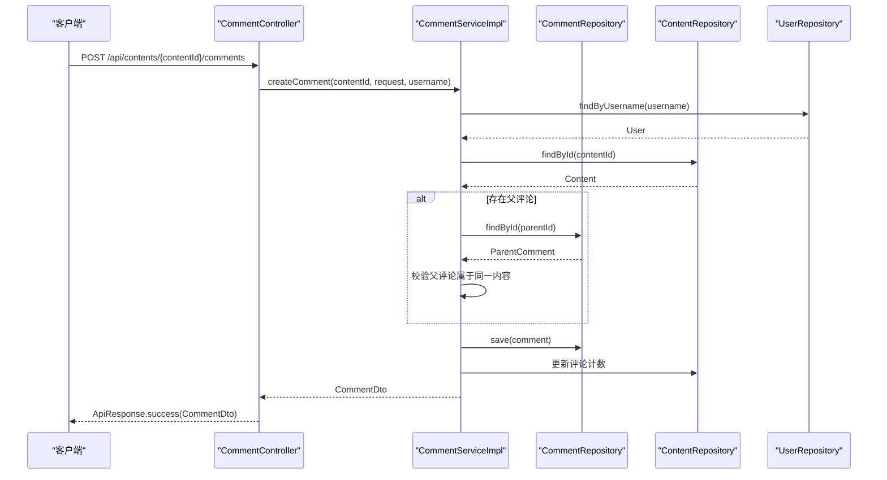
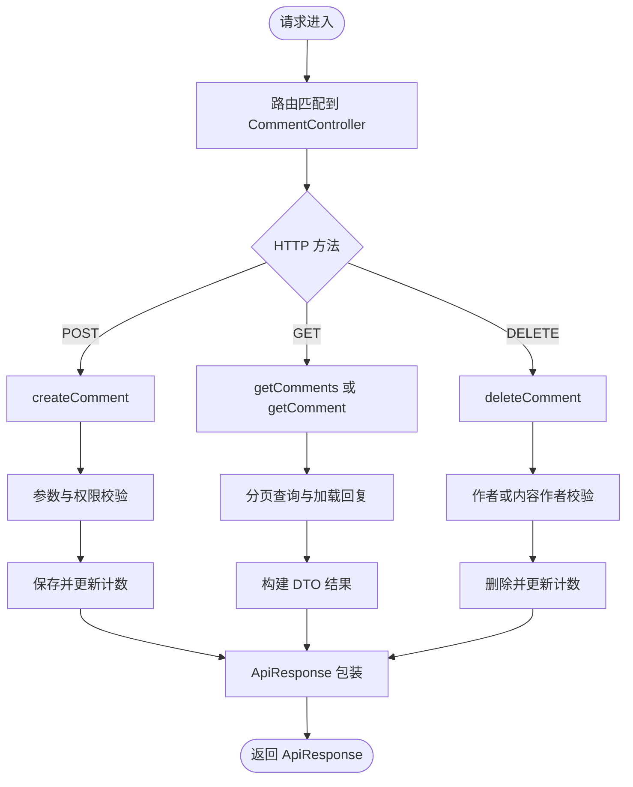
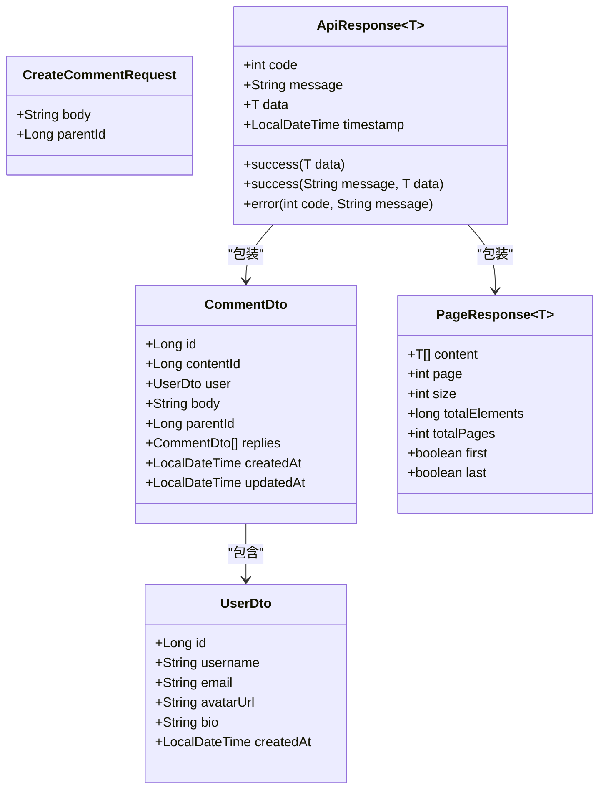
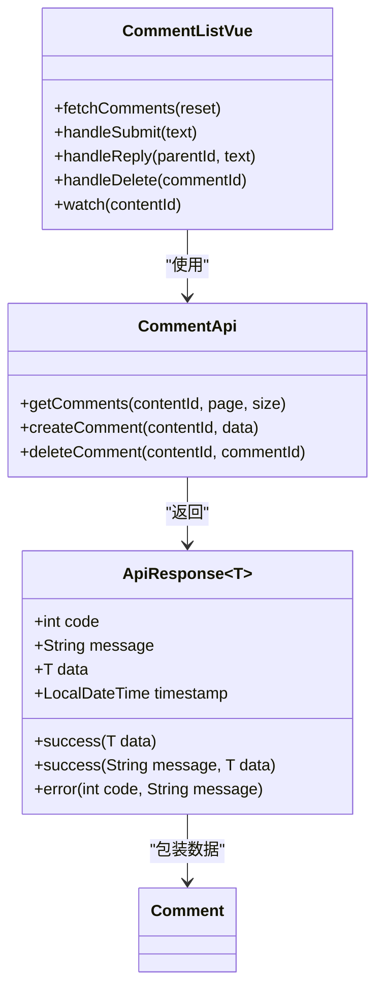
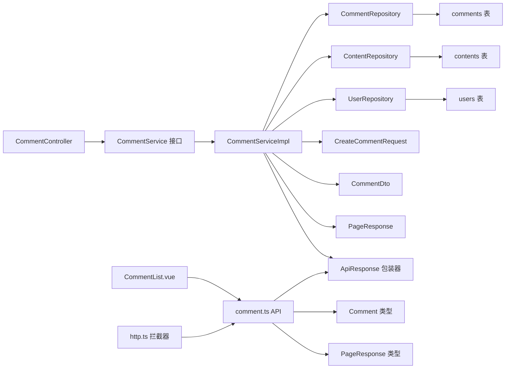

# 评论系统

<cite>
**本文引用的文件**
- [Comment.java](file://communication-backend/src/main/java/com/communication/entity/Comment.java)
- [Content.java](file://communication-backend/src/main/java/com/communication/entity/Content.java)
- [User.java](file://communication-backend/src/main/java/com/communication/entity/User.java)
- [CommentController.java](file://communication-backend/src/main/java/com/communication/controller/CommentController.java)
- [CommentService.java](file://communication-backend/src/main/java/com/communication/service/CommentService.java)
- [CommentServiceImpl.java](file://communication-backend/src/main/java/com/communication/service/impl/CommentServiceImpl.java)
- [CommentRepository.java](file://communication-backend/src/main/java/com/communication/repository/CommentRepository.java)
- [CreateCommentRequest.java](file://communication-backend/src/main/java/com/communication/dto/CreateCommentRequest.java)
- [CommentDto.java](file://communication-backend/src/main/java/com/communication/dto/CommentDto.java)
- [PageResponse.java](file://communication-backend/src/main/java/com/communication/dto/PageResponse.java)
- [UserDto.java](file://communication-backend/src/main/java/com/communication/dto/UserDto.java)
- [ApiResponse.java](file://communication-backend/src/main/java/com/communication/dto/ApiResponse.java)
- [V3__create_comments_subscriptions.sql](file://communication-backend/src/main/resources/db/migration/V3__create_comments_subscriptions.sql)
- [CommentServiceTest.java](file://communication-backend/src/test/java/com/communication/service/CommentServiceTest.java)
- [comment.ts](file://communication-frontend/src/api/comment.ts)
- [CommentList.vue](file://communication-frontend/src/components/comment/CommentList.vue)
- [CommentItem.vue](file://communication-frontend/src/components/comment/CommentItem.vue)
- [CommentInput.vue](file://communication-frontend/src/components/comment/CommentInput.vue)
- [http.ts](file://communication-frontend/src/api/http.ts)
- [auth.ts](file://communication-frontend/src/api/auth.ts)
</cite>

## 更新摘要
**所做更改**
- 更新了CommentList.vue组件，正确处理新的ApiResponse包装结构
- 新增了响应式prop监听机制的实现说明
- 增强了错误处理机制的文档描述
- 更新了前后端API交互的详细说明

## 目录
1. [简介](#简介)
2. [项目结构](#项目结构)
3. [核心组件](#核心组件)
4. [架构总览](#架构总览)
5. [详细组件分析](#详细组件分析)
6. [依赖分析](#依赖分析)
7. [性能考虑](#性能考虑)
8. [故障排查指南](#故障排查指南)
9. [结论](#结论)
10. [附录](#附录)

## 简介
本文件为评论系统提供完整的技术文档，覆盖评论与回复的实现细节（嵌套回复、权限控制、内容关联）、评论实体模型设计（评论树结构、层级关系、状态管理）、服务层逻辑（验证、父子关系处理、事务与计数更新）、控制器 API 设计（创建、删除、分页列表）、数据传输对象（DTO）设计与使用、前端交互与展示、以及性能优化与分页查询策略。文档同时提供关键流程图与时序图，帮助开发者快速理解与扩展评论功能。

**更新** 本版本重点介绍了CommentList.vue组件的重大改进，包括正确的ApiResponse包装结构处理、响应式prop监听机制和增强的错误处理能力。

## 项目结构
后端采用分层架构：控制器层负责接收请求与返回响应；服务层封装业务规则与事务；仓储层负责数据访问；实体层定义持久化模型；DTO 层用于跨层数据传递与序列化；迁移脚本定义数据库结构与索引。

**图表来源**
- [CommentController.java:1-55](file://communication-backend/src/main/java/com/communication/controller/CommentController.java#L1-L55)
- [CommentServiceImpl.java:1-137](file://communication-backend/src/main/java/com/communication/service/impl/CommentServiceImpl.java#L1-L137)
- [CommentRepository.java:1-33](file://communication-backend/src/main/java/com/communication/repository/CommentRepository.java#L1-L33)
- [Comment.java:1-109](file://communication-backend/src/main/java/com/communication/entity/Comment.java#L1-L109)
- [Content.java:1-135](file://communication-backend/src/main/java/com/communication/entity/Content.java#L1-L135)
- [User.java:1-96](file://communication-backend/src/main/java/com/communication/entity/User.java#L1-L96)
- [CreateCommentRequest.java:1-16](file://communication-backend/src/main/java/com/communication/dto/CreateCommentRequest.java#L1-L16)
- [CommentDto.java:1-50](file://communication-backend/src/main/java/com/communication/dto/CommentDto.java#L1-L50)
- [PageResponse.java:1-23](file://communication-backend/src/main/java/com/communication/dto/PageResponse.java#L1-L23)
- [ApiResponse.java:1-76](file://communication-backend/src/main/java/com/communication/dto/ApiResponse.java#L1-L76)
- [UserDto.java:1-72](file://communication-backend/src/main/java/com/communication/dto/UserDto.java#L1-L72)
- [V3__create_comments_subscriptions.sql:1-33](file://communication-backend/src/main/resources/db/migration/V3__create_comments_subscriptions.sql#L1-L33)
- [comment.ts:1-51](file://communication-frontend/src/api/comment.ts#L1-L51)
- [CommentList.vue:1-220](file://communication-frontend/src/components/comment/CommentList.vue#L1-L220)
- [CommentItem.vue:1-220](file://communication-frontend/src/components/comment/CommentItem.vue#L1-L220)
- [CommentInput.vue:1-84](file://communication-frontend/src/components/comment/CommentInput.vue#L1-L84)
- [http.ts:1-70](file://communication-frontend/src/api/http.ts#L1-L70)
- [auth.ts:29-34](file://communication-frontend/src/api/auth.ts#L29-L34)

**章节来源**
- [CommentController.java:1-55](file://communication-backend/src/main/java/com/communication/controller/CommentController.java#L1-L55)
- [CommentServiceImpl.java:1-137](file://communication-backend/src/main/java/com/communication/service/impl/CommentServiceImpl.java#L1-L137)
- [CommentRepository.java:1-33](file://communication-backend/src/main/java/com/communication/repository/CommentRepository.java#L1-L33)
- [Comment.java:1-109](file://communication-backend/src/main/java/com/communication/entity/Comment.java#L1-L109)
- [Content.java:1-135](file://communication-backend/src/main/java/com/communication/entity/Content.java#L1-L135)
- [User.java:1-96](file://communication-backend/src/main/java/com/communication/entity/User.java#L1-L96)
- [CreateCommentRequest.java:1-16](file://communication-backend/src/main/java/com/communication/dto/CreateCommentRequest.java#L1-L16)
- [CommentDto.java:1-50](file://communication-backend/src/main/java/com/communication/dto/CommentDto.java#L1-L50)
- [PageResponse.java:1-23](file://communication-backend/src/main/java/com/communication/dto/PageResponse.java#L1-L23)
- [ApiResponse.java:1-76](file://communication-backend/src/main/java/com/communication/dto/ApiResponse.java#L1-L76)
- [UserDto.java:1-72](file://communication-backend/src/main/java/com/communication/dto/UserDto.java#L1-L72)
- [V3__create_comments_subscriptions.sql:1-33](file://communication-backend/src/main/resources/db/migration/V3__create_comments_subscriptions.sql#L1-L33)
- [comment.ts:1-51](file://communication-frontend/src/api/comment.ts#L1-L51)
- [CommentList.vue:1-220](file://communication-frontend/src/components/comment/CommentList.vue#L1-L220)
- [CommentItem.vue:1-220](file://communication-frontend/src/components/comment/CommentItem.vue#L1-L220)
- [CommentInput.vue:1-84](file://communication-frontend/src/components/comment/CommentInput.vue#L1-L84)
- [http.ts:1-70](file://communication-frontend/src/api/http.ts#L1-L70)
- [auth.ts:29-34](file://communication-frontend/src/api/auth.ts#L29-L34)

## 核心组件
- 控制器层：提供评论创建、分页列表、单条查询、删除接口，统一返回 ApiResponse 包裹。
- 服务层：实现评论创建（含回复）、权限校验（评论作者或内容作者）、分页查询、删除与计数维护。
- 仓储层：基于 JPA 提供按内容与层级的查询、计数与分页。
- 实体层：评论实体支持自引用（父子关系），与内容、用户建立多对一关联；内容实体维护评论计数。
- DTO 层：CreateCommentRequest 负责入参校验；CommentDto 支持扁平与带回复的转换；PageResponse 封装分页元信息；ApiResponse 作为统一响应包装器。
- 前端：comment.ts 定义 API 接口类型；CommentList.vue 渲染评论列表，支持响应式prop监听和增强的错误处理；CommentItem.vue 渲染评论与回复，支持回复与删除操作；CommentInput.vue 提供评论输入功能。

**更新** 前端组件现在正确处理ApiResponse包装结构，实现了响应式prop监听机制，增强了错误处理能力。

**章节来源**
- [CommentController.java:1-55](file://communication-backend/src/main/java/com/communication/controller/CommentController.java#L1-L55)
- [CommentService.java:1-19](file://communication-backend/src/main/java/com/communication/service/CommentService.java#L1-L19)
- [CommentServiceImpl.java:1-137](file://communication-backend/src/main/java/com/communication/service/impl/CommentServiceImpl.java#L1-L137)
- [CommentRepository.java:1-33](file://communication-backend/src/main/java/com/communication/repository/CommentRepository.java#L1-L33)
- [Comment.java:1-109](file://communication-backend/src/main/java/com/communication/entity/Comment.java#L1-L109)
- [Content.java:1-135](file://communication-backend/src/main/java/com/communication/entity/Content.java#L1-L135)
- [CreateCommentRequest.java:1-16](file://communication-backend/src/main/java/com/communication/dto/CreateCommentRequest.java#L1-L16)
- [CommentDto.java:1-50](file://communication-backend/src/main/java/com/communication/dto/CommentDto.java#L1-L50)
- [PageResponse.java:1-23](file://communication-backend/src/main/java/com/communication/dto/PageResponse.java#L1-L23)
- [ApiResponse.java:1-76](file://communication-backend/src/main/java/com/communication/dto/ApiResponse.java#L1-L76)
- [comment.ts:1-51](file://communication-frontend/src/api/comment.ts#L1-L51)
- [CommentList.vue:1-220](file://communication-frontend/src/components/comment/CommentList.vue#L1-L220)
- [CommentItem.vue:1-220](file://communication-frontend/src/components/comment/CommentItem.vue#L1-L220)
- [CommentInput.vue:1-84](file://communication-frontend/src/components/comment/CommentInput.vue#L1-L84)

## 架构总览
评论系统遵循典型的 MVC 分层与整洁架构思想，控制器仅做参数绑定与调用服务，服务层集中处理业务规则与事务，仓储层专注数据存取，实体与 DTO 明确职责边界。新增的ApiResponse包装器提供了统一的响应格式，增强了前后端交互的一致性和可靠性。

**图表来源**
- [CommentController.java:1-55](file://communication-backend/src/main/java/com/communication/controller/CommentController.java#L1-L55)
- [CommentServiceImpl.java:1-137](file://communication-backend/src/main/java/com/communication/service/impl/CommentServiceImpl.java#L1-L137)
- [CommentRepository.java:1-33](file://communication-backend/src/main/java/com/communication/repository/CommentRepository.java#L1-L33)
- [Comment.java:1-109](file://communication-backend/src/main/java/com/communication/entity/Comment.java#L1-L109)
- [Content.java:1-135](file://communication-backend/src/main/java/com/communication/entity/Content.java#L1-L135)
- [User.java:1-96](file://communication-backend/src/main/java/com/communication/entity/User.java#L1-L96)
- [CreateCommentRequest.java:1-16](file://communication-backend/src/main/java/com/communication/dto/CreateCommentRequest.java#L1-L16)
- [CommentDto.java:1-50](file://communication-backend/src/main/java/com/communication/dto/CommentDto.java#L1-L50)
- [PageResponse.java:1-23](file://communication-backend/src/main/java/com/communication/dto/PageResponse.java#L1-L23)
- [ApiResponse.java:1-76](file://communication-backend/src/main/java/com/communication/dto/ApiResponse.java#L1-L76)
- [V3__create_comments_subscriptions.sql:1-33](file://communication-backend/src/main/resources/db/migration/V3__create_comments_subscriptions.sql#L1-L33)
- [CommentList.vue:1-220](file://communication-frontend/src/components/comment/CommentList.vue#L1-L220)
- [CommentItem.vue:1-220](file://communication-frontend/src/components/comment/CommentItem.vue#L1-L220)
- [CommentInput.vue:1-84](file://communication-frontend/src/components/comment/CommentInput.vue#L1-L84)
- [http.ts:1-70](file://communication-frontend/src/api/http.ts#L1-L70)

## 详细组件分析

### 评论实体模型与树形结构
- 评论实体通过自引用字段 parent 指向父评论，replies 维护子评论集合，形成树形结构。
- 评论与内容、用户分别建立多对一关系，确保评论归属内容与作者。
- 实体在持久化与更新时自动维护时间戳，保证审计信息。

**图表来源**
- [Comment.java:1-109](file://communication-backend/src/main/java/com/communication/entity/Comment.java#L1-L109)
- [Content.java:1-135](file://communication-backend/src/main/java/com/communication/entity/Content.java#L1-L135)
- [User.java:1-96](file://communication-backend/src/main/java/com/communication/entity/User.java#L1-L96)

**章节来源**
- [Comment.java:1-109](file://communication-backend/src/main/java/com/communication/entity/Comment.java#L1-L109)
- [Content.java:1-135](file://communication-backend/src/main/java/com/communication/entity/Content.java#L1-L135)
- [User.java:1-96](file://communication-backend/src/main/java/com/communication/entity/User.java#L1-L96)

### 评论服务层实现逻辑
- 创建评论（含回复）：校验用户与内容存在性；若提供父评论 ID，则校验父评论属于同一内容；保存评论并更新内容评论计数。
- 查询评论：按内容分页列出顶层评论，再为每个顶层评论加载其直接回复；支持按创建时间排序。
- 删除评论：仅允许评论作者或内容作者删除；删除时递减内容评论计数（避免负值）。

**图表来源**
- [CommentController.java:23-30](file://communication-backend/src/main/java/com/communication/controller/CommentController.java#L23-L30)
- [CommentServiceImpl.java:32-64](file://communication-backend/src/main/java/com/communication/service/impl/CommentServiceImpl.java#L32-L64)
- [CommentRepository.java:1-33](file://communication-backend/src/main/java/com/communication/repository/CommentRepository.java#L1-L33)
- [Content.java:39-40](file://communication-backend/src/main/java/com/communication/entity/Content.java#L39-L40)

**章节来源**
- [CommentServiceImpl.java:32-130](file://communication-backend/src/main/java/com/communication/service/impl/CommentServiceImpl.java#L32-L130)
- [CommentServiceTest.java:93-189](file://communication-backend/src/test/java/com/communication/service/CommentServiceTest.java#L93-L189)

### 评论控制器 API 设计
- 创建评论：POST /api/contents/{contentId}/comments，请求体为 CreateCommentRequest，返回 ApiResponse<CommentDto>。
- 获取评论列表：GET /api/contents/{contentId}/comments?page=&size=，返回 ApiResponse<PageResponse<CommentDto>>。
- 获取单条评论：GET /api/contents/{contentId}/comments/{commentId}，返回 ApiResponse<CommentDto>。
- 删除评论：DELETE /api/contents/{contentId}/comments/{commentId}，返回 ApiResponse<Void>。

**更新** 所有API现在都使用ApiResponse包装器，提供统一的响应格式，包含code、message、data和timestamp字段。

**图表来源**
- [CommentController.java:1-55](file://communication-backend/src/main/java/com/communication/controller/CommentController.java#L1-L55)
- [CommentServiceImpl.java:66-130](file://communication-backend/src/main/java/com/communication/service/impl/CommentServiceImpl.java#L66-L130)
- [ApiResponse.java:32-56](file://communication-backend/src/main/java/com/communication/dto/ApiResponse.java#L32-L56)

**章节来源**
- [CommentController.java:23-53](file://communication-backend/src/main/java/com/communication/controller/CommentController.java#L23-L53)

### 数据传输对象（DTO）设计与使用
- CreateCommentRequest：校验 body 非空且长度限制，可选 parentId。
- CommentDto：支持 fromEntity（扁平）与 fromEntityWithReplies（含回复树）两种转换。
- PageResponse：封装分页元信息，便于前端分页渲染。
- UserDto：从 User 实体转换而来，供 CommentDto 使用。
- ApiResponse：统一响应包装器，提供标准的响应格式。

**更新** ApiResponse现在作为所有API响应的标准包装器，确保前后端交互的一致性。

**图表来源**
- [CreateCommentRequest.java:1-16](file://communication-backend/src/main/java/com/communication/dto/CreateCommentRequest.java#L1-L16)
- [CommentDto.java:1-50](file://communication-backend/src/main/java/com/communication/dto/CommentDto.java#L1-L50)
- [PageResponse.java:1-23](file://communication-backend/src/main/java/com/communication/dto/PageResponse.java#L1-L23)
- [UserDto.java:1-72](file://communication-backend/src/main/java/com/communication/dto/UserDto.java#L1-L72)
- [ApiResponse.java:1-76](file://communication-backend/src/main/java/com/communication/dto/ApiResponse.java#L1-L76)

**章节来源**
- [CreateCommentRequest.java:1-16](file://communication-backend/src/main/java/com/communication/dto/CreateCommentRequest.java#L1-L16)
- [CommentDto.java:28-48](file://communication-backend/src/main/java/com/communication/dto/CommentDto.java#L28-L48)
- [PageResponse.java:14-22](file://communication-backend/src/main/java/com/communication/dto/PageResponse.java#L14-L22)
- [UserDto.java:39-48](file://communication-backend/src/main/java/com/communication/dto/UserDto.java#L39-L48)
- [ApiResponse.java:32-56](file://communication-backend/src/main/java/com/communication/dto/ApiResponse.java#L32-L56)

### 权限控制与内容关联
- 权限控制：删除接口要求当前用户为评论作者或内容作者，否则抛出业务异常。
- 内容关联：评论必须属于某个内容；回复必须与内容保持一致，防止跨内容回复。
- 计数维护：创建与删除评论时同步更新内容的 comment_count 字段，避免不一致。

**章节来源**
- [CommentServiceImpl.java:106-130](file://communication-backend/src/main/java/com/communication/service/impl/CommentServiceImpl.java#L106-L130)
- [CommentServiceTest.java:207-242](file://communication-backend/src/test/java/com/communication/service/CommentServiceTest.java#L207-L242)
- [V3__create_comments_subscriptions.sql:31-32](file://communication-backend/src/main/resources/db/migration/V3__create_comments_subscriptions.sql#L31-L32)

### 嵌套回复机制与层级关系
- 顶层评论：contentId 且 parent 为空，按创建时间倒序。
- 直接回复：按 parentId 加载，按创建时间正序。
- DTO 转换：支持将实体树转换为扁平或带回复树的 DTO，便于前端渲染。

**章节来源**
- [CommentServiceImpl.java:74-104](file://communication-backend/src/main/java/com/communication/service/impl/CommentServiceImpl.java#L74-L104)
- [CommentRepository.java:16-18](file://communication-backend/src/main/java/com/communication/repository/CommentRepository.java#L16-L18)
- [CommentDto.java:40-48](file://communication-backend/src/main/java/com/communication/dto/CommentDto.java#L40-L48)

### 前端集成与展示
- comment.ts 定义评论 API 类型与分页响应结构，便于强类型调用。
- CommentList.vue 渲染评论列表，支持响应式prop监听和增强的错误处理；正确处理ApiResponse包装结构。
- CommentItem.vue 渲染评论头像、作者、时间、正文与操作按钮；支持回复与删除；根据登录用户与内容作者显示删除权限。
- CommentInput.vue 提供评论输入功能，支持占位符、提交文本、取消按钮和加载状态。

**更新** CommentList.vue现在正确处理ApiResponse包装结构，通过response.data.data访问实际数据，实现了响应式prop监听机制，增强了错误处理能力。

**章节来源**
- [comment.ts:1-51](file://communication-frontend/src/api/comment.ts#L1-L51)
- [CommentList.vue:68-90](file://communication-frontend/src/components/comment/CommentList.vue#L68-L90)
- [CommentItem.vue:1-220](file://communication-frontend/src/components/comment/CommentItem.vue#L1-L220)
- [CommentInput.vue:1-84](file://communication-frontend/src/components/comment/CommentInput.vue#L1-L84)

### ApiResponse包装器详解
- 统一响应格式：所有API响应都通过ApiResponse包装，包含code、message、data和timestamp字段。
- 成功响应：使用ApiResponse.success()方法创建，code默认200，message默认"Success"。
- 错误响应：使用ApiResponse.error()方法创建，提供自定义code和message。
- 前端处理：CommentList.vue通过response.data.data访问实际数据，确保与后端响应格式一致。

**更新** 新增了ApiResponse包装器的详细说明，这是本次改进的核心部分。

**图表来源**
- [ApiResponse.java:1-76](file://communication-backend/src/main/java/com/communication/dto/ApiResponse.java#L1-L76)
- [CommentList.vue:68-166](file://communication-frontend/src/components/comment/CommentList.vue#L68-L166)
- [comment.ts:36-49](file://communication-frontend/src/api/comment.ts#L36-L49)
- [auth.ts:29-34](file://communication-frontend/src/api/auth.ts#L29-L34)

**章节来源**
- [ApiResponse.java:32-56](file://communication-backend/src/main/java/com/communication/dto/ApiResponse.java#L32-L56)
- [CommentList.vue:76-101](file://communication-frontend/src/components/comment/CommentList.vue#L76-L101)
- [comment.ts:36-49](file://communication-frontend/src/api/comment.ts#L36-L49)
- [auth.ts:29-34](file://communication-frontend/src/api/auth.ts#L29-L34)

## 依赖分析
- 控制器依赖服务接口；服务实现依赖仓储与实体；仓储依赖数据库表结构。
- 评论实体与内容、用户多对一关联；评论实体自引用维护树形结构。
- DTO 与实体解耦，服务层负责转换；前端通过 API 客户端与控制器交互。
- 新增的ApiResponse包装器作为统一响应格式，增强了前后端交互的一致性。

**更新** 新增了ApiResponse包装器的依赖关系说明。

**图表来源**
- [CommentController.java:1-55](file://communication-backend/src/main/java/com/communication/controller/CommentController.java#L1-L55)
- [CommentService.java:1-19](file://communication-backend/src/main/java/com/communication/service/CommentService.java#L1-L19)
- [CommentServiceImpl.java:1-137](file://communication-backend/src/main/java/com/communication/service/impl/CommentServiceImpl.java#L1-L137)
- [CommentRepository.java:1-33](file://communication-backend/src/main/java/com/communication/repository/CommentRepository.java#L1-L33)
- [ApiResponse.java:1-76](file://communication-backend/src/main/java/com/communication/dto/ApiResponse.java#L1-L76)
- [CommentList.vue:1-220](file://communication-frontend/src/components/comment/CommentList.vue#L1-L220)
- [comment.ts:1-51](file://communication-frontend/src/api/comment.ts#L1-L51)
- [http.ts:1-70](file://communication-frontend/src/api/http.ts#L1-L70)

**章节来源**
- [CommentController.java:1-55](file://communication-backend/src/main/java/com/communication/controller/CommentController.java#L1-L55)
- [CommentService.java:1-19](file://communication-backend/src/main/java/com/communication/service/CommentService.java#L1-L19)
- [CommentServiceImpl.java:1-137](file://communication-backend/src/main/java/com/communication/service/impl/CommentServiceImpl.java#L1-L137)
- [CommentRepository.java:1-33](file://communication-backend/src/main/java/com/communication/repository/CommentRepository.java#L1-L33)
- [ApiResponse.java:1-76](file://communication-backend/src/main/java/com/communication/dto/ApiResponse.java#L1-L76)
- [CommentList.vue:1-220](file://communication-frontend/src/components/comment/CommentList.vue#L1-L220)
- [comment.ts:1-51](file://communication-frontend/src/api/comment.ts#L1-L51)
- [http.ts:1-70](file://communication-frontend/src/api/http.ts#L1-L70)

## 性能考虑
- 分页查询：使用 PageRequest 限制查询数量，避免一次性加载大量评论。
- N+1 查询规避：先分页加载顶层评论，再为每个顶层评论单独查询直接回复，减少不必要的 JOIN。
- 索引优化：评论表对 content_id、user_id、parent_id 建有索引，提升查询效率。
- 计数缓存：内容表维护 comment_count，避免每次统计，但需在事务中正确更新。
- DTO 转换：仅在需要时展开回复树，避免深层递归带来的序列化开销。
- ApiResponse包装：统一响应格式减少了前端的数据解析复杂度，提升了整体性能。

**更新** 新增了ApiResponse包装对性能的影响说明。

章节来源
- [CommentServiceImpl.java:74-104](file://communication-backend/src/main/java/com/communication/service/impl/CommentServiceImpl.java#L74-L104)
- [CommentRepository.java:16-18](file://communication-backend/src/main/java/com/communication/repository/CommentRepository.java#L16-L18)
- [V3__create_comments_subscriptions.sql:13-15](file://communication-backend/src/main/resources/db/migration/V3__create_comments_subscriptions.sql#L13-L15)

## 故障排查指南
- 参数校验失败：检查 CreateCommentRequest 的 body 是否为空或超长。
- 资源不存在：用户、内容或父评论不存在会触发资源未找到异常。
- 权限不足：非评论作者且非内容作者尝试删除评论会触发业务异常。
- 父评论归属错误：回复的父评论不属于当前内容会触发业务异常。
- ApiResponse处理错误：确保前端正确使用response.data.data访问实际数据，而不是response.data。
- 响应式prop监听问题：检查props.contentId的变化是否正确触发fetchComments(true)。
- 测试参考：通过单元测试定位问题，如创建评论、创建回复、删除权限等场景。

**更新** 新增了ApiResponse处理和响应式prop监听相关的故障排查指导。

章节来源
- [CommentServiceTest.java:93-242](file://communication-backend/src/test/java/com/communication/service/CommentServiceTest.java#L93-L242)
- [CommentServiceImpl.java:32-64](file://communication-backend/src/main/java/com/communication/service/impl/CommentServiceImpl.java#L32-L64)
- [CommentList.vue:76-175](file://communication-frontend/src/components/comment/CommentList.vue#L76-L175)

## 结论
评论系统以清晰的分层与 DTO 解耦实现了评论与回复的完整生命周期管理，结合严格的权限控制与内容关联，保障了数据一致性与安全性。通过合理的分页与索引策略，系统在高并发场景下具备良好的可扩展性。**本次重大改进**引入了统一的ApiResponse包装器，增强了前后端交互的一致性和可靠性，同时CommentList.vue实现了响应式prop监听和增强的错误处理机制，显著提升了用户体验和系统的健壮性。建议后续可引入缓存与异步通知机制进一步优化用户体验与性能。

## 附录
- 数据库迁移脚本定义了评论表结构、外键约束与索引，并为内容表增加评论计数字段。
- 前端通过 comment.ts 与 CommentItem.vue 实现评论列表、回复与删除的交互。
- ApiResponse包装器提供了统一的响应格式，确保前后端交互的一致性。

**更新** 新增了ApiResponse包装器和响应式prop监听机制的相关说明。

章节来源
- [V3__create_comments_subscriptions.sql:1-33](file://communication-backend/src/main/resources/db/migration/V3__create_comments_subscriptions.sql#L1-L33)
- [comment.ts:1-51](file://communication-frontend/src/api/comment.ts#L1-L51)
- [CommentItem.vue:1-220](file://communication-frontend/src/components/comment/CommentItem.vue#L1-L220)
- [CommentList.vue:1-220](file://communication-frontend/src/components/comment/CommentList.vue#L1-L220)
- [ApiResponse.java:1-76](file://communication-backend/src/main/java/com/communication/dto/ApiResponse.java#L1-L76)
- [auth.ts:29-34](file://communication-frontend/src/api/auth.ts#L29-L34)