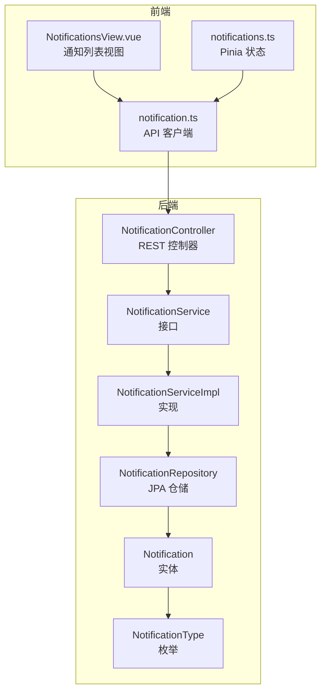
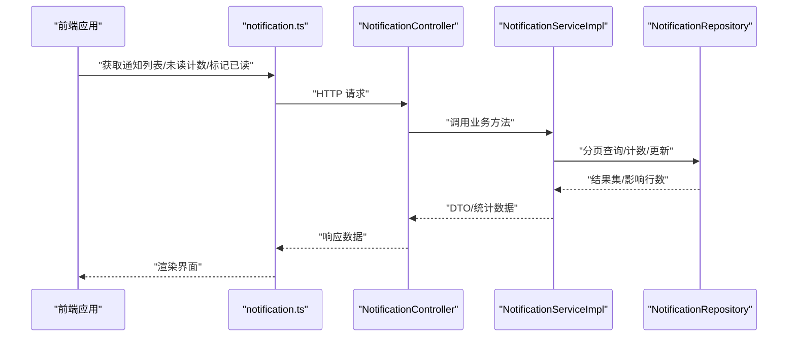
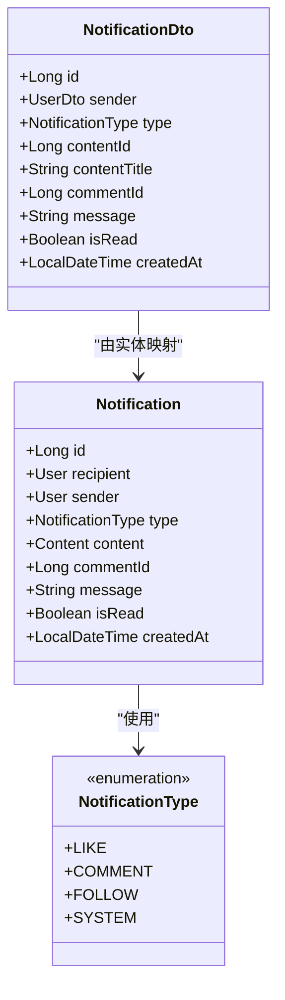
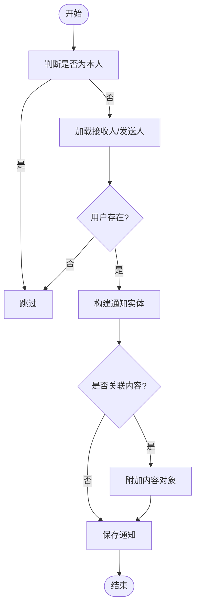
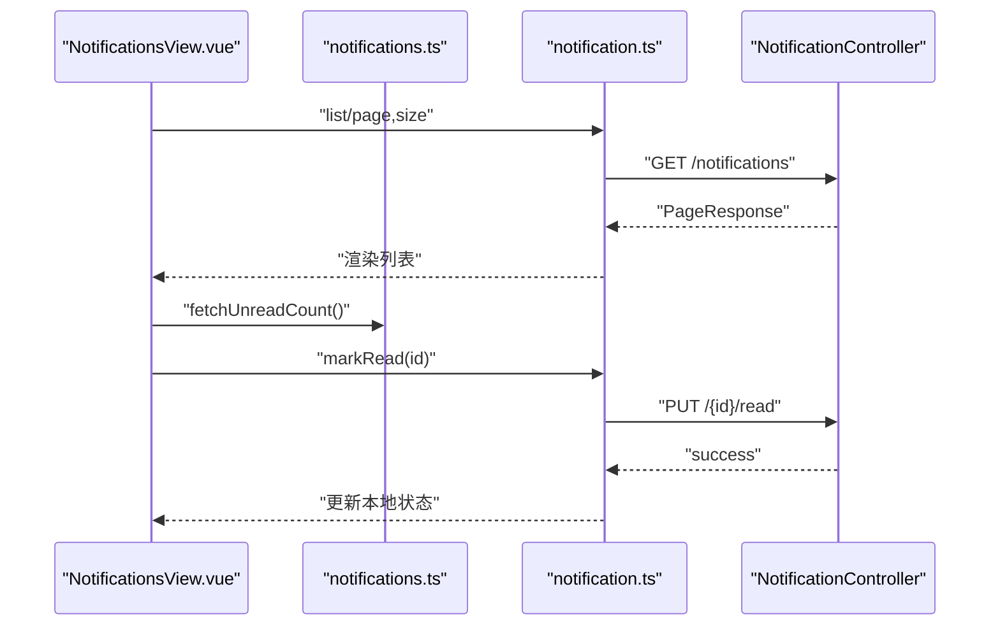
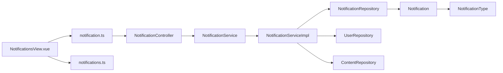

# 通知系统

<cite>
**本文引用的文件**
- [Notification.java](file://communication-backend/src/main/java/com/communication/entity/Notification.java)
- [NotificationType.java](file://communication-backend/src/main/java/com/communication/entity/NotificationType.java)
- [NotificationDto.java](file://communication-backend/src/main/java/com/communication/dto/NotificationDto.java)
- [NotificationController.java](file://communication-backend/src/main/java/com/communication/controller/NotificationController.java)
- [NotificationService.java](file://communication-backend/src/main/java/com/communication/service/NotificationService.java)
- [NotificationServiceImpl.java](file://communication-backend/src/main/java/com/communication/service/impl/NotificationServiceImpl.java)
- [NotificationRepository.java](file://communication-backend/src/main/java/com/communication/repository/NotificationRepository.java)
- [notification.ts（后端）](file://communication-backend/src/main/resources/application.yml)
- [notification.ts（前端）](file://communication-frontend/src/api/notification.ts)
- [通知视图（前端）](file://communication-frontend/src/views/user/NotificationsView.vue)
- [通知状态（前端）](file://communication-frontend/src/stores/notifications.ts)
</cite>

## 目录
1. [简介](#简介)
2. [项目结构](#项目结构)
3. [核心组件](#核心组件)
4. [架构总览](#架构总览)
5. [详细组件分析](#详细组件分析)
6. [依赖分析](#依赖分析)
7. [性能考量](#性能考量)
8. [故障排查指南](#故障排查指南)
9. [结论](#结论)
10. [附录](#附录)

## 简介
本文件系统性梳理通知系统的数据模型、生成机制、实时推送现状、存储与查询优化、API 接口规范以及前端组件设计，并给出性能与可扩展性建议。当前仓库中通知系统以同步 REST API 为主，未发现 WebSocket 实时推送或消息队列异步处理的实现；后续可在现有基础上扩展。

## 项目结构
通知系统涉及后端实体与服务层、控制器层，以及前端 API 调用、状态管理与页面视图。整体采用分层架构：前端通过 HTTP API 访问后端，后端使用 JPA/Hibernate 持久化，Spring Data JPA 提供分页与条件查询能力。

图表来源
- [notification.ts（前端）:1-39](file://communication-frontend/src/api/notification.ts#L1-L39)
- [通知视图（前端）:1-145](file://communication-frontend/src/views/user/NotificationsView.vue#L1-L145)
- [通知状态（前端）:1-23](file://communication-frontend/src/stores/notifications.ts#L1-L23)
- [NotificationController.java:1-47](file://communication-backend/src/main/java/com/communication/controller/NotificationController.java#L1-L47)
- [NotificationService.java:1-19](file://communication-backend/src/main/java/com/communication/service/NotificationService.java#L1-L19)
- [NotificationServiceImpl.java:1-98](file://communication-backend/src/main/java/com/communication/service/impl/NotificationServiceImpl.java#L1-L98)
- [NotificationRepository.java:1-27](file://communication-backend/src/main/java/com/communication/repository/NotificationRepository.java#L1-L27)
- [Notification.java:1-69](file://communication-backend/src/main/java/com/communication/entity/Notification.java#L1-L69)
- [NotificationType.java:1-9](file://communication-backend/src/main/java/com/communication/entity/NotificationType.java#L1-L9)

章节来源
- [notification.ts（前端）:1-39](file://communication-frontend/src/api/notification.ts#L1-L39)
- [通知视图（前端）:1-145](file://communication-frontend/src/views/user/NotificationsView.vue#L1-L145)
- [通知状态（前端）:1-23](file://communication-frontend/src/stores/notifications.ts#L1-L23)
- [NotificationController.java:1-47](file://communication-backend/src/main/java/com/communication/controller/NotificationController.java#L1-L47)
- [NotificationService.java:1-19](file://communication-backend/src/main/java/com/communication/service/NotificationService.java#L1-L19)
- [NotificationServiceImpl.java:1-98](file://communication-backend/src/main/java/com/communication/service/impl/NotificationServiceImpl.java#L1-L98)
- [NotificationRepository.java:1-27](file://communication-backend/src/main/java/com/communication/repository/NotificationRepository.java#L1-L27)
- [Notification.java:1-69](file://communication-backend/src/main/java/com/communication/entity/Notification.java#L1-L69)
- [NotificationType.java:1-9](file://communication-backend/src/main/java/com/communication/entity/NotificationType.java#L1-L9)

## 核心组件
- 通知实体与类型
  - 实体包含接收人、发送人、类型、关联内容/评论、消息正文、是否已读、创建时间等字段。
  - 类型枚举支持 LIKE、COMMENT、FOLLOW、SYSTEM 四类通知。
- DTO 映射
  - 将实体映射为对外传输对象，补充发送人信息、内容标题等便于前端展示。
- 控制器与服务
  - 控制器暴露分页查询、未读计数、单条/全部标记已读等接口。
  - 服务负责业务逻辑：创建通知、分页查询、未读统计、标记已读。
- 仓储与查询
  - 基于 Spring Data JPA 的分页查询、未读计数、批量更新“已读”状态。
- 前端集成
  - API 客户端封装 REST 请求；Pinia 状态维护未读计数；视图负责分页加载、点击打开、一键已读。

章节来源
- [Notification.java:1-69](file://communication-backend/src/main/java/com/communication/entity/Notification.java#L1-L69)
- [NotificationType.java:1-9](file://communication-backend/src/main/java/com/communication/entity/NotificationType.java#L1-L9)
- [NotificationDto.java:1-54](file://communication-backend/src/main/java/com/communication/dto/NotificationDto.java#L1-L54)
- [NotificationController.java:1-47](file://communication-backend/src/main/java/com/communication/controller/NotificationController.java#L1-L47)
- [NotificationService.java:1-19](file://communication-backend/src/main/java/com/communication/service/NotificationService.java#L1-L19)
- [NotificationServiceImpl.java:1-98](file://communication-backend/src/main/java/com/communication/service/impl/NotificationServiceImpl.java#L1-L98)
- [NotificationRepository.java:1-27](file://communication-backend/src/main/java/com/communication/repository/NotificationRepository.java#L1-L27)
- [notification.ts（前端）:1-39](file://communication-frontend/src/api/notification.ts#L1-L39)
- [通知视图（前端）:1-145](file://communication-frontend/src/views/user/NotificationsView.vue#L1-L145)
- [通知状态（前端）:1-23](file://communication-frontend/src/stores/notifications.ts#L1-L23)

## 架构总览
通知系统采用经典的三层结构：前端通过 HTTP API 与后端交互；后端控制器接收请求，调用服务层完成业务处理；服务层协调仓储访问数据库；实体映射类型枚举，确保类型安全与一致性。

图表来源
- [notification.ts（前端）:1-39](file://communication-frontend/src/api/notification.ts#L1-L39)
- [NotificationController.java:1-47](file://communication-backend/src/main/java/com/communication/controller/NotificationController.java#L1-L47)
- [NotificationServiceImpl.java:1-98](file://communication-backend/src/main/java/com/communication/service/impl/NotificationServiceImpl.java#L1-L98)
- [NotificationRepository.java:1-27](file://communication-backend/src/main/java/com/communication/repository/NotificationRepository.java#L1-L27)

## 详细组件分析

### 数据模型与类型
- 通知实体字段
  - 关键字段：接收人、发送人、类型、内容/评论关联、消息正文、是否已读、创建时间。
  - 生命周期钩子在持久化前自动填充创建时间。
- 通知类型
  - 枚举类型包含 LIKE、COMMENT、FOLLOW、SYSTEM，用于区分不同事件场景。
- DTO 设计
  - 将实体转换为对外传输对象，包含发送人、内容标题等必要信息，避免泄露内部实体细节。

图表来源
- [Notification.java:1-69](file://communication-backend/src/main/java/com/communication/entity/Notification.java#L1-L69)
- [NotificationType.java:1-9](file://communication-backend/src/main/java/com/communication/entity/NotificationType.java#L1-L9)
- [NotificationDto.java:1-54](file://communication-backend/src/main/java/com/communication/dto/NotificationDto.java#L1-L54)

章节来源
- [Notification.java:1-69](file://communication-backend/src/main/java/com/communication/entity/Notification.java#L1-L69)
- [NotificationType.java:1-9](file://communication-backend/src/main/java/com/communication/entity/NotificationType.java#L1-L9)
- [NotificationDto.java:1-54](file://communication-backend/src/main/java/com/communication/dto/NotificationDto.java#L1-L54)

### 通知生成机制
- 触发条件
  - 当发生点赞、评论、关注或系统事件时，服务层创建通知。
- 内容组装
  - 设置接收人、发送人、类型、消息正文、可选内容/评论 ID。
- 接收者筛选
  - 避免给自己发通知；若接收人或发送人不存在则忽略。
- 存储入库
  - 保存到数据库，等待后续查询与展示。

图表来源
- [NotificationServiceImpl.java:36-59](file://communication-backend/src/main/java/com/communication/service/impl/NotificationServiceImpl.java#L36-L59)

章节来源
- [NotificationServiceImpl.java:36-59](file://communication-backend/src/main/java/com/communication/service/impl/NotificationServiceImpl.java#L36-L59)

### 实时推送现状与建议
- 现状
  - 后端未发现 WebSocket 或消息队列相关实现；前端通过轮询式 API 获取通知与未读计数。
- 建议
  - 引入 WebSocket 或 SSE，后端在创建通知后主动推送给在线用户。
  - 对高并发场景引入消息队列（如 RabbitMQ/Kafka），异步落库并广播，降低主流程阻塞。
  - 前端结合本地状态与增量更新，减少重复请求与渲染开销。

[本节为概念性建议，不直接分析具体文件，故无章节来源]

### 存储与查询优化
- 分页加载
  - 使用 Spring Data JPA 的 Pageable 进行倒序分页，避免一次性加载全量数据。
- 未读计数
  - 提供按接收人统计未读数量的专用查询，减少前端多次请求。
- 批量操作
  - 支持单条与全部标记已读，使用原生 JPQL 执行批量更新，提升性能。
- 索引建议
  - 在 recipient_id、is_read、created_at 上建立复合索引，加速分页与未读统计。
- 缓存策略
  - 对热点用户的未读计数进行短期缓存，降低数据库压力。

章节来源
- [NotificationRepository.java:15-26](file://communication-backend/src/main/java/com/communication/repository/NotificationRepository.java#L15-L26)
- [NotificationServiceImpl.java:61-96](file://communication-backend/src/main/java/com/communication/service/impl/NotificationServiceImpl.java#L61-L96)

### API 接口规范
- 获取通知列表
  - 方法与路径：GET /api/notifications
  - 查询参数：page（默认 0）、size（默认 20）
  - 返回：分页响应，包含通知列表与分页元数据
- 获取未读计数
  - 方法与路径：GET /api/notifications/unread-count
  - 返回：未读数量
- 标记单条为已读
  - 方法与路径：PUT /api/notifications/{id}/read
  - 返回：成功状态
- 全部标记为已读
  - 方法与路径：PUT /api/notifications/read-all
  - 返回：成功状态

章节来源
- [NotificationController.java:22-45](file://communication-backend/src/main/java/com/communication/controller/NotificationController.java#L22-L45)
- [notification.ts（前端）:20-38](file://communication-frontend/src/api/notification.ts#L20-L38)

### 前端通知组件设计
- 通知状态管理
  - 使用 Pinia 维护未读计数，提供拉取与设置方法。
- 通知视图
  - 支持分页加载、骨架屏占位、空状态提示、类型标签与时间显示。
  - 点击项自动标记已读并跳转至目标页面（内容详情或用户主页）。
  - 提供“全部已读”按钮，一键更新本地状态与后端状态。
- 交互细节
  - 加载更多时避免重复请求，控制 total pages 边界。
  - 已读态样式区分，提升可读性。

图表来源
- [通知视图（前端）:16-59](file://communication-frontend/src/views/user/NotificationsView.vue#L16-L59)
- [通知状态（前端）:8-19](file://communication-frontend/src/stores/notifications.ts#L8-L19)
- [notification.ts（前端）:20-37](file://communication-frontend/src/api/notification.ts#L20-L37)
- [NotificationController.java:35-39](file://communication-backend/src/main/java/com/communication/controller/NotificationController.java#L35-L39)

章节来源
- [通知视图（前端）:1-145](file://communication-frontend/src/views/user/NotificationsView.vue#L1-L145)
- [通知状态（前端）:1-23](file://communication-frontend/src/stores/notifications.ts#L1-L23)
- [notification.ts（前端）:1-39](file://communication-frontend/src/api/notification.ts#L1-L39)

## 依赖分析
- 后端依赖关系
  - 控制器依赖服务接口；
  - 服务实现依赖仓储与用户/内容仓库；
  - 仓储继承 JPA 基础接口，提供自定义查询；
  - 实体依赖类型枚举，DTO 依赖实体与用户 DTO。
- 前端依赖关系
  - 视图依赖 API 客户端与状态管理；
  - API 客户端依赖通用 HTTP 封装。

图表来源
- [NotificationController.java:1-47](file://communication-backend/src/main/java/com/communication/controller/NotificationController.java#L1-L47)
- [NotificationService.java:1-19](file://communication-backend/src/main/java/com/communication/service/NotificationService.java#L1-L19)
- [NotificationServiceImpl.java:25-34](file://communication-backend/src/main/java/com/communication/service/impl/NotificationServiceImpl.java#L25-L34)
- [NotificationRepository.java:12-26](file://communication-backend/src/main/java/com/communication/repository/NotificationRepository.java#L12-L26)
- [Notification.java:1-69](file://communication-backend/src/main/java/com/communication/entity/Notification.java#L1-L69)
- [NotificationType.java:1-9](file://communication-backend/src/main/java/com/communication/entity/NotificationType.java#L1-L9)
- [通知视图（前端）:1-145](file://communication-frontend/src/views/user/NotificationsView.vue#L1-L145)
- [通知状态（前端）:1-23](file://communication-frontend/src/stores/notifications.ts#L1-L23)
- [notification.ts（前端）:1-39](file://communication-frontend/src/api/notification.ts#L1-L39)

章节来源
- [NotificationServiceImpl.java:25-34](file://communication-backend/src/main/java/com/communication/service/impl/NotificationServiceImpl.java#L25-L34)
- [NotificationRepository.java:12-26](file://communication-backend/src/main/java/com/communication/repository/NotificationRepository.java#L12-L26)
- [Notification.java:1-69](file://communication-backend/src/main/java/com/communication/entity/Notification.java#L1-L69)
- [NotificationType.java:1-9](file://communication-backend/src/main/java/com/communication/entity/NotificationType.java#L1-L9)
- [通知视图（前端）:1-145](file://communication-frontend/src/views/user/NotificationsView.vue#L1-L145)
- [通知状态（前端）:1-23](file://communication-frontend/src/stores/notifications.ts#L1-L23)
- [notification.ts（前端）:1-39](file://communication-frontend/src/api/notification.ts#L1-L39)

## 性能考量
- 查询性能
  - 利用分页与倒序排序，避免全表扫描；对高频字段建立索引。
- 写入性能
  - 创建通知为轻量写入，注意避免自触发与无效用户场景。
- 批处理
  - 标记已读使用批量更新，减少事务开销。
- 前端体验
  - 使用骨架屏与懒加载，避免长列表渲染卡顿。
- 可扩展性
  - 引入消息队列与 WebSocket/SSE，支撑高并发与实时推送。

[本节为通用性能建议，不直接分析具体文件，故无章节来源]

## 故障排查指南
- 用户不存在
  - 服务层在找不到用户时会直接返回，避免异常传播；前端应捕获错误并降级处理。
- 权限问题
  - 控制器基于认证上下文获取用户名，确保前端携带正确 Token。
- 分页边界
  - 注意 total pages 与当前页的边界判断，防止重复请求与越界。
- 未读计数不一致
  - 前端在标记已读后同步更新本地状态与后端状态，避免显示与实际不符。

章节来源
- [NotificationServiceImpl.java:75-96](file://communication-backend/src/main/java/com/communication/service/impl/NotificationServiceImpl.java#L75-L96)
- [NotificationController.java:22-45](file://communication-backend/src/main/java/com/communication/controller/NotificationController.java#L22-L45)
- [通知视图（前端）:16-59](file://communication-frontend/src/views/user/NotificationsView.vue#L16-L59)
- [通知状态（前端）:8-19](file://communication-frontend/src/stores/notifications.ts#L8-L19)

## 结论
当前通知系统以简洁清晰的分层架构实现，具备基本的创建、查询、未读统计与标记已读能力。建议后续引入 WebSocket/SSE 与消息队列，以提升实时性与吞吐能力；同时完善索引与缓存策略，进一步优化性能与用户体验。

## 附录
- 配置参考
  - 数据源与 JPA 配置位于后端资源文件中，包含数据库连接、方言与 Flyway 迁移配置。

章节来源
- [notification.ts（后端）:5-42](file://communication-backend/src/main/resources/application.yml#L5-L42)