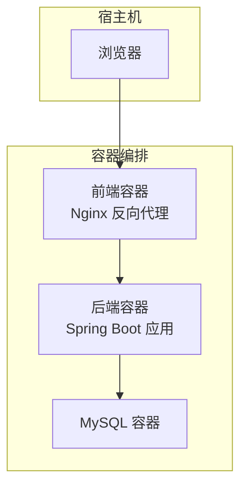
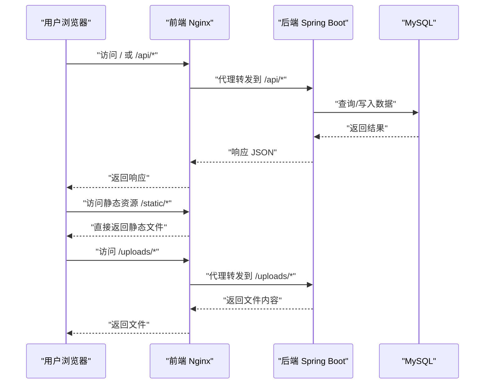
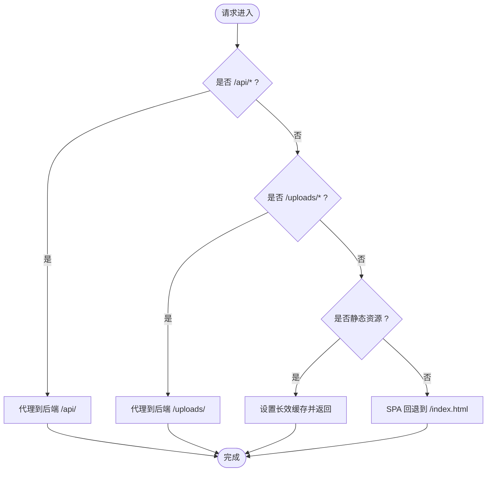
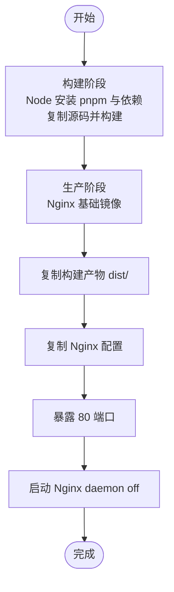
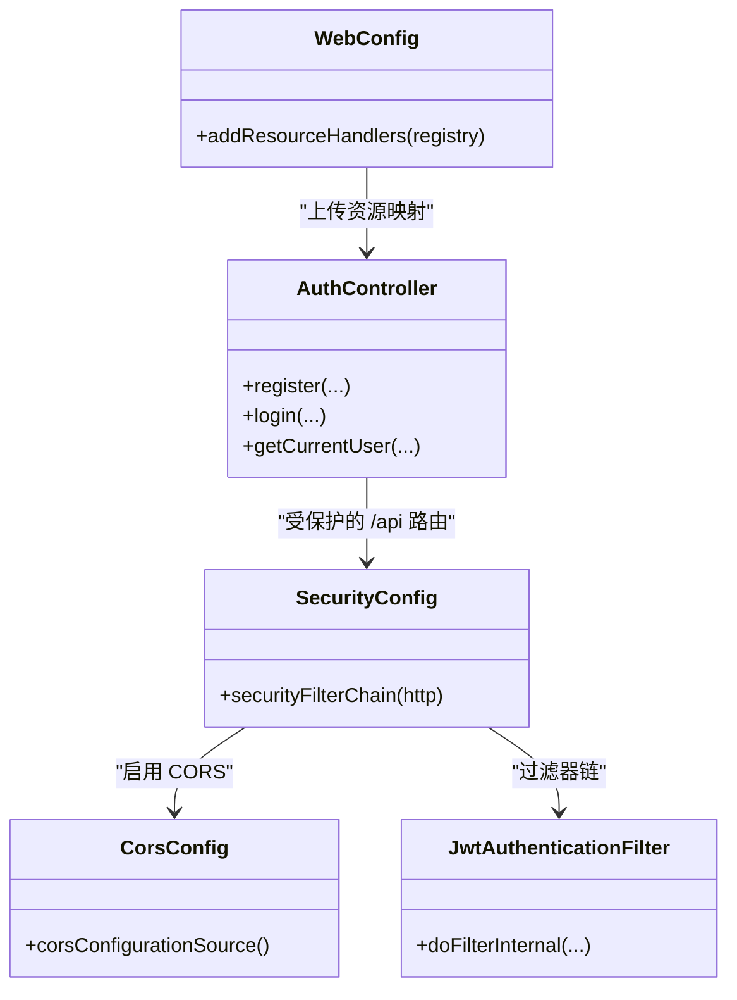
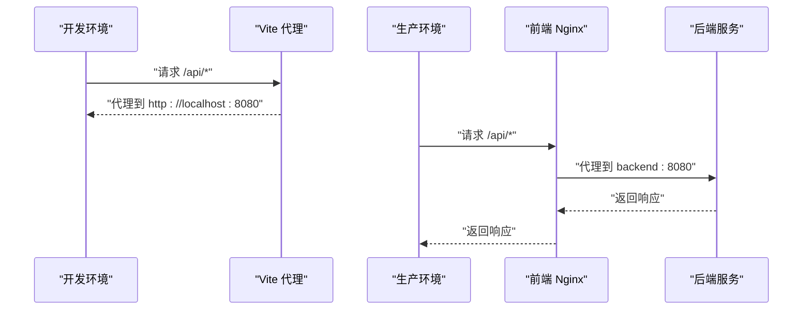
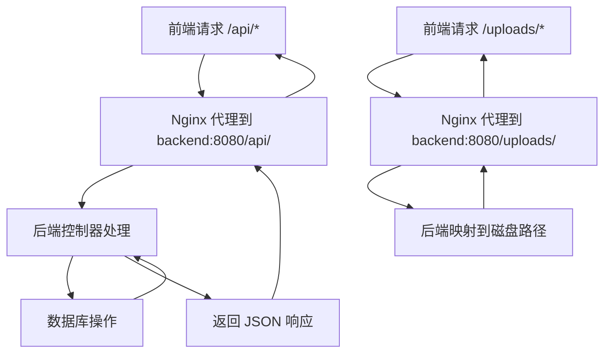
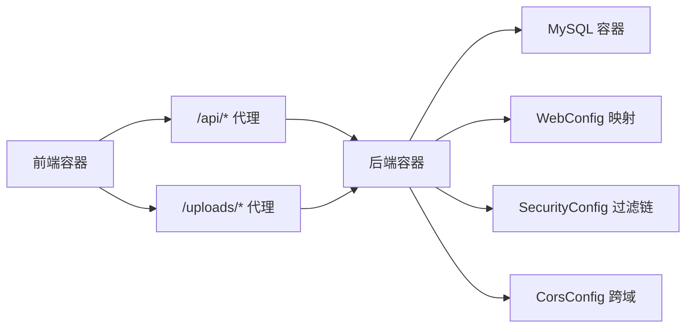

# 前后端集成部署

<cite>
**本文引用的文件**
- [docker-compose.yml](file://docker-compose.yml)
- [nginx.conf](file://communication-frontend/nginx.conf)
- [Dockerfile（前端）](file://communication-frontend/Dockerfile)
- [Dockerfile（后端）](file://communication-backend/Dockerfile)
- [application.yml](file://communication-backend/src/main/resources/application.yml)
- [application-docker.yml](file://communication-backend/src/main/resources/application-docker.yml)
- [CorsConfig.java](file://communication-backend/src/main/java/com/communication/config/CorsConfig.java)
- [WebConfig.java](file://communication-backend/src/main/java/com/communication/config/WebConfig.java)
- [SecurityConfig.java](file://communication-backend/src/main/java/com/communication/config/SecurityConfig.java)
- [JwtAuthenticationFilter.java](file://communication-backend/src/main/java/com/communication/config/JwtAuthenticationFilter.java)
- [vite.config.ts](file://communication-frontend/vite.config.ts)
- [AuthController.java](file://communication-backend/src/main/java/com/communication/controller/AuthController.java)
- [init.sql](file://init.sql)
- [package.json](file://communication-frontend/package.json)
</cite>

## 目录
1. [简介](#简介)
2. [项目结构](#项目结构)
3. [核心组件](#核心组件)
4. [架构总览](#架构总览)
5. [详细组件分析](#详细组件分析)
6. [依赖关系分析](#依赖关系分析)
7. [性能与优化](#性能与优化)
8. [故障排查指南](#故障排查指南)
9. [结论](#结论)
10. [附录](#附录)

## 简介
本文件面向通信平台的前后端集成部署，系统性阐述以下主题：
- Nginx 反向代理配置的设计原理与关键选项：静态资源服务、API 代理转发、CORS 跨域处理、SPA 路由回退。
- 前后端分离架构的部署策略及 Nginx 的作用定位。
- Dockerfile 中前端构建流程与静态资源优化策略。
- 服务间通信配置：CORS 设置与 API 路由转发规则。
- 负载均衡与高可用部署方案思路。
- SSL/TLS 证书配置与 HTTPS 部署指南。
- 性能优化建议：缓存策略、压缩配置与静态资源长效缓存。

## 项目结构
项目采用前后端分离架构，通过 Docker Compose 编排 MySQL、后端服务与前端 Nginx 服务，形成可一键部署的完整环境。前端容器内嵌 Nginx 提供静态资源与 API 代理；后端容器运行 Spring Boot 应用，提供 REST API 与文件上传访问。

**图表来源**
- [docker-compose.yml](file://docker-compose.yml#L1-L60)
- [nginx.conf](file://communication-frontend/nginx.conf#L1-L42)
- [Dockerfile（前端）](file://communication-frontend/Dockerfile#L1-L33)
- [Dockerfile（后端）](file://communication-backend/Dockerfile#L1-L32)

**章节来源**
- [docker-compose.yml](file://docker-compose.yml#L1-L60)

## 核心组件
- 前端 Nginx：监听 80 端口，提供静态资源、Gzip 压缩、API 与上传路径代理、SPA 回退路由，并对静态资源设置长效缓存。
- 后端 Spring Boot：提供认证、内容、用户、订阅等 API，启用无状态会话、JWT 过滤链与 CORS 支持，暴露上传资源映射。
- 数据库：MySQL 8.0，使用初始化脚本与 Flyway 迁移。
- 容器化：前后端分别构建镜像，通过 Compose 组合运行。

**章节来源**
- [nginx.conf](file://communication-frontend/nginx.conf#L1-L42)
- [application.yml](file://communication-backend/src/main/resources/application.yml#L1-L42)
- [application-docker.yml](file://communication-backend/src/main/resources/application-docker.yml#L1-L43)
- [CorsConfig.java](file://communication-backend/src/main/java/com/communication/config/CorsConfig.java#L1-L29)
- [WebConfig.java](file://communication-backend/src/main/java/com/communication/config/WebConfig.java#L1-L20)
- [SecurityConfig.java](file://communication-backend/src/main/java/com/communication/config/SecurityConfig.java#L1-L89)
- [JwtAuthenticationFilter.java](file://communication-backend/src/main/java/com/communication/config/JwtAuthenticationFilter.java#L1-L69)
- [Dockerfile（前端）](file://communication-frontend/Dockerfile#L1-L33)
- [Dockerfile（后端）](file://communication-backend/Dockerfile#L1-L32)
- [init.sql](file://init.sql#L1-L3)

## 架构总览
下图展示从浏览器到后端 API 的典型请求路径，以及静态资源与上传资源的代理转发关系。

**图表来源**
- [nginx.conf](file://communication-frontend/nginx.conf#L11-L29)
- [application.yml](file://communication-backend/src/main/resources/application.yml#L38-L42)
- [WebConfig.java](file://communication-backend/src/main/java/com/communication/config/WebConfig.java#L14-L18)

## 详细组件分析

### Nginx 反向代理配置（nginx.conf）
- 监听与根目录：监听 80 端口，根目录指向静态资源输出目录，首页索引为 index.html。
- Gzip 压缩：开启并指定压缩类型，减少传输体积。
- API 代理（/api/）：将匹配前缀的请求代理至后端服务地址，设置必要的头部以保留客户端真实 IP、协议与升级头，用于 WebSocket 等场景。
- 上传代理（/uploads/）：将上传资源请求代理至后端，便于后端统一处理文件读取。
- SPA 路由回退：对未命中静态文件的请求回退到 index.html，使前端路由生效。
- 静态资源缓存：对 JS/CSS/图片/字体等资源设置一年缓存与 immutable 标记，提升缓存命中率。

**图表来源**
- [nginx.conf](file://communication-frontend/nginx.conf#L11-L41)

**章节来源**
- [nginx.conf](file://communication-frontend/nginx.conf#L1-L42)

### 前端构建与静态资源优化（Dockerfile）
- 多阶段构建：第一阶段使用 Node 基础镜像安装 pnpm 与依赖，复制源码并执行构建；第二阶段基于 Nginx 镜像，清理默认配置，复制构建产物与自定义 Nginx 配置，暴露 80 端口并以非守护进程方式启动 Nginx。
- 静态资源优化：通过 Nginx 配置对 JS/CSS/媒体/字体等设置一年缓存与 immutable 标签，结合 Gzip 压缩，显著降低带宽与加载时间。

**图表来源**
- [Dockerfile（前端）](file://communication-frontend/Dockerfile#L1-L33)
- [nginx.conf](file://communication-frontend/nginx.conf#L36-L41)

**章节来源**
- [Dockerfile（前端）](file://communication-frontend/Dockerfile#L1-L33)
- [nginx.conf](file://communication-frontend/nginx.conf#L36-L41)

### 后端服务配置与安全策略
- 数据源与 JPA：使用 MySQL 作为持久层，Flyway 自动迁移；Docker 环境下调整连接参数与池大小。
- 文件上传：通过 WebMvc 配置将 /uploads/** 映射到磁盘路径，配合后端控制器提供下载。
- CORS：允许特定前端开发端口（如 5173、3000），支持常用方法与凭证，设置最大缓存时长。
- 安全：禁用 CSRF，启用无状态会话，开放部分公开接口，其余接口需鉴权；JWT 过滤器从 Authorization 头解析 Bearer Token 并注入认证上下文。
- API 路由：控制器按模块划分（认证、内容、用户、订阅等），统一前缀 /api。

**图表来源**
- [SecurityConfig.java](file://communication-backend/src/main/java/com/communication/config/SecurityConfig.java#L66-L87)
- [CorsConfig.java](file://communication-backend/src/main/java/com/communication/config/CorsConfig.java#L15-L27)
- [WebConfig.java](file://communication-backend/src/main/java/com/communication/config/WebConfig.java#L14-L18)
- [JwtAuthenticationFilter.java](file://communication-backend/src/main/java/com/communication/config/JwtAuthenticationFilter.java#L31-L67)
- [AuthController.java](file://communication-backend/src/main/java/com/communication/controller/AuthController.java#L12-L42)

**章节来源**
- [application.yml](file://communication-backend/src/main/resources/application.yml#L1-L42)
- [application-docker.yml](file://communication-backend/src/main/resources/application-docker.yml#L1-L43)
- [CorsConfig.java](file://communication-backend/src/main/java/com/communication/config/CorsConfig.java#L1-L29)
- [WebConfig.java](file://communication-backend/src/main/java/com/communication/config/WebConfig.java#L1-L20)
- [SecurityConfig.java](file://communication-backend/src/main/java/com/communication/config/SecurityConfig.java#L1-L89)
- [JwtAuthenticationFilter.java](file://communication-backend/src/main/java/com/communication/config/JwtAuthenticationFilter.java#L1-L69)
- [AuthController.java](file://communication-backend/src/main/java/com/communication/controller/AuthController.java#L1-L42)

### 前后端分离部署策略与 Nginx 的作用
- 前端独立容器：内置 Nginx，负责静态资源分发、API 与上传代理、SPA 回退与缓存策略。
- 后端独立容器：仅暴露 API 与上传资源，不直接对外提供静态页面。
- 服务发现：前端容器通过服务名访问后端容器，实现容器间通信。
- 开发与生产差异：开发模式下前端 Vite 使用本地代理；生产模式下由 Nginx 统一代理。

**图表来源**
- [vite.config.ts](file://communication-frontend/vite.config.ts#L26-L38)
- [nginx.conf](file://communication-frontend/nginx.conf#L11-L22)
- [docker-compose.yml](file://docker-compose.yml#L46-L56)

**章节来源**
- [vite.config.ts](file://communication-frontend/vite.config.ts#L1-L40)
- [nginx.conf](file://communication-frontend/nginx.conf#L1-L42)
- [docker-compose.yml](file://docker-compose.yml#L1-L60)

### 服务间通信与 API 路由转发规则
- API 路由：前端 Nginx 将 /api/* 代理到后端 backend:8080；后端控制器按模块划分路由，统一前缀 /api。
- 上传资源：/uploads/* 由前端 Nginx 代理到后端，后端通过 WebConfig 将其映射到磁盘路径。
- CORS：后端启用 CORS，允许开发端口访问，支持凭证与常见方法。
- 认证：JWT 过滤器从 Authorization 头提取 Bearer Token，校验后注入认证上下文，后续受保护接口方可访问。

**图表来源**
- [nginx.conf](file://communication-frontend/nginx.conf#L11-L29)
- [WebConfig.java](file://communication-backend/src/main/java/com/communication/config/WebConfig.java#L14-L18)
- [CorsConfig.java](file://communication-backend/src/main/java/com/communication/config/CorsConfig.java#L15-L27)
- [JwtAuthenticationFilter.java](file://communication-backend/src/main/java/com/communication/config/JwtAuthenticationFilter.java#L31-L67)

**章节来源**
- [nginx.conf](file://communication-frontend/nginx.conf#L11-L29)
- [WebConfig.java](file://communication-backend/src/main/java/com/communication/config/WebConfig.java#L14-L18)
- [CorsConfig.java](file://communication-backend/src/main/java/com/communication/config/CorsConfig.java#L1-L29)
- [JwtAuthenticationFilter.java](file://communication-backend/src/main/java/com/communication/config/JwtAuthenticationFilter.java#L1-L69)

### 负载均衡与高可用部署方案
- 前端层：多实例前端容器 + 外部负载均衡器（如 Nginx、HAProxy 或云厂商 LB），实现静态资源与 API 请求的横向扩展。
- 后端层：多实例后端容器 + 数据库主从或集群，结合连接池参数与健康检查，确保高可用与弹性伸缩。
- 存储：上传目录挂载到持久卷或对象存储，避免单点故障。
- 网络：容器网络隔离与服务发现，通过服务名进行内部通信；外部暴露最小化端口，仅开放 80/443。

[本节为概念性部署建议，不直接分析具体文件，故无“章节来源”]

### SSL/TLS 证书配置与 HTTPS 部署
- 证书获取：通过 Let’s Encrypt 或商业 CA 获取域名证书与私钥。
- Nginx 配置：在前端 Nginx 中添加 443 端口监听，配置 ssl_certificate、ssl_certificate_key 与安全参数；重定向 80 到 443。
- 后端信任：若后端需要 HTTPS 回调或上游通信，确保证书链完整且受信任。
- 客户端访问：浏览器通过 HTTPS 访问，避免混合内容问题；CORS 与 Cookie 凭证需在 HTTPS 下工作。

[本节为通用部署指导，不直接分析具体文件，故无“章节来源”]

## 依赖关系分析
- 前端容器依赖后端服务健康状态；后端依赖数据库健康状态。
- 后端通过 WebConfig 将 /uploads/** 映射到磁盘路径，供前端 Nginx 代理访问。
- CORS 配置与安全过滤链共同保障跨域与认证行为。

**图表来源**
- [docker-compose.yml](file://docker-compose.yml#L4-L56)
- [nginx.conf](file://communication-frontend/nginx.conf#L11-L29)
- [WebConfig.java](file://communication-backend/src/main/java/com/communication/config/WebConfig.java#L14-L18)
- [SecurityConfig.java](file://communication-backend/src/main/java/com/communication/config/SecurityConfig.java#L66-L87)
- [CorsConfig.java](file://communication-backend/src/main/java/com/communication/config/CorsConfig.java#L15-L27)

**章节来源**
- [docker-compose.yml](file://docker-compose.yml#L1-L60)
- [nginx.conf](file://communication-frontend/nginx.conf#L1-L42)
- [WebConfig.java](file://communication-backend/src/main/java/com/communication/config/WebConfig.java#L1-L20)
- [SecurityConfig.java](file://communication-backend/src/main/java/com/communication/config/SecurityConfig.java#L1-L89)
- [CorsConfig.java](file://communication-backend/src/main/java/com/communication/config/CorsConfig.java#L1-L29)

## 性能与优化
- 缓存策略：对静态资源设置一年缓存与 immutable 标记，显著降低重复请求；后端接口可通过 Cache-Control 控制缓存。
- 压缩配置：启用 Gzip 并限定压缩类型，减少传输体积；可考虑 Brotli 以获得更高压缩比。
- 静态资源优化：构建时进行代码分割与 Tree Shaking；CDN 分发静态资源，缩短边缘延迟。
- 上传优化：后端限制上传大小与类型，前端预检与进度反馈；上传目录使用高性能存储或对象存储。
- 连接与池化：合理设置数据库连接池大小与超时，避免并发高峰下的连接争用。
- 健康检查与探针：为容器配置健康检查与就绪探针，确保流量只导向健康实例。

[本节提供通用优化建议，不直接分析具体文件，故无“章节来源”]

## 故障排查指南
- 前端无法访问 API：
  - 检查 Nginx 代理配置与后端服务连通性；确认 /api/ 前缀代理目标正确。
  - 查看浏览器开发者工具 Network 面板，确认代理是否成功转发。
- CORS 失败：
  - 确认后端 CORS 允许的源、方法与凭证设置；开发环境与生产环境的允许源可能不同。
- 上传失败或 404：
  - 检查 /uploads/ 代理配置与后端 WebConfig 映射路径；确认上传目录权限与挂载。
- JWT 认证失败：
  - 检查 Authorization 头格式与后端 JWT 解析逻辑；确认密钥一致与过期时间设置。
- 数据库连接异常：
  - 检查数据库健康状态与连接参数；确认初始化脚本与 Flyway 迁移是否成功。

**章节来源**
- [nginx.conf](file://communication-frontend/nginx.conf#L11-L29)
- [CorsConfig.java](file://communication-backend/src/main/java/com/communication/config/CorsConfig.java#L15-L27)
- [WebConfig.java](file://communication-backend/src/main/java/com/communication/config/WebConfig.java#L14-L18)
- [JwtAuthenticationFilter.java](file://communication-backend/src/main/java/com/communication/config/JwtAuthenticationFilter.java#L31-L67)
- [application.yml](file://communication-backend/src/main/resources/application.yml#L5-L9)
- [application-docker.yml](file://communication-backend/src/main/resources/application-docker.yml#L3-L7)

## 结论
本部署方案通过 Nginx 实现前后端分离的统一入口与代理转发，结合 Spring Boot 的安全与 CORS 配置，形成清晰的请求链路与资源分发机制。Docker 化与 Compose 编排简化了部署与运维，适合中小型团队快速落地与扩展。生产环境中建议补充 HTTPS、CDN、缓存与监控体系，进一步提升安全性与性能。

## 附录
- 开发与生产差异要点：
  - 开发：前端 Vite 本地代理到后端 8080；后端使用本地数据库连接。
  - 生产：前端 Nginx 代理到后端服务；后端使用 Docker 环境变量与持久卷。
- 关键配置参考：
  - 前端 Nginx：静态资源、Gzip、代理与缓存。
  - 后端：数据源、JPA、CORS、安全过滤链、JWT 过滤器与上传映射。
  - Compose：服务编排、端口映射、健康检查与卷挂载。

**章节来源**
- [vite.config.ts](file://communication-frontend/vite.config.ts#L26-L38)
- [nginx.conf](file://communication-frontend/nginx.conf#L1-L42)
- [application.yml](file://communication-backend/src/main/resources/application.yml#L1-L42)
- [application-docker.yml](file://communication-backend/src/main/resources/application-docker.yml#L1-L43)
- [docker-compose.yml](file://docker-compose.yml#L1-L60)
- [init.sql](file://init.sql#L1-L3)
- [package.json](file://communication-frontend/package.json#L1-L36)