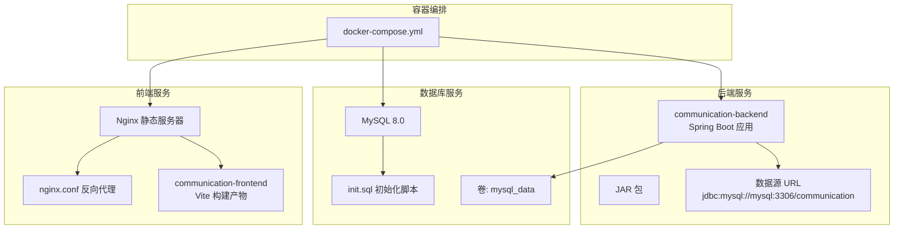
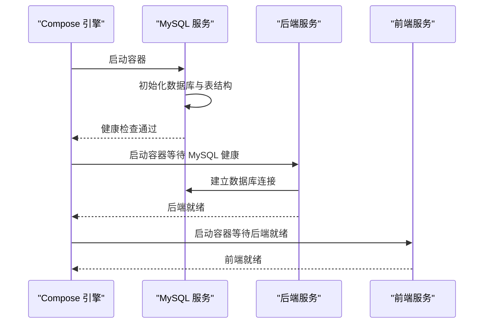
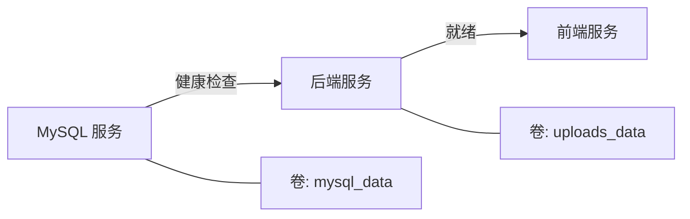

# 容器化部署

<cite>
**本文引用的文件**
- [docker-compose.yml](file://docker-compose.yml)
- [Dockerfile（后端）](file://communication-backend/Dockerfile)
- [Dockerfile（前端）](file://communication-frontend/Dockerfile)
- [application.yml（默认）](file://communication-backend/src/main/resources/application.yml)
- [application-docker.yml（Docker配置）](file://communication-backend/src/main/resources/application-docker.yml)
- [nginx.conf（前端）](file://communication-frontend/nginx.conf)
- [init.sql（初始化脚本）](file://init.sql)
- [package.json（前端包管理）](file://communication-frontend/package.json)
- [pom.xml（后端依赖）](file://communication-backend/pom.xml)
- [CommunicationApplication.java（入口类）](file://communication-backend/src/main/java/com/communication/CommunicationApplication.java)
</cite>

## 目录
1. [简介](#简介)
2. [项目结构](#项目结构)
3. [核心组件](#核心组件)
4. [架构总览](#架构总览)
5. [详细组件分析](#详细组件分析)
6. [依赖关系分析](#依赖关系分析)
7. [性能与优化建议](#性能与优化建议)
8. [故障排查指南](#故障排查指南)
9. [结论](#结论)
10. [附录：多环境部署示例](#附录多环境部署示例)

## 简介
本文件面向通信平台的容器化部署，系统性解析 docker-compose.yml 的完整结构与运行机制，覆盖 MySQL 数据库服务、Spring Boot 后端服务与 Vue 前端服务的配置细节；阐明服务间依赖与启动顺序、Dockerfile 构建流程与优化策略、卷挂载与持久化方案、容器网络与端口映射、健康检查与重启策略，并提供多环境（开发/测试/生产）的配置思路与最佳实践。

## 项目结构
通信平台采用三模块架构：
- 后端：基于 Spring Boot 的 Java 应用，使用 Flyway 进行数据库迁移，HikariCP 连接池，JWT 认证与文件上传能力。
- 前端：基于 Vue 3 + Vite 的单页应用（SPA），通过 Nginx 提供静态资源与反向代理。
- 数据库：MySQL 8.0，支持 UTF8MB4 字符集与校对规则，初始化脚本自动创建数据库。

图表来源
- [docker-compose.yml](file://docker-compose.yml#L1-L60)
- [Dockerfile（后端）](file://communication-backend/Dockerfile#L1-L32)
- [Dockerfile（前端）](file://communication-frontend/Dockerfile#L1-L33)
- [application-docker.yml（Docker配置）](file://communication-backend/src/main/resources/application-docker.yml#L1-L43)
- [nginx.conf（前端）](file://communication-frontend/nginx.conf#L1-L42)
- [init.sql（初始化脚本）](file://init.sql#L1-L3)

章节来源
- [docker-compose.yml](file://docker-compose.yml#L1-L60)
- [Dockerfile（后端）](file://communication-backend/Dockerfile#L1-L32)
- [Dockerfile（前端）](file://communication-frontend/Dockerfile#L1-L33)
- [application.yml（默认）](file://communication-backend/src/main/resources/application.yml#L1-L42)
- [application-docker.yml（Docker配置）](file://communication-backend/src/main/resources/application-docker.yml#L1-L43)
- [nginx.conf（前端）](file://communication-frontend/nginx.conf#L1-L42)
- [init.sql（初始化脚本）](file://init.sql#L1-L3)

## 核心组件
- MySQL 数据库服务
  - 镜像版本：mysql:8.0
  - 环境变量：根密码、数据库名、普通用户与密码
  - 端口映射：3306:3306
  - 卷：mysql_data（持久化）、init.sql（只读初始化）
  - 命令参数：字符集与校对规则设置
  - 健康检查：mysqladmin ping
- Spring Boot 后端服务
  - 构建阶段：多阶段 Alpine JDK 打包
  - 运行阶段：Alpine JRE 轻量运行时
  - 环境变量：激活 docker profile、数据源连接、JWT 密钥、上传路径
  - 端口映射：8080:8080
  - 卷：uploads_data（文件上传持久化）
  - 依赖：MySQL（健康就绪）
- Vue 前端服务
  - 构建阶段：Node 20 Alpine + pnpm 安装依赖 + Vite 构建
  - 运行阶段：Nginx Alpine 静态服务
  - 端口映射：80:80
  - 依赖：后端（服务就绪）

章节来源
- [docker-compose.yml](file://docker-compose.yml#L4-L55)
- [Dockerfile（后端）](file://communication-backend/Dockerfile#L1-L32)
- [Dockerfile（前端）](file://communication-frontend/Dockerfile#L1-L33)
- [application-docker.yml（Docker配置）](file://communication-backend/src/main/resources/application-docker.yml#L1-L43)

## 架构总览
容器编排遵循“数据库优先、后端次之、前端最后”的启动顺序，确保后端在数据库可用后再启动，前端在后端可用后再启动。网络层面，所有服务位于同一 Docker Compose 网络中，默认可通过服务名进行内部访问（如后端访问 mysql:3306）。

图表来源
- [docker-compose.yml](file://docker-compose.yml#L42-L55)
- [application-docker.yml（Docker配置）](file://communication-backend/src/main/resources/application-docker.yml#L1-L43)

## 详细组件分析

### MySQL 数据库服务
- 配置要点
  - 使用官方 mysql:8.0 镜像，设置 root 密码、数据库名、普通用户与密码
  - 挂载 mysql_data 实现持久化，init.sql 在首次初始化时执行
  - 设置字符集与校对规则，确保多语言内容正确存储
  - 健康检查使用 mysqladmin ping，间隔与重试次数合理
- 端口与网络
  - 映射宿主机 3306 到容器 3306，便于本地调试
  - 容器内通过服务名 mysql 访问自身端口 3306
- 数据持久化
  - 卷 mysql_data 挂载到 /var/lib/mysql，避免容器删除导致数据丢失

章节来源
- [docker-compose.yml](file://docker-compose.yml#L4-L23)
- [init.sql（初始化脚本）](file://init.sql#L1-L3)

### Spring Boot 后端服务
- 构建与运行
  - 多阶段构建：第一阶段使用 eclipse-temurin:21-jdk-alpine 下载依赖并打包；第二阶段使用 eclipse-temurin:21-jre-alpine 运行
  - 创建 /app/uploads 目录用于文件上传
  - 暴露 8080 端口，以 JAR 方式启动
- 配置文件
  - application-docker.yml 激活 docker profile，设置数据源、Flyway、JWT、上传路径等
  - application.yml 提供默认开发配置（本地直连 localhost:3306）
- 依赖与启动顺序
  - depends_on 指定依赖 MySQL 健康状态，确保数据库可用后再启动后端
- 卷与持久化
  - 挂载 uploads_data 到 /app/uploads，实现上传文件持久化

章节来源
- [Dockerfile（后端）](file://communication-backend/Dockerfile#L1-L32)
- [application-docker.yml（Docker配置）](file://communication-backend/src/main/resources/application-docker.yml#L1-L43)
- [application.yml（默认）](file://communication-backend/src/main/resources/application.yml#L1-L42)
- [docker-compose.yml](file://docker-compose.yml#L25-L44)

### Vue 前端服务
- 构建与运行
  - 多阶段构建：Node 20 Alpine 安装 pnpm 与依赖，Vite 构建；Nginx Alpine 提供静态服务
  - 暴露 80 端口，Nginx 以前台模式运行
- 反向代理与路由
  - nginx.conf 将 /api/ 代理至后端 8080 端口，WebSocket 升级头透传
  - /uploads/ 代理至后端上传接口
  - SPA 路由回退到 index.html，静态资源缓存一年
- 依赖与启动顺序
  - depends_on 指定依赖后端服务就绪后再启动前端

章节来源
- [Dockerfile（前端）](file://communication-frontend/Dockerfile#L1-L33)
- [nginx.conf（前端）](file://communication-frontend/nginx.conf#L1-L42)
- [docker-compose.yml](file://docker-compose.yml#L46-L55)

### 后端应用配置要点
- 数据源与连接池
  - 使用 HikariCP，最大池大小、最小空闲、连接超时等参数已配置
- 数据库迁移
  - Flyway 启用，迁移脚本位于 classpath:db/migration，首次迁移自动基线
- 文件上传
  - 最大文件大小与请求大小限制，上传目录通过环境变量控制
- 日志级别
  - 生产环境日志级别设置为 INFO

章节来源
- [application-docker.yml（Docker配置）](file://communication-backend/src/main/resources/application-docker.yml#L1-L43)
- [pom.xml（后端依赖）](file://communication-backend/pom.xml#L1-L114)
- [CommunicationApplication.java（入口类）](file://communication-backend/src/main/java/com/communication/CommunicationApplication.java#L1-L13)

## 依赖关系分析
- 服务依赖
  - 后端依赖 MySQL 健康（service_healthy）
  - 前端依赖后端就绪（service_started）
- 网络与命名
  - 所有服务位于同一 Compose 网络，内部通过服务名访问
  - 后端通过 jdbc:mysql://mysql:3306/communication 访问数据库
- 卷与持久化
  - mysql_data：数据库持久化
  - uploads_data：后端上传文件持久化

图表来源
- [docker-compose.yml](file://docker-compose.yml#L42-L55)

章节来源
- [docker-compose.yml](file://docker-compose.yml#L42-L55)

## 性能与优化建议
- 镜像体积与启动速度
  - 后端使用 JRE 运行时镜像，减少体积；前端使用 Nginx 静态镜像，启动更快
- 构建缓存
  - Maven Wrapper 与 pnpm 锁文件固定依赖版本，提升重复构建稳定性
- 连接池与数据库
  - HikariCP 参数已配置，建议根据并发与延迟调优
- 文件上传
  - 上传路径与大小限制已在配置中设置，建议结合 CDN 或对象存储优化大文件处理
- 健康检查
  - MySQL 健康检查间隔与超时合理，可按实际环境微调

章节来源
- [Dockerfile（后端）](file://communication-backend/Dockerfile#L1-L32)
- [Dockerfile（前端）](file://communication-frontend/Dockerfile#L1-L33)
- [application-docker.yml（Docker配置）](file://communication-backend/src/main/resources/application-docker.yml#L1-L43)

## 故障排查指南
- 数据库未就绪
  - 症状：后端启动失败或连接超时
  - 排查：查看 MySQL 健康检查输出，确认 init.sql 是否成功执行
- 端口冲突
  - 症状：容器无法映射端口
  - 排查：确认宿主机 3306 与 8080/80 端口未被占用
- 上传文件不可见
  - 症状：前端无法访问 /uploads/
  - 排查：确认 uploads_data 卷挂载与后端 UPLOAD_PATH 配置一致
- CORS 与 WebSocket
  - 症状：跨域或实时功能异常
  - 排查：确认 nginx.conf 中代理头透传与 /api/ 路由配置

章节来源
- [docker-compose.yml](file://docker-compose.yml#L4-L55)
- [nginx.conf（前端）](file://communication-frontend/nginx.conf#L1-L42)
- [application-docker.yml（Docker配置）](file://communication-backend/src/main/resources/application-docker.yml#L1-L43)

## 结论
该容器化方案以 docker-compose 为核心，清晰定义了 MySQL、后端与前端三者之间的依赖与启动顺序，通过健康检查与卷挂载保障了可用性与持久化。前端通过 Nginx 实现静态资源与 API 代理，后端采用多阶段构建与轻量运行时，兼顾体积与性能。建议在生产环境中进一步强化密钥管理、网络隔离与监控告警。

## 附录：多环境部署示例
以下为不同环境的配置思路（不直接粘贴具体代码，仅提供配置维度与要点）：
- 开发环境
  - 使用 application.yml 默认配置，后端直连本地 MySQL（或本地容器）
  - 前端通过 Vite dev server 运行，后端提供 /api/ 代理
- 测试环境
  - 使用 application-docker.yml，启用 docker profile
  - 数据库与后端使用独立卷，保留测试数据以便回归
- 生产环境
  - 使用外部 MySQL 与对象存储（如 S3），后端配置只读数据库账号
  - 前端静态资源走 CDN，Nginx 配置缓存与安全头
  - 健康检查与重启策略按业务 SLA 调整，增加日志与指标采集

[本节为概念性说明，无需列出具体文件来源]