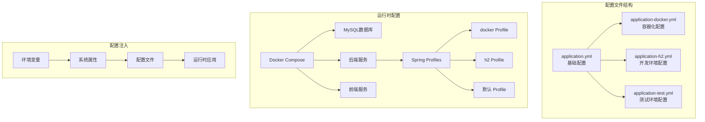
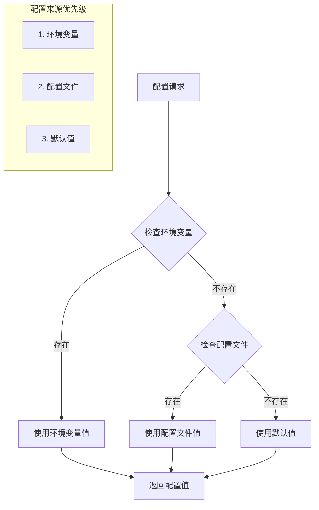
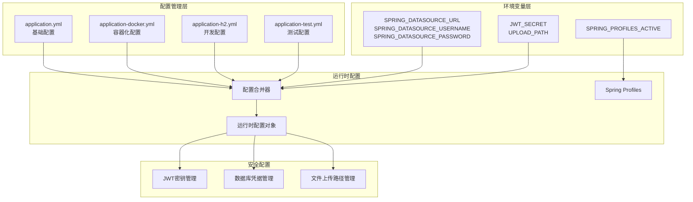
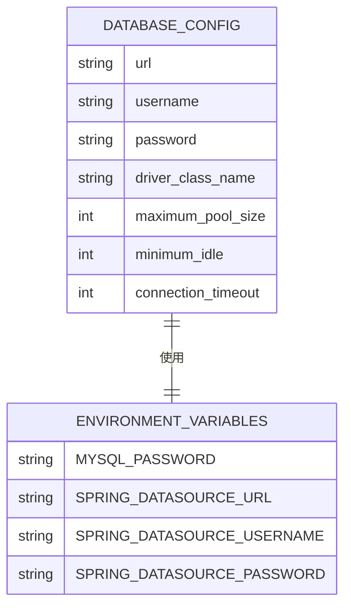
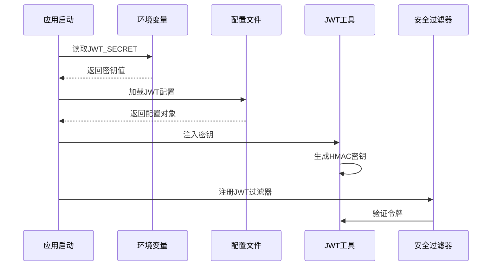
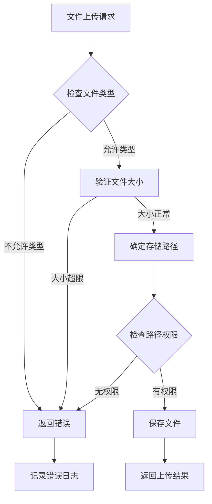
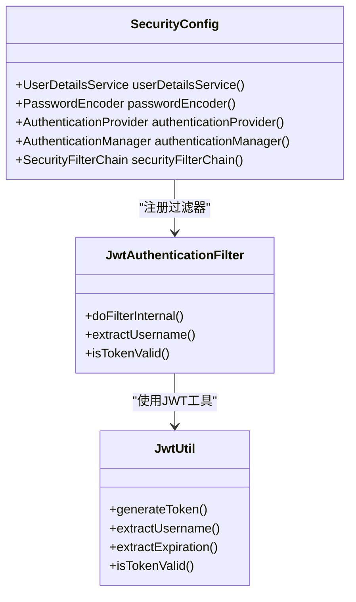
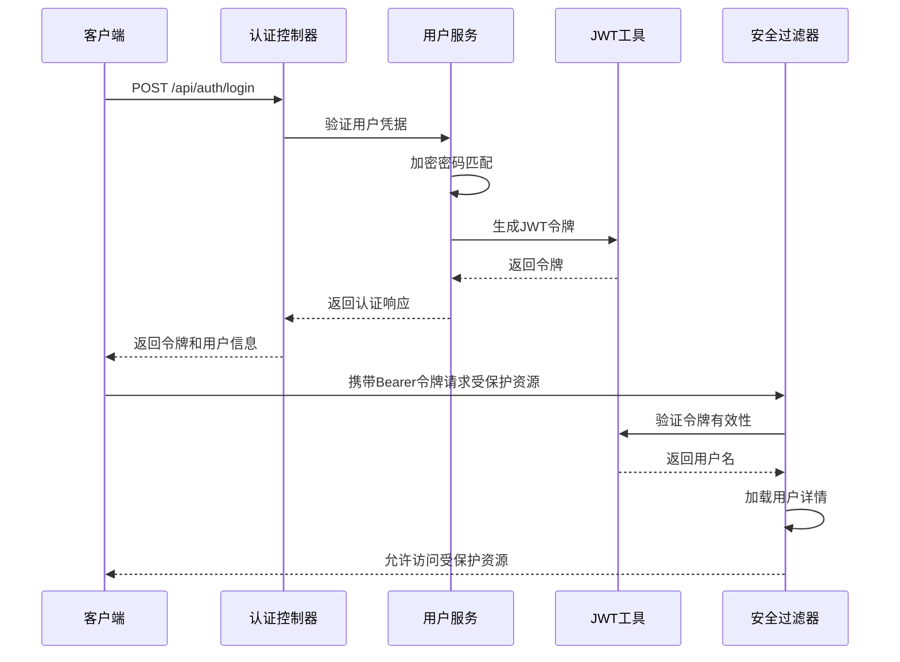
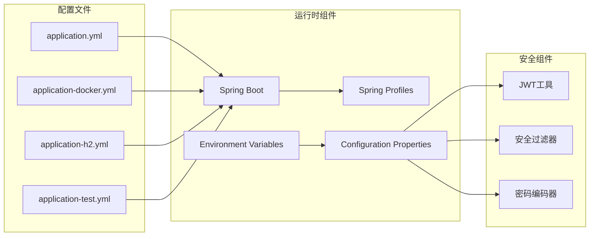
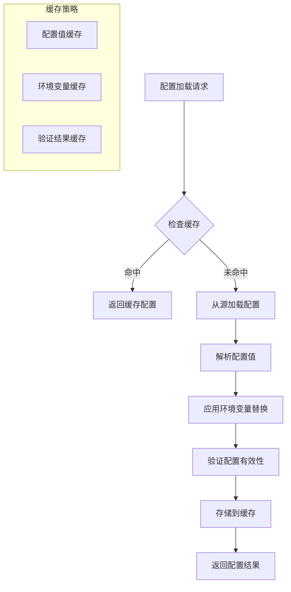

# 环境配置管理

<cite>
**本文档引用的文件**
- [application.yml](file://communication-backend/src/main/resources/application.yml)
- [application-docker.yml](file://communication-backend/src/main/resources/application-docker.yml)
- [application-h2.yml](file://communication-backend/src/main/resources/application-h2.yml)
- [application-test.yml](file://communication-backend/src/test/resources/application-test.yml)
- [JwtUtil.java](file://communication-backend/src/main/java/com/communication/util/JwtUtil.java)
- [JwtAuthenticationFilter.java](file://communication-backend/src/main/java/com/communication/config/JwtAuthenticationFilter.java)
- [SecurityConfig.java](file://communication-backend/src/main/java/com/communication/config/SecurityConfig.java)
- [WebConfig.java](file://communication-backend/src/main/java/com/communication/config/WebConfig.java)
- [docker-compose.yml](file://docker-compose.yml)
- [Dockerfile](file://communication-backend/Dockerfile)
- [pom.xml](file://communication-backend/pom.xml)
- [AuthController.java](file://communication-backend/src/main/java/com/communication/controller/AuthController.java)
- [UserServiceImpl.java](file://communication-backend/src/main/java/com/communication/service/impl/UserServiceImpl.java)
</cite>

## 目录
1. [简介](#简介)
2. [项目结构](#项目结构)
3. [核心组件](#核心组件)
4. [架构概览](#架构概览)
5. [详细组件分析](#详细组件分析)
6. [依赖关系分析](#依赖关系分析)
7. [性能考虑](#性能考虑)
8. [故障排除指南](#故障排除指南)
9. [结论](#结论)
10. [附录](#附录)

## 简介

本文件为通信平台的环境配置管理文档，详细阐述了Spring Boot多环境配置策略，包括基础配置、容器化配置和开发环境配置。文档深入分析了配置文件中的关键参数设置，涵盖数据库连接配置、JWT密钥管理、文件上传路径配置等方面，并提供了环境变量注入和配置优先级说明。同时，文档包含了敏感信息保护策略、不同部署环境的配置模板和最佳实践，以及配置验证和故障排除指南。

## 项目结构

通信平台采用Spring Boot框架构建，配置文件位于后端项目的资源目录中，通过Profile机制实现多环境配置管理。



**图表来源**
- [application.yml](file://communication-backend/src/main/resources/application.yml#L1-L42)
- [application-docker.yml](file://communication-backend/src/main/resources/application-docker.yml#L1-L43)
- [application-h2.yml](file://communication-backend/src/main/resources/application-h2.yml#L1-L42)
- [docker-compose.yml](file://docker-compose.yml#L1-L60)

**章节来源**
- [application.yml](file://communication-backend/src/main/resources/application.yml#L1-L42)
- [application-docker.yml](file://communication-backend/src/main/resources/application-docker.yml#L1-L43)
- [application-h2.yml](file://communication-backend/src/main/resources/application-h2.yml#L1-L42)
- [docker-compose.yml](file://docker-compose.yml#L1-L60)

## 核心组件

### 配置文件层次结构

系统采用三层配置文件结构，通过Profile机制实现环境隔离：

1. **基础配置**：定义通用的基础配置项
2. **环境特定配置**：针对不同部署环境的专用配置
3. **测试配置**：单元测试和集成测试的专用配置

### 配置优先级体系

Spring Boot遵循以下配置优先级顺序（从高到低）：
1. 命令行参数
2. 系统环境变量
3. 应用程序配置文件
4. 默认属性值



**图表来源**
- [application.yml](file://communication-backend/src/main/resources/application.yml#L5-L41)
- [application-docker.yml](file://communication-backend/src/main/resources/application-docker.yml#L3-L37)

**章节来源**
- [application.yml](file://communication-backend/src/main/resources/application.yml#L1-L42)
- [application-docker.yml](file://communication-backend/src/main/resources/application-docker.yml#L1-L43)
- [application-h2.yml](file://communication-backend/src/main/resources/application-h2.yml#L1-L42)

## 架构概览

系统配置架构采用分层设计，确保不同环境下的配置隔离和安全性。



**图表来源**
- [application.yml](file://communication-backend/src/main/resources/application.yml#L33-L41)
- [application-docker.yml](file://communication-backend/src/main/resources/application-docker.yml#L32-L37)
- [docker-compose.yml](file://docker-compose.yml#L31-L37)

## 详细组件分析

### 数据库连接配置

#### MySQL生产环境配置

基础配置文件定义了MySQL数据库连接参数，采用环境变量注入机制：



**图表来源**
- [application.yml](file://communication-backend/src/main/resources/application.yml#L5-L9)
- [application-docker.yml](file://communication-backend/src/main/resources/application-docker.yml#L3-L7)

#### H2内存数据库配置

开发环境使用H2内存数据库，便于快速开发和测试：

| 配置项 | 开发环境值 | 生产环境值 | 测试环境值 |
|--------|------------|------------|------------|
| 数据库URL | jdbc:h2:mem:communication | jdbc:mysql://localhost:3306/communication | jdbc:h2:mem:testdb |
| 驱动类名 | org.h2.Driver | com.mysql.cj.jdbc.Driver | org.h2.Driver |
| 用户名 | sa | root | sa |
| 密码 | 空 | 环境变量注入 | 空 |
| DDL策略 | create-drop | validate | create-drop |

**章节来源**
- [application-h2.yml](file://communication-backend/src/main/resources/application-h2.yml#L1-L6)
- [application.yml](file://communication-backend/src/main/resources/application.yml#L5-L9)
- [application-test.yml](file://communication-backend/src/test/resources/application-test.yml#L1-L6)

### JWT密钥管理系统

#### 密钥配置与注入

JWT配置采用环境变量注入，确保生产环境的安全性：



**图表来源**
- [JwtUtil.java](file://communication-backend/src/main/java/com/communication/util/JwtUtil.java#L17-L26)
- [JwtAuthenticationFilter.java](file://communication-backend/src/main/java/com/communication/config/JwtAuthenticationFilter.java#L47-L64)

#### 密钥安全策略

| 安全级别 | 配置要求 | 实现方式 |
|----------|----------|----------|
| 开发环境 | 至少256位密钥 | 使用固定密钥进行演示 |
| 测试环境 | 至少256位密钥 | 使用测试专用密钥 |
| 生产环境 | 至少256位随机密钥 | 通过环境变量注入 |
| 容器环境 | 支持Kubernetes Secret | 通过环境变量映射 |

**章节来源**
- [application.yml](file://communication-backend/src/main/resources/application.yml#L33-L36)
- [application-docker.yml](file://communication-backend/src/main/resources/application-docker.yml#L32-L34)
- [application-h2.yml](file://communication-backend/src/main/resources/application-h2.yml#L30-L32)

### 文件上传配置系统

#### 上传路径配置

文件上传功能通过配置文件控制存储路径和类型限制：



**图表来源**
- [WebConfig.java](file://communication-backend/src/main/java/com/communication/config/WebConfig.java#L11-L18)

#### 路径配置策略

| 环境 | 存储路径 | 权限设置 | 访问控制 |
|------|----------|----------|----------|
| 开发环境 | ./uploads | 本地文件系统 | 仅本地访问 |
| 容器环境 | /app/uploads | Docker卷挂载 | 通过Nginx代理 |
| 生产环境 | S3存储桶 | 云存储权限 | CDN加速 |
| 测试环境 | 临时目录 | 内存存储 | 单元测试隔离 |

**章节来源**
- [application.yml](file://communication-backend/src/main/resources/application.yml#L38-L41)
- [application-docker.yml](file://communication-backend/src/main/resources/application-docker.yml#L36-L37)
- [WebConfig.java](file://communication-backend/src/main/java/com/communication/config/WebConfig.java#L11-L18)

### 安全配置管理

#### CORS配置

系统采用宽松的CORS策略，支持跨域请求：



**图表来源**
- [SecurityConfig.java](file://communication-backend/src/main/java/com/communication/config/SecurityConfig.java#L66-L84)
- [JwtAuthenticationFilter.java](file://communication-backend/src/main/java/com/communication/config/JwtAuthenticationFilter.java#L20-L30)

#### 认证流程



**图表来源**
- [AuthController.java](file://communication-backend/src/main/java/com/communication/controller/AuthController.java#L30-L34)
- [UserServiceImpl.java](file://communication-backend/src/main/java/com/communication/service/impl/UserServiceImpl.java#L50-L62)
- [JwtAuthenticationFilter.java](file://communication-backend/src/main/java/com/communication/config/JwtAuthenticationFilter.java#L46-L61)

**章节来源**
- [SecurityConfig.java](file://communication-backend/src/main/java/com/communication/config/SecurityConfig.java#L66-L84)
- [JwtAuthenticationFilter.java](file://communication-backend/src/main/java/com/communication/config/JwtAuthenticationFilter.java#L31-L67)

## 依赖关系分析

### 配置依赖图



**图表来源**
- [pom.xml](file://communication-backend/pom.xml#L25-L93)
- [docker-compose.yml](file://docker-compose.yml#L31-L37)

### 外部依赖关系

系统依赖的关键外部组件：

| 组件 | 版本 | 用途 | 安全考虑 |
|------|------|------|----------|
| Spring Boot | 3.2.3 | 应用框架 | 定期更新安全补丁 |
| MySQL Connector | 最新版本 | 数据库驱动 | 使用官方安全版本 |
| Flyway | 核心版本 | 数据库迁移 | 仅在生产启用 |
| H2 Database | 2.x | 开发测试 | 仅内存模式 |
| JJWT | 0.12.5 | JWT处理 | 使用最新稳定版 |
| BCrypt | Spring Security | 密码加密 | 自动盐值生成 |

**章节来源**
- [pom.xml](file://communication-backend/pom.xml#L20-L23)
- [pom.xml](file://communication-backend/pom.xml#L44-L93)

## 性能考虑

### 连接池配置优化

不同环境下的连接池配置差异：

| 配置项 | 开发环境 | 容器环境 | 生产环境 |
|--------|----------|----------|----------|
| 最大连接数 | 默认值 | 10 | 根据负载调整 |
| 最小空闲连接 | 默认值 | 5 | 根据并发需求 |
| 连接超时时间 | 默认值 | 30000ms | 根据网络延迟 |
| 连接测试查询 | 默认值 | 有效查询 | 健康检查 |

### 缓存策略



## 故障排除指南

### 常见配置问题

#### 数据库连接问题

**问题症状**：应用启动失败，显示数据库连接异常

**排查步骤**：
1. 检查数据库服务状态
2. 验证连接URL格式正确性
3. 确认用户名密码正确
4. 检查网络连通性

**解决方案**：
```bash
# 检查数据库服务
docker-compose ps mysql

# 验证连接参数
echo $SPRING_DATASOURCE_URL
echo $SPRING_DATASOURCE_USERNAME
echo $SPRING_DATASOURCE_PASSWORD

# 测试数据库连接
mysql -h mysql -u communication -pcomm123
```

#### JWT密钥问题

**问题症状**：用户登录成功但无法访问受保护资源

**排查步骤**：
1. 验证JWT密钥长度至少256位
2. 检查密钥是否在所有实例中一致
3. 确认密钥未被意外修改

**解决方案**：
```bash
# 生成新的JWT密钥
openssl rand -base64 48

# 更新环境变量
export JWT_SECRET="new-generated-secret-key"
```

#### 文件上传问题

**问题症状**：文件上传失败或访问404错误

**排查步骤**：
1. 检查上传路径是否存在
2. 验证文件权限设置
3. 确认文件类型在允许列表中

**解决方案**：
```bash
# 创建上传目录
mkdir -p /app/uploads

# 设置正确的权限
chmod 755 /app/uploads

# 验证目录权限
ls -la /app/uploads
```

### 配置验证工具

#### 配置文件验证

```bash
# 验证YAML语法
yamllint application.yml
yamllint application-docker.yml
yamllint application-h2.yml

# 检查配置完整性
grep -r "\${" application.yml application-docker.yml application-h2.yml
```

#### 运行时配置检查

```bash
# 检查应用属性
curl http://localhost:8080/actuator/env

# 查看配置映射
curl http://localhost:8080/actuator/configprops

# 监控健康状态
curl http://localhost:8080/actuator/health
```

**章节来源**
- [docker-compose.yml](file://docker-compose.yml#L19-L23)
- [JwtUtil.java](file://communication-backend/src/main/java/com/communication/util/JwtUtil.java#L58-L65)

## 结论

通信平台的环境配置管理采用了成熟的Spring Boot多环境配置策略，通过Profile机制实现了开发、测试、生产和容器化环境的有效隔离。配置文件的设计充分考虑了安全性、可维护性和可扩展性。

关键优势包括：
1. **环境隔离**：通过Profile实现不同环境的独立配置
2. **安全注入**：使用环境变量管理敏感信息
3. **灵活部署**：支持传统部署和容器化部署
4. **完整监控**：提供配置验证和故障排除工具

建议的后续改进方向：
1. 引入配置中心（如Spring Cloud Config）
2. 实施配置审计和变更追踪
3. 添加配置热重载支持
4. 增强配置加密和密钥管理

## 附录

### 配置模板

#### 开发环境配置模板

```yaml
# application-dev.yml
spring:
  datasource:
    url: jdbc:h2:mem:communication;DB_CLOSE_DELAY=-1;DB_CLOSE_ON_EXIT=FALSE;MODE=MySQL
    driver-class-name: org.h2.Driver
    username: sa
    password:
  
  h2:
    console:
      enabled: true
      path: /h2-console
  
  jpa:
    hibernate:
      ddl-auto: create-drop
    show-sql: true
    properties:
      hibernate:
        dialect: org.hibernate.dialect.H2Dialect
  
  flyway:
    enabled: false
  
  servlet:
    multipart:
      max-file-size: 50MB
      max-request-size: 50MB

jwt:
  secret: dev-secret-key-for-h2-testing-only-change-in-production
  expiration: 86400000

upload:
  path: ./uploads
  allowed-types: image/jpeg,image/png,image/gif,video/mp4,video/webm

logging:
  level:
    root: INFO
    com.communication: DEBUG
    org.hibernate.SQL: DEBUG
```

#### 生产环境配置模板

```yaml
# application-prod.yml
spring:
  datasource:
    url: ${SPRING_DATASOURCE_URL:jdbc:mysql://localhost:3306/communication}
    username: ${SPRING_DATASOURCE_USERNAME:communication}
    password: ${SPRING_DATASOURCE_PASSWORD:comm123}
    driver-class-name: com.mysql.cj.jdbc.Driver
    hikari:
      maximum-pool-size: 20
      minimum-idle: 10
      connection-timeout: 30000
      idle-timeout: 600000
      max-lifetime: 1800000
  
  jpa:
    hibernate:
      ddl-auto: validate
    show-sql: false
    properties:
      hibernate:
        dialect: org.hibernate.dialect.MySQLDialect
  
  flyway:
    enabled: true
    locations: classpath:db/migration
    baseline-on-migrate: true
  
  servlet:
    multipart:
      max-file-size: 100MB
      max-request-size: 100MB

jwt:
  secret: ${JWT_SECRET:your-super-secret-jwt-key-change-in-production}
  expiration: 86400000

upload:
  path: ${UPLOAD_PATH:/app/uploads}
  allowed-types: image/jpeg,image/png,image/gif,video/mp4,video/webm

logging:
  level:
    root: WARN
    com.communication: INFO
```

#### 容器化部署配置模板

```yaml
# docker-compose.yml
version: '3.8'

services:
  mysql:
    image: mysql:8.0
    container_name: communication-mysql
    restart: unless-stopped
    environment:
      MYSQL_ROOT_PASSWORD: ${MYSQL_ROOT_PASSWORD}
      MYSQL_DATABASE: communication
      MYSQL_USER: ${MYSQL_USER}
      MYSQL_PASSWORD: ${MYSQL_PASSWORD}
    ports:
      - "${MYSQL_PORT}:3306"
    volumes:
      - mysql_data:/var/lib/mysql
      - ./init.sql:/docker-entrypoint-initdb.d/init.sql:ro
    healthcheck:
      test: ["CMD", "mysqladmin", "ping", "-h", "localhost"]

  backend:
    build:
      context: ./communication-backend
      dockerfile: Dockerfile
    container_name: communication-backend
    restart: unless-stopped
    environment:
      SPRING_PROFILES_ACTIVE: ${SPRING_PROFILES_ACTIVE:docker}
      SPRING_DATASOURCE_URL: ${SPRING_DATASOURCE_URL}
      SPRING_DATASOURCE_USERNAME: ${SPRING_DATASOURCE_USERNAME}
      SPRING_DATASOURCE_PASSWORD: ${SPRING_DATASOURCE_PASSWORD}
      JWT_SECRET: ${JWT_SECRET}
      UPLOAD_PATH: ${UPLOAD_PATH}
    ports:
      - "${BACKEND_PORT}:8080"
    volumes:
      - uploads_data:${UPLOAD_PATH}
    depends_on:
      mysql:
        condition: service_healthy

  frontend:
    build:
      context: ./communication-frontend
      dockerfile: Dockerfile
    container_name: communication-frontend
    restart: unless-stopped
    ports:
      - "${FRONTEND_PORT}:80"
    depends_on:
      - backend

volumes:
  mysql_data:
  uploads_data:
```

### 最佳实践清单

#### 配置管理最佳实践

1. **敏感信息保护**
   - 使用环境变量存储数据库密码和JWT密钥
   - 在生产环境中使用加密存储
   - 定期轮换密钥

2. **配置文件组织**
   - 将通用配置放在基础文件中
   - 环境特定配置使用Profile分离
   - 测试配置独立管理

3. **部署策略**
   - 开发环境使用H2数据库
   - 生产环境使用MySQL
   - 容器化部署使用Docker Compose

4. **监控和验证**
   - 启用配置验证和健康检查
   - 定期检查配置变更
   - 实施配置审计日志

#### 安全配置检查清单

- [ ] JWT密钥长度至少256位
- [ ] 数据库密码使用环境变量注入
- [ ] 文件上传路径权限正确设置
- [ ] CORS策略符合业务需求
- [ ] 日志级别适合当前环境
- [ ] 数据库连接池参数合理配置