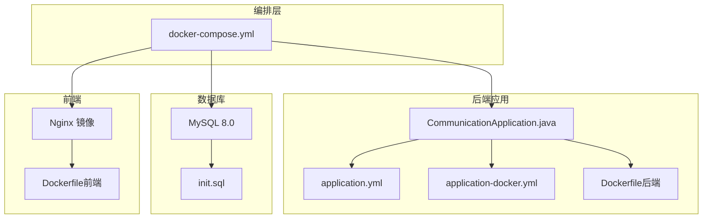
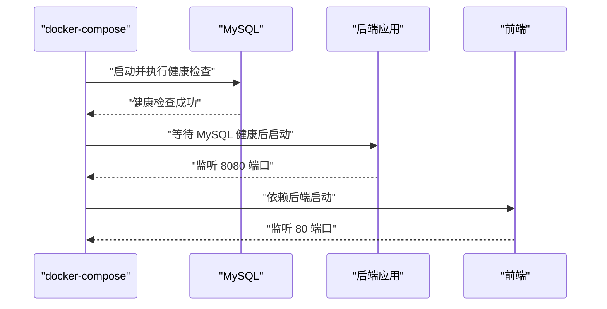
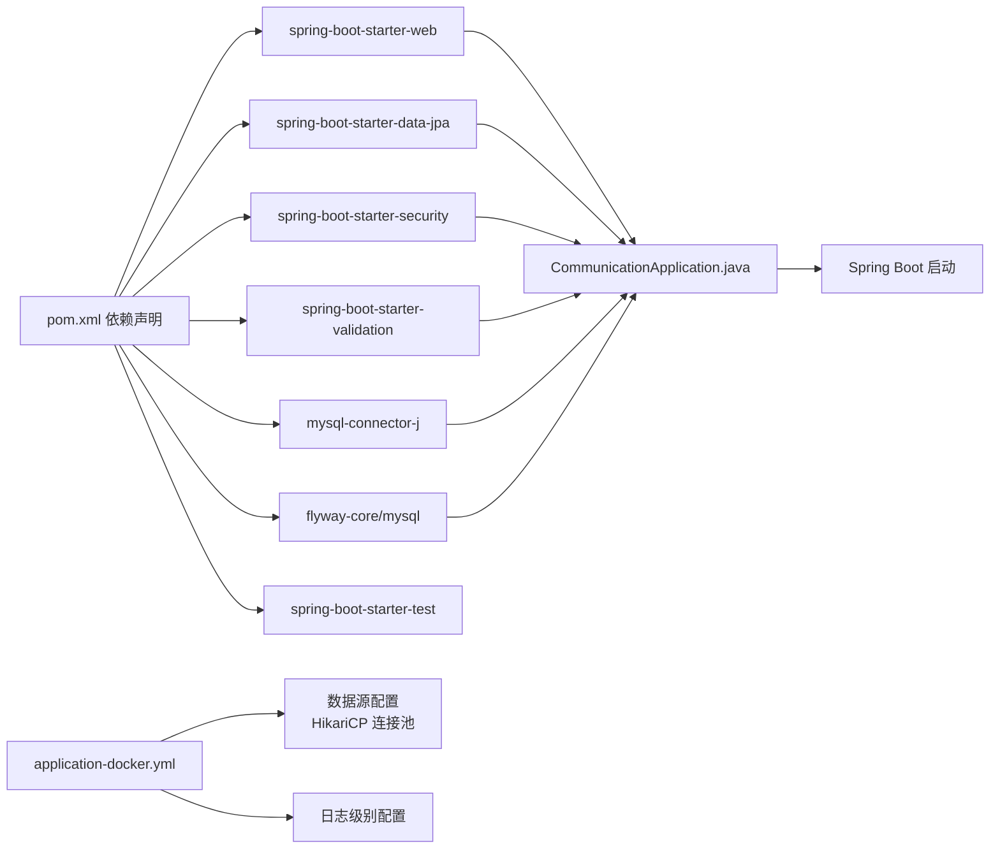

# 监控与日志管理

<cite>
**本文引用的文件**
- [application.yml](file://communication-backend/src/main/resources/application.yml)
- [application-docker.yml](file://communication-backend/src/main/resources/application-docker.yml)
- [docker-compose.yml](file://docker-compose.yml)
- [Dockerfile（后端）](file://communication-backend/Dockerfile)
- [Dockerfile（前端）](file://communication-frontend/Dockerfile)
- [pom.xml](file://communication-backend/pom.xml)
- [CommunicationApplication.java](file://communication-backend/src/main/java/com/communication/CommunicationApplication.java)
- [JwtAuthenticationFilter.java](file://communication-backend/src/main/java/com/communication/config/JwtAuthenticationFilter.java)
- [AuthController.java](file://communication-backend/src/main/java/com/communication/controller/AuthController.java)
- [GlobalExceptionHandler.java](file://communication-backend/src/main/java/com/communication/exception/GlobalExceptionHandler.java)
- [init.sql](file://init.sql)
</cite>

## 目录
1. [简介](#简介)
2. [项目结构](#项目结构)
3. [核心组件](#核心组件)
4. [架构总览](#架构总览)
5. [详细组件分析](#详细组件分析)
6. [依赖关系分析](#依赖关系分析)
7. [性能考虑](#性能考虑)
8. [故障排查指南](#故障排查指南)
9. [结论](#结论)
10. [附录](#附录)

## 简介
本文件面向通信平台的运维与开发团队，提供一套完整的监控与日志管理方案。内容覆盖：
- Docker 容器健康检查配置与运行时状态观测
- Spring Boot Actuator 的启用与监控端点配置建议
- 日志聚合与集中化管理方案（ELK/类似栈）
- 关键业务指标监控（API 响应时间、数据库连接数、内存使用率等）
- 告警规则与通知机制配置思路
- 性能监控与故障诊断工具使用指南
- 日志轮转与存储策略
- 监控仪表板搭建与可视化配置示例

当前仓库未内置 Actuator 或日志聚合相关依赖与配置，本文在不改变现有代码的前提下，提供可落地的扩展方案与最佳实践。

## 项目结构
通信平台由三部分组成：MySQL 数据库、后端 Spring Boot 应用、前端 Nginx 镜像。通过 docker-compose 编排，实现服务发现与依赖顺序启动。

**图表来源**
- [docker-compose.yml](file://docker-compose.yml#L1-L60)
- [application.yml](file://communication-backend/src/main/resources/application.yml#L1-L42)
- [application-docker.yml](file://communication-backend/src/main/resources/application-docker.yml#L1-L43)
- [Dockerfile（后端）](file://communication-backend/Dockerfile#L1-L32)
- [Dockerfile（前端）](file://communication-frontend/Dockerfile#L1-L33)
- [init.sql](file://init.sql#L1-L3)

**章节来源**
- [docker-compose.yml](file://docker-compose.yml#L1-L60)
- [application.yml](file://communication-backend/src/main/resources/application.yml#L1-L42)
- [application-docker.yml](file://communication-backend/src/main/resources/application-docker.yml#L1-L43)
- [Dockerfile（后端）](file://communication-backend/Dockerfile#L1-L32)
- [Dockerfile（前端）](file://communication-frontend/Dockerfile#L1-L33)
- [init.sql](file://init.sql#L1-L3)

## 核心组件
- 后端应用（Spring Boot）
  - 运行于 Java 21 环境，使用 MySQL 作为主数据源，Flyway 进行迁移，HikariCP 作为连接池。
  - 默认端口 8080，生产环境通过 docker profile 覆盖配置。
- 数据库（MySQL 8.0）
  - 提供健康检查（ping），初始化脚本确保数据库存在。
- 前端（Nginx）
  - 使用多阶段构建，静态资源由 Nginx 提供，暴露 80 端口。

**章节来源**
- [pom.xml](file://communication-backend/pom.xml#L25-L94)
- [application.yml](file://communication-backend/src/main/resources/application.yml#L5-L31)
- [application-docker.yml](file://communication-backend/src/main/resources/application-docker.yml#L3-L37)
- [docker-compose.yml](file://docker-compose.yml#L4-L23)
- [Dockerfile（后端）](file://communication-backend/Dockerfile#L18-L32)
- [Dockerfile（前端）](file://communication-frontend/Dockerfile#L1-L33)

## 架构总览
下图展示容器间依赖与启动顺序，以及健康检查触发条件。

**图表来源**
- [docker-compose.yml](file://docker-compose.yml#L19-L44)

**章节来源**
- [docker-compose.yml](file://docker-compose.yml#L1-L60)

## 详细组件分析

### Docker 容器健康检查与运行时观测
- MySQL 健康检查
  - 使用 ping 检查，间隔 10 秒，超时 5 秒，重试 5 次。
  - 仅当健康检查通过后，后端容器才被允许启动，避免连接失败。
- 后端与前端
  - 后端容器暴露 8080；前端容器暴露 80。
  - 前端依赖后端服务启动。

建议补充：
- 后端应用增加健康检查端点（见“Spring Boot Actuator”章节）。
- 使用外部监控系统（如 Prometheus + Grafana）抓取健康与指标端点。

**章节来源**
- [docker-compose.yml](file://docker-compose.yml#L19-L23)
- [docker-compose.yml](file://docker-compose.yml#L30-L44)

### Spring Boot Actuator：启用与监控端点配置
Actuator 可用于暴露运行时指标与健康信息，便于集成 Prometheus/Grafana。

- Maven 依赖
  - 在后端 pom 中添加 spring-boot-starter-actuator 依赖。
- 配置要点
  - 开启所需端点（如 health、info、metrics、httptrace 等）。
  - 设置端点访问路径前缀与安全策略（如仅内网访问或受保护）。
  - 指标导出格式与粒度控制（如按接口、异常类型分类）。
- 端口与暴露
  - 将 Actuator 端口与业务端口分离，避免与前端冲突。
  - 在 docker-compose 中为 Actuator 单独映射或置于内网网络中。

提示：Actuator 未在当前仓库中声明，请在 pom.xml 中新增依赖并在 application-docker.yml 中进行端点配置。

**章节来源**
- [pom.xml](file://communication-backend/pom.xml#L25-L94)
- [application-docker.yml](file://communication-backend/src/main/resources/application-docker.yml#L1-L43)

### 日志聚合与集中化管理（ELK/类似方案）
当前仓库未包含日志聚合栈配置。可在现有容器基础上扩展：

- 日志采集
  - 使用 Filebeat/Fluent Bit 收集容器 stdout/stderr。
  - 将后端日志输出到标准输出，便于容器日志驱动采集。
- 存储与索引
  - Elasticsearch 存储日志，Kibana 提供可视化。
- 管理策略
  - 为 MySQL/Nginx/后端应用分别建立日志管道。
  - 对敏感字段脱敏（如密码、令牌）。

注意：本节为概念性方案，不直接对应具体文件。

### 关键业务指标监控
以下指标建议通过 Actuator + 外部监控系统采集与展示：

- API 响应时间
  - 使用 httpserver.requests 指标按 URI/方法分组统计 P50/P95/P99。
- 数据库连接数
  - 使用 datasource.* 指标观察连接池活跃/空闲/超时/拒绝数。
- 内存使用率
  - 使用 jvm.memory.used/jvm.memory.max 等指标计算使用率。
- 请求量与错误率
  - 统计 2xx/4xx/5xx 比例，结合全局异常处理统计错误分布。

提示：Actuator 指标需在 pom 与配置中启用。

**章节来源**
- [application-docker.yml](file://communication-backend/src/main/resources/application-docker.yml#L8-L11)
- [pom.xml](file://communication-backend/pom.xml#L25-L94)

### 告警规则与通知机制
- 告警规则示例
  - API 响应时间 P99 超过阈值（如 2s）持续 3 分钟。
  - 数据库连接池超时次数增长超过基线。
  - 内存使用率超过阈值（如 85%）持续 5 分钟。
  - 后端/MySQL 健康检查连续失败。
- 通知渠道
  - 邮件、Slack、Webhook、PagerDuty 等。
- 触发策略
  - 降噪：静默窗口、告警抑制、升级策略。

注意：本节为通用实践，不直接对应具体文件。

### 性能监控与故障诊断工具使用指南
- JVM 诊断
  - 使用 JFR/JMC/Async Profiler 进行热点分析与 GC 观测。
- 线程与锁
  - 使用 jstack/jconsole/jmc 观察线程阻塞与死锁风险。
- 数据库性能
  - 结合慢查询日志与 EXPLAIN 分析热点 SQL。
- 端到端链路
  - 引入分布式追踪（如 OpenTelemetry）定位延迟瓶颈。

注意：本节为通用实践，不直接对应具体文件。

### 日志轮转与存储策略
- 后端日志
  - 输出至 stdout，由容器运行时或外部采集器负责轮转与归档。
  - 控制单文件大小与保留份数，避免磁盘占满。
- 文件上传目录
  - 通过卷挂载持久化，配合备份策略与配额限制。
- 数据库日志
  - MySQL 错误日志与慢查询日志定期轮转与清理。

注意：本节为通用实践，不直接对应具体文件。

### 监控仪表板搭建与可视化配置示例
- Prometheus 抓取
  - 配置 job 抓取后端 /actuator/prometheus 与 /actuator/health。
- Grafana 仪表板
  - 指标面板：请求速率、P99 延迟、连接池状态、JVM 内存。
  - 告警面板：健康检查状态、错误率、容量预警。
- Kibana 可视化
  - 日志热词、错误趋势、用户行为分析。

注意：本节为通用实践，不直接对应具体文件。

## 依赖关系分析
后端应用的关键依赖与配置如下：

**图表来源**
- [pom.xml](file://communication-backend/pom.xml#L25-L94)
- [application-docker.yml](file://communication-backend/src/main/resources/application-docker.yml#L3-L37)
- [CommunicationApplication.java](file://communication-backend/src/main/java/com/communication/CommunicationApplication.java#L6-L11)

**章节来源**
- [pom.xml](file://communication-backend/pom.xml#L25-L94)
- [application-docker.yml](file://communication-backend/src/main/resources/application-docker.yml#L3-L37)
- [CommunicationApplication.java](file://communication-backend/src/main/java/com/communication/CommunicationApplication.java#L6-L11)

## 性能考虑
- 连接池参数
  - maximum-pool-size、minimum-idle、connection-timeout 需结合 QPS 与数据库能力调优。
- 应用线程与 GC
  - 使用 JVM 参数与监控工具识别 GC 峰值与停顿。
- I/O 与缓存
  - 文件上传路径与磁盘 IO 监控，必要时引入本地缓存与 CDN。
- 网络与安全
  - JWT 过滤器与安全配置对请求链路的影响，建议开启接口级限流与熔断。

**章节来源**
- [application-docker.yml](file://communication-backend/src/main/resources/application-docker.yml#L8-L11)
- [JwtAuthenticationFilter.java](file://communication-backend/src/main/java/com/communication/config/JwtAuthenticationFilter.java#L20-L33)

## 故障排查指南
- 健康检查失败
  - 检查 MySQL 健康检查命令与网络连通性；确认后端已等待 MySQL 健康后再启动。
- 启动报错与异常
  - 查看全局异常处理器返回的错误码与消息，结合日志定位业务异常。
- 数据库连接问题
  - 观察连接池指标与慢查询日志，核对 DDL 自动策略与 Flyway 迁移是否成功。
- 前端无法访问后端
  - 检查后端端口映射与 CORS 配置，确认跨域与鉴权过滤链路。

**章节来源**
- [docker-compose.yml](file://docker-compose.yml#L19-L44)
- [GlobalExceptionHandler.java](file://communication-backend/src/main/java/com/communication/exception/GlobalExceptionHandler.java#L15-L30)
- [application-docker.yml](file://communication-backend/src/main/resources/application-docker.yml#L22-L25)
- [CorsConfig.java](file://communication-backend/src/main/java/com/communication/config/CorsConfig.java#L1-L200)

## 结论
本方案在不破坏现有结构的基础上，提供了从容器健康检查、应用指标采集、日志聚合到告警与可视化的完整监控体系建议。建议优先完成 Actuator 依赖与端点配置，并结合 Prometheus/Grafana/Kibana 实施，以获得稳定可靠的可观测性能力。

## 附录

### Actuator 端点与指标参考清单
- /actuator/health：应用与依赖健康状态
- /actuator/info：应用元信息
- /actuator/metrics：JVM/HTTP/业务指标
- /actuator/httptrace：HTTP 请求轨迹
- /actuator/threaddump：线程快照
- /actuator/loggers：动态调整日志级别

注意：本节为通用实践，不直接对应具体文件。