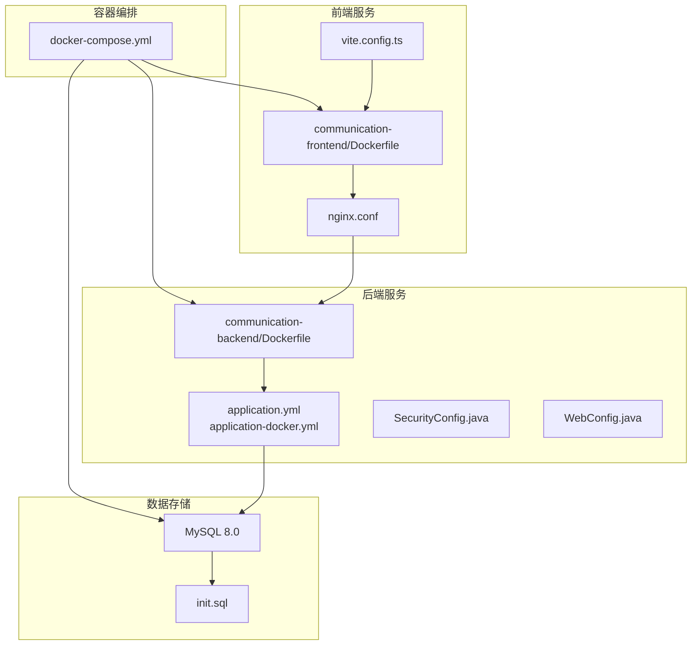
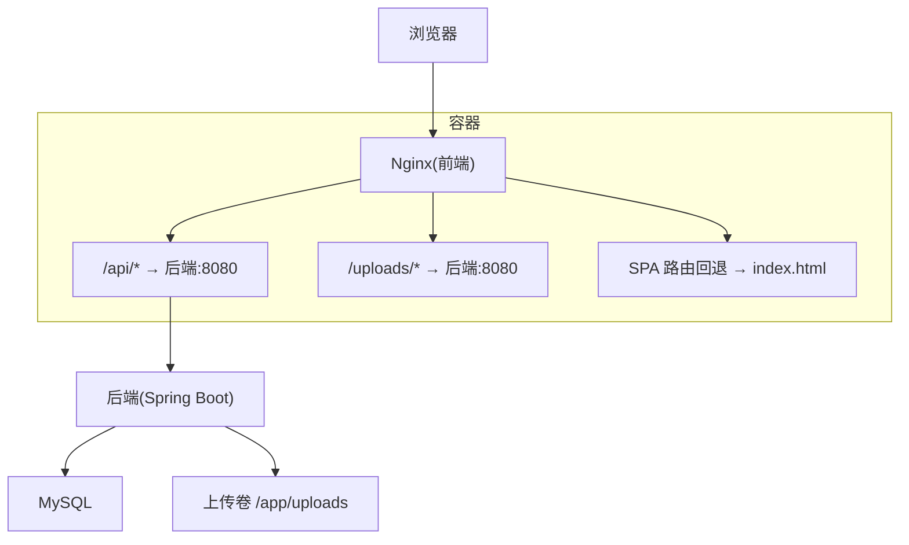
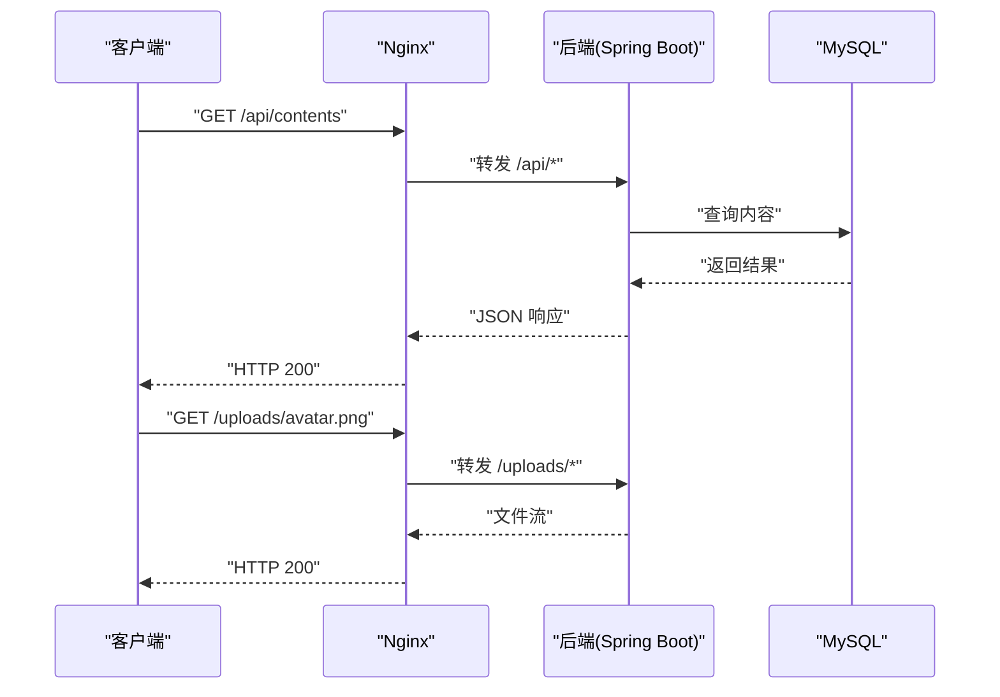
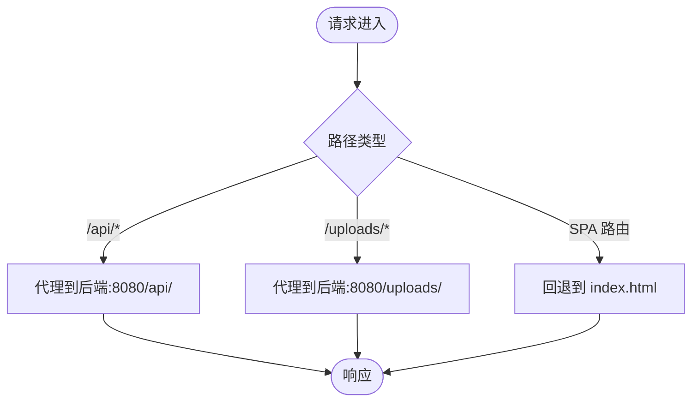
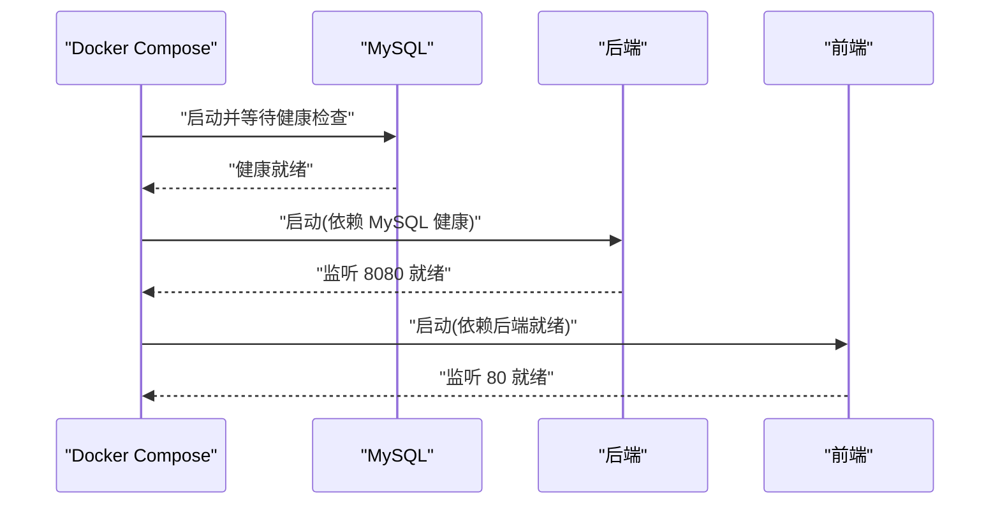
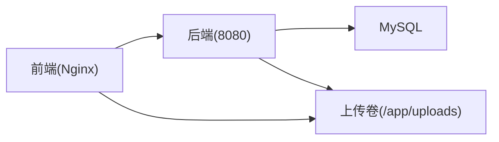

# 部署与运维

<cite>
**本文引用的文件**
- [docker-compose.yml](file://docker-compose.yml)
- [init.sql](file://init.sql)
- [communication-backend/Dockerfile](file://communication-backend/Dockerfile)
- [communication-frontend/Dockerfile](file://communication-frontend/Dockerfile)
- [communication-frontend/nginx.conf](file://communication-frontend/nginx.conf)
- [communication-backend/src/main/resources/application.yml](file://communication-backend/src/main/resources/application.yml)
- [communication-backend/src/main/resources/application-docker.yml](file://communication-backend/src/main/resources/application-docker.yml)
- [communication-backend/src/main/java/com/communication/config/SecurityConfig.java](file://communication-backend/src/main/java/com/communication/config/SecurityConfig.java)
- [communication-backend/src/main/java/com/communication/config/WebConfig.java](file://communication-backend/src/main/java/com/communication/config/WebConfig.java)
- [communication-frontend/vite.config.ts](file://communication-frontend/vite.config.ts)
- [communication-frontend/package.json](file://communication-frontend/package.json)
- [README.md](file://README.md)
- [communication-backend/pom.xml](file://communication-backend/pom.xml)
</cite>

## 目录
1. [简介](#简介)
2. [项目结构](#项目结构)
3. [核心组件](#核心组件)
4. [架构总览](#架构总览)
5. [详细组件分析](#详细组件分析)
6. [依赖分析](#依赖分析)
7. [性能考虑](#性能考虑)
8. [故障排除指南](#故障排除指南)
9. [结论](#结论)
10. [附录](#附录)

## 简介
本文件面向通信平台的部署与运维团队，提供从零到一的容器化部署方案，覆盖镜像构建、服务编排、前后端分离部署、环境变量与敏感信息管理、生产最佳实践（负载均衡、健康检查、日志管理）、监控与告警、故障排除与性能调优，以及备份恢复与灾难恢复策略。读者无需深入代码即可理解系统如何在容器环境中稳定运行。

## 项目结构
该仓库采用前后端分离的单仓多模块结构，配合 Docker Compose 实现一键编排：
- communication-backend：Spring Boot 后端，提供认证授权、内容管理、订阅、评论等 API，并通过 Nginx 对外暴露。
- communication-frontend：Vue 3 前端，使用 Vite 构建，打包后由 Nginx 提供静态资源与反向代理。
- docker-compose.yml：统一编排 MySQL、后端、前端三类服务，定义网络、卷、健康检查与依赖顺序。
- init.sql：初始化数据库脚本，确保首次启动时存在目标数据库。
- 后端与前端各自提供 Dockerfile，实现多阶段构建与最小化运行时镜像。

**图表来源**
- [docker-compose.yml](file://docker-compose.yml#L1-L60)
- [communication-backend/Dockerfile](file://communication-backend/Dockerfile#L1-L32)
- [communication-frontend/Dockerfile](file://communication-frontend/Dockerfile#L1-L33)
- [communication-frontend/nginx.conf](file://communication-frontend/nginx.conf#L1-L42)
- [communication-backend/src/main/resources/application.yml](file://communication-backend/src/main/resources/application.yml#L1-L42)
- [communication-backend/src/main/resources/application-docker.yml](file://communication-backend/src/main/resources/application-docker.yml#L1-L43)
- [communication-backend/src/main/java/com/communication/config/SecurityConfig.java](file://communication-backend/src/main/java/com/communication/config/SecurityConfig.java#L1-L89)
- [communication-backend/src/main/java/com/communication/config/WebConfig.java](file://communication-backend/src/main/java/com/communication/config/WebConfig.java#L1-L20)
- [init.sql](file://init.sql#L1-L3)

**章节来源**
- [README.md](file://README.md#L1-L193)
- [docker-compose.yml](file://docker-compose.yml#L1-L60)

## 核心组件
- MySQL 数据库：提供持久化存储，内置健康检查与初始化脚本，挂载卷保障数据持久化。
- 后端服务（Spring Boot）：多阶段构建，JVM 运行时，读取 Docker 环境变量进行数据库与 JWT 配置，暴露 8080 端口。
- 前端服务（Nginx）：多阶段构建，静态站点由 Nginx 提供，反向代理 /api/ 与 /uploads/ 到后端，SPA 路由回退至 index.html。
- 网络与卷：Compose 统一网络，MySQL 与上传目录挂载卷；后端通过命名网络访问 MySQL。

**章节来源**
- [docker-compose.yml](file://docker-compose.yml#L4-L55)
- [communication-backend/Dockerfile](file://communication-backend/Dockerfile#L1-L32)
- [communication-frontend/Dockerfile](file://communication-frontend/Dockerfile#L1-L33)
- [communication-frontend/nginx.conf](file://communication-frontend/nginx.conf#L1-L42)
- [communication-backend/src/main/resources/application-docker.yml](file://communication-backend/src/main/resources/application-docker.yml#L1-L43)

## 架构总览
下图展示容器化部署的整体交互：浏览器请求经 Nginx 反向代理，静态资源直接由 Nginx 返回，API 请求转发至后端，后端访问 MySQL 并读写上传目录。

**图表来源**
- [communication-frontend/nginx.conf](file://communication-frontend/nginx.conf#L11-L34)
- [docker-compose.yml](file://docker-compose.yml#L25-L55)

## 详细组件分析

### 数据库层（MySQL）
- 镜像与版本：使用官方 MySQL 8.0，设置字符集与排序规则，启用健康检查。
- 初始化：通过挂载 init.sql 确保数据库存在；首次启动自动执行。
- 存储：挂载 mysql_data 卷，避免容器删除导致数据丢失。
- 端口映射：默认 3306 映射到宿主机，便于本地调试或外部工具访问。

**章节来源**
- [docker-compose.yml](file://docker-compose.yml#L4-L23)
- [init.sql](file://init.sql#L1-L3)

### 后端服务（Spring Boot）
- 多阶段构建：先在 Alpine JDK 中下载依赖与打包，再复制到更小的 JRE 镜像运行。
- 环境变量与配置文件：
  - application.yml：本地开发默认配置，包含数据库连接、JWT 密钥、上传路径等。
  - application-docker.yml：Docker 环境专用配置，优先读取环境变量覆盖默认值。
- 安全与路由：
  - SecurityConfig：禁用 CSRF，启用 CORS，基于路径的权限控制，JWT 过滤器前置。
  - WebConfig：将 /uploads/** 映射到文件系统上传目录。
- 上传与静态资源：后端通过 WebMvcConfigurer 暴露上传目录，Nginx 同时代理 /uploads/。

**图表来源**
- [communication-frontend/nginx.conf](file://communication-frontend/nginx.conf#L11-L29)
- [communication-backend/src/main/java/com/communication/config/SecurityConfig.java](file://communication-backend/src/main/java/com/communication/config/SecurityConfig.java#L63-L81)
- [communication-backend/src/main/java/com/communication/config/WebConfig.java](file://communication-backend/src/main/java/com/communication/config/WebConfig.java#L14-L18)

**章节来源**
- [communication-backend/Dockerfile](file://communication-backend/Dockerfile#L1-L32)
- [communication-backend/src/main/resources/application.yml](file://communication-backend/src/main/resources/application.yml#L1-L42)
- [communication-backend/src/main/resources/application-docker.yml](file://communication-backend/src/main/resources/application-docker.yml#L1-L43)
- [communication-backend/src/main/java/com/communication/config/SecurityConfig.java](file://communication-backend/src/main/java/com/communication/config/SecurityConfig.java#L1-L89)
- [communication-backend/src/main/java/com/communication/config/WebConfig.java](file://communication-backend/src/main/java/com/communication/config/WebConfig.java#L1-L20)

### 前端服务（Nginx）
- 多阶段构建：Node 构建产物拷贝至 Nginx 镜像，移除默认配置，仅保留自定义配置。
- 反向代理：
  - /api/ → 后端 8080，透传 Host、X-Real-IP、X-Forwarded-* 等头部，支持 WebSocket。
  - /uploads/ → 后端 8080，用于直链访问上传资源。
- SPA 路由：所有未匹配路径回退到 index.html，保证前端路由正常工作。
- 缓存策略：对静态资源设置一年缓存与 immutable 标记，提升性能。

**图表来源**
- [communication-frontend/nginx.conf](file://communication-frontend/nginx.conf#L11-L34)

**章节来源**
- [communication-frontend/Dockerfile](file://communication-frontend/Dockerfile#L1-L33)
- [communication-frontend/nginx.conf](file://communication-frontend/nginx.conf#L1-L42)

### 服务编排与依赖关系
- 依赖顺序：MySQL 健康就绪后才启动后端；后端就绪后再启动前端。
- 端口暴露：MySQL 3306、后端 8080、前端 80。
- 卷管理：MySQL 数据卷与上传目录卷独立挂载，便于备份与扩容。

**图表来源**
- [docker-compose.yml](file://docker-compose.yml#L42-L55)

**章节来源**
- [docker-compose.yml](file://docker-compose.yml#L1-L60)

## 依赖分析
- 后端对数据库的依赖：通过 application-docker.yml 的 JDBC URL 与凭据连接 MySQL。
- 前端对后端的依赖：通过 Nginx 反向代理访问 /api 与 /uploads。
- CORS 与安全：后端配置允许开发机地址，生产中需收紧来源。
- 上传目录：后端与 Nginx 共享 /uploads，需确保权限与路径一致。

**图表来源**
- [communication-frontend/nginx.conf](file://communication-frontend/nginx.conf#L11-L29)
- [communication-backend/src/main/resources/application-docker.yml](file://communication-backend/src/main/resources/application-docker.yml#L36-L37)
- [communication-backend/src/main/java/com/communication/config/WebConfig.java](file://communication-backend/src/main/java/com/communication/config/WebConfig.java#L14-L18)

**章节来源**
- [communication-backend/src/main/resources/application-docker.yml](file://communication-backend/src/main/resources/application-docker.yml#L1-L43)
- [communication-backend/src/main/java/com/communication/config/SecurityConfig.java](file://communication-backend/src/main/java/com/communication/config/SecurityConfig.java#L18-L26)

## 性能考虑
- 静态资源缓存：Nginx 对 JS/CSS/媒体资源设置一年缓存与 immutable，显著降低带宽与延迟。
- 上传优化：/uploads/ 直接由后端提供，避免额外转发开销。
- JVM 与线程池：后端 HikariCP 连接池参数可按并发与实例数调整，Flyway 迁移仅在启动时执行。
- 前端构建：Vite 开发代理仅用于本地开发，生产镜像不包含开发服务器。

**章节来源**
- [communication-frontend/nginx.conf](file://communication-frontend/nginx.conf#L36-L40)
- [communication-backend/src/main/resources/application-docker.yml](file://communication-backend/src/main/resources/application-docker.yml#L8-L11)

## 故障排除指南
- 健康检查失败
  - 现象：后端/前端迟迟无法启动。
  - 排查：查看 MySQL 健康检查输出与日志；确认 JDBC URL、用户名、密码正确。
- CORS 问题
  - 现象：跨域请求被拒绝。
  - 排查：核对 SecurityConfig 中允许的来源列表；生产环境务必限制来源。
- 上传失败
  - 现象：上传成功但无法访问。
  - 排查：确认 /uploads/** 路径映射与权限；检查 WebConfig 的 upload.path 与 Nginx 代理。
- 数据库初始化
  - 现象：首次启动无表。
  - 排查：确认 init.sql 已挂载且可执行；Flyway 是否启用并完成迁移。
- 日志定位
  - 后端日志级别已在 Docker 配置中设置；可通过容器日志查看异常堆栈与 SQL。

**章节来源**
- [docker-compose.yml](file://docker-compose.yml#L19-L23)
- [communication-backend/src/main/java/com/communication/config/SecurityConfig.java](file://communication-backend/src/main/java/com/communication/config/SecurityConfig.java#L16-L26)
- [communication-backend/src/main/java/com/communication/config/WebConfig.java](file://communication-backend/src/main/java/com/communication/config/WebConfig.java#L11-L18)
- [communication-backend/src/main/resources/application-docker.yml](file://communication-backend/src/main/resources/application-docker.yml#L22-L25)

## 结论
本部署方案以 Docker Compose 为核心，结合 Nginx 反向代理与 Spring Boot 的安全配置，实现了前后端分离、数据持久化与可扩展的基础能力。生产环境建议进一步完善证书、密钥管理、负载均衡与监控告警体系，以满足高可用与可观测性需求。

## 附录

### A. Docker 镜像构建与运行流程
- 后端镜像：多阶段构建，先打包后复制到运行时镜像，暴露 8080。
- 前端镜像：Node 构建产物拷贝至 Nginx，暴露 80，加载自定义 conf。
- Compose 启动：按健康检查与依赖顺序启动，端口映射与卷挂载明确。

**章节来源**
- [communication-backend/Dockerfile](file://communication-backend/Dockerfile#L1-L32)
- [communication-frontend/Dockerfile](file://communication-frontend/Dockerfile#L1-L33)
- [docker-compose.yml](file://docker-compose.yml#L25-L55)

### B. 环境变量与敏感信息管理
- 关键变量（示例清单）
  - SPRING_PROFILES_ACTIVE：切换 Docker 配置文件
  - SPRING_DATASOURCE_URL/USERNAME/PASSWORD：数据库连接
  - JWT_SECRET：JWT 密钥
  - UPLOAD_PATH：上传目录路径
- 管理建议
  - 使用 Docker Secret 或外部密钥管理服务注入敏感变量。
  - 生产环境禁止将密钥硬编码在镜像或配置文件中。

**章节来源**
- [docker-compose.yml](file://docker-compose.yml#L31-L37)
- [communication-backend/src/main/resources/application-docker.yml](file://communication-backend/src/main/resources/application-docker.yml#L32-L37)

### C. 生产环境最佳实践
- 负载均衡
  - 使用反向代理（如 Nginx/Traefik）分发请求至多个后端实例。
- 健康检查
  - 后端暴露健康端点（如 Actuator），Compose 增加健康检查策略。
- 日志管理
  - 统一收集容器 stdout/stderr，集中存储与检索。
- 监控与告警
  - 指标采集（CPU/内存/连接数/响应时间），阈值告警与自动化扩缩容。

### D. 备份恢复与灾难恢复
- 备份
  - 定期导出数据库快照；备份 MySQL 数据卷与上传卷。
- 恢复
  - 重建容器后恢复卷数据，验证数据库迁移是否成功。
- 灾难恢复
  - 多副本部署与异地容灾；演练恢复流程并记录步骤。

### E. 部署前检查清单
- 系统要求
  - Docker Engine 20.10+
  - Docker Compose v2+
  - 至少 2GB RAM
- 网络配置
  - 确认端口 80、8080、3306 未被占用
  - 防火墙放行相关端口
- 存储空间
  - 预留至少 1GB 磁盘空间用于数据库与日志
- 安全准备
  - 生成强 JWT 密钥
  - 配置 HTTPS 证书（生产环境）
- 环境变量
  - 准备数据库凭据
  - 配置上传目录权限

### F. 常见部署场景
- 开发环境
  - 使用默认凭据和本地存储
  - 禁用 HTTPS
  - 启用详细日志
- 测试环境
  - 使用独立数据库实例
  - 配置专门的 JWT 密钥
  - 设置合理的超时参数
- 生产环境
  - 使用外部数据库服务
  - 配置 SSL/TLS
  - 启用健康检查和监控
  - 设置自动重启策略

### G. 性能调优建议
- 数据库优化
  - 调整 innodb_buffer_pool_size
  - 配置连接池大小
  - 启用查询缓存（如适用）
- 应用优化
  - 调整 JVM 堆大小
  - 配置合适的线程池
  - 启用 GZIP 压缩
- 前端优化
  - 启用 CDN 加速
  - 配置缓存策略
  - 优化图片和媒体资源