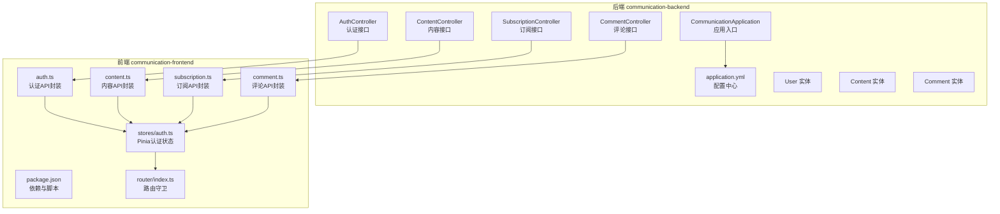
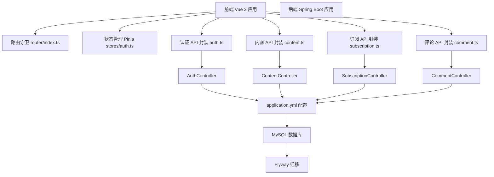
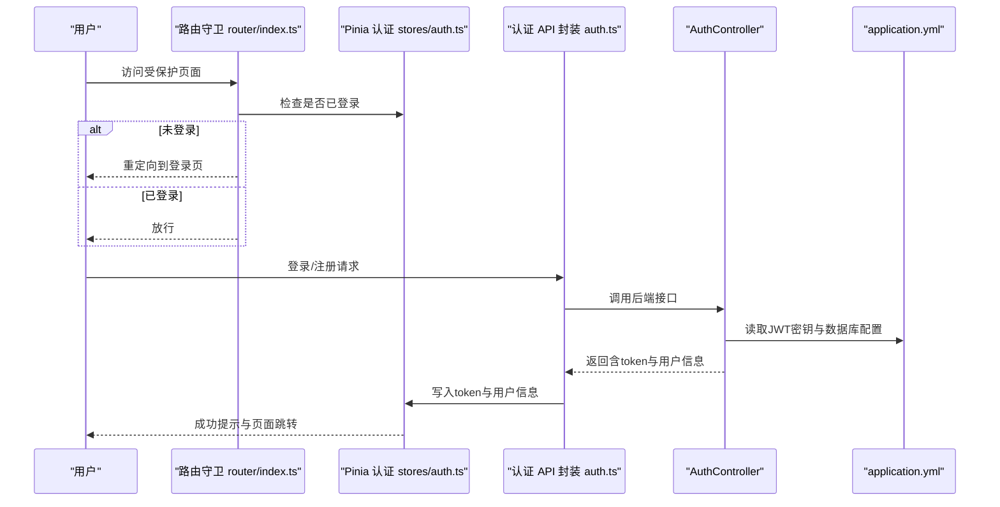
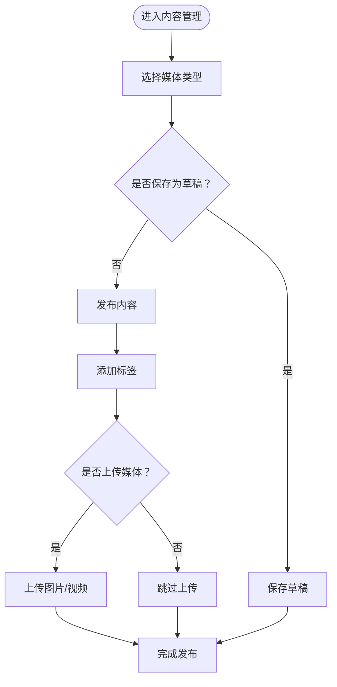
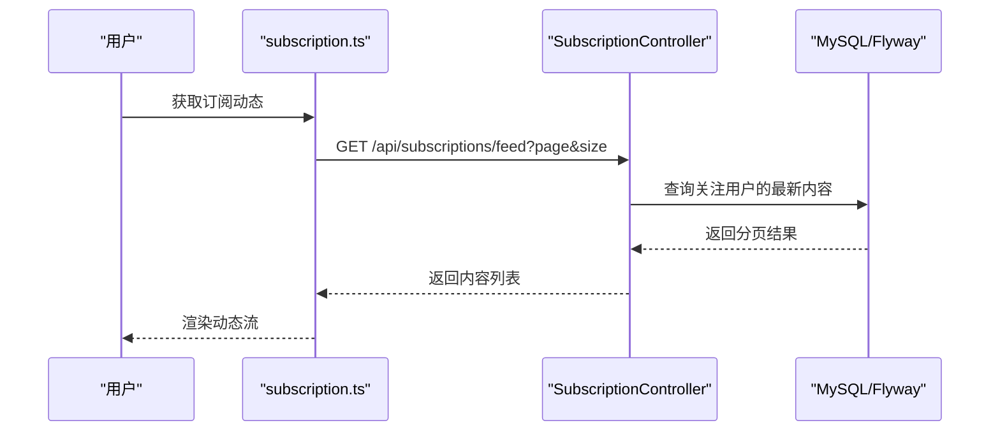
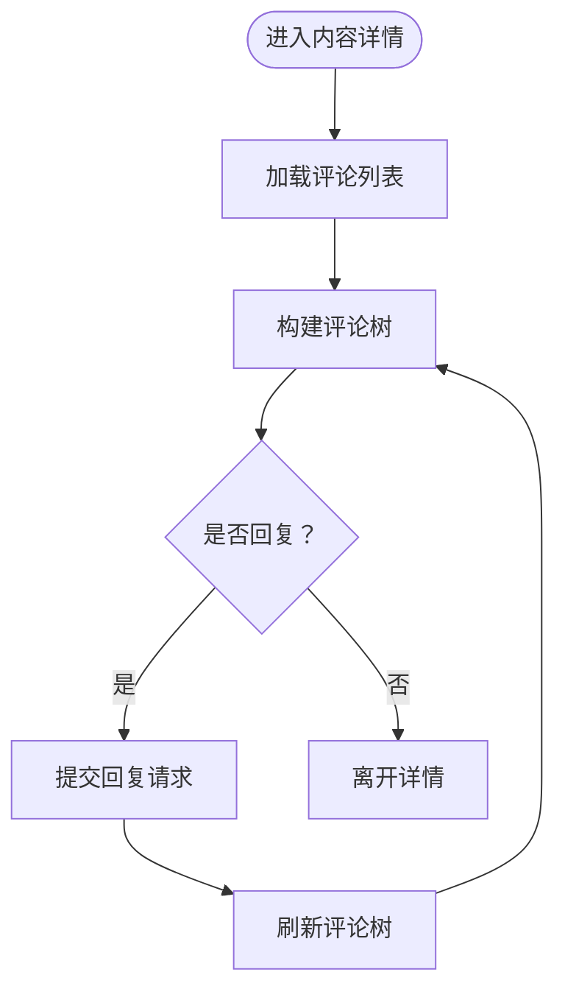
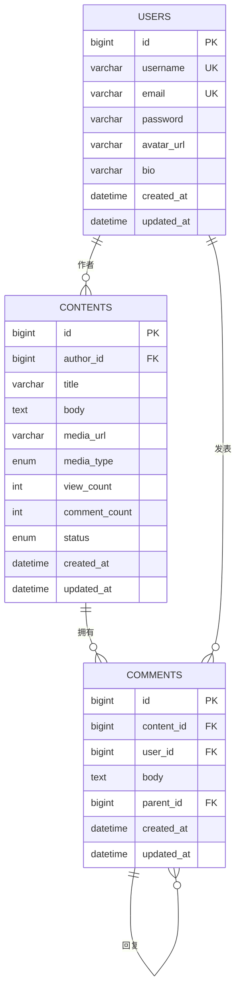
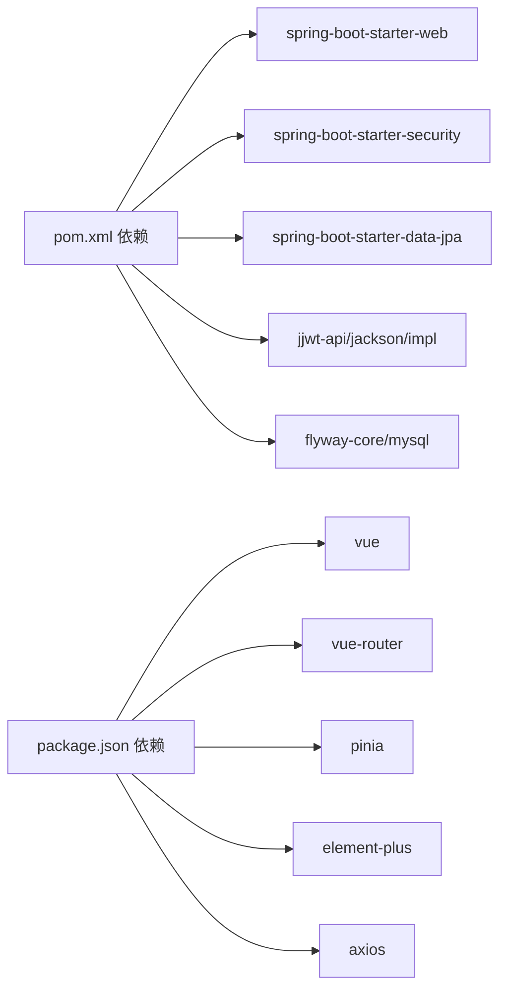

# 项目概述

<cite>
**本文引用的文件**
- [README.md](file://README.md)
- [communication-backend/src/main/java/com/communication/CommunicationApplication.java](file://communication-backend/src/main/java/com/communication/CommunicationApplication.java)
- [communication-backend/src/main/resources/application.yml](file://communication-backend/src/main/resources/application.yml)
- [communication-backend/src/main/java/com/communication/controller/AuthController.java](file://communication-backend/src/main/java/com/communication/controller/AuthController.java)
- [communication-backend/src/main/java/com/communication/controller/ContentController.java](file://communication-backend/src/main/java/com/communication/controller/ContentController.java)
- [communication-backend/src/main/java/com/communication/controller/SubscriptionController.java](file://communication-backend/src/main/java/com/communication/controller/SubscriptionController.java)
- [communication-backend/src/main/java/com/communication/controller/CommentController.java](file://communication-backend/src/main/java/com/communication/controller/CommentController.java)
- [communication-backend/src/main/java/com/communication/entity/User.java](file://communication-backend/src/main/java/com/communication/entity/User.java)
- [communication-backend/src/main/java/com/communication/entity/Content.java](file://communication-backend/src/main/java/com/communication/entity/Content.java)
- [communication-backend/src/main/java/com/communication/entity/Comment.java](file://communication-backend/src/main/java/com/communication/entity/Comment.java)
- [communication-frontend/src/api/auth.ts](file://communication-frontend/src/api/auth.ts)
- [communication-frontend/src/api/content.ts](file://communication-frontend/src/api/content.ts)
- [communication-frontend/src/api/subscription.ts](file://communication-frontend/src/api/subscription.ts)
- [communication-frontend/src/api/comment.ts](file://communication-frontend/src/api/comment.ts)
- [communication-frontend/src/stores/auth.ts](file://communication-frontend/src/stores/auth.ts)
- [communication-frontend/src/router/index.ts](file://communication-frontend/src/router/index.ts)
- [communication-frontend/package.json](file://communication-frontend/package.json)
- [communication-backend/pom.xml](file://communication-backend/pom.xml)
- [docker-compose.yml](file://docker-compose.yml)
</cite>

## 目录
1. [引言](#引言)
2. [项目结构](#项目结构)
3. [核心组件](#核心组件)
4. [架构总览](#架构总览)
5. [详细组件分析](#详细组件分析)
6. [依赖分析](#依赖分析)
7. [性能考虑](#性能考虑)
8. [故障排查指南](#故障排查指南)
9. [结论](#结论)
10. [附录](#附录)

## 引言
本项目是一个现代化的内容发布与社交互动平台，支持用户注册登录、内容发布（文本/图片/视频）、订阅管理、评论系统、搜索与数据统计等核心功能。项目采用前后端分离架构：后端基于 Spring Boot 3.2 + Java 21，使用 Spring Security + JWT 实现认证授权；前端基于 Vue 3 + TypeScript，配合 Pinia 状态管理、Vue Router 路由与 Element Plus UI 组件库。通过 Docker Compose 提供一键部署能力，适合快速搭建与扩展。

## 项目结构
项目采用多模块分层组织，后端与前端分别独立构建，便于团队协作与持续集成。

图表来源
- [communication-backend/src/main/java/com/communication/CommunicationApplication.java](file://communication-backend/src/main/java/com/communication/CommunicationApplication.java#L1-L13)
- [communication-backend/src/main/resources/application.yml](file://communication-backend/src/main/resources/application.yml#L1-L42)
- [communication-backend/src/main/java/com/communication/controller/AuthController.java](file://communication-backend/src/main/java/com/communication/controller/AuthController.java#L1-L40)
- [communication-backend/src/main/java/com/communication/controller/ContentController.java](file://communication-backend/src/main/java/com/communication/controller/ContentController.java#L1-L83)
- [communication-backend/src/main/java/com/communication/controller/SubscriptionController.java](file://communication-backend/src/main/java/com/communication/controller/SubscriptionController.java#L1-L75)
- [communication-backend/src/main/java/com/communication/controller/CommentController.java](file://communication-backend/src/main/java/com/communication/controller/CommentController.java#L1-L53)
- [communication-frontend/src/api/auth.ts](file://communication-frontend/src/api/auth.ts#L1-L49)
- [communication-frontend/src/api/content.ts](file://communication-frontend/src/api/content.ts#L1-L114)
- [communication-frontend/src/api/subscription.ts](file://communication-frontend/src/api/subscription.ts#L1-L51)
- [communication-frontend/src/api/comment.ts](file://communication-frontend/src/api/comment.ts#L1-L50)
- [communication-frontend/src/stores/auth.ts](file://communication-frontend/src/stores/auth.ts#L1-L96)
- [communication-frontend/src/router/index.ts](file://communication-frontend/src/router/index.ts#L1-L98)

章节来源
- [README.md](file://README.md#L20-L36)
- [communication-backend/src/main/java/com/communication/CommunicationApplication.java](file://communication-backend/src/main/java/com/communication/CommunicationApplication.java#L1-L13)
- [communication-backend/src/main/resources/application.yml](file://communication-backend/src/main/resources/application.yml#L1-L42)
- [communication-frontend/package.json](file://communication-frontend/package.json#L1-L36)

## 核心组件
- 应用入口与配置
  - 后端应用入口负责启动 Spring Boot 应用上下文。
  - application.yml 提供数据库、JPA、Flyway、JWT、文件上传等统一配置。
- 控制器层
  - 认证控制器：处理注册、登录、获取当前用户。
  - 内容控制器：支持内容分页查询、详情查看、创建、更新、删除及作者维度查询。
  - 订阅控制器：关注/取消关注、检查关注关系、获取我的订阅/粉丝、订阅动态流、统计关注/粉丝数。
  - 评论控制器：按内容聚合评论、发表评论、删除评论。
- 实体层
  - 用户实体：包含用户名、邮箱、头像、简介、时间戳等字段。
  - 内容实体：标题、正文、媒体类型与URL、浏览/评论计数、状态、标签集合、时间戳。
  - 评论实体：正文、层级父子关系、回复集合、创建/更新时间。
- 前端API与状态
  - 各模块API封装：认证、内容、订阅、评论，统一返回结构与参数约定。
  - Pinia 认证状态：持久化 token 与用户信息，提供登录/注册/登出/刷新当前用户等方法。
  - 路由守卫：实现访客页面限制与登录保护。

章节来源
- [communication-backend/src/main/java/com/communication/controller/AuthController.java](file://communication-backend/src/main/java/com/communication/controller/AuthController.java#L1-L40)
- [communication-backend/src/main/java/com/communication/controller/ContentController.java](file://communication-backend/src/main/java/com/communication/controller/ContentController.java#L1-L83)
- [communication-backend/src/main/java/com/communication/controller/SubscriptionController.java](file://communication-backend/src/main/java/com/communication/controller/SubscriptionController.java#L1-L75)
- [communication-backend/src/main/java/com/communication/controller/CommentController.java](file://communication-backend/src/main/java/com/communication/controller/CommentController.java#L1-L53)
- [communication-backend/src/main/java/com/communication/entity/User.java](file://communication-backend/src/main/java/com/communication/entity/User.java#L1-L96)
- [communication-backend/src/main/java/com/communication/entity/Content.java](file://communication-backend/src/main/java/com/communication/entity/Content.java#L1-L70)
- [communication-backend/src/main/java/com/communication/entity/Comment.java](file://communication-backend/src/main/java/com/communication/entity/Comment.java#L1-L61)
- [communication-frontend/src/api/auth.ts](file://communication-frontend/src/api/auth.ts#L1-L49)
- [communication-frontend/src/api/content.ts](file://communication-frontend/src/api/content.ts#L1-L114)
- [communication-frontend/src/api/subscription.ts](file://communication-frontend/src/api/subscription.ts#L1-L51)
- [communication-frontend/src/api/comment.ts](file://communication-frontend/src/api/comment.ts#L1-L50)
- [communication-frontend/src/stores/auth.ts](file://communication-frontend/src/stores/auth.ts#L1-L96)
- [communication-frontend/src/router/index.ts](file://communication-frontend/src/router/index.ts#L1-L98)

## 架构总览
系统采用前后端分离架构，后端提供 RESTful API，前端通过 Axios 封装的 http 客户端调用接口。认证采用 JWT，路由守卫控制访问权限，数据库使用 MySQL 并通过 Flyway 进行版本化迁移。

图表来源
- [communication-frontend/src/router/index.ts](file://communication-frontend/src/router/index.ts#L1-L98)
- [communication-frontend/src/stores/auth.ts](file://communication-frontend/src/stores/auth.ts#L1-L96)
- [communication-frontend/src/api/auth.ts](file://communication-frontend/src/api/auth.ts#L1-L49)
- [communication-frontend/src/api/content.ts](file://communication-frontend/src/api/content.ts#L1-L114)
- [communication-frontend/src/api/subscription.ts](file://communication-frontend/src/api/subscription.ts#L1-L51)
- [communication-frontend/src/api/comment.ts](file://communication-frontend/src/api/comment.ts#L1-L50)
- [communication-backend/src/main/resources/application.yml](file://communication-backend/src/main/resources/application.yml#L1-L42)
- [communication-backend/src/main/java/com/communication/controller/AuthController.java](file://communication-backend/src/main/java/com/communication/controller/AuthController.java#L1-L40)
- [communication-backend/src/main/java/com/communication/controller/ContentController.java](file://communication-backend/src/main/java/com/communication/controller/ContentController.java#L1-L83)
- [communication-backend/src/main/java/com/communication/controller/SubscriptionController.java](file://communication-backend/src/main/java/com/communication/controller/SubscriptionController.java#L1-L75)
- [communication-backend/src/main/java/com/communication/controller/CommentController.java](file://communication-backend/src/main/java/com/communication/controller/CommentController.java#L1-L53)

## 详细组件分析

### 认证与会话流程
- 前端通过 Pinia 状态管理维护 token 与用户信息，登录/注册成功后写入本地存储。
- 路由守卫根据 meta 字段判断是否需要登录或禁止已登录用户访问。
- 后端控制器接收请求，调用服务层完成业务处理，返回统一封装的响应体。

图表来源
- [communication-frontend/src/router/index.ts](file://communication-frontend/src/router/index.ts#L76-L95)
- [communication-frontend/src/stores/auth.ts](file://communication-frontend/src/stores/auth.ts#L1-L96)
- [communication-frontend/src/api/auth.ts](file://communication-frontend/src/api/auth.ts#L1-L49)
- [communication-backend/src/main/java/com/communication/controller/AuthController.java](file://communication-backend/src/main/java/com/communication/controller/AuthController.java#L1-L40)
- [communication-backend/src/main/resources/application.yml](file://communication-backend/src/main/resources/application.yml#L33-L42)

章节来源
- [communication-frontend/src/router/index.ts](file://communication-frontend/src/router/index.ts#L1-L98)
- [communication-frontend/src/stores/auth.ts](file://communication-frontend/src/stores/auth.ts#L1-L96)
- [communication-frontend/src/api/auth.ts](file://communication-frontend/src/api/auth.ts#L1-L49)
- [communication-backend/src/main/java/com/communication/controller/AuthController.java](file://communication-backend/src/main/java/com/communication/controller/AuthController.java#L1-L40)
- [communication-backend/src/main/resources/application.yml](file://communication-backend/src/main/resources/application.yml#L33-L42)

### 内容发布与标签系统
- 内容支持文本、图片、视频三种媒体类型，具备草稿/发布状态切换。
- 标签系统与内容关联，便于检索与聚合。
- 前端提供上传图片/视频能力，后端统一文件大小与类型限制。

图表来源
- [communication-backend/src/main/java/com/communication/controller/ContentController.java](file://communication-backend/src/main/java/com/communication/controller/ContentController.java#L1-L83)
- [communication-backend/src/main/java/com/communication/entity/Content.java](file://communication-backend/src/main/java/com/communication/entity/Content.java#L1-L70)
- [communication-frontend/src/api/content.ts](file://communication-frontend/src/api/content.ts#L1-L114)

章节来源
- [communication-backend/src/main/java/com/communication/controller/ContentController.java](file://communication-backend/src/main/java/com/communication/controller/ContentController.java#L1-L83)
- [communication-backend/src/main/java/com/communication/entity/Content.java](file://communication-backend/src/main/java/com/communication/entity/Content.java#L1-L70)
- [communication-frontend/src/api/content.ts](file://communication-frontend/src/api/content.ts#L1-L114)

### 订阅与动态流
- 支持关注/取消关注、查看订阅/粉丝列表、获取订阅动态流。
- 动态流按关注用户的内容进行聚合，分页加载。

图表来源
- [communication-frontend/src/api/subscription.ts](file://communication-frontend/src/api/subscription.ts#L1-L51)
- [communication-backend/src/main/java/com/communication/controller/SubscriptionController.java](file://communication-backend/src/main/java/com/communication/controller/SubscriptionController.java#L1-L75)

章节来源
- [communication-frontend/src/api/subscription.ts](file://communication-frontend/src/api/subscription.ts#L1-L51)
- [communication-backend/src/main/java/com/communication/controller/SubscriptionController.java](file://communication-backend/src/main/java/com/communication/controller/SubscriptionController.java#L1-L75)

### 评论系统与嵌套回复
- 评论支持父子关系与多级回复，按内容聚合展示。
- 前端以树形结构渲染评论，后端提供删除评论能力。

图表来源
- [communication-frontend/src/api/comment.ts](file://communication-frontend/src/api/comment.ts#L1-L50)
- [communication-backend/src/main/java/com/communication/controller/CommentController.java](file://communication-backend/src/main/java/com/communication/controller/CommentController.java#L1-L53)
- [communication-backend/src/main/java/com/communication/entity/Comment.java](file://communication-backend/src/main/java/com/communication/entity/Comment.java#L1-L61)

章节来源
- [communication-frontend/src/api/comment.ts](file://communication-frontend/src/api/comment.ts#L1-L50)
- [communication-backend/src/main/java/com/communication/controller/CommentController.java](file://communication-backend/src/main/java/com/communication/controller/CommentController.java#L1-L53)
- [communication-backend/src/main/java/com/communication/entity/Comment.java](file://communication-backend/src/main/java/com/communication/entity/Comment.java#L1-L61)

### 数据模型与关系

图表来源
- [communication-backend/src/main/java/com/communication/entity/User.java](file://communication-backend/src/main/java/com/communication/entity/User.java#L1-L96)
- [communication-backend/src/main/java/com/communication/entity/Content.java](file://communication-backend/src/main/java/com/communication/entity/Content.java#L1-L70)
- [communication-backend/src/main/java/com/communication/entity/Comment.java](file://communication-backend/src/main/java/com/communication/entity/Comment.java#L1-L61)

章节来源
- [communication-backend/src/main/java/com/communication/entity/User.java](file://communication-backend/src/main/java/com/communication/entity/User.java#L1-L96)
- [communication-backend/src/main/java/com/communication/entity/Content.java](file://communication-backend/src/main/java/com/communication/entity/Content.java#L1-L70)
- [communication-backend/src/main/java/com/communication/entity/Comment.java](file://communication-backend/src/main/java/com/communication/entity/Comment.java#L1-L61)

## 依赖分析
- 后端技术栈
  - Spring Boot 3.2 + Java 21：稳定的企业级框架与语言版本。
  - Spring Security + JWT：无状态认证，适合分布式与微服务场景。
  - Spring Data JPA + MySQL：对象关系映射与关系型数据存储。
  - Flyway：数据库版本化迁移，保证环境一致性。
  - jjwt：JWT 工具链，提供签名与解析能力。
  - Lombok：减少样板代码，提升开发效率。
- 前端技术栈
  - Vue 3 + TypeScript：组合式 API 与强类型保障。
  - Pinia：轻量状态管理，替代 Vuex。
  - Vue Router：单页应用路由与守卫。
  - Element Plus：丰富的 UI 组件库。
  - Vite：快速构建与热更新。

图表来源
- [communication-backend/pom.xml](file://communication-backend/pom.xml#L25-L102)
- [communication-frontend/package.json](file://communication-frontend/package.json#L15-L34)

章节来源
- [communication-backend/pom.xml](file://communication-backend/pom.xml#L1-L137)
- [communication-frontend/package.json](file://communication-frontend/package.json#L1-L36)

## 性能考虑
- 分页查询：内容、评论、订阅均提供分页参数，避免一次性加载大量数据。
- 缓存策略：可结合 Redis 对热点内容与 JWT 白名单进行缓存优化。
- 数据库索引：对常用查询字段（如作者、标签、创建时间）建立索引。
- 媒体资源：CDN 加速与缩略图生成，降低带宽与首屏压力。
- 前端懒加载：路由与组件懒加载，减少初始包体积。

## 故障排查指南
- 启动失败
  - 检查数据库连接参数与账号权限，确认 Flyway 迁移是否成功。
  - 查看后端日志与容器健康状态。
- 认证问题
  - 确认 JWT 密钥配置一致，客户端与服务端保持同步。
  - 检查本地存储中的 token 是否过期或被清理。
- 文件上传失败
  - 校验文件大小与类型限制，确认上传路径权限。
- 跨域与静态资源
  - 前端代理与后端 CORS 配置需匹配，确保静态资源可访问。

章节来源
- [communication-backend/src/main/resources/application.yml](file://communication-backend/src/main/resources/application.yml#L5-L42)
- [docker-compose.yml](file://docker-compose.yml#L1-L60)

## 结论
本项目以清晰的前后端分层、完善的认证与内容生态、可扩展的数据模型为基础，提供了从注册登录到内容创作、订阅互动与评论回复的完整闭环。通过 Docker 一键部署与标准化配置，能够快速落地并支持后续迭代扩展。

## 附录

### 快速开始
- Docker 部署（推荐）
  - 在项目根目录执行编排命令，等待服务启动后访问前端与后端 API。
- 本地开发
  - 后端：创建数据库、配置 application.yml、使用 Maven 启动。
  - 前端：安装依赖、启动开发服务器。

章节来源
- [README.md](file://README.md#L38-L99)
- [docker-compose.yml](file://docker-compose.yml#L1-L60)

### API 接口一览
- 认证
  - 注册、登录、获取当前用户
- 内容
  - 列表、详情、创建、更新、删除、作者维度查询、上传媒体
- 评论
  - 按内容聚合、发表、删除
- 订阅
  - 关注/取消关注、检查关系、订阅动态流、统计关注/粉丝数

章节来源
- [README.md](file://README.md#L131-L164)
- [communication-backend/src/main/java/com/communication/controller/AuthController.java](file://communication-backend/src/main/java/com/communication/controller/AuthController.java#L1-L40)
- [communication-backend/src/main/java/com/communication/controller/ContentController.java](file://communication-backend/src/main/java/com/communication/controller/ContentController.java#L1-L83)
- [communication-backend/src/main/java/com/communication/controller/CommentController.java](file://communication-backend/src/main/java/com/communication/controller/CommentController.java#L1-L53)
- [communication-backend/src/main/java/com/communication/controller/SubscriptionController.java](file://communication-backend/src/main/java/com/communication/controller/SubscriptionController.java#L1-L75)