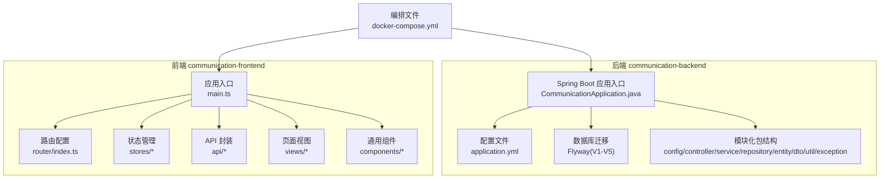
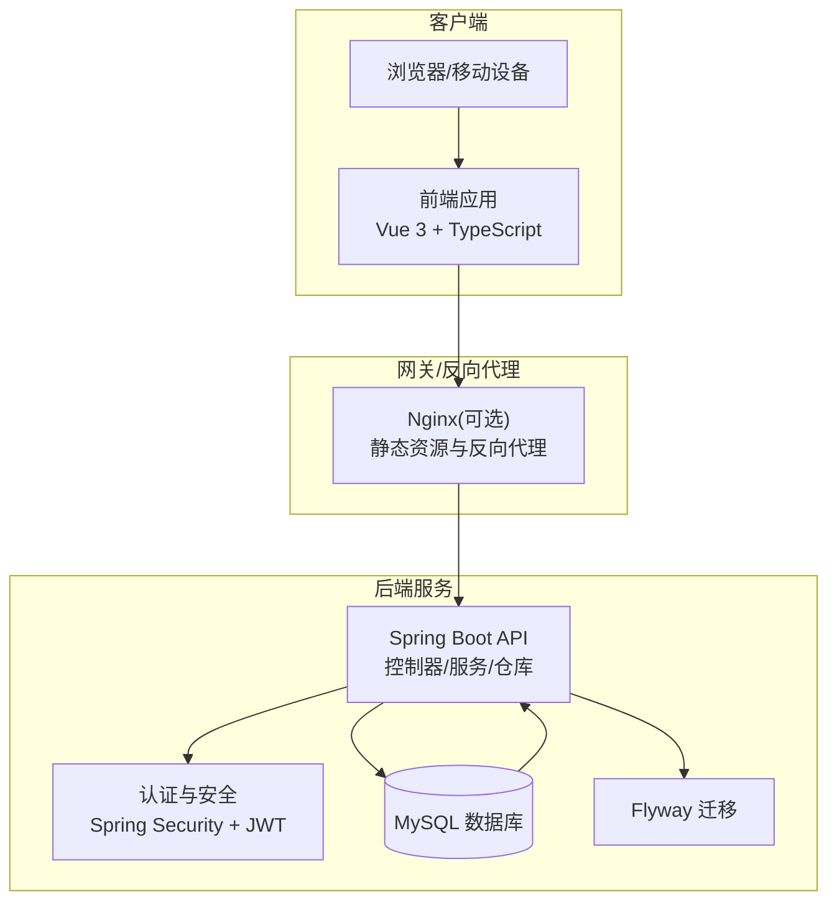
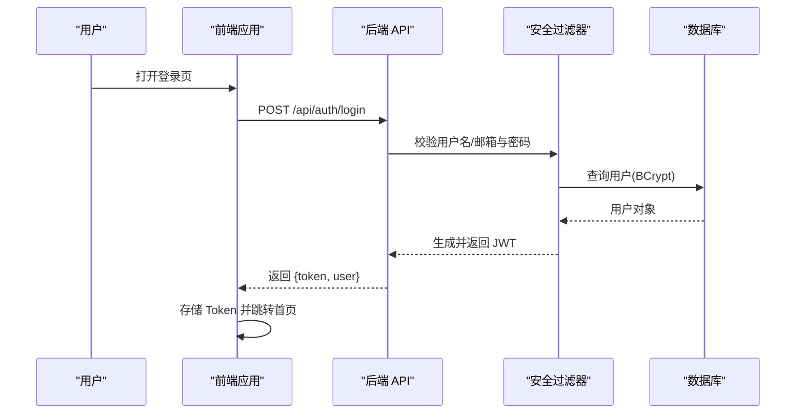
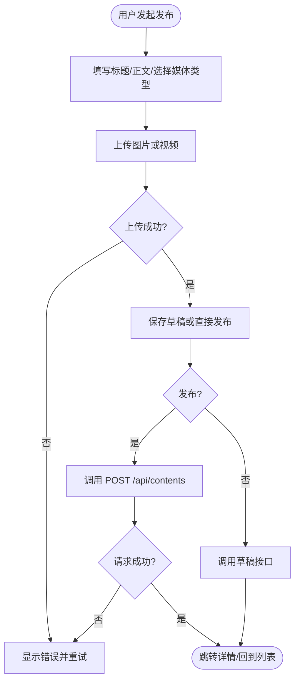
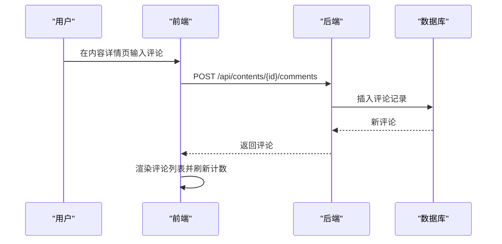
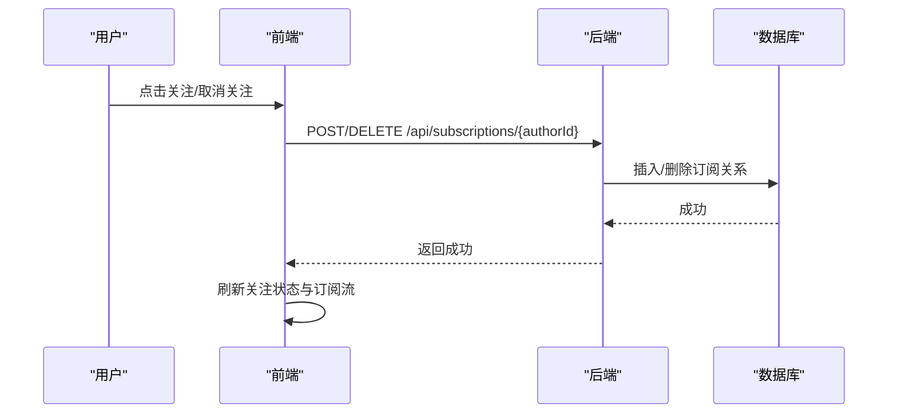
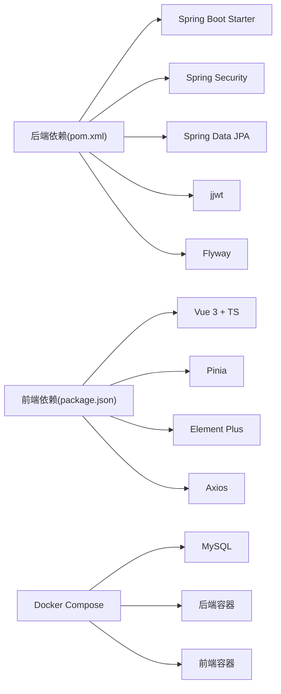

# 项目概述

<cite>
**本文引用的文件**
- [README.md](file://README.md)
- [plan.md](file://plan.md)
- [CommunicationApplication.java](file://communication-backend/src/main/java/com/communication/CommunicationApplication.java)
- [pom.xml](file://communication-backend/pom.xml)
- [application.yml](file://communication-backend/src/main/resources/application.yml)
- [docker-compose.yml](file://docker-compose.yml)
- [package.json](file://communication-frontend/package.json)
- [main.ts](file://communication-frontend/src/main.ts)
- [router/index.ts](file://communication-frontend/src/router/index.ts)
- [auth.ts](file://communication-frontend/src/api/auth.ts)
- [content.ts](file://communication-frontend/src/api/content.ts)
- [comment.ts](file://communication-frontend/src/api/comment.ts)
- [subscription.ts](file://communication-frontend/src/api/subscription.ts)
- [user.ts](file://communication-frontend/src/api/user.ts)
</cite>

## 目录
1. [引言](#引言)
2. [项目结构](#项目结构)
3. [核心组件](#核心组件)
4. [架构总览](#架构总览)
5. [详细组件分析](#详细组件分析)
6. [依赖分析](#依赖分析)
7. [性能考虑](#性能考虑)
8. [故障排查指南](#故障排查指南)
9. [结论](#结论)
10. [附录](#附录)

## 引言
本项目是一个现代化的内容发布平台，支持用户注册登录、内容发布（文本/图片/视频）、订阅、评论互动、搜索以及作者后台管理等核心功能。项目采用前后端分离架构：后端基于 Spring Boot 3.2 + Java 21，使用 Spring Security + JWT 实现认证授权；前端基于 Vue 3 + TypeScript，采用 Pinia 状态管理与 Element Plus UI 组件库。通过 Flyway 进行数据库迁移，Docker Compose 提供一键部署能力。

项目愿景是打造一个“温暖、动态、功能性”的社交内容平台，帮助创作者高效发布内容，帮助读者便捷发现与互动。发展历程分为六个迭代阶段，覆盖从认证到内容、社交、搜索、后台与 UI 收尾的完整闭环。

## 项目结构
项目采用多模块结构，后端与前端分别独立开发与部署，配合 Docker Compose 实现本地与生产环境的一致化编排。

图表来源
- [CommunicationApplication.java:1-13](file://communication-backend/src/main/java/com/communication/CommunicationApplication.java#L1-L13)
- [application.yml:1-42](file://communication-backend/src/main/resources/application.yml#L1-L42)
- [docker-compose.yml:1-60](file://docker-compose.yml#L1-L60)
- [main.ts:1-17](file://communication-frontend/src/main.ts#L1-L17)
- [router/index.ts:1-128](file://communication-frontend/src/router/index.ts#L1-L128)

章节来源
- [README.md:20-36](file://README.md#L20-L36)
- [plan.md:62-94](file://plan.md#L62-L94)

## 核心组件
- 后端核心组件
  - 应用入口与配置：Spring Boot 启动类、JPA/Hibernate、Flyway、JWT、文件上传配置
  - 模块化分层：controller/service/repository/entity/dto/util/exception
  - 数据库迁移：V1 初始化用户表，V2 内容表，V3 评论与订阅，V4 标签，V5 扩展表
- 前端核心组件
  - 应用入口：注册 Pinia、Vue Router、Element Plus
  - 路由守卫：基于 meta 字段的鉴权与访客限制
  - API 封装：auth/content/comment/subscription/user 等模块化接口
  - 视图与组件：Home、Auth、Content、User、Search、Discover 等页面与复用组件

章节来源
- [CommunicationApplication.java:1-13](file://communication-backend/src/main/java/com/communication/CommunicationApplication.java#L1-L13)
- [application.yml:1-42](file://communication-backend/src/main/resources/application.yml#L1-L42)
- [plan.md:67-77](file://plan.md#L67-L77)
- [main.ts:1-17](file://communication-frontend/src/main.ts#L1-L17)
- [router/index.ts:1-128](file://communication-frontend/src/router/index.ts#L1-L128)

## 架构总览
系统采用前后端分离架构，前端通过 Axios 调用后端 REST API，后端以 Spring MVC 控制器对外暴露接口，使用 Spring Data JPA 访问 MySQL，Flyway 管理数据库版本，JWT 实现无状态认证。

图表来源
- [docker-compose.yml:1-60](file://docker-compose.yml#L1-L60)
- [application.yml:1-42](file://communication-backend/src/main/resources/application.yml#L1-L42)
- [pom.xml:25-94](file://communication-backend/pom.xml#L25-L94)

## 详细组件分析

### 认证与用户系统
- 前端
  - API 封装：注册、登录、获取当前用户信息
  - 状态管理：保存 Token、用户信息、鉴权状态
  - 路由守卫：对受保护路由进行鉴权拦截
- 后端
  - Spring Security + JWT：过滤器链校验 Token，暴露 /api/auth/* 接口
  - 用户实体与仓储：用户 CRUD、密码加密（BCrypt）
  - 全局异常处理：统一响应格式

图表来源
- [auth.ts:36-48](file://communication-frontend/src/api/auth.ts#L36-L48)
- [router/index.ts:106-125](file://communication-frontend/src/router/index.ts#L106-L125)
- [application.yml:33-36](file://communication-backend/src/main/resources/application.yml#L33-L36)

章节来源
- [auth.ts:1-49](file://communication-frontend/src/api/auth.ts#L1-L49)
- [router/index.ts:1-128](file://communication-frontend/src/router/index.ts#L1-L128)
- [application.yml:33-36](file://communication-backend/src/main/resources/application.yml#L33-L36)

### 内容发布与媒体上传
- 前端
  - 内容模型：标题、正文、媒体类型、状态、标签、分类
  - API：列表、详情、创建、更新、删除、图片/视频上传
  - 组件：内容卡片、内容流、媒体上传器
- 后端
  - 控制器：/api/contents 对应 CRUD
  - 服务：权限校验、草稿/发布状态管理
  - 仓储：分页查询、作者筛选
  - 文件上传：本地存储路径与类型限制

图表来源
- [content.ts:69-119](file://communication-frontend/src/api/content.ts#L69-L119)
- [application.yml:38-41](file://communication-backend/src/main/resources/application.yml#L38-L41)

章节来源
- [content.ts:1-120](file://communication-frontend/src/api/content.ts#L1-L120)
- [application.yml:38-41](file://communication-backend/src/main/resources/application.yml#L38-L41)

### 评论与互动
- 前端
  - 评论模型：支持嵌套回复、分页
  - API：按内容 ID 获取评论、发表评论、删除评论
  - 组件：评论列表、评论输入、评论项
- 后端
  - 控制器：/api/contents/{id}/comments
  - 服务：权限校验、删除校验（仅作者可删）

图表来源
- [comment.ts:36-49](file://communication-frontend/src/api/comment.ts#L36-L49)

章节来源
- [comment.ts:1-51](file://communication-frontend/src/api/comment.ts#L1-L51)

### 订阅与动态流
- 前端
  - API：关注/取消关注、检查关注、获取我的关注、订阅流、统计
  - 组件：关注按钮、订阅流卡片、关注列表
- 后端
  - 控制器：/api/subscriptions/*
  - 服务：订阅关系维护、订阅流聚合

图表来源
- [subscription.ts:22-48](file://communication-frontend/src/api/subscription.ts#L22-L48)

章节来源
- [subscription.ts:1-92](file://communication-frontend/src/api/subscription.ts#L1-L92)

### 搜索与标签
- 前端
  - API：搜索内容、搜索用户、热门标签
  - 组件：搜索框（防抖）、搜索结果页（内容/用户 Tab）
- 后端
  - 控制器：/api/search/*
  - 服务：关键词匹配、标签聚合

章节来源
- [plan.md:172-186](file://plan.md#L172-L186)

### 作者后台与数据看板
- 前端
  - API：统计数据、个人资料编辑、头像上传
  - 视图：仪表盘、内容管理表格、个人资料编辑
- 后端
  - 控制器：/api/dashboard/*
  - 服务：聚合统计、资料更新

章节来源
- [plan.md:190-203](file://plan.md#L190-L203)

## 依赖分析
- 技术栈选择理由
  - 后端：Spring Boot 3.2 + Java 21 提供稳定生态与现代化特性；Spring Security + JWT 实现无状态认证；JPA + MySQL + Flyway 组合保证数据一致性与可演进性。
  - 前端：Vue 3 + TypeScript 提供强类型与组合式 API；Pinia 简化状态管理；Element Plus 提升 UI 一致性与开发效率；Vite 提供快速构建与热更新。
- 组件耦合与协作
  - 前端通过 Axios 调用后端 REST API，路由守卫在进入受保护页面前检查鉴权状态。
  - 后端控制器依赖服务层，服务层依赖仓库层访问数据库，Flyway 在应用启动时自动执行迁移脚本。
  - Docker Compose 将 MySQL、后端、前端串联，提供一致的开发与部署体验。

图表来源
- [pom.xml:25-94](file://communication-backend/pom.xml#L25-L94)
- [package.json:15-34](file://communication-frontend/package.json#L15-L34)
- [docker-compose.yml:1-60](file://docker-compose.yml#L1-L60)

章节来源
- [pom.xml:25-94](file://communication-backend/pom.xml#L25-L94)
- [package.json:15-34](file://communication-frontend/package.json#L15-L34)
- [docker-compose.yml:1-60](file://docker-compose.yml#L1-L60)

## 性能考虑
- 前端
  - 路由懒加载与组件懒加载减少首屏体积
  - 图片懒加载与骨架屏提升感知性能
  - API 请求缓存与分页加载避免一次性大数据传输
- 后端
  - JPA 分页查询与合理索引降低查询成本
  - Flyway 版本化迁移避免生产回滚风险
  - 限流与文件大小限制防止资源滥用
- DevOps
  - Docker Compose 统一环境，减少部署差异导致的性能波动

## 故障排查指南
- 启动失败
  - 检查数据库连接参数与账号权限
  - 确认 JWT 密钥与上传路径环境变量
- 认证问题
  - 核对 Token 是否过期或格式正确
  - 检查路由守卫是否正确拦截未登录访问
- 文件上传失败
  - 确认上传目录权限与允许的媒体类型
  - 检查请求体类型与大小限制
- 数据库迁移失败
  - 查看 Flyway 日志与迁移脚本执行情况

章节来源
- [application.yml:5-41](file://communication-backend/src/main/resources/application.yml#L5-L41)
- [router/index.ts:106-125](file://communication-frontend/src/router/index.ts#L106-L125)
- [docker-compose.yml:31-41](file://docker-compose.yml#L31-L41)

## 结论
本项目以清晰的前后端分离架构、完善的模块化设计与一致的开发规范，实现了从用户认证到内容发布、从社交互动到搜索与后台管理的完整业务闭环。通过 Docker 与 Flyway 的工程化手段，项目具备良好的可维护性与可扩展性。建议后续持续完善监控与日志体系、引入缓存与消息队列以进一步提升性能与可靠性。

## 附录
- 快速开始
  - Docker 一键部署：在项目根目录执行 compose 命令，访问前端与后端服务
  - 本地开发：分别启动后端与前端，按需配置数据库与环境变量
- API 端点概览
  - 认证：注册、登录、获取当前用户
  - 内容：列表、详情、创建、更新、删除、上传
  - 评论：按内容获取、发表、删除
  - 订阅：关注/取消、订阅流、统计
  - 搜索：内容、用户、热门标签
  - 后台：统计数据、个人资料、头像上传

章节来源
- [README.md:38-98](file://README.md#L38-L98)
- [README.md:131-164](file://README.md#L131-L164)
- [plan.md:224-250](file://plan.md#L224-L250)